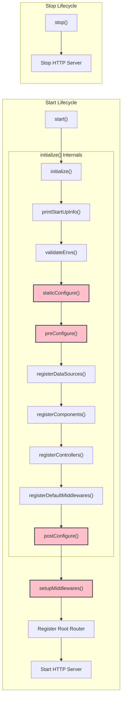

# The Application Class

The `Application` class is the heart of every Ignis project. It is responsible for managing the application's configuration, lifecycle, and all of its components, controllers, services, and other resources.

## Creating an Application

To create an application, you need to extend the `BaseApplication` class.

```typescript
import { BaseApplication, IApplicationConfigs, IApplicationInfo, ValueOrPromise } from '@vez/ignis';
import packageJson from './../package.json';

// Application configurations
export const appConfigs: IApplicationConfigs = {
  host: process.env.APP_ENV_SERVER_HOST,
  port: +(process.env.APP_ENV_SERVER_PORT ?? 3000),
  path: {
    base: process.env.APP_ENV_SERVER_BASE_PATH,
    isStrict: true,
  },
  debug: {
    showRoutes: process.env.NODE_ENV !== 'production',
  },
};

// Main Application class
export class Application extends BaseApplication {
  // Implement abstract methods
  override getAppInfo(): ValueOrPromise<IApplicationInfo> {
    return packageJson;
  }

  staticConfigure(): void {}
  preConfigure(): ValueOrPromise<void> {}
  postConfigure(): ValueOrPromise<void> {}
  setupMiddlewares(): ValueOrPromise<void> {}
}
```

## Application Lifecycle

The Ignis application has a well-defined lifecycle, managed by the following methods:

- **`constructor(opts)`**: Initializes the application with the given configuration.
- **`initialize()`**: Initializes the application and its core bindings. It also calls `validateEnvs()`, `staticConfigure()`, and `preConfigure()`.
- **`start()`**: Starts the application server. This method calls `initialize()`, `setupMiddlewares()`, registers controllers, and then starts the HTTP server.
- **`stop()`**: Stops the application server.

The `BaseApplication` class provides several methods that you can override to hook into the application lifecycle:

- `getAppInfo()`: Return application information from `package.json`.
- `staticConfigure()`: Configure static file serving.
- `preConfigure()`: Set up application resources like components, controllers, services, and datasources before the main configuration.
- `postConfigure()`: Perform actions after the application is configured.
- `setupMiddlewares()`: Set up application-level middlewares.

## Configuration

Application configuration is passed to the `BaseApplication` constructor. It is an object that implements the `IApplicationConfigs` interface.

Here's an example configuration:
```typescript
export const appConfigs: IApplicationConfigs = {
  host: '0.0.0.0',
  port: 3000,
  path: {
    base: '/api',
    isStrict: true,
  },
  debug: {
    showRoutes: true,
  },
};
```

### Configuration Options

- `host`: The host address to bind the server to.
- `port`: The port to listen on.
- `path.base`: The base path for all routes in the application.
- `path.isStrict`: If `true`, the router will be strict about trailing slashes.
- `debug.showRoutes`: If `true`, all registered routes will be printed to the console on startup.

## Registering Resources

You can register controllers, components, services, and datasources with your application instance using the following methods:

- `app.controller(MyController)`
- `app.component(MyComponent)`
- `app.service(MyService)`
- `app.dataSource(MyDataSource)`

These are typically called within the `preConfigure` method of your `Application` class.

## Lifecycle Diagram

Here is a diagram illustrating the application's lifecycle, based on the `BaseApplication` implementation. Methods that you can override are highlighted in pink.


