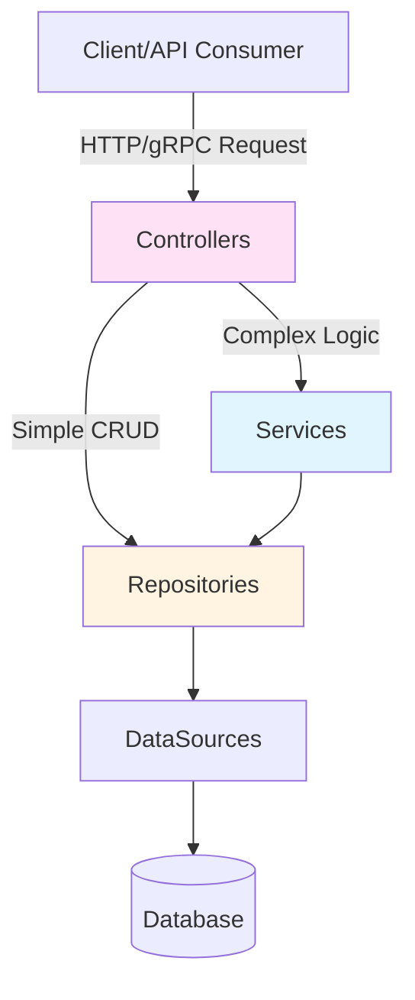

# Architectural Patterns

IGNIS promotes separation of concerns, dependency injection, and modularity for scalable, maintainable applications.

## 1. Layered Architecture

Each layer has a single responsibility. IGNIS supports **two architectural approaches**:



| Layer | Responsibility | Example |
|-------|---------------|---------|
| **Controllers** | Handle HTTP/gRPC - parse requests, validate, format responses | `ConfigurationController` (REST), `GreeterController` (gRPC) |
| **Services** | Business logic - orchestrate operations | `AuthenticationService` (auth logic) |
| **Repositories** | Data access - CRUD operations | `ConfigurationRepository` (extends `DefaultRelationalRepository`) |
| **DataSources** | Database connections | `PostgresDataSource` (connects to PostgreSQL) |
| **Models** | Data structure - Drizzle schemas + Entity classes | `Configuration`, `User` models |

**Key Principle - Two Approaches:**

```
Simple CRUD (no business logic):
┌────────────┐
│ Controller │──────────────┐
└────────────┘              │
                            ▼
                    ┌──────────────┐
                    │  Repository  │
                    └──────────────┘
                            │
                            ▼
                        Database

Complex Logic (validation, orchestration):
┌────────────┐
│ Controller │────┐
└────────────┘    │
                  ▼
            ┌─────────┐
            │ Service │
            └─────────┘
                  │
                  ▼
          ┌──────────────┐
          │  Repository  │
          └──────────────┘
                  │
                  ▼
              Database
```

**When to use each:**
- **Controller → Repository** - Simple CRUD (list, get by ID, create, update, delete)
- **Controller → Service → Repository** - Business logic, validation, orchestrating multiple repositories

## 2. Dependency Injection (DI)

Classes declare dependencies in their constructor - the framework automatically provides them at runtime.

**Benefits:**
- Loosely coupled code
- Easy to test (mock dependencies)
- Easy to swap implementations

**Example (REST controller):**
```typescript
@controller({ path: BASE_PATH })
export class ConfigurationController extends _Controller {
  constructor(
    // The @inject decorator tells the container to provide
    // an instance of ConfigurationRepository here.
    @inject({
      key: BindingKeys.build({
        namespace: BindingNamespaces.REPOSITORY,
        key: ConfigurationRepository.name,
      }),
    })
    repository: ConfigurationRepository,
  ) {
    super(repository);
  }
}
```

**Controller Transports:**

The `@controller` decorator supports a `transport` field to distinguish between REST and gRPC controllers:

```typescript
// REST controller (default - transport can be omitted)
@controller({ path: '/users' })
export class UserController extends BaseRestController { ... }

// gRPC controller (transport is required)
@controller({ path: '/greeter', transport: 'grpc', service: GreeterService })
export class GreeterController extends BaseGrpcController { ... }
```

REST controllers extend `BaseRestController`, while gRPC controllers extend `BaseGrpcController`. The application must enable the appropriate transport(s) in its configuration.

## 3. Component-Based Modularity

Components bundle a group of related, reusable, and pluggable features into self-contained modules. A single component can encapsulate multiple providers, services, controllers, and repositories. It functions as a mini-application that plugs into any IGNIS project.

**Built-in Components:**
- `AuthenticateComponent` - JWT authentication
- `ApiReferenceComponent` - OpenAPI documentation
- `HealthCheckComponent` - Health check endpoint
- `RequestTrackerComponent` - Request logging

**Example:**
```typescript
// src/application.ts

export class Application extends BaseApplication {
  // ...
  preConfigure(): ValueOrPromise<void> {
    // ...
    // Registering components plugs their functionality into the application.
    this.component(HealthCheckComponent);
    this.component(ApiReferenceComponent);
    // ...
  }
}
```
This architecture keeps the main `Application` class clean and focused on high-level assembly. The details of each feature stay neatly encapsulated within their respective components.

## 4. Custom Components

You can encapsulate your own logic or third-party integrations (like Socket.IO, Redis, specific Cron jobs) into reusable Components.

**Structure of a Component:**
1.  Extend `BaseComponent`.
2.  Define default `bindings` (optional configuration/options).
3.  Implement `binding()` to register services, providers, or attach logic to the application.

**Example (`SocketIOComponent`):**

```typescript
import { BaseApplication, BaseComponent, inject, CoreBindings, Binding } from '@venizia/ignis';

export class MySocketComponent extends BaseComponent {
  constructor(
    @inject({ key: CoreBindings.APPLICATION_INSTANCE }) private application: BaseApplication,
  ) {
    super({
      scope: MySocketComponent.name,
      // Automatically register bindings when component is loaded
      initDefault: { enable: true, container: application },
      bindings: {
        // Define default configuration binding
        'my.socket.options': Binding.bind({ key: 'my.socket.options' }).toValue({ port: 8080 }),
      },
    });
  }

  // The binding method is called when the application configures components (registerComponents)
  override binding(): void {
    const options = this.application.get({ key: 'my.socket.options' });
    
    this.logger.info('Initializing Socket.IO with options: %j', options);
    
    // Perform setup logic, register other services, etc.
    // this.application.bind(...).toValue(...);
  }
}
```

## 5. Application Lifecycle Hooks

IGNIS applications follow a predictable startup sequence with hooks for customization:

```
┌─────────────────────────────────────────────────────────────┐
│                     initialize()                            │
├─────────────────────────────────────────────────────────────┤
│  1. printStartUpInfo()     - Log startup configuration      │
│  2. validateEnvs()         - Empty-env check, off by default│
│  3. registerDefaultMiddlewares() - Request id, errors, 404  │
│  4. staticConfigure()      - Configure static file serving  │
│  5. registerArtifacts      - Bind every class listed in     │
│                              configs.artifacts              │
│                                                             │
│  ┌─────────────────────────────────────────────────────┐    │
│  │ 6. preConfigure()  ← YOUR CODE HERE                 │    │
│  │    - Registry calls and hand-made bindings          │    │
│  │    - Anything the generated index cannot express    │    │
│  └─────────────────────────────────────────────────────┘    │
│                                                             │
│  7. hydrateSecrets()       - Resolve secrets into env       │
│  8. registerConfigurations() - Configure configurations     │
│  9. registerDataSources()  - Initialize DB connections      │
│ 10. registerComponents()   - Configure all components       │
│ 11. registerContributedDataSources()                        │
│                            - Datasources components added   │
│ 12. wireSecretRotatables() - Attach rotation listeners      │
│ 13. registerControllers()  - Mount routes to router         │
│                                                             │
│  ┌─────────────────────────────────────────────────────┐    │
│  │ 14. postConfigure()  ← YOUR CODE HERE               │    │
│  │    - Seed data                                      │    │
│  │    - Start background jobs                          │    │
│  │    - Custom initialization                          │    │
│  └─────────────────────────────────────────────────────┘    │
│                                                             │
│ 15. verifyBindings()       - Resolve every service and      │
│                              repository once (opt-in)       │
│ 16. validateScopeFilterSupport()                            │
│                            - Refuse a dead scopeFilter      │
└─────────────────────────────────────────────────────────────┘
```

Sixteen steps. Each one logs `Boot step n/16 <name>`.

`registerArtifacts` sits between `staticConfigure()` and `preConfigure()`, so every class in `configs.artifacts` is already bound by the time your hook runs. `hydrateSecrets()` runs after `preConfigure()` so a secrets provider registered there is available, and before `registerConfigurations()` and `registerDataSources()` so both read already-resolved values. Configurations are configured first, ahead of datasources, because they are what the rest of the application is set up from. `registerContributedDataSources()` runs once after every component, so a datasource a component adds is configured before any controller mounts. `wireSecretRotatables()` follows it, because a rotation lease may point at one of those contributed datasources. `verifyBindings()` resolves every service and repository once when `bootChecks.binding.doVerify` is on. `validateScopeFilterSupport()` runs last, so a model a component registered is checked too.

**Lifecycle Methods:**

| Method | When | Purpose |
|--------|------|---------|
| `staticConfigure()` | Before DI registration | Configure static file serving |
| `preConfigure()` | After `registerArtifacts`, before the sweeps | Whatever the artifact index cannot express: registry calls, hand-made bindings |
| `postConfigure()` | After everything is registered | Seed data, start jobs, custom logic |

**Example:**
```typescript
// The registration surface is the artifact index, not a hook. `registerArtifacts` reads it at step
// 5, before `preConfigure()` runs, so everything named here is already bound by then.
export const beConfigs: IApplicationConfigs = {
  path: { base: '/api', isStrict: true },
  artifacts: [
    // Every decorated class under src/, regenerated with `bun run generate:artifacts`.
    GeneratedArtifacts,
    // Then the framework components this application turns on.
    { components: [AuthenticateComponent, ApiReferenceComponent] },
  ],
};

export class Application extends BaseApplication {
  // Runs after `registerArtifacts`. Only what the index cannot express belongs here.
  preConfigure(): ValueOrPromise<void> {
    AuthenticationStrategyRegistry.getInstance().register({
      container: this,
      strategies: [
        { name: Authentication.STRATEGY_JWT, strategy: JWKSIssuerAuthenticationStrategy },
      ],
    });
  }

  // Called after all registrations complete
  async postConfigure(): Promise<void> {
    // Access registered services
    const userRepository = this.get<UserRepository>({
      key: BindingKeys.build({
        namespace: BindingNamespaces.REPOSITORY,
        key: UserRepository.name,
      }),
    });

    // Seed initial data (findOne returns the record or null)
    const adminExists = await userRepository.findOne({
      filter: { where: { role: 'admin' } },
    });
    if (!adminExists) {
      await userRepository.create({ data: { name: 'Admin', role: 'admin' } });
    }
  }

  // Configure static file serving
  staticConfigure(): void {
    this.static({ restPath: '/public/*', folderPath: './public' });
  }
}
```

> [!WARNING]
> Do not register new configurations, datasources, components, or controllers in `postConfigure()`. The sweeps that configure them have already run, so they are bound but never initialized. Put the class in `configs.artifacts` instead; if you must add one late, call its `configure()` yourself.

> [!NOTE]
> Hand-registering in `preConfigure()` still works, but it is the old shape. A project that sets `bootChecks.binding.allowManual: false` refuses it outright while `configs.artifacts` is set, and throws naming the class and the hook.

## 6. Registration Surface & Capability Interfaces

`RestApplication` - the kernel layer, two classes above `BaseApplication` - implements the full resource-registration surface directly: `configuration()`, `service()`, `repository()`, `dataSource()`, `controller()`, `component()` and `registerArtifacts()`. Extend `BaseApplication` and you inherit all of it. Most applications never call the first six, because `configs.artifacts` registers every decorated class - see [Registering artifacts](/guides/core-concepts/application/bootstrapping).

**How registration works:**

Each of the six single-class methods is a one-line call into one private `registerArtifact()`, which differs only in the namespace and the default scope:

```typescript
service<Base extends IService>(target: TClass<Base>, opts?: TMixinOpts): Binding<Base> {
  return this.registerArtifact({
    target,
    namespace: BindingNamespaces.SERVICE,
    defaultScope: BindingScopes.TRANSIENT,
    caller: this.service.name,
    opts,
  });
}
```

`registerArtifact()` then does the same five things for every kind:

1. Resolves the binding in a fixed order - explicit `opts`, then the class's `@injectable` metadata, then the derived `{ namespace, key: target.name }`.
2. Writes the resulting key back into `MetadataRegistry`, so `@inject({ target })` can read it.
3. Stores `opts.options`, to be replayed into `instance.configure(options)` during the matching boot sweep.
4. Runs `assertNoBindingCollision`, which throws when the key is bound and `allowOverride` is false.
5. Binds `.toClass(target).setScope(declared?.scope ?? defaultScope)`.

Step 5 is why a service is `TRANSIENT` and a component `SINGLETON` without either class saying so. Every registration method takes the same optional second argument. `opts.binding` overrides the derived `{ namespace, key }` when you need to register two classes under one contract.

**Capability interfaces:**

Each registration capability is declared as a TypeScript interface. `IRestApplication` extends `IApplication` plus these five, and `BaseApplication` implements it. Reference them when you type your own application contracts:

| Interface | Methods | Purpose |
|-----------|---------|---------|
| `IServiceMixin` | `service()` | Register service classes |
| `IRepositoryMixin` | `dataSource()`, `repository()` | Register data layer |
| `IComponentMixin` | `component()`, `registerComponents()` | Register modular components |
| `IControllerMixin` | `controller()`, `registerControllers()` | Register controllers and mount routes |
| `IStaticServeMixin` | `static()` | Serve static files |

Two more interfaces live in the same file and are **not** part of `IRestApplication`, even though `RestApplication` implements both:

| Interface | Methods | Purpose |
|-----------|---------|---------|
| `IConfigurationMixin` | `configuration()`, `registerConfigurations()` | Register configurations |
| `IServerConfigMixin` | `staticConfigure()`, `preConfigure()`, `postConfigure()`, `getApplicationVersion()` | Lifecycle hooks |

> [!NOTE]
> Earlier releases also exported `ServiceMixin`, `RepositoryMixin`, and `ComponentMixin` as class-mixin **functions** you composed onto `AbstractApplication`. They duplicated `BaseApplication`'s own methods verbatim, drifted out of sync, and had no known consumers, so they were removed. The `IServiceMixin` / `IRepositoryMixin` / `IComponentMixin` **interfaces** remain - extend `BaseApplication` and call its registration methods directly.

**Why direct methods over composed mixins?**
- One implementation, no drift between a mixin and the base class
- Registration is available the moment you extend `BaseApplication`
- The interfaces still express each capability for typed contracts

## 7. Controller Factory Pattern

`ControllerFactory.defineCrudController()` generates a complete CRUD controller from an entity definition. This reduces boilerplate while maintaining full customization.

**Basic Usage:**
```typescript
const _Controller = ControllerFactory.defineCrudController({
  entity: () => User, // Entity class or resolver function
  repository: { name: UserRepository.name },
  controller: {
    name: 'UserController',
    basePath: '/users',
    // Default: { path: true, requestSchema: true }
    isStrict: { path: true, requestSchema: true },
  },
});

@controller({ path: '/users' })
export class UserController extends _Controller {
  constructor(
    @inject({ key: BindingKeys.build({ namespace: BindingNamespaces.REPOSITORY, key: UserRepository.name }) })
    repository: UserRepository,
  ) {
    super(repository);
  }
}
```

**Per-Route Authentication:**
```typescript
const _Controller = ControllerFactory.defineCrudController({
  entity: () => User,
  repository: { name: UserRepository.name },
  controller: { name: 'UserController', basePath: '/users' },

  // Apply JWT to all routes by default
  authenticate: { strategies: [Authentication.STRATEGY_JWT] },

  // Override per-route
  routes: {
    // Public read endpoints
    find: { authenticate: { skip: true } },
    findById: { authenticate: { skip: true } },
    count: { authenticate: { skip: true } },

    // Protected write endpoints (use controller-level auth)
    create: {},
    updateById: {},
    deleteById: {},
  },
});
```

**Custom Schemas Per Route:**
```typescript
const _Controller = ControllerFactory.defineCrudController({
  entity: () => User,
  repository: { name: UserRepository.name },
  controller: { name: 'UserController', basePath: '/users' },

  routes: {
    // Custom request body schema for create
    create: {
      authenticate: { strategies: [Authentication.STRATEGY_JWT] },
      request: {
        body: z.object({
          email: z.string().email(),
          name: z.string().min(2),
          // Exclude sensitive fields from client input
        }),
      },
    },

    // Custom response schema
    find: {
      authenticate: { skip: true },
      response: {
        schema: z.array(z.object({
          id: z.string(),
          name: z.string(),
          // Exclude internal fields from response
        })),
      },
    },
  },
});
```

**Generated Routes:**

| Route | Method | Path | Description |
|-------|--------|------|-------------|
| `count` | GET | `/count` | Count records matching filter |
| `find` | GET | `/` | List records with filter |
| `findById` | GET | `/{id}` | Get single record |
| `findOne` | GET | `/find-one` | Get first matching record |
| `create` | POST | `/` | Create new record |
| `updateById` | PATCH | `/{id}` | Update record by ID |
| `updateBy` | PATCH | `/` | Bulk update by filter |
| `deleteById` | DELETE | `/{id}` | Delete by ID |
| `deleteBy` | DELETE | `/` | Bulk delete by filter |

> [!TIP]
> `TDataObject`/`TPersistObject` cannot be inferred from `entity` - pass them explicitly for typed handlers: `ControllerFactory.defineCrudController<TUserRecord>({ ... })`. Use `controller.enabledRoutes` to whitelist routes and `controller.readonly` to disable all write routes.