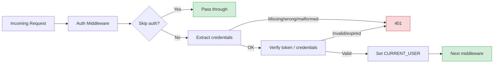
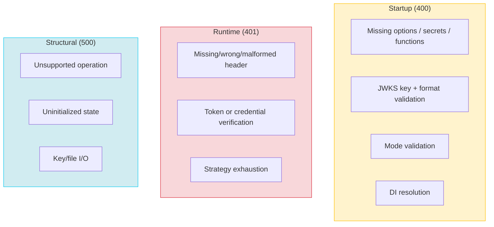

# Authentication Errors

Every error message the Authentication component and its services throw, with cause and fix. See the [Overview](./) for initial setup.

## Find what you need

| Error is thrown by | Go to |
|---|---|
| Startup, while wiring the component | [AuthenticateComponent (startup)](#authenticatecomponent-startup) |
| `verify`/`generate`/`extractCredentials`, shared by JWS, JWKS, and Basic | [Bearer token services (runtime)](#bearer-token-services-runtime) |
| The `JWSTokenService` constructor | [JWSTokenService (constructor)](#jwstokenservice-constructor) |
| `JWKSIssuerTokenService` init or key parsing | [JWKSIssuerTokenService (init + runtime)](#jwksissuertokenservice-init-runtime) |
| `JWKSVerifierTokenService` signing calls | [JWKSVerifierTokenService (runtime)](#jwksverifiertokenservice-runtime) |
| Basic auth credential decoding | [BasicTokenService (runtime)](#basictokenservice-runtime) |
| "Descriptor not found" or a strategy registration issue | [AuthenticationStrategyRegistry (startup + runtime)](#authenticationstrategyregistry-startup-runtime) |
| "Authentication failed" at request time | [AuthenticationProvider (runtime)](#authenticationprovider-runtime) |
| The built-in `/auth` controller | [Auth controller factory](#auth-controller-factory) |

- **Startup errors (400 unless noted)** come from `AuthenticateComponent.binding()` and stop the application before it serves traffic.
- **Runtime errors (401)** come from request-time credential extraction, verification, or strategy exhaustion.
- **Structural errors (500)** come from calling an unsupported operation - signing on a verify-only service, for example - or accessing uninitialized state.
- All of them go through `getError()`. It defaults `statusCode` to `400` when you don't set one - so every "startup" error below is a 400 unless the table says otherwise.



## AuthenticateComponent (startup)

Thrown during `binding()` while validating options and wiring services.

| Message | Status | Cause | Fix |
|---------|--------|-------|-----|
| `[AuthenticateComponent] At least one of jwtOptions or basicOptions must be provided` | 400 | Neither `JWT_OPTIONS` nor `BASIC_OPTIONS` bound before `this.component(AuthenticateComponent)` | Bind at least one before registering the component - see [Setup](./#common-tasks) |
| `[AuthenticateComponent] Unknown JOSE standard: {standard}` | 400 | `jwtOptions.standard` is not `'JWS'` or `'JWKS'` | Use `JOSEStandards.JWS` or `JOSEStandards.JWKS` |
| `[defineJWSAuth] Invalid jwtSecret \| Provided: {jwtSecret}` | 400 | `jwtSecret` falsy or equals placeholder `'unknown_secret'` | Set a real secret - `APP_ENV_JWT_SECRET`, for example |
| `[defineJWSAuth] getTokenExpiresFn is required` | 400 | `getTokenExpiresFn` missing from JWS options | Provide `() => Number(process.env.APP_ENV_JWT_EXPIRES_IN \|\| 86400)` |
| `[defineJWKSAuth] keys.private and keys.public are required for issuer mode` | 400 | Issuer mode missing one or both keys | Provide `keys.private` and `keys.public` |
| `[defineJWKSAuth] keys.format is required and must be one of: pem, jwk` | 400 | `keys.format` missing or invalid | Use `JWKSKeyFormats.PEM` or `JWKSKeyFormats.JWK` |
| `[defineJWKSAuth] kid is required for issuer mode` | 400 | `kid` (Key ID) not provided | Provide a unique `kid` string |
| `[defineJWKSAuth] getTokenExpiresFn is required for issuer mode` | 400 | `getTokenExpiresFn` missing | Provide a token-expiry function |
| `[defineJWKSAuth] jwksUrl is required for verifier mode` | 400 | Verifier mode missing `jwksUrl` | Provide the issuer's `/certs` URL |
| `[defineJWKSAuth] Invalid JWKS mode: {mode}` | 400 | `mode` is not `'issuer'` or `'verifier'` | Use `JWKSModes.ISSUER` or `JWKSModes.VERIFIER` |
| `[defineBasicAuth] verifyCredentials function is required` | 400 | `BASIC_OPTIONS` bound without a `verifyCredentials` callback | Provide the callback - see [Setup](./#common-tasks) |
| `[defineControllers] Auth controller requires jwtOptions to be configured` | 400 | `useAuthController: true` but no `jwtOptions` bound | Bind `JWT_OPTIONS` before enabling the auth controller |

> [!NOTE]
> `applicationSecret` is optional and not validated. Every token service treats it as optional - omitting it disables AES payload encryption, nothing more. Its presence is never checked.

## Bearer token services (runtime)

Shared by `JWSTokenService`, `JWKSIssuerTokenService`, and `JWKSVerifierTokenService` via `AbstractBearerTokenService`.

| Message | Status | Method | Cause | Fix |
|---------|--------|--------|-------|-----|
| `Unauthorized user! Missing authorization header` | 401 | `extractCredentials` | No `Authorization` header | Send `Authorization: Bearer <token>` |
| `Unauthorized user! Invalid schema of request token!` | 401 | `extractCredentials` | Header doesn't start with `Bearer` | Use the `Bearer` scheme |
| `Authorization header value is invalid format. It must follow the pattern: 'Bearer xx.yy.zz' ...` | 401 | `extractCredentials` | Header doesn't split into exactly 2 parts | Check for extra whitespace or a malformed token |
| `[verify] Invalid request token!` | 401 | `verify` | Token value is empty | Ensure the token half of the header isn't blank |
| `[verify] Invalid or expired token` | 401 | `verify` | `doVerify()` threw - expired, malformed, or bad signature | Check application logs for the real cause (see below) |
| `[generate] Invalid token payload!` | 401 | `generate` | Payload is null/undefined | Pass a non-null `IJWTTokenPayload` |
| `[generate] Failed to generate token` | 500 | `generate` | Signing failed (key/algorithm issue) | Check application logs for the real cause |

> [!TIP]
> Errors are sanitized on the wire. `verify()` and `generate()` never leak the original `error.message` to the client. The full error is logged at `error` level - run `grep "Failed to verify token" logs/application.log` to find it.

## JWSTokenService (constructor)

| Message | Status | Cause | Fix |
|---------|--------|-------|-----|
| `[JWSTokenService] Invalid jwtSecret` | 500 | `jwtSecret` falsy in injected options | Fix the `JWT_OPTIONS` binding |
| `[JWSTokenService] Invalid getTokenExpiresFn` | 500 | `getTokenExpiresFn` falsy in injected options | Fix the `JWT_OPTIONS` binding |
| `[getSigningKey] Invalid jwtSecret!` | 400 | `jwtSecret` Uint8Array is null | Should not happen after constructor validation - report if seen |

## JWKSIssuerTokenService (init + runtime)

| Message | Status | Method | Cause | Fix |
|---------|--------|--------|-------|-----|
| `[JWKSIssuerTokenService] Unknown key driver: {driver}` | 500 | `resolveKeyContent` | `keys.driver` not `'text'` or `'file'` | Use `JWKSKeyDrivers.TEXT` or `.FILE` |
| `[JWKSIssuerTokenService] Invalid raw.priv key!` | 500 | `parseKeyMaterial` | Resolved private key content is empty | Check the file path or inline string |
| `[JWKSIssuerTokenService] Invalid raw.pub key!` | 500 | `parseKeyMaterial` | Resolved public key content is empty | Check the file path or inline string |
| `[JWKSIssuerTokenService] Invalid JWK key material` | 500 | `parseKeyMaterial` | JWK JSON parse or `importJWK()` failed | Validate the JWK is well-formed JSON (see below) |
| `[JWKSIssuerTokenService] Unknown key format: {format}` | 500 | `parseKeyMaterial` | `keys.format` not `'pem'` or `'jwk'` | Use `JWKSKeyFormats.PEM` or `.JWK` |
| `[getSigningKey] Invalid privateKey!` | 400 | `getSigningKey` | Private key null - init incomplete or failed | Ensure `initialize()` succeeded; check logs |
| `[JWKSIssuerTokenService] JWKS not initialized yet. Call getJWKSAsync() instead.` | 500 | `getJWKS` | Sync `getJWKS()` called before lazy init completed | Use `await getJWKSAsync()` instead |

> [!WARNING]
> File read errors are not wrapped. With `JWKSKeyDrivers.FILE`, `readFile()` errors (`ENOENT`, `EACCES`, ...) surface as raw Node.js filesystem errors during initialization - they are not caught and re-thrown as `getError()`.

## JWKSVerifierTokenService (runtime)

| Message | Status | Method | Cause |
|---------|--------|--------|-------|
| `[JWKSVerifierTokenService] Verifier mode cannot sign tokens` | 500 | `getSigner` | `generate()` called on a verify-only service |
| `[JWKSVerifierTokenService] Verifier mode cannot sign tokens` | 500 | `getSigningKey` | Signing key accessed on a verify-only service |
| `[JWKSVerifierTokenService] Verifier mode has no token expiry` | 500 | `getDefaultTokenExpiresFn` | Token expiry accessed on a verify-only service |

**Fix:** token generation must happen on the **issuer** service. If one application needs both signing and verification, use `JWKSModes.ISSUER` everywhere - an issuer can both sign and verify.

## BasicTokenService (runtime)

| Message | Status | Method | Cause | Fix |
|---------|--------|--------|-------|-----|
| `[BasicTokenService] Invalid verifyCredentials function` | 500 | `constructor` | `verifyCredentials` missing from injected options | Provide the callback in `BASIC_OPTIONS` |
| `Unauthorized! Missing authorization header` | 401 | `extractCredentials` | No `Authorization` header | Send `Authorization: Basic <base64>` |
| `Unauthorized! Invalid authorization schema, expected Basic` | 401 | `extractCredentials` | Header doesn't start with `Basic` | Use the `Basic` scheme |
| `Unauthorized! Invalid authorization header format` | 401 | `extractCredentials` | Header doesn't split into exactly 2 parts | Check the header value |
| `Unauthorized! Invalid base64 credentials format` | 401 | `extractCredentials` | Base64 decode failed, or no `:` separator, or empty username | Verify the client encodes `username:password` correctly |
| `Unauthorized! Invalid username or password` | 401 | `verify` | `verifyCredentials` callback returned `null` | Expected on wrong credentials - check your callback's lookup logic if unexpected |

## AuthenticationStrategyRegistry (startup + runtime)

Inherited from `AbstractAuthRegistry`.

| Message | Status | Method | Cause | Fix |
|---------|--------|--------|-------|-----|
| `[getKey] Invalid name \| name: {name}` | 400 | `getKey` | Strategy name empty or falsy | Pass a non-empty strategy name |
| `[AuthenticationStrategyRegistry] No items registered` | 400 | `getDefaultName` | No strategies registered yet | Register at least one strategy |
| `[AuthenticationStrategyRegistry] Descriptor not found: {name}` | 400 | `resolveDescriptor` | Route references a strategy name that was never registered | Register it after the component - see below |
| `[AuthenticationStrategyRegistry] Failed to resolve: {name}` | 400 | `resolveDescriptor` | Strategy registered but the container returned null | Check the strategy's own constructor dependencies |

**Fix for "Descriptor not found":** strategies are **not** auto-registered by `AuthenticateComponent`.

```typescript
this.component(AuthenticateComponent);

AuthenticationStrategyRegistry.getInstance().register({
  container: this,
  strategies: [{ name: Authentication.STRATEGY_JWT, strategy: JWSAuthenticationStrategy }],
});
```

## AuthenticationProvider (runtime)

The middleware that executes strategies in the configured mode.

| Message | Status | Method | Cause |
|---------|--------|--------|-------|
| `Authentication failed. Tried strategies: {strategies}` | 401 | `executeAnyMode` | Every strategy failed in `'any'` mode |
| `Failed to identify authenticated user!` | 401 | `executeAllMode` | All strategies passed in `'all'` mode, but the first strategy's `userId` is falsy |
| `Invalid authentication mode \| mode: {mode}` | 500 | `createAuthenticateMiddleware` | `mode` is not `'any'` or `'all'` |

**Fix for "Authentication failed":** verify the client sends the right header - `Bearer <token>` or `Basic <base64>`. Common causes: an expired token, a token signed with a different key, or the wrong strategy name in the route config.

## Auth controller factory

| Message | Status | Method | Cause | Fix |
|---------|--------|--------|-------|-----|
| `[AuthController] Failed to init auth controller \| Invalid injectable authentication service!` | 400 | `constructor` | DI could not resolve the service at `controllerOpts.serviceKey` | Register your service before the component |

```typescript
this.service(AuthenticationService);

this.bind<TAuthenticationRestOptions>({ key: AuthenticateBindingKeys.REST_OPTIONS }).toValue({
  useAuthController: true,
  controllerOpts: { restPath: '/auth', serviceKey: 'services.AuthenticationService' },
});

this.component(AuthenticateComponent);
```

## Error categories



## See also

- [Overview](./) - initial setup and binding keys
- [Usage & Examples](./usage) - securing routes, auth flows, and API endpoints
- [API Reference](./api) - architecture, service internals, and strategy registry
