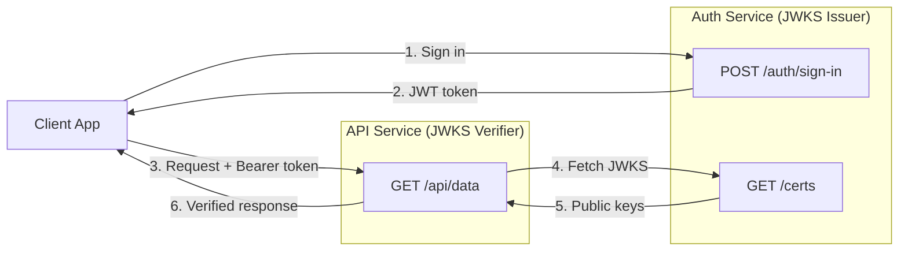
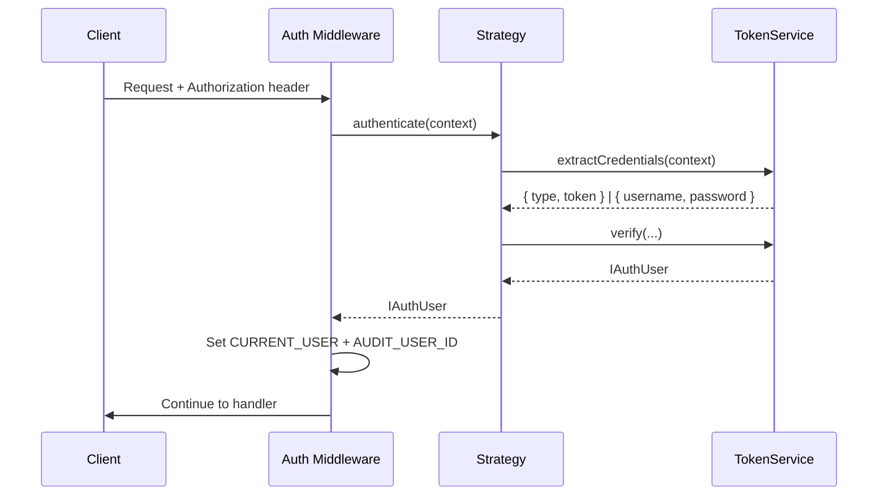
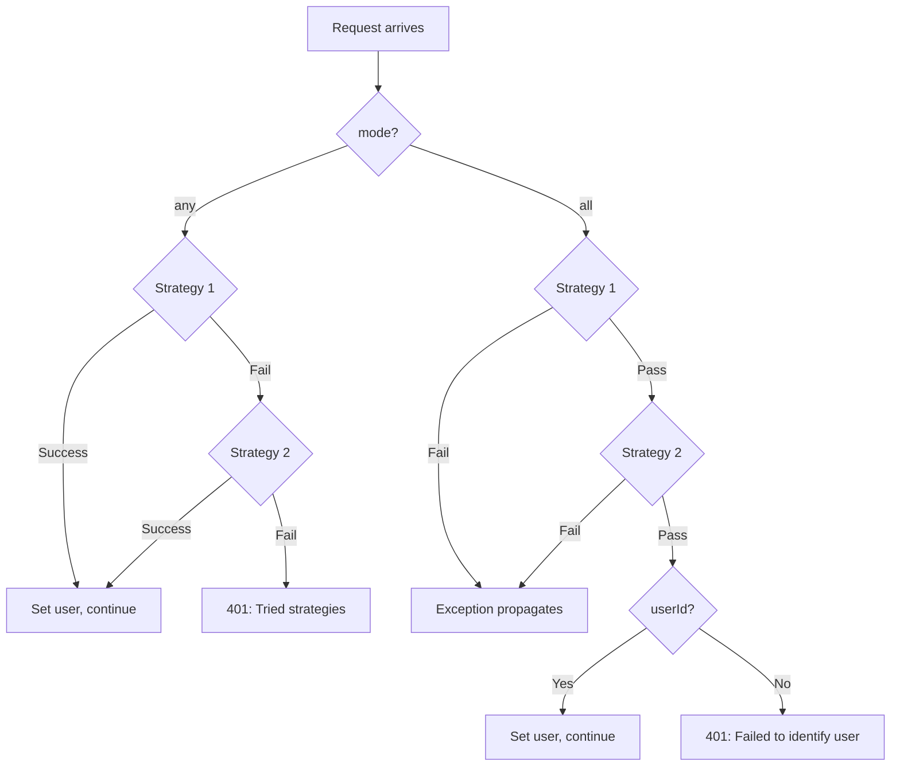

# Authentication Usage

Task-oriented examples for the Authentication component. See the [Overview](./) for initial setup and the [API Reference](./api) for every option and class.

## Securing routes

**Require one strategy.** Add `authenticate` to the route config.

```typescript
const SECURE_ROUTE_CONFIG = {
  path: '/secure-data',
  method: HTTP.Methods.GET,
  authenticate: { strategies: [Authentication.STRATEGY_JWT] },
  responses: jsonResponse({ description: 'Protected data', schema: z.object({ message: z.string() }) }),
} as const;
```

**Accept multiple strategies with fallback.** `mode: 'any'` (default) tries each in order; the first success wins.

```typescript
const FALLBACK_AUTH_CONFIG = {
  path: '/api/data',
  method: HTTP.Methods.GET,
  authenticate: { strategies: [Authentication.STRATEGY_JWT, Authentication.STRATEGY_BASIC], mode: AuthenticationModes.ANY },
  responses: jsonResponse({ description: 'Data via JWT or Basic', schema: z.object({ data: z.any() }) }),
} as const;
```

**Make a route public.** `skip: true` bypasses authentication entirely.

```typescript
const PUBLIC_ROUTE_CONFIG = {
  path: '/public',
  method: HTTP.Methods.GET,
  authenticate: { skip: true },
  responses: jsonResponse({ description: 'Public endpoint', schema: z.object({ message: z.string() }) }),
} as const;
```

**Use `authenticate()` as raw Hono middleware.** Outside of route configs - e.g. for a plain Hono sub-app.

```typescript
import { authenticate, Authentication, AuthenticationModes } from '@venizia/ignis';

const authMiddleware = authenticate({ strategies: [Authentication.STRATEGY_JWT], mode: AuthenticationModes.ANY });

app.get('/protected', authMiddleware, c => {
  const user = c.get(Authentication.CURRENT_USER);
  return c.json({ userId: user.userId });
});
```

**Read the authenticated user in a handler.**

```typescript
import { Authentication, IJWTTokenPayload } from '@venizia/ignis';

const user = c.get(Authentication.CURRENT_USER) as IJWTTokenPayload | undefined;
if (user) {
  console.log('User ID:', user.userId, 'Roles:', user.roles);
}
```

**Skip authentication dynamically from a preceding middleware.** Useful for internal API keys or webhooks.

```typescript
import { Authentication } from '@venizia/ignis';
import { createMiddleware } from 'hono/factory';

const conditionalAuthMiddleware = createMiddleware(async (c, next) => {
  if (c.req.header('X-API-Key') === 'valid-api-key') {
    c.set(Authentication.SKIP_AUTHENTICATION, true);
  }
  return next();
});
```

## Implementing IAuthService

The built-in auth controller (`useAuthController: true`) delegates every route to a service you provide, implementing `IAuthService`.

**JWS-backed service.**

```typescript
import {
  BaseService, inject, IAuthService, IJWTTokenPayload, JWSTokenService,
  BindingKeys, BindingNamespaces, TSignInRequest, TContext,
} from '@venizia/ignis';
import { getError } from '@venizia/ignis-helpers';
import { Env } from 'hono';

export class AuthenticationService extends BaseService implements IAuthService {
  constructor(
    @inject({ key: BindingKeys.build({ namespace: BindingNamespaces.SERVICE, key: JWSTokenService.name }) })
    private _tokenService: JWSTokenService,
  ) {
    super({ scope: AuthenticationService.name });
  }

  async signIn(context: TContext<Env>, opts: TSignInRequest): Promise<{ token: string }> {
    const { identifier, credential } = opts;
    const user = await this.userRepo.findByIdentifier(identifier);

    if (!user || !await this.verifyCredential(credential, user)) {
      throw getError({ message: 'Invalid credentials' });
    }

    const payload: IJWTTokenPayload = { userId: user.id, roles: user.roles };
    const token = await this._tokenService.generate({ payload });
    return { token };
  }

  async signUp(context: TContext<Env>, opts: any): Promise<any> { /* your logic */ }
  async changePassword(context: TContext<Env>, opts: any): Promise<any> { /* your logic */ }
}
```

**JWKS-backed service.** Same shape, inject `JWKSIssuerTokenService` instead.

```typescript
constructor(
  @inject({ key: BindingKeys.build({ namespace: BindingNamespaces.SERVICE, key: JWKSIssuerTokenService.name }) })
  private _tokenService: JWKSIssuerTokenService,
) { super({ scope: AuthenticationService.name }); }
```

**Implement `refreshToken` (optional).** Re-issues a token from the currently valid one - there is no separate refresh token.

```typescript
async refreshToken(context: TContext<Env>): Promise<{ token: string }> {
  const currentUser = context.get(Authentication.CURRENT_USER);
  const token = await this._tokenService.generate({ payload: currentUser });
  return { token };
}
```

> [!NOTE]
> IGNIS does not enforce rotation or revocation policy. If you need to invalidate old tokens after refresh, implement that inside your `refreshToken`.

**Implement `getUserInformation` (optional).** Backs both `GET /me` and `GET /who-am-i?withUserInformation=true`.

```typescript
async getUserInformation(context: TContext<Env>, _opts: AnyObject): Promise<AnyObject> {
  const currentUser = context.get(Authentication.CURRENT_USER);
  return this.userRepository.findById({ id: currentUser.userId });
}
```

## JWKS microservice patterns

**Issuer + verifier split.** One service signs, others only verify - no shared secret to distribute.



```typescript
// Auth service (issuer)
this.bind<TJWTTokenServiceOptions>({ key: AuthenticateBindingKeys.JWT_OPTIONS }).toValue({
  standard: JOSEStandards.JWKS,
  options: {
    mode: JWKSModes.ISSUER, algorithm: 'ES256',
    keys: { driver: JWKSKeyDrivers.FILE, format: JWKSKeyFormats.PEM, private: './keys/private.pem', public: './keys/public.pem' },
    kid: 'auth-key-1', getTokenExpiresFn: () => 86400,
  },
});

// API service (verifier)
this.bind<TJWTTokenServiceOptions>({ key: AuthenticateBindingKeys.JWT_OPTIONS }).toValue({
  standard: JOSEStandards.JWKS,
  options: { mode: JWKSModes.VERIFIER, jwksUrl: 'https://auth-service.internal/certs', cacheTtlMs: 43_200_000, cooldownMs: 30_000 },
});
```

**Generate ES256 or RS256 keys.**

```bash
# ES256
openssl ecparam -genkey -name prime256v1 -noout -out private.pem
openssl ec -in private.pem -pubout -out public.pem

# RS256
openssl genrsa -out private.pem 2048
openssl rsa -in private.pem -pubout -out public.pem
```

> [!WARNING]
> Never commit private keys to version control.

**Use inline keys instead of files.** For serverless or restricted-filesystem environments, switch `driver` to `text`.

```typescript
keys: {
  driver: JWKSKeyDrivers.TEXT,
  format: JWKSKeyFormats.PEM,
  private: process.env.JWKS_PRIVATE_KEY!, // PEM string from env
  public: process.env.JWKS_PUBLIC_KEY!,
}
```

**Share AES payload encryption across issuer and verifier.** Both sides need the identical `applicationSecret` - the verifier decrypts what the issuer encrypted.

```typescript
// Issuer
{ mode: JWKSModes.ISSUER, /* ... */ applicationSecret: process.env.APP_ENV_APPLICATION_SECRET }

// Verifier - must match
{ mode: JWKSModes.VERIFIER, jwksUrl: '...', applicationSecret: process.env.APP_ENV_APPLICATION_SECRET }
```

## Auth flows

- **JWS:** extract Bearer token -> `jose.jwtVerify()` with the shared secret -> decrypt payload (if AES configured) -> set `CURRENT_USER`.
- **JWKS Issuer:** extract Bearer token -> `ensureInitialized()` (lazy-loads keys once) -> `jwtVerify()` with the public key -> decrypt payload -> set `CURRENT_USER`.
- **JWKS Verifier:** extract Bearer token -> `ensureInitialized()` (creates the remote JWKS verifier once) -> `jwtVerify()` with the remote JWKS -> decrypt payload -> set `CURRENT_USER`.
- **Basic:** decode `Authorization: Basic <base64>` -> call your `verifyCredentials` callback -> on `null`, throw `401`; on a user, set `CURRENT_USER`.



## Multi-strategy authentication

| Mode | Behavior | Use case |
|------|----------|----------|
| `'any'` (default) | Strategies tried in order; first success wins; failures discarded (debug log); `401` with the tried-strategy list only if all fail | Fallback auth (JWT primary, Basic for legacy clients) |
| `'all'` | Every strategy must pass; first failure rejects immediately; the **first** strategy's user payload is the identity source | Multi-factor authentication |



## Token encryption (optional AES)

- **Off by default.** AES payload encryption only activates when `applicationSecret` is set on the JWS/JWKS options - otherwise payloads are standard plaintext JWT.
- **Standard fields untouched.** `iss`, `sub`, `aud`, `jti`, `nbf`, `exp`, `iat` are never encrypted, on either side.
- **Everything else, key and value.** Every other payload field has both its key and its value AES-encrypted; `null`/`undefined` values are skipped.
- **Serialization is `JSON.stringify` unless you supply a codec.** `AuthenticationFieldCodecs.ROLES_CODEC` is a ready-made codec that serializes `roles` as pipe-separated `id|identifier|priority` strings - it is opt-in, not automatic. Pass it via `fieldCodecs: [AuthenticationFieldCodecs.ROLES_CODEC]` if you want that format instead of the default JSON array.
- **Secret must stay constant.** Changing `applicationSecret` invalidates every existing token. Issuer and verifier must share the identical secret (and identical `fieldCodecs`, if used).

```typescript
this.bind<TJWTTokenServiceOptions>({ key: AuthenticateBindingKeys.JWT_OPTIONS }).toValue({
  standard: JOSEStandards.JWS,
  options: {
    jwtSecret: process.env.APP_ENV_JWT_SECRET!,
    getTokenExpiresFn: () => 86400,
    applicationSecret: process.env.APP_ENV_APPLICATION_SECRET, // enables AES encryption
    fieldCodecs: [AuthenticationFieldCodecs.ROLES_CODEC],       // optional, opt-in
  },
});
```

## Hono context extension

The module augments Hono's `ContextVariableMap` (a plain interface, not generic) so `c.get()` is type-safe:

```typescript
declare module 'hono' {
  interface ContextVariableMap {
    [Authentication.CURRENT_USER]: IAuthUser;
    [Authentication.AUDIT_USER_ID]: IdType;
  }
}
```

| Constant | Key string | Type | Description |
|----------|-----------|------|-------------|
| `Authentication.CURRENT_USER` | `auth.current.user` | `IAuthUser` | Authenticated user payload |
| `Authentication.AUDIT_USER_ID` | `audit.user.id` | `IdType` | Authenticated user's ID |
| `Authentication.SKIP_AUTHENTICATION` | `authentication.skip` | `boolean` | Set `true` to bypass authentication |

## API endpoints

The built-in auth controller exists only when `REST_OPTIONS.useAuthController: true` is set - see [Setup](./#common-tasks).

| Method | Path | Auth required | Description |
|--------|------|---------------|-------------|
| `POST` | `/auth/sign-in` | No | Authenticate, receive a JWT |
| `POST` | `/auth/sign-up` | Configurable (`requireAuthenticatedSignUp`) | Create a user account |
| `POST` | `/auth/change-password` | JWT | Change the authenticated user's password |
| `POST` | `/auth/token/refresh` | JWT | Re-issue a token from the caller's valid JWT |
| `GET` | `/auth/who-am-i` | JWT | Return the JWT payload, optionally merged with `getUserInformation` |
| `GET` | `/auth/me` | JWT | Return `getUserInformation` result directly |
| `GET` | `/certs` | No | JWKS endpoint (Issuer mode only) |

> [!NOTE]
> `/auth` is configurable via `controllerOpts.restPath`; `/certs` via `rest.path` in `IJWKSIssuerOptions`. `/certs` is intentionally unauthenticated.

**`POST /auth/sign-in`** - body defaults to `SignInRequestSchema` (nested `identifier`/`credential`), overridable via `payload.signIn`.

```json
{ "token": "eyJhbGciOiJFUzI1NiIsImtpZCI6Im15LWtleS1pZC0xIn0..." }
```

**`POST /auth/sign-up`** - public unless `requireAuthenticatedSignUp: true`. Body defaults to a flat `SignUpRequestSchema` (`username`, `credential` - unlike sign-in's nested shape).

**`POST /auth/change-password`** - always requires JWT. Body defaults to `ChangePasswordRequestSchema` (`scheme`, `oldCredential`, `newCredential`, `userId`).

**`POST /auth/token/refresh`** - always requires JWT, no request body. Returns `501` if `IAuthService.refreshToken` isn't implemented.

**`GET /auth/who-am-i`** - always requires JWT. Query param `withUserInformation` (`true`/`false`/`1`/`0`, default `false`) attaches a `userInformation` field from `getUserInformation`; returns `501` if that method is truthy-requested but not implemented.

```json
{ "userId": "123", "roles": [{ "id": "1", "identifier": "admin", "priority": 0 }] }
```

**`GET /auth/me`** - always requires JWT. Delegates entirely to `getUserInformation(context, {})` - the response is not merged with the JWT payload. Returns `501` if not implemented.

> [!TIP]
> One `getUserInformation` implementation backs both routes: use `GET /me` for the raw profile, `GET /who-am-i?withUserInformation=true` to get it merged with the principal in one round-trip.

**`GET /certs`** (Issuer mode only) - public, returns the JSON Web Key Set with `Cache-Control: public, max-age=3600, stale-while-revalidate=86400`.

```json
{ "keys": [{ "kty": "EC", "kid": "my-key-id-1", "use": "sig", "alg": "ES256", "crv": "P-256", "x": "...", "y": "..." }] }
```

## Entity column helpers

Column helper functions return pre-configured Drizzle columns for auth-related tables - spread them into `pgTable()` alongside your own columns.

```typescript
import { pgTable, text } from 'drizzle-orm/pg-core';
import { extraUserColumns, extraRoleColumns, extraPermissionColumns, extraPolicyDefinitionColumns, withSerialId, withTimestamps } from '@venizia/ignis';

export const users = pgTable('users', {
  ...withSerialId(),
  ...withTimestamps(),
  ...extraUserColumns(),
  username: text('username').unique().notNull(),
  passwordHash: text('password_hash').notNull(),
});

export const roles = pgTable('roles', { ...withSerialId(), ...withTimestamps(), ...extraRoleColumns() });
export const permissions = pgTable('permissions', { ...withSerialId(), ...withTimestamps(), ...extraPermissionColumns() });
export const policyDefinitions = pgTable('policy_definitions', { ...withSerialId(), ...withTimestamps(), ...extraPolicyDefinitionColumns() });
```

**`extraUserColumns(opts?: { idType })`**

| Column | DB column | Type | Default | Description |
|--------|-----------|------|---------|-------------|
| `realm` | `realm` | `text` | `''` | Multi-tenancy realm identifier |
| `status` | `status` | `text` | `UserStatuses.UNKNOWN` | User lifecycle status |
| `type` | `type` | `text` | `UserTypes.SYSTEM` | `SYSTEM` or `LINKED` |
| `activatedAt` | `activated_at` | `timestamp (tz)` | `null` | Activation timestamp |
| `lastLoginAt` | `last_login_at` | `timestamp (tz)` | `null` | Last login timestamp |
| `parentId` | `parent_id` | `text` or `integer` | `null` | Depends on `idType` |

**`extraRoleColumns()`** - no options.

| Column | DB column | Type | Default | Description |
|--------|-----------|------|---------|-------------|
| `identifier` | `identifier` | `text` (unique) | -- | e.g. `'admin'`, `'editor'` |
| `name` | `name` | `text` | -- | Human-readable name |
| `description` | `description` | `text` | `null` | Optional |
| `priority` | `priority` | `integer` | -- | Lower = higher priority |
| `status` | `status` | `text` | `RoleStatuses.ACTIVATED` | Role lifecycle status |

**`extraPermissionColumns(opts?: { idType })`**

| Column | DB column | Type | Default | Description |
|--------|-----------|------|---------|-------------|
| `code` | `code` | `text` (unique) | -- | Unique permission code |
| `name` | `name` | `text` | -- | Display name |
| `subject` | `subject` | `text` | -- | e.g. `'User'`, `'Order'` |
| `method` | `method` | `text` | -- | e.g. `'GET'`, `'POST'` |
| `action` | `action` | `text` | -- | e.g. `'read'`, `'write'` |
| `scope` | `scope` | `text` | -- | Permission scope |
| `description` | `description` | `text` | `null` | Optional |
| `parentId` | `parent_id` | `text` or `integer` | `null` | Depends on `idType` |

**`extraPolicyDefinitionColumns(opts?: { idType })`** - Casbin-style policies mapping subjects to targets.

| Column | DB column | Type | Nullable | Description |
|--------|-----------|------|----------|-------------|
| `variant` | `variant` | `text` | No | `'p'` (policy) or `'g'` (grouping) |
| `subjectType` | `subject_type` | `text` | No | e.g. `'user'`, `'role'` |
| `targetType` | `target_type` | `text` | No | e.g. `'permission'`, `'role'` |
| `action` | `action` | `text` | Yes | Policy action |
| `effect` | `effect` | `text` | Yes | `'allow'` / `'deny'` |
| `domain` | `domain` | `text` | Yes | Multi-tenancy domain |
| `subjectId` | `subject_id` | `text` or `integer` | No | Depends on `idType` |
| `targetId` | `target_id` | `text` or `integer` | No | Depends on `idType` |

All `idType` options default to `'number'` (`integer` columns); pass `'string'` for `text` (e.g. UUID) columns.

## See also

- [Overview](./) - initial setup and binding keys
- [API Reference](./api) - full option tables, service class hierarchy, strategy registry
- [Error Reference](./errors) - every error message and how to fix it
