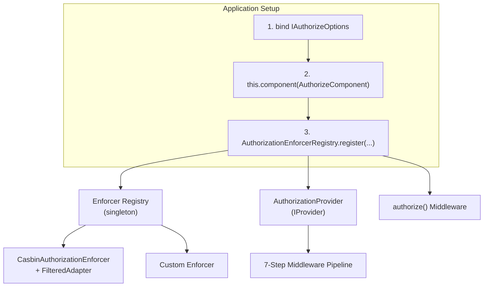
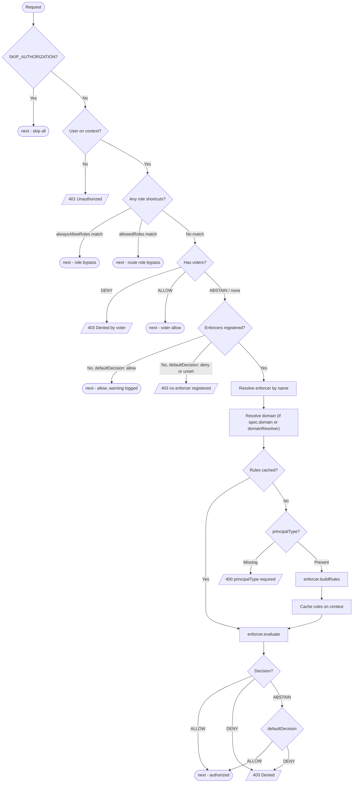
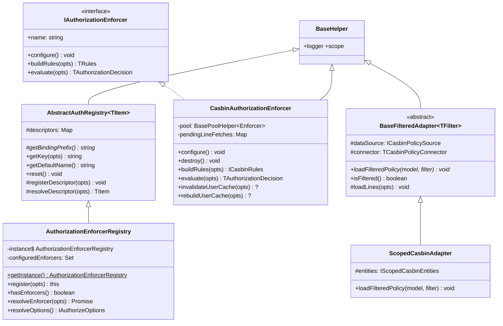

# Authorization Reference

Every option, binding key, class, and method the Authorization component exposes. See the [Overview](./) for the guided introduction and [Usage](./usage) for task-oriented examples.

**Files:**

- [`packages/core-server/src/components/auth/authorize/`](https://github.com/VENIZIA-AI/ignis/blob/main/packages/core-server/src/components/auth/authorize) - component, providers, enforcers, adapters, models, middleware
- [`packages/core-server/src/components/auth/base/abstract-auth-registry.ts`](https://github.com/VENIZIA-AI/ignis/blob/main/packages/core-server/src/components/auth/base/abstract-auth-registry.ts) - `AbstractAuthRegistry` (shared with Authentication)
- [`packages/core-server/src/base/metadata/persistents.ts`](https://github.com/VENIZIA-AI/ignis/blob/main/packages/core-server/src/base/metadata/persistents.ts) - `@model` populating `AUTHORIZATION_SUBJECT`
- [`packages/core-server/src/helpers/inversion/mixins/model.mixin.ts`](https://github.com/VENIZIA-AI/ignis/blob/main/packages/core-server/src/helpers/inversion/mixins/model.mixin.ts) - `MetadataRegistry` authorize-settings queries

## Find what you need

| You want to | Go to |
|---|---|
| Bind global options and per-enforcer options | [Binding keys](#binding-keys) |
| Configure `AuthorizeComponent` at startup | [IAuthorizeOptions](#iauthorizeoptions) |
| Configure the Casbin enforcer (model, cache, pool) | [ICasbinEnforcerOptions](#icasbinenforceroptions) |
| Write a route's `authorize` spec | [IAuthorizationSpec (route-level)](#iauthorizationspec-route-level) |
| Resolve a request's domain scope | [IAuthorizationDomainSource / TAuthorizationDomainResolver](#iauthorizationdomainsource-tauthorizationdomainresolver) |
| Look up an action, decision, or role constant | [Constants](#constants) |
| Read the scoped RBAC `.conf` model | [CASBIN_RBAC_DOMAIN_SCOPED_MODEL](#casbin_rbac_domain_scoped_model) |
| Register or resolve enforcers | [AuthorizationEnforcerRegistry](#authorizationenforcerregistry) |
| Understand how the Casbin enforcer builds and evaluates rules | [CasbinAuthorizationEnforcer](#casbinauthorizationenforcer) |
| Use the ready-made Postgres adapter | [ScopedCasbinAdapter](#scopedcasbinadapter) |
| Write a custom adapter | [BaseFilteredAdapter](#basefilteredadapter) |
| Grant a subset of a subject's operations | [Subset grants (custom rows)](#subset-grants-custom-rows) and [GrantBuilder.planGrant](#grantbuilderplangrant) |
| Seed `PolicyDefinition` / `Permission` rows | [Policy and permission builders](#policy-and-permission-builders) |
| Wire `authorize` into a REST or gRPC controller | [Controller integration](#controller-integration) |
| Read the context keys the middleware sets | [Context variables](#context-variables) |

## Import paths

```typescript
import {
  // Component & middleware
  AuthorizeComponent, AuthorizationProvider, authorize,

  // Registry
  AuthorizationEnforcerRegistry,

  // Enforcers
  CasbinAuthorizationEnforcer,

  // Adapters
  BaseFilteredAdapter, ScopedCasbinAdapter, PrincipalPolicyEdges,

  // Scoped RBAC model
  CASBIN_RBAC_DOMAIN_SCOPED_MODEL,

  // Models
  AuthorizationRole,

  // Policy / permission catalog builders - AuthorizationPermissionBuilder.objectMatch is the
  // resource-hierarchy matcher (register on a custom Casbin model)
  AuthorizationPolicyBuilder, AuthorizationPermissionBuilder, GrantBuilder,

  // Constants
  Authorization, AuthorizationActions, AuthorizationDecisions, AuthorizationDomainScopes,
  AuthorizationPolicyVariants, AuthorizationRoles, AuthorizationEnforcerTypes,
  CasbinEnforcerModelDrivers, CasbinEnforcerCachedDrivers, CasbinRuleVariants,
  CasbinDomainMatchingFunctions,

  // Binding keys
  AuthorizeBindingKeys,
} from '@venizia/ignis';

import type {
  // Core interfaces
  IAuthorizeOptions, IAuthorizationEnforcer, IAuthorizationSpec, IAuthorizationRequest,
  IAuthorizationRole, IAuthorizationDomainSource, TAuthorizationDomainResolver,

  // Casbin options
  ICasbinEnforcerOptions, ICasbinEnforcerCachedRedis,

  // Adapter types
  ICasbinPolicyFilter, ICasbinPolicySource, IScopedCasbinEntities, IScopedCasbinPolicyFilter,

  // Function & utility types
  TAuthorizeFn, TAuthorizationVoter, TAuthorizationConditions, TRegistryDescriptor,

  // Model-based authorization metadata
  IModelAuthorizeSettings,

  // Value types (from TConstValue)
  TAuthorizationAction, TAuthorizationDecision, TAuthorizationEnforcerType,
  TCasbinEnforcerCachedDriver, TCasbinEnforcerModelDriver, TCasbinRuleVariant,
  TCasbinDomainMatchingFunction, TAuthorizationPolicyVariant, TAuthorizationDomainScope,
} from '@venizia/ignis';
```

## Architecture

### System overview



### Middleware pipeline



### Class hierarchy



### Module file layout

```
components/auth/authorize/
├── adapters/
│   ├── base-filtered.ts          # BaseFilteredAdapter (thin abstract) + ICasbinPolicyFilter
│   ├── scoped-casbin.adapter.ts  # ScopedCasbinAdapter (generic edge-table reader)
│   └── types.ts                  # IScopedCasbinEntities, IScopedCasbinTable, ICasbinPolicySource
├── builders/
│   ├── grant.builder.ts           # GrantBuilder
│   ├── permission.builder.ts      # AuthorizationPermissionBuilder + static objectMatch
│   └── policy.builder.ts          # AuthorizationPolicyBuilder
├── common/
│   ├── constants.ts               # Authorization, Actions, Decisions, PolicyVariants, Roles, AuthorizeBindingKeys, ...
│   └── types.ts                   # IAuthorizeOptions, IAuthorizationEnforcer, ICasbinEnforcerOptions, ...
├── enforcers/
│   ├── casbin.enforcer.ts        # CasbinAuthorizationEnforcer
│   ├── enforcer-registry.ts      # AuthorizationEnforcerRegistry (singleton)
│   └── models/rbac-domain.model.ts # CASBIN_RBAC_DOMAIN_SCOPED_MODEL
├── middlewares/authorize.middleware.ts # authorize() standalone function
├── models/authorization-role.model.ts  # AuthorizationRole
├── providers/
│   ├── authorization.provider.ts # AuthorizationProvider
│   └── request-domain.ts         # resolveRequestDomain, readDeclarative
└── component.ts                        # AuthorizeComponent
```

### Design decisions

| Decision | Rationale |
|----------|-----------|
| Enforcer-based | Pluggable architecture - swap Casbin for a custom enforcer without changing route configs |
| Registry + co-located options | Enforcer class, name, type, and options are registered together - no split configuration |
| Type-discriminated enforcers | `type: 'casbin' \| 'custom'` in registry constrains `options` (`ICasbinEnforcerOptions` vs `unknown`) |
| Voter pattern | Custom logic that short-circuits before the enforcer |
| Rules caching | Built rules cached on the Hono context per-request - avoids rebuilding for multi-spec routes |
| Registry singleton | Mirrors `AuthenticationStrategyRegistry` - shares `AbstractAuthRegistry<T>` |
| Filtered adapter pattern | `BaseFilteredAdapter` is a thin read-only base; subclasses implement only `loadFilteredPolicy` |
| No-enforcer fallback | No enforcers registered -> the middleware honors `defaultDecision`: `deny` (default) throws a named 403, `allow` proceeds and logs a warning |
| Single edge table (scoped model) | `ScopedCasbinAdapter` reads one `PolicyDefinition` table for every edge type - no per-relation tables |

## AuthorizeComponent

`AuthorizeComponent extends BaseComponent`. Its `binding()` runs at application startup:

| Step | Action | Failure |
|------|--------|---------|
| 1 | Resolve `IAuthorizeOptions` from the container via `AuthorizeBindingKeys.OPTIONS` | Throws `[AuthorizeComponent] No authorize options found` |
| 2 | `bindAlwaysAllowRoles()` - binds `alwaysAllowRoles` to `AuthorizeBindingKeys.ALWAYS_ALLOW_ROLES` if present | Skipped if no roles configured |

```typescript
class AuthorizeComponent extends BaseComponent {
  constructor(@inject({ key: CoreBindings.APPLICATION_INSTANCE }) private application: BaseApplication);
  override binding(): ValueOrPromise<void>;
  private bindAlwaysAllowRoles(opts: { options: IAuthorizeOptions }): void;
}
```

> [!NOTE]
> Enforcer registration is separate - `AuthorizeComponent` only validates global options. Register enforcers via `AuthorizationEnforcerRegistry.register()`.

Source -> [`component.ts`](https://github.com/VENIZIA-AI/ignis/blob/main/packages/core-server/src/components/auth/authorize/component.ts)

## Binding keys

| Key | Constant | Type | Description |
|-----|----------|------|-------------|
| `@app/authorize/options` | `AuthorizeBindingKeys.OPTIONS` | `IAuthorizeOptions` | Global authorization options |
| `@app/authorize/always-allow-roles` | `AuthorizeBindingKeys.ALWAYS_ALLOW_ROLES` | `string[]` | Auto-bound by the component if present in options |
| `@app/authorize/enforcers/{name}/options` | `AuthorizeBindingKeys.enforcerOptions(name)` | `ICasbinEnforcerOptions \| unknown` | Per-enforcer options, auto-bound by the registry |

```typescript
class AuthorizeBindingKeys {
  static readonly OPTIONS = '@app/authorize/options';
  static readonly ALWAYS_ALLOW_ROLES = '@app/authorize/always-allow-roles';
  static enforcerOptions(name: string): string {
    return `@app/authorize/enforcers/${name}/options`;
  }
}
```

`AuthorizeBindingKeys.enforcerOptions(name)` is called automatically by `AuthorizationEnforcerRegistry.register()` when `options` is provided; `CasbinAuthorizationEnforcer` injects its options from `AuthorizeBindingKeys.enforcerOptions('casbin')`.

Source -> [`common/constants.ts`](https://github.com/VENIZIA-AI/ignis/blob/main/packages/core-server/src/components/auth/authorize/common/constants.ts)

## Option interfaces

### IAuthorizeOptions

Global settings, bound before registering `AuthorizeComponent`.

| Option | Type | Default | Description |
|--------|------|---------|-------------|
| `defaultDecision` | `TAuthorizationDecision` | - | **Required.** Decision applied when the enforcer returns `ABSTAIN` |
| `alwaysAllowRoles` | `string[]` | `[]` | Roles that bypass all authorization checks (global) |
| `domainResolver` | `TAuthorizationDomainResolver` | - | Fallback domain resolver used when a route's `spec.domain` is not set. Returns `{ type, id }` or `null` (-> `SYSTEM_WIDE`) |

```typescript
interface IAuthorizeOptions {
  defaultDecision: TAuthorizationDecision;
  alwaysAllowRoles?: string[];
  domainResolver?: TAuthorizationDomainResolver;
}
```

### ICasbinEnforcerOptions

Casbin-specific options, provided per-enforcer via `AuthorizationEnforcerRegistry.register()`.

| Option | Type | Default | Description |
|--------|------|---------|-------------|
| `model` | `{ driver: 'file', definition } \| { driver: 'text', definition }` | - | **Required.** Casbin model (file path or inline text). For scoped RBAC, use `CASBIN_RBAC_DOMAIN_SCOPED_MODEL` |
| `cached` | `{ use: false } \| (ICasbinEnforcerCachedRedis & { use: true })` | - | **Required.** Caching configuration (Redis-only) |
| `adapter` | `Adapter` | - | Casbin adapter instance (e.g. `ScopedCasbinAdapter`) |
| `isScoped` | `boolean` | `false` | Enables the scoped model: 4-token `(sub, dom, obj, act)` requests. Auto-registers `keyMatch`, `objectMatch`, and `ResourceRoleManager` - see [`CasbinAuthorizationEnforcer`](#casbinauthorizationenforcer) |
| `poolSize` | `number` | `16` | Pooled enforcers (each request enforces on its own borrowed instance) |
| `poolAcquireTimeoutMs` | `number` | `5000` | Max ms to wait for a free pooled enforcer before failing closed |
| `normalizePayloadFn` | `(opts) => { subject, resource, action, domain? }` | - | Custom (non-scoped) payload normalizer, run before evaluation |
| `domainMatching` | `{ roleDefinition: string; fn: TCasbinDomainMatchingFunction }` | - | Opt-in domain matching function for the flat model. **Not needed when `isScoped: true`** |

```typescript
interface ICasbinEnforcerOptions<E extends Env = Env, TAction = string, TResource = string, TAdapter = Adapter> {
  model: { driver: 'file'; definition: string } | { driver: 'text'; definition: string };
  cached: { use: false } | (ICasbinEnforcerCachedRedis & { use: true });
  adapter?: TAdapter;
  isScoped?: boolean;
  poolSize?: number;
  poolAcquireTimeoutMs?: number;
  normalizePayloadFn?(opts: { user: IAuthUser; action: TAction; resource: TResource; context: TContext<E, string> }): {
    subject: string; resource: string; action: string; domain?: string;
  };
  domainMatching?: { roleDefinition: string; fn: TCasbinDomainMatchingFunction };
}
```

> [!NOTE]
> `cached.options.expiresIn` must be `>= 10_000` ms (`MIN_EXPIRES_IN`). Caching is **Redis-only** - the in-memory driver was removed.

### Domain hierarchy edges (`g3`)

There is no enforcer-level option for domain hierarchy - a role assignment (`g`), a grant (`g3`), or a domain membership (`g2`) declared at a parent domain reaching its children is driven entirely by `g3` policy lines already present in a principal's own line set, whenever `isScoped: true`. Two sources produce those lines - see `resolveDomainEdges` on [`ScopedCasbinAdapter`](#scopedcasbinadapter) below for the second one:

- `domain_inherits` rows reachable from the principal's domain closure (`ScopedCasbinAdapter`'s `DOMAIN_EDGE` branch, always on).
- `ScopedCasbinAdapter`'s `resolveDomainEdges` constructor hook, for a hierarchy the app already owns on a business table.

`registerMatchers()` (see [`configure()`](#configure) below) wires this unconditionally for every scoped model, sharing one overlay across the three role managers. Freshness is whatever the per-user policy-line cache already guarantees; there is no separate TTL or invalidation call to reason about.

**Cache configuration (discriminated union):**

```typescript
interface { use: false } // every request rebuilds the user's policy from the datasource

interface ICasbinEnforcerCachedRedis {
  driver: 'redis';
  options: {
    connection: IRedisHelper;
    expiresIn: number;
    keyFn: (opts: { user: IAuthorizationUser }) => ValueOrPromise<string>;
  };
}
```

### IAuthorizationSpec (route-level)

| Option | Type | Default | Description |
|--------|------|---------|-------------|
| `action` | `TAction` | - | **Required.** Action being performed (e.g. `'read'`, `'create'`) |
| `resource` | `TResource` | - | **Required.** Resource being accessed (e.g. `'Article'`) |
| `conditions` | `TAuthorizationConditions` | - | Key-value ABAC conditions. Plumbed into `request.conditions`; the built-in Casbin enforcer does not read it - only custom enforcers/voters can |
| `allowedRoles` | `string[]` | - | Roles that bypass the enforcer for this route |
| `voters` | `TAuthorizationVoter[]` | - | Custom voter functions for this route |
| `domain` | `IAuthorizationDomainSource \| TAuthorizationDomainResolver` | - | Per-route domain source for scoped RBAC. Omitted -> falls back to the global `domainResolver`, then `SYSTEM_WIDE` |

```typescript
interface IAuthorizationSpec<E extends Env = Env, TAction = string, TResource = string> {
  action: TAction;
  resource: TResource;
  conditions?: TAuthorizationConditions;
  allowedRoles?: string[];
  voters?: TAuthorizationVoter<E, TAction, TResource>[];
  domain?: IAuthorizationDomainSource | TAuthorizationDomainResolver<E>;
}
```

### IAuthorizationDomainSource / TAuthorizationDomainResolver

```typescript
interface IAuthorizationDomainSource {
  from: 'param' | 'header' | 'query' | 'context';
  key: string;
  type: string; // domain type, e.g. 'Merchant'
}

type TAuthorizationDomainResolver<E extends Env = Env> = (opts: {
  context: TContext<E, string>;
}) => ValueOrPromise<TNullable<{ type: string; id: IdType }>>;
```

`resolveRequestDomain()` (`providers/request-domain.ts`) turns either shape into a casbin domain string. Precedence: `spec.domain` (resolver, then declarative `readDeclarative()`) -> `IAuthorizeOptions.domainResolver` -> `AuthorizationDomainScopes.SYSTEM_WIDE`.

`readDeclarative()` reads `context.req.param/header/query()` for `'param'|'header'|'query'`, or `context.get(key)` for `'context'`.

### TAuthorizationConditions / TAuthorizationVoter / TAuthorizeFn

```typescript
type TAuthorizationConditions<KeyType extends string | symbol = string | symbol, ValueType = string | number | boolean | null> =
  Record<KeyType, ValueType>;

type TAuthorizationVoter<E extends Env = Env, TAction = string, TResource = string> = (opts: {
  user: IAuthUser; action: TAction; resource: TResource; context: TContext<E, string>;
}) => ValueOrPromise<TAuthorizationDecision>;

type TAuthorizeFn<E extends Env = Env, TAction = string, TResource = string> = (opts: {
  spec: IAuthorizationSpec<E, TAction, TResource>;
  enforcerName?: string;
}) => MiddlewareHandler;
```

### IAuthorizationRequest

The request object built by the provider and passed to `evaluate()`.

```typescript
interface IAuthorizationRequest<TAction = string, TResource = string> {
  action: TAction;
  resource: TResource;
  conditions?: TAuthorizationConditions;
  /** Resolved domain scope: `"<DomainType>_<id>"` (e.g. `"Merchant_7"`) or the `"SYSTEM_WIDE"` sentinel. */
  domain?: string;
}
```

Source -> [`common/types.ts`](https://github.com/VENIZIA-AI/ignis/blob/main/packages/core-server/src/components/auth/authorize/common/types.ts)

## Constants

All constant classes follow the same pattern: static readonly values + `SCHEME_SET: Set<string>` + `isValid(input): boolean`, plus a companion type alias via `TConstValue<typeof ClassName>`.

**`Authorization`** - context keys.

| Constant | Value | Description |
|----------|-------|-------------|
| `Authorization.RULES` | `'authorization.rules'` | Context key for cached rules |
| `Authorization.SKIP_AUTHORIZATION` | `'authorization.skip'` | Context key to dynamically skip authorization |
| `Authorization.ENFORCER` | `'authorization.enforcer'` | Binding key prefix for enforcers |
| `Authorization.DOMAIN` | `'authorization.domain'` | Context key for the resolved request domain scope |

**`AuthorizationActions`** - `CREATE` `UPDATE` `DELETE` `EXECUTE` `READ` `WRITE` `MANAGE` `CUSTOM`. `AuthorizationActions.LATTICE` declares the standard action hierarchy consumed by `AuthorizationPolicyBuilder.actionLattice()`:

| `child` | `parent` |
|---|---|
| `READ`, `WRITE`, `EXECUTE` | `MANAGE` |
| `CREATE`, `UPDATE`, `DELETE` | `WRITE` |

`CUSTOM` (`'custom'`) is a grant-mode marker for a subset grant carrying `metadata.ops` - see [Subset grants](#subset-grants-custom-rows). It is deliberately absent from `LATTICE`: it names an encoding, not a position in the action hierarchy.

**`AuthorizationDecisions`** - `ALLOW` `DENY` `ABSTAIN`.

| Method | String check | Number check |
|--------|-------------|--------------|
| `isAllow(input)` | `input.toLowerCase() === 'allow'` | `input > 0` |
| `isDeny(input)` | `input.toLowerCase() === 'deny'` | `input < 0` |
| `isAbstain(input)` | `input.toLowerCase() === 'abstain'` | `input === 0` |

**`AuthorizationEnforcerTypes`** - `CASBIN` (`'casbin'`), `CUSTOM` (`'custom'`).

**`CasbinEnforcerModelDrivers`** - `FILE` (`'file'`, load from a `.conf` path), `TEXT` (`'text'`, inline string).

**`CasbinEnforcerCachedDrivers`** - `REDIS` (`'redis'`) is the only driver; the in-memory driver was removed.

**`CasbinDomainMatchingFunctions`** - selectable for `ICasbinEnforcerOptions.domainMatching.fn`, each mapping 1:1 to a Casbin `Util.*Func`, applied to the **domain slot** of a role definition (e.g. `g`).

| Constant | Value | Description |
|----------|-------|-------------|
| `KEY_MATCH` | `'keyMatch'` | `*` is the only wildcard; exact compare otherwise (recommended for `Merchant_<uuid>`-style domains) |
| `KEY_MATCH_2` | `'keyMatch2'` | Adds URL-path `:param` segment matching |
| `KEY_MATCH_3` | `'keyMatch3'` | Adds `{param}` segment matching |
| `KEY_MATCH_4` | `'keyMatch4'` | `{param}` with repeated-name equality checks |
| `REGEX_MATCH` | `'regexMatch'` | Treats the stored/policy value as a full regular expression |

> [!IMPORTANT]
> Applied as `fn(requestDomain, policyDomain)` - the wildcard must live on the **stored/policy** side.
>
> | Call | Result |
> |---|---|
> | `keyMatch("Merchant_X", "*")` | `true` |
> | `keyMatch("Merchant_X", "Merchant_X")` | `true` |
> | `keyMatch("Merchant_X", "Merchant_Y")` | `false` |

**`CasbinRuleVariants`** - the Casbin line prefixes declared by the scoped model, numbered in request-tuple order (`sub -> dom -> obj -> act`).

| Constant | Value | Relation |
|----------|-------|----------|
| `P` | `'p'` | Permission policy line |
| `G` | `'g'` | Role membership + role inheritance (the `sub` axis) |
| `G2` | `'g2'` | User -> domain membership (the `dom` axis) |
| `G3` | `'g3'` | Domain hierarchy (the `dom` axis) |
| `G4` | `'g4'` | Resource hierarchy (the `obj` axis, served by `ResourceRoleManager`) |
| `G5` | `'g5'` | Action hierarchy (the `act` axis) |

**`AuthorizationPolicyVariants`** - the DB `variant` discriminator stored on each `PolicyDefinition` row (the kind of "edge"). Each entry carries `action` (the DB value) and `rule` (the Casbin prefix `ScopedCasbinAdapter` emits for it).

| Variant | `action` (DB) | `rule` | Meaning |
|---------|---------------|--------|---------|
| `GRANT` | `'grant'` | `p` | Give a permission to a User or Role |
| `ASSIGN_ROLE` | `'assign_role'` | `g` | Give a User a Role (optionally domain-scoped) |
| `ROLE_INHERITS` | `'role_inherits'` | `g` | Role inherits another Role |
| `JOIN_DOMAIN` | `'join_domain'` | `g2` | User is a member of a Domain |
| `DOMAIN_INHERITS` | `'domain_inherits'` | `g3` | Domain nested under a parent Domain |
| `RESOURCE_INHERITS` | `'resource_inherits'` | `g4` | Resource nested under a broader Resource |
| `ACTION_INHERITS` | `'action_inherits'` | `g5` | Action implied by a broader Action |

`isValidAction(input)` / `isValidRule(input)` check membership; `ACTION_SCHEME_SET` / `RULE_SCHEME_SET` hold the sets.

The `variant` column's TypeScript type (`extraPolicyDefinitionColumns` in [`policy-definition.model.ts`](https://github.com/VENIZIA-AI/ignis/blob/main/packages/core-server/src/components/auth/models/entities/policy-definition.model.ts)) is closed to these seven values by default - `extraPolicyDefinitionColumns()`. An application with its own edge type stored in the same table declares it explicitly, and only that call site's column type widens:

```typescript
extraPolicyDefinitionColumns({ idType: 'string', extraVariants: ['merchant_role'] });
```

`ScopedCasbinAdapter` never selects an undeclared variant - it is purely the application's own data alongside the seven above.

**`AuthorizationDomainScopes`** - sentinel domain values on `grant` rows.

| Constant | Value | Meaning |
|----------|-------|---------|
| `ANY_MEMBER` | `'ANY_MEMBER'` | Applies in every domain the subject joined (checked via `g2`) |
| `SYSTEM_WIDE` | `'SYSTEM_WIDE'` | Applies system-wide, bypassing membership (super-admin) |

**`AuthorizationRoles`** - built-in role identifiers (see [AuthorizationRole](#authorizationrole)).

| Constant | Identifier | Priority |
|----------|------------|----------|
| `SUPER_ADMIN` | `'999_super-admin'` | 999 |
| `ADMIN` | `'900_admin'` | 900 |
| `USER` | `'010_user'` | 10 |
| `GUEST` | `'001_guest'` | 1 |
| `UNKNOWN_USER` | `'000_unknown-user'` | 0 |

Source -> [`common/constants.ts`](https://github.com/VENIZIA-AI/ignis/blob/main/packages/core-server/src/components/auth/authorize/common/constants.ts)

## CASBIN_RBAC_DOMAIN_SCOPED_MODEL

The exported `.conf` text for the scoped model - pass it to `ICasbinEnforcerOptions.model` with `driver: CasbinEnforcerModelDrivers.TEXT` and `isScoped: true`.

```ini
[request_definition]
r = sub, dom, obj, act

[policy_definition]
p = sub, dom, obj, act, eft

[role_definition]
g = _, _, _
g2 = _, _
g3 = _, _
g4 = _, _
g5 = _, _

[policy_effect]
e = some(where (p.eft == allow)) && !some(where (p.eft == deny))

[matchers]
m = g(r.sub, p.sub, r.dom) && (p.dom == "SYSTEM_WIDE" || (p.dom == "ANY_MEMBER" && g2(r.sub, r.dom)) || g3(r.dom, p.dom)) && (objectMatch(r.obj, p.obj) || g4(r.obj, p.obj)) && g5(r.act, p.act)
```

| Relation | Axis | Meaning |
|---|---|---|
| `g` | `sub` | `assign_role` (user -> role) + `role_inherits` (role -> role), domain-aware. Registered with `keyMatch` so a `*` domain on a link matches any request domain |
| `g2` | `dom` (membership) | `join_domain` - powers the `ANY_MEMBER` grant scope |
| `g3` | `dom` (nesting) | `domain_inherits`, plus a self-link so an exact domain always matches itself |
| `g4` | `obj` | `resource_inherits` - explicit non-standard nesting edges; served by `ResourceRoleManager`, not a matching function |
| `g5` | `act` | `action_inherits`, plus a self-link |

**Effect** is casbin's `allow-and-deny` effector. A request needs a matching `allow` AND no matching `deny` - default-DENY. An explicit `deny` always overrides an `allow`. This is deliberately NOT casbin's `deny-override` effector (`!some(where (p.eft == deny))`), which would be default-ALLOW.

**Domain clause**, matched by `p.dom`:

| `p.dom` value | Matches |
|---|---|
| `SYSTEM_WIDE` | Every domain - bypasses membership, super-admin |
| `ANY_MEMBER` | Every domain the subject joined, via `g2` |
| `<Type>_<id>` | That domain, or a nested child via `g3` |

> [!NOTE]
> Relies on the default `DefaultRoleManager`'s self-link behavior (`hasLink(name, name) === true`) for `g3`/`g4`/`g5` - a custom role manager must preserve self-links.

Source -> [`enforcers/models/rbac-domain.model.ts`](https://github.com/VENIZIA-AI/ignis/blob/main/packages/core-server/src/components/auth/authorize/enforcers/models/rbac-domain.model.ts)

## AbstractAuthRegistry

Shared base for the authentication strategy registry and `AuthorizationEnforcerRegistry`. Provides descriptor storage, binding-key generation, and DI resolution.

```typescript
abstract class AbstractAuthRegistry<TItem> extends BaseHelper {
  protected descriptors: Map<string, TRegistryDescriptor<TItem>>;
  constructor(opts: { scope: string });
  protected abstract getBindingPrefix(): string;

  getKey(opts: { name: string }): string;      // `${prefix}.${name}`
  getDefaultName(): string;                     // first registered descriptor (Map insertion order)
  reset(): void;                                 // clears the Map

  protected registerDescriptor(opts: { container: Container; target: TClass<TItem>; name: string }): void;
  protected resolveDescriptor(opts: { name: string }): TItem;
}

type TRegistryDescriptor<TItem> = { container: Container; targetClass: TClass<TItem> };
```

| Method | Description | Throws |
|--------|-------------|--------|
| `getKey({ name })` | Builds the binding key | `[getKey] Invalid name` if empty |
| `getDefaultName()` | First registered descriptor's name | `[ClassName] No items registered` if none |
| `registerDescriptor(opts)` | Stores the descriptor + binds the class `SINGLETON` in DI | - |
| `resolveDescriptor({ name })` | Resolves the instance from the DI container | `Descriptor not found: {name}` or `Failed to resolve: {name}` |
| `reset()` | Clears all descriptors | - |

`AuthorizationEnforcerRegistry.getBindingPrefix()` returns `Authorization.ENFORCER` (`'authorization.enforcer'`).

Source -> [`base/abstract-auth-registry.ts`](https://github.com/VENIZIA-AI/ignis/blob/main/packages/core-server/src/components/auth/base/abstract-auth-registry.ts)

## AuthorizationEnforcerRegistry

Singleton, extends `AbstractAuthRegistry<IAuthorizationEnforcer>`.

```typescript
class AuthorizationEnforcerRegistry extends AbstractAuthRegistry<IAuthorizationEnforcer> {
  private static instance: AuthorizationEnforcerRegistry;
  private configuredEnforcers: Set<string>;

  static getInstance(): AuthorizationEnforcerRegistry;
  override reset(): void; // clears descriptors + configuredEnforcers

  register(opts: {
    container: Container;
    enforcers: Array<
      | { enforcer: TClass<IAuthorizationEnforcer>; name: string; type: 'casbin'; options?: ICasbinEnforcerOptions }
      | { enforcer: TClass<IAuthorizationEnforcer>; name: string; type: 'custom'; options?: unknown }
    >;
  }): this;

  hasEnforcers(): boolean;
  getDefaultEnforcerName(): string;
  resolveEnforcer(opts: { name: string }): Promise<IAuthorizationEnforcer>;
  resolveOptions(): IAuthorizeOptions | undefined;
  invalidateUserCache(opts: { user: IAuthorizationUser; enforcerName?: string }): Promise<{ invalidatedKeys: number }>;
  rebuildUserCache(opts: { user; enforcerName? }): Promise<{ cacheKey: string; lineCount: number }>;
}
```

| Method | Returns | Description |
|--------|---------|-------------|
| `getInstance()` | `AuthorizationEnforcerRegistry` | Singleton instance (created on first call) |
| `register(opts)` | `this` | Registers enforcers with type-safe options (chainable) |
| `hasEnforcers()` | `boolean` | `descriptors.size > 0` - used by the middleware to decide whether to honor `defaultDecision` instead of resolving an enforcer |
| `getDefaultEnforcerName()` | `string` | Delegates to `getDefaultName()` |
| `resolveEnforcer({ name })` | `Promise<IAuthorizationEnforcer>` | Resolves + auto-configures once (`configuredEnforcers` Set) |
| `resolveOptions()` | `IAuthorizeOptions \| undefined` | Iterates all registered containers looking for `AuthorizeBindingKeys.OPTIONS` |
| `invalidateUserCache(opts)` | `Promise<{ invalidatedKeys }>` | Drops a user's cached policies - throws if the resolved enforcer lacks the optional method |
| `rebuildUserCache(opts)` | `Promise<{ cacheKey, lineCount }>` | Drops then immediately re-extracts + re-caches |
| `reset()` | `void` | Clears descriptors AND `configuredEnforcers` |

**`register()` behavior:**

- Validates no duplicate names within the call.
- Validates each name is not already registered.
- Binds each class as a singleton at `authorization.enforcer.{name}`.
- If `options` is given, binds it to `AuthorizeBindingKeys.enforcerOptions(name)`.

**Configure-once pattern:**

```typescript
async resolveEnforcer(opts: { name: string }): Promise<IAuthorizationEnforcer> {
  const enforcer = this.resolveDescriptor(opts);
  if (!this.configuredEnforcers.has(opts.name)) {
    await enforcer.configure();
    this.configuredEnforcers.add(opts.name);
  }
  return enforcer;
}
```

Source -> [`enforcers/enforcer-registry.ts`](https://github.com/VENIZIA-AI/ignis/blob/main/packages/core-server/src/components/auth/authorize/enforcers/enforcer-registry.ts)

## IAuthorizationEnforcer interface

```typescript
interface IAuthorizationEnforcer<
  E extends Env = Env, TAction = string, TResource = string, TRules = unknown,
  TBuildRulesReturn = ValueOrPromise<TRules>, TEvaluateReturn = ValueOrPromise<TAuthorizationDecision>,
> {
  name: string;
  configure(): ValueOrPromise<void>;
  buildRules(opts: { user: IAuthorizationUser; context: TContext<E, string> }): TBuildRulesReturn;
  evaluate(opts: { rules: TRules; request: IAuthorizationRequest<TAction, TResource>; context: TContext<E, string> }): TEvaluateReturn;

  /** Optional - implemented only by caching enforcers. */
  invalidateUserCache?(opts: { user: IAuthorizationUser }): Promise<{ invalidatedKeys: number }>;
  rebuildUserCache?(opts: { user: IAuthorizationUser }): Promise<{ cacheKey: string; lineCount: number }>;
}
```

| Generic | Default | Description |
|---------|---------|--------------|
| `E` | `Env` | Hono `Env` type for typed context access |
| `TAction` / `TResource` | `string` | Action / resource type |
| `TRules` | `unknown` | Rules type produced by `buildRules`, consumed by `evaluate` |
| `TBuildRulesReturn` | `ValueOrPromise<TRules>` | Return type of `buildRules` |
| `TEvaluateReturn` | `ValueOrPromise<TAuthorizationDecision>` | Return type of `evaluate` |

| Method | Input | Returns | Called by |
|--------|-------|---------|-----------|
| `configure()` | - | `void` | Registry, on first `resolveEnforcer()` |
| `buildRules` | `{ user, context }` | `TRules` | Provider, pipeline step 6 |
| `evaluate` | `{ rules, request, context }` | `TAuthorizationDecision` | Provider, pipeline step 7 |

`invalidateUserCache`/`rebuildUserCache` are feature-detected at runtime (`typeof enforcer.invalidateUserCache === 'function'`) - only `CasbinAuthorizationEnforcer` with a Redis cache implements them.

## CasbinAuthorizationEnforcer

Wraps the `casbin` library (optional peer dependency). The adapter only loads from the database on a throwaway enforcer, to build one user's policy lines (cached in Redis if configured). Every request then evaluates on its own enforcer, borrowed from a `BasePoolHelper<Enforcer>` and freshly loaded with those lines. This isolates concurrency and keeps the database out of the hot path.

```typescript
class CasbinAuthorizationEnforcer<E extends Env = Env, TAction extends string = string, TResource extends string = string>
  extends BaseHelper
  implements IAuthorizationEnforcer<E, TAction, TResource, ICasbinRules>
{
  name = 'CasbinAuthorizationEnforcer';
  private readonly MIN_EXPIRES_IN = 10_000;
  private pool: TNullable<BasePoolHelper<CasbinEnforcerType>>;
  private helper: TNullable<typeof CasbinHelper>;          // casbin.Helper (loadPolicyLine)
  private readonly pendingLineFetches = new Map<string, Promise<string[]>>(); // single-flight
  private resolvedPayloadFn: TNullable<TNormalizePayloadFn>; // memoized in configure()

  constructor(@inject({ key: AuthorizeBindingKeys.enforcerOptions('casbin') }) private options: ICasbinEnforcerOptions<E, TAction, TResource>);

  async configure(): Promise<void>;
  destroy(): void;

  async buildRules(opts: { user; context }): Promise<ICasbinRules>;      // { user, lines }
  async evaluate(opts: { rules; request; context }): Promise<TAuthorizationDecision>;

  async invalidateUserCache(opts: { user }): Promise<{ invalidatedKeys: number }>;
  async rebuildUserCache(opts: { user }): Promise<{ cacheKey: string; lineCount: number }>;

  protected async registerMatchers(opts: { enforcer; casbin }): Promise<void>;
  protected assertMatcherCompilesSync(opts: { enforcer }): void;
  protected resolveModel(opts): Model;
  protected validateExpiresIn(opts: { expiresIn: number }): void;
  protected async fetchLinesWithRedisCache(opts: { user; cached }): Promise<string[]>;
  protected async extractUserLines(opts: { user }): Promise<string[]>;   // throwaway enforcer + adapter
  protected async extractLinesFrom(enforcer): Promise<string[]>;
  protected async loadPolicyLinesIntoModel(opts: { enforcer; lines }): Promise<void>;
  protected enforceWithExplain(opts: { enforcer; vals: string[] }): boolean;
}
```

### configure()

Called once by the registry on first use:

1. Dynamically imports `casbin` - throws if not installed.
2. Validates `options.model` is present.
3. Memoizes the payload normalizer (`options.normalizePayloadFn ?? defaultScopedPayloadFn()`; the latter is `undefined` unless `isScoped`).
4. If `cached.use`, validates `expiresIn >= MIN_EXPIRES_IN` (10,000 ms).
5. Builds a `BasePoolHelper<Enforcer>` (`size = poolSize ?? 16`, `acquireTimeoutMs = poolAcquireTimeoutMs ?? 5000`). Each pooled enforcer is created **without an adapter** (no DB load at warmup), then `registerMatchers()` and `assertMatcherCompilesSync()` run on it.
6. `await pool.warmup()` - pre-creates the enforcers.

**`registerMatchers()`** - when `isScoped`, registers three things:

| Registers | On |
|---|---|
| `keyMatch` | Domain matching func on `g` |
| `objectMatch` | Matcher-expression function via `addFunction` - called directly in the model's matcher string, not as a relation's matching func |
| `ResourceRoleManager` | Named role manager for `g4` |

`g4` skips `addNamedMatchingFunc` on purpose. It sets casbin's `hasPattern`, which disables `DefaultRoleManager`'s fast path on every link check, not just `g4` lookups.

For every scoped model, three more role managers are wired unconditionally - not behind a separate option:

| Registers | On | Notes |
|---|---|---|
| `MembershipRoleManager` | `g2` | Joining a parent domain membership makes the request domain's ancestors match too |
| `DomainHierarchyRoleManager` | `g3` | Grant domain nesting, request-domain-first |
| `DomainHierarchyRoleManager` (`reversed: true`) | `g`, via casbin's own `DefaultRoleManager.addDomainHierarchy()` | Role-assignment domain, stored-domain-first - the opposite argument order from `g3` |

The `g3` instance, the reversed `g` instance and `MembershipRoleManager` on `g2` are handed the same overlay `Map<child, Set<parent>>`. Casbin's `buildRoleLinks()` feeds every `g3` policy line to the `g3` instance via `addLink`, which writes into that shared overlay - the reversed `g` instance and `MembershipRoleManager` only ever read it, since casbin never puts the `g`-axis manager in its own `rmMap` and so never calls `addLink` on it directly. See [Domain hierarchy edges (`g3`)](#domain-hierarchy-edges-g3) above for where those `g3` lines come from.

When `domainMatching` is set (flat model), `registerMatchers()` registers the chosen `Util.*Func` on the named role definition instead, and always finishes with `buildRoleLinks()`.

**`assertMatcherCompilesSync()`** is a boot-time smoke test. It forces casbin's lazy matcher compile with one dummy `enforceSync` call (4 args when scoped/`normalizePayloadFn`, else 3). A malformed matcher, an unregistered function, or an arity mismatch fails at warmup, not on the first real request.

### buildRules()

Returns `ICasbinRules = { user, lines }` - the user's complete Casbin policy lines.

| Function | Behavior |
|---|---|
| `extractUserLines(user)` | Builds a fresh, isolated enforcer *with the adapter* and calls `adapter.loadFilteredPolicy({ principal: { type, id } })` |
| `extractLinesFrom()` | Serializes every `p*`/`g*` rule the model declares back into lines, not just `p`/`g` - including the scoped model's `g2`-`g5` hierarchies |
| `fetchLinesWithRedisCache` | Returns cached lines on a hit (Redis owns expiry via `PX`); on a miss, dedups concurrent misses via `pendingLineFetches` (single-flight), extracts once, and writes the lines back to Redis |

A corrupt cache entry is logged and discarded, then refetched - never surfaced as a `500`.

### evaluate()

Borrows an enforcer from the pool and evaluates atomically inside `pool.use`:

1. `loadPolicyLinesIntoModel(enforcer, rules.lines)` - `clearPolicy()` + `loadPolicyLine()` per line + `buildRoleLinks()`.
2. `normalizePayloadFn(user, action, resource, context)` normalizes the payload.
3. `domain = normalized.domain ?? request.domain ?? (isScoped ? SYSTEM_WIDE : undefined)`.
4. `vals` is `[subject, domain, resource, action]` when a domain is present, else `[subject, resource, action]`.
5. `enforceWithExplain(vals)` runs `enforceExSync` and logs the deciding policy on a DENY.

On any error inside `pool.use`, the pool **destroys** the borrowed enforcer (fail-closed); a fresh one is created on demand.

### invalidateUserCache() / rebuildUserCache()

Redis-only - both throw if caching is disabled. `invalidateUserCache` deletes the user's shared Redis key; the next request rebuilds lazily. `rebuildUserCache` deletes, then immediately re-extracts (on a throwaway enforcer) and re-caches. The key is shared in Redis, so one call is correct across every instance.

Source -> [`enforcers/casbin.enforcer.ts`](https://github.com/VENIZIA-AI/ignis/blob/main/packages/core-server/src/components/auth/authorize/enforcers/casbin.enforcer.ts)

## BaseFilteredAdapter

Thin read-only base for casbin `FilteredAdapter`s backed by a datasource. Owns the boilerplate every filtered adapter repeats; a subclass implements only `loadFilteredPolicy`.

```typescript
abstract class BaseFilteredAdapter<TFilter = ICasbinPolicyFilter> extends BaseHelper implements FilteredAdapter {
  protected readonly dataSource: ICasbinPolicySource;
  protected get connector(): TCasbinPolicyConnector;
  constructor(opts: { scope: string; dataSource: ICasbinPolicySource });

  abstract loadFilteredPolicy(model: Model, filter: TFilter): Promise<void>;
  isFiltered(): boolean; // always true

  // Read-only adapter - no-op write methods
  async loadPolicy(): Promise<void>;
  async savePolicy(): Promise<boolean>; // returns true
  async addPolicy(): Promise<void>;
  async removePolicy(): Promise<void>;
  async removeFilteredPolicy(): Promise<void>;

  protected async query<TRow>(opts: { statement: SQL }): Promise<TRow[]>;
  protected async loadLines(opts: { model: Model; lines: string[] }): Promise<void>;
}
```

```typescript
interface ICasbinPolicyFilter { principal: { type: string; id: IdType }; }

/** Minimal contract - NOT the framework's general IDataSource. Any Drizzle-backed datasource satisfies it. */
interface ICasbinPolicySource {
  getConnector?(): TCasbinPolicyConnector; // preferred: lazily wires the driver on first read, survives pool rotation
  connector?: TCasbinPolicyConnector;      // back-compat: a pre-wired connector
}
type TCasbinPolicyConnector = PgDatabase<PgQueryResultHKT, Record<string, AnyType>>;
```

> [!NOTE]
> `ICasbinPolicySource` is a minimal local contract, not the framework's general `IDataSource` - `src/components/**` never imports `@/connectors/postgres` for this. The `connector` getter resolves `getConnector?.() ?? connector`. When a datasource exposes neither, it throws a clear `[BaseFilteredAdapter]` error - never a bare `TypeError`.

`query()` runs a raw `SQL` statement and normalizes the result to a row array. Drizzle's `execute()` shape differs per driver: node-postgres yields `{ rows }`, postgres-js yields the row list itself. Call `query()` rather than read `.rows` directly.

`loadLines()` is the other orchestration helper. Call it after assembling your own casbin lines:

```typescript
protected async loadLines(opts: { model: Model; lines: string[] }): Promise<void> {
  const { Helper } = await import('casbin');
  for (const line of opts.lines) {
    Helper.loadPolicyLine(line, opts.model);
  }
}
```

Source -> [`adapters/base-filtered.ts`](https://github.com/VENIZIA-AI/ignis/blob/main/packages/core-server/src/components/auth/authorize/adapters/base-filtered.ts), [`adapters/types.ts`](https://github.com/VENIZIA-AI/ignis/blob/main/packages/core-server/src/components/auth/authorize/adapters/types.ts)

## ScopedCasbinAdapter

The generic, read-only `FilteredAdapter` for the scoped RBAC model. Reads **one principal's edges** plus the **shared structural hierarchy** from a single `PolicyDefinition` table (joined to `Permission` for codes) and emits casbin lines. No subclassing - configure it with `IScopedCasbinEntities`.

```typescript
class ScopedCasbinAdapter extends BaseFilteredAdapter<IScopedCasbinPolicyFilter> {
  protected readonly entities: IScopedCasbinEntities;
  protected readonly resolveDomainEdges?: TResolveDomainEdgesFn;
  constructor(opts: {
    dataSource: ICasbinPolicySource;
    entities: IScopedCasbinEntities;
    resolveDomainEdges?: TResolveDomainEdgesFn;
  });

  async loadFilteredPolicy(model: Model, filter: IScopedCasbinPolicyFilter): Promise<void>;

  protected async queryPrincipalPolicies(opts: {
    principal: { type: string; id: IdType };
  }): Promise<TPrincipalPolicyRow[]>; // one statement, two recursive CTEs (role_closure, domain_closure) - direct edges + reachable role_inherits + role-closure grants + reachable domain_inherits
  protected collectDirectRow(opts: {
    row: TPrincipalPolicyRow;
    principal: { type: string; id: IdType };
    lines: string[];
    directGrants: TGrantRow[];
  }): void; // routes one 'direct' row to its g/g2 line, or into the direct-grant batch
  protected async buildGrantLines(opts: { subjectType: string; rows: TGrantRow[] }): Promise<string[]>; // -> p, shared by direct and role-closure grants
  protected async queryEdgePolicies(): Promise<string[]>; // -> g4 (resource_inherits) + g5 (action_inherits), the two code-fixed structural trees
}
```

```typescript
/** The `kind` discriminator values in `TPrincipalPolicyRow`, one per UNION ALL branch of `queryPrincipalPolicies`. */
class PrincipalPolicyEdges {
  static readonly DIRECT = 'direct';
  static readonly ROLE_EDGE = 'roleEdge';
  static readonly ROLE_GRANT = 'roleGrant';
  static readonly DOMAIN_EDGE = 'domainEdge';
}

/** A grant row as fetched, before it becomes casbin lines. Permission columns are null when the join misses. */
type TGrantRow = {
  subjectId: IdType;
  objectCode: TNullable<string>;
  objectSubject: TNullable<string>;
  objectMethod: TNullable<string>;
  action: TNullable<string>;
  effect: TNullable<string>;
  domain: TNullable<string>;
  metadata?: unknown;
};

/** A row from the single principal-policy statement; `kind` says which branch produced it. */
type TPrincipalPolicyRow = TGrantRow & {
  kind: TConstValue<typeof PrincipalPolicyEdges>;
  variant: string;
  targetType: TNullable<string>;
  targetId: IdType;
};
```

> [!NOTE]
> **There is no cache in the adapter.** Every `loadFilteredPolicy()` call re-runs both statements. If extraction cost becomes a measured problem, add the indexes below rather than a staleness window. The framework does not create these indexes. Your `PolicyDefinition` schema owns that, but the queries need them:
>
> | Index | Serves |
> |---|---|
> | `(variant, subject_type, subject_id)` | `queryPrincipalPolicies`' two CTE anchor terms (`role_closure`, `domain_closure`) and its `direct` branch |
> | `(variant, subject_id)` | `role_closure`'s recursive-term join and the role-grant branch |
> | `(variant, subject_type, subject_id)` again | `domain_closure`'s recursive term and the `domainEdge` branch. A domain node's identity is `(type, id)`, so both join on the pair, not `subject_id` alone |
> | `(variant)`, or per-variant partial indexes | `queryEdgePolicies`' two branches (`resource_inherits`, `action_inherits`) - each filters on `variant` alone |
>
> Without them, the recursive CTEs' anchor and direct-edge branches fall back to a sequential scan of the whole `PolicyDefinition` table. Measured with `EXPLAIN (ANALYZE, BUFFERS)` against a real Postgres database.

```typescript
interface IScopedCasbinTable { tableName: string; schemaName?: string; }

interface IScopedCasbinEntities {
  policyDefinition: IScopedCasbinTable & { metadata?: { columnName: string } }; // metadata.columnName opts into subset grants
  permission: IScopedCasbinTable;                // permission catalog (id, code, ...)
  principals: { user: string; role: string };    // casbin name prefixes
  domainTypes: string[];                          // e.g. ['Merchant', 'Organizer']
  softDelete?: { use: false } | { use: true; columnName: string };
}

interface IScopedCasbinPolicyFilter { principal: { type: string; id: IdType }; }
```

**`loadFilteredPolicy()` runs one wave of two independent statements:**

1. `Promise.all` of two statements, neither waiting on the other:

   **`queryPrincipalPolicies`** covers everything scoped to the principal, tagged by `kind`:

   | `kind` | Rows |
   |---|---|
   | `DIRECT` | The principal's own `assign_role` / `join_domain` / `grant` rows |
   | `ROLE_EDGE` | `role_inherits` edges reachable from its roles |
   | `ROLE_GRANT` | Grants of that role closure |
   | `DOMAIN_EDGE` | `domain_inherits` edges reachable from its domains |

   It resolves two `WITH RECURSIVE` CTEs in SQL. `role_closure` seeds from `assign_role` rows and walks `role_inherits`. `domain_closure` seeds from `join_domain` rows and walks `domain_inherits`. Each recursive term uses `UNION`, not `UNION ALL` - the de-duplication is what terminates a cyclic graph.

   **`queryEdgePolicies`** covers the two code-fixed structural trees, `resource_inherits` (`g4`) and `action_inherits` (`g5`), merged into one statement with two `UNION ALL` branches. `domain_inherits` (`g3`) is not loaded here - see [why `g3` is scoped differently](#why-g3-is-scoped-and-g4-g5-are-not).

2. **Row routing:**

   | `kind` | Routed to |
   |---|---|
   | `direct` | `collectDirectRow` - `g` for `assign_role`, `g2` for `join_domain`, or the direct-grant batch for `grant` |
   | `roleEdge` | `g` lines, inline |
   | `domainEdge` | `g3` lines, inline |
   | `roleGrant` | Batched separately |

   Both grant batches expand through the shared `buildGrantLines`.

3. All lines load via `loadLines`.

Only reachable edges are emitted: `role_inherits` edges from the principal's roles, and `domain_inherits` edges from its domains - never the whole role/domain graph. An edge outside either closure could never be traversed by the matcher anyway. This is behavior-preserving, and it shrinks every user's payload.

### Why `g3` is scoped and `g4`/`g5` are not

`g4` (resource) and `g5` (action) are fixed by the codebase - a few hundred rows, constant regardless of tenant count. `queryEdgePolicies` loads them whole for every principal.

`g3` (domain) grows with the domain count - many merchants under few organizers. It is scoped to the principal's domain closure inside `queryPrincipalPolicies` instead.

**The permission join is a `LEFT JOIN`, not `INNER JOIN`.** A grant whose target does not resolve (missing or soft-deleted `Permission` row) is logged and skipped by `buildGrantLines`, not silently dropped from the result set.

All queries use the `sql` template tag from `drizzle-orm`. Tables are schema-qualified via `sql.identifier` (injection-safe); interpolated values are bound parameters. The soft-delete clause (`AND <alias>.<col> IS NULL`) is appended when `entities.softDelete.use` is true.

```typescript
import { ScopedCasbinAdapter } from '@venizia/ignis';

const adapter = new ScopedCasbinAdapter({
  dataSource: myPostgresDataSource,
  entities: {
    policyDefinition: { tableName: 'PolicyDefinition', schemaName: 'identity' },
    permission: { tableName: 'Permission', schemaName: 'identity' },
    principals: { user: 'User', role: 'Role' },
    domainTypes: ['Merchant', 'Organizer'],
    softDelete: { use: true, columnName: 'deleted_at' },
  },
});
```

Source -> [`adapters/scoped-casbin.adapter.ts`](https://github.com/VENIZIA-AI/ignis/blob/main/packages/core-server/src/components/auth/authorize/adapters/scoped-casbin.adapter.ts)

### `resolveDomainEdges` - `g3` edges from business data

A second, opt-in source of `g3` edges, alongside the `DOMAIN_EDGE` branch above. Configured on the constructor, for a tenant hierarchy the app already owns as a plain foreign key on a business table rather than `domain_inherits` rows:

```typescript
type TResolveDomainEdgesFn = (opts: {
  principal: { type: string; id: IdType };
  domains: string[];
}) => Promise<Array<{ child: string; parent: string }>>;

new ScopedCasbinAdapter({
  dataSource,
  entities,
  resolveDomainEdges: async ({ principal, domains }) => [{ child, parent }, ...],
});
```

`domains` is the principal's own domain closure, reconstructed from rows `queryPrincipalPolicies` already fetched (the `join_domain` seed plus both ends of every `domainEdge` row) rather than a third query. The hook returns `{ child, parent }` pairs as already-formed `<Type>_<id>` tokens; `loadFilteredPolicy` turns each into a `g3, <child>, <parent>` line, the exact shape a real `domain_inherits` row produces - nothing downstream can tell which source produced a given edge. A hook edge duplicating a real `domain_inherits` row is harmless: `DomainHierarchyRoleManager.addLink` stores parents in a `Set`, so the duplicate `addLink` call is a no-op.

A throwing hook is caught, logged, and treated as no edges for that one load - the rows already gathered (direct grants, role assignments, table-sourced `g3` rows) still load normally. This is the fail-secure direction: a missing `g3` edge only narrows what `g`/`g2`/`g3` reach, it can never widen it. The hook cannot join `queryPrincipalPolicies`'s wave (it needs that query's rows to compute `domains`) but does not wait on the independent `queryEdgePolicies` either - both resolve concurrently once the closure is known.

### Subset grants (custom rows)

A grant row can express an arbitrary subset of a subject's operations instead of a full tier:

| Field | Value |
|---|---|
| `action` | `'custom'` |
| Target | A subject-level resource node - `Permission.method` is `AuthorizationPermissionBuilder.RESOURCE_NODE_METHOD`, the `*` sentinel |
| `metadata` | `{ ops: [...] }` |

`ops` holds **method names**, not full permission codes. The subject comes from the target node, so `ops: ['find']` against node `Order` resolves to `Order.find`.

`buildGrantLines` expands each custom row into one `p` line per operation, using that operation's catalogued action (never the `custom` sentinel). The emitted lines are byte-identical to what equivalent per-operation grant rows produce. Expansion runs one extra batched query (`queryOperationCatalog`) per extraction, and none when no custom rows are present.

Reading is **opt-in**: without `entities.policyDefinition.metadata.columnName` mapped, the adapter never selects the `metadata` column, and a custom row is logged and skipped.

**Rejection rules** (`rejectCustomRow`, checked in this order). Each produces one `error`-level log line naming the subject id and object code, so a skipped grant can be diagnosed from the log alone:

| Condition | Logged reason |
|---|---|
| `action = 'custom'` but `metadata.columnName` is not mapped | `metadata.columnName is not mapped, so metadata.ops cannot be read` |
| `action = 'custom'` but `metadata.ops` is missing, empty, or not an array of non-empty strings | `metadata.ops is missing, empty, or not an array of non-empty strings` |
| `metadata.ops` is present but `action` is not `'custom'` | `metadata.ops is present but action is not "custom", so the intent is ambiguous` |
| The target's `Permission.method` is not the `*` resource-node sentinel | `the target must be a subject-level resource node` |

A row that passes all four checks can still drop an individual **unresolvable operation name** during expansion. `expandCustomGrants` logs it separately, naming the unknown operations. The row's other valid operations still expand and emit lines.

**Composing a grant:** use `planGrant` (below) rather than hand-building a custom row. It collapses an operation selection into tier grants wherever possible. What does not collapse falls back to a custom row, or a single per-operation row.

Source -> [`adapters/scoped-casbin.adapter.ts`](https://github.com/VENIZIA-AI/ignis/blob/main/packages/core-server/src/components/auth/authorize/adapters/scoped-casbin.adapter.ts)

## AuthorizationPermissionBuilder.objectMatch

Resource-hierarchy matcher registered by the scoped model **only** as a function - `objectMatch(r.obj, p.obj)`, called directly in the matcher expression via `addFunction`. It decides whether a requested resource falls under a granted one, without needing a stored edge for the standard case. Dotted nesting is derived from the code itself.

`objectMatch` is **not** registered as the `g4` matching func. `g4` (`resource_inherits`) is served by a dedicated `ResourceRoleManager` instead - see [ScopedCasbinAdapter](#scopedcasbinadapter). Registering it via `addNamedMatchingFunc` would set casbin's `hasPattern`. That disables `DefaultRoleManager`'s O(1) fast path on every link check, not only `g4` lookups.

It lives as a `static` method on `AuthorizationPermissionBuilder`, the class that owns the `code = <subject>.<method>` format it matches against. It must stay `static` with no `this` reference, since Casbin calls it by reference:

```typescript
class AuthorizationPermissionBuilder {
  static objectMatch(requested: string, granted: string): boolean {
    if (granted === '*') return true;
    if (requested === granted) return true;
    return requested.startsWith(`${granted}.`);
  }
}

enforcer.addFunction('objectMatch', AuthorizationPermissionBuilder.objectMatch);
```

| Call | Result | Why |
|---|---|---|
| `objectMatch('Activation.findById', 'Activation')` | `true` | Dotted nesting - endpoint under subject |
| `objectMatch('OrderItem', 'Order')` | `false`, unless a `resource_inherits` (`g4`) edge links them | Non-standard nesting always needs an explicit edge |

Source -> [`builders/permission.builder.ts`](https://github.com/VENIZIA-AI/ignis/blob/main/packages/core-server/src/components/auth/authorize/builders/permission.builder.ts)

## AuthorizationProvider

Implements `IProvider<TAuthorizeFn>` and produces the middleware factory.

```typescript
class AuthorizationProvider extends BaseHelper implements IProvider<TAuthorizeFn> {
  constructor();
  value(): TAuthorizeFn;
  private createAuthorizeMiddleware(opts: { spec: IAuthorizationSpec; enforcerName?: string }): MiddlewareHandler;
  private extractUserRoles(opts: { user: IAuthUser }): string[];
}
```

**The 7-step pipeline** (`createAuthorizeMiddleware`):

```typescript
// 1. Skip check
if (context.get(Authorization.SKIP_AUTHORIZATION)) return next();

// 2. User check
const user = context.get(Authentication.CURRENT_USER);
if (!user) throw 401 'No authenticated user found';

// 3. Role shortcuts (alwaysAllowRoles + allowedRoles, merged; userRoles extracted once)
if (needsRoleCheck) {
  const userRoles = extractUserRoles({ user });
  if (alwaysAllowRoles match) return next();
  if (allowedRoles match) return next();
}

// 4. Voters (from spec.voters)
for (const voter of spec.voters ?? []) {
  const decision = await voter({ user, action, resource, context });
  if (decision === DENY) throw 403 'Authorization denied by voter';
  if (decision === ALLOW) return next();
  // ABSTAIN -> next voter
}

// 5. Resolve enforcer (no-enforcer fallback honors defaultDecision - fails closed by default)
if (!registry.hasEnforcers()) {
  if (options?.defaultDecision === 'allow') return next(); // logs a warning
  throw 403 'no enforcer registered'; // AuthorizationErrors.ENFORCER_NOT_REGISTERED
}
const enforcer = await registry.resolveEnforcer({ name: enforcerName ?? registry.getDefaultEnforcerName() });

// 5b. Resolve request domain - only when spec.domain or a global domainResolver is in play
if (spec.domain || options?.domainResolver) {
  context.set(Authorization.DOMAIN, await resolveRequestDomain({ spec, context, options }));
}

// 6. Build/cache rules
let rules = context.get(Authorization.RULES);
if (!rules) {
  if (!user.principalType) throw 400 'user.principalType is required for enforcer-based authorization';
  rules = await enforcer.buildRules({ user, context });
  context.set(Authorization.RULES, rules);
}

// 7. Evaluate
let decision = await enforcer.evaluate({ rules, request: { action, resource, conditions, domain: context.get(Authorization.DOMAIN) }, context });
if (decision === ABSTAIN) decision = options?.defaultDecision ?? DENY;
if (decision !== ALLOW) throw 403 'Authorization denied';

await next();
```

**`extractUserRoles()`** - normalizes `user.roles` to `string[]`, priority `identifier` > `name` > `String(id)`:

```typescript
roles.map(r => typeof r === 'string' ? r : (r.identifier ?? r.name ?? String(r.id ?? '')));
```

Source -> [`providers/authorization.provider.ts`](https://github.com/VENIZIA-AI/ignis/blob/main/packages/core-server/src/components/auth/authorize/providers/authorization.provider.ts)

## Standalone authorize() function

```typescript
const authorizationProvider = new AuthorizationProvider();
const authorizeFn = authorizationProvider.value();

export const authorize = (opts: { spec: IAuthorizationSpec; enforcerName?: string }) => authorizeFn(opts);
```

A module-level singleton `AuthorizationProvider`; the returned handler is a standard Hono `MiddlewareHandler`.

Source -> [`middlewares/authorize.middleware.ts`](https://github.com/VENIZIA-AI/ignis/blob/main/packages/core-server/src/components/auth/authorize/middlewares/authorize.middleware.ts)

## AuthorizationRole

Value object for priority-based role comparison.

```typescript
class AuthorizationRole implements IAuthorizationRole {
  readonly name: string;
  readonly priority: number;
  readonly delimiter: string; // default '_'

  static build(opts: { name: string; priority: number; delimiter?: string }): AuthorizationRole;
  constructor(opts: { name: string; priority: number; delimiter?: string });

  get identifier(): string; // `${String(priority).padStart(3, '0')}${delimiter}${name}`

  compare(opts: { target: IAuthorizationRole }): number; // this.priority - target.priority
  isHigherThan(opts: { target: IAuthorizationRole }): boolean;
  isLowerThan(opts: { target: IAuthorizationRole }): boolean;
  isEqualTo(opts: { target: IAuthorizationRole }): boolean;
}

interface IAuthorizationRole { readonly name: string; readonly priority: number; readonly identifier: string; }
```

Source -> [`models/authorization-role.model.ts`](https://github.com/VENIZIA-AI/ignis/blob/main/packages/core-server/src/components/auth/authorize/models/authorization-role.model.ts)

## Policy and permission builders

Framework-owned row shapes for seeding a `PolicyDefinition`/`Permission` store that `ScopedCasbinAdapter` reads. Neither builder touches the database - both return plain objects for your own repository/insert calls.

### AuthorizationPolicyBuilder

One static method per `PolicyDefinition` edge type (see [Authorization Policy Variants](#constants)). All accept a `TPolicyDomainInput` (a scope literal string or `{ type, id }`), serialized via `[type, id].join('_')`.

```typescript
class AuthorizationPolicyBuilder {
  static readonly ACTION_PRINCIPAL = 'Action';

  static grant(opts: { subject: { type; id }; permission: { type; id }; action: string; domain?: TNullable<TPolicyDomainInput>; effect: TAuthorizationDecision }): PolicyDefinitionRow;
  /** A subset grant: subject -> resource node, granting only `ops` (method names). `action` is fixed to `AuthorizationActions.CUSTOM`; the adapter expands `ops` at read time (see Subset grants). */
  static customGrant(opts: { subject: { type; id }; permission: { type; id }; ops: string[]; domain?: TNullable<TPolicyDomainInput>; effect: TAuthorizationDecision }): PolicyDefinitionRow;
  static assignRole(opts: { user: { type; id }; role: { type; id }; domain?: TNullable<TPolicyDomainInput> }): PolicyDefinitionRow;
  static joinDomain(opts: { user: { type; id }; domain: { type; id } }): PolicyDefinitionRow;
  static roleInherits(opts: { child: { type; id }; parent: { type; id } }): PolicyDefinitionRow;
  static resourceInherits(opts: { child: { type; id }; parent: { type; id } }): PolicyDefinitionRow; // Permission ids
  static actionInherits(opts: { child: TAuthorizationAction; parent: TAuthorizationAction }): PolicyDefinitionRow;
  static domainInherits(opts: { child: { type; id }; parent: { type; id } }): PolicyDefinitionRow;

  /** All action_inherits rows for AuthorizationActions.LATTICE. Seed once, idempotently. */
  static actionLattice(): PolicyDefinitionRow[];

  /** A role's coarse grant rows from resolved permission codes -> ids. */
  static roleGrants(opts: {
    role: { type; id };
    permission: { type: string; idByCode: ReadonlyMap<string, string> };
    grants: ReadonlyArray<{ resourceCode: string; action: string; domain?: TNullable<TPolicyDomainInput>; effect: TAuthorizationDecision }>;
  }): PolicyDefinitionRow[]; // unresolved resourceCodes are skipped
}
```

`domain` defaults: `grant` -> `null` maps to `ANY_MEMBER` (the adapter's default); `assignRole` -> `null` maps to `*` (every domain).

### AuthorizationPermissionBuilder

Builds `Permission` catalog rows (the `obj` axis the scoped matcher resolves). Generic over the name/description type, so i18n and plain-text apps both fit. The framework only owns the `code`/`method`/`action` shape.

```typescript
class AuthorizationPermissionBuilder {
  static readonly RESOURCE_NODE_METHOD = '*'; // sentinel method for a coarse resource node

  /** Standard repository method -> base action. Unlisted methods resolve to `execute`. */
  static readonly METHOD_ACTIONS: Record<string, TAuthorizationAction>; // find/findById/findOne/count -> read, create -> create, updateById/updateBy -> update, deleteById/deleteBy -> delete
  static readonly DEFAULT_CRUD_METHODS: string[]; // the methods `crud()` generates by default

  static actionForMethod(method: string): TAuthorizationAction;

  /** One operation-level permission, code = `<subject>.<method>`. */
  static operation<TName>(opts: { subject: string; method: string; scope: string; name: TName; description?: TNullable<TName>; action?: TAuthorizationAction; parentId?: TNullable<IdType> }): PermissionRow;

  /** A coarse resource node (module or subject) used as a grant target, e.g. `Sale`. code has no dotted method; action defaults to `manage`. */
  static resourceNode<TName>(opts: { code: string; subject?: string; scope: string; name: TName; description?: TNullable<TName>; action?: TAuthorizationAction; parentId?: TNullable<IdType> }): PermissionRow;

  /** The CRUD permission set for a subject (find/findById/findOne/count/create/updateById/updateBy/deleteById/deleteBy by default). */
  static crud<TName>(opts: {
    subject: string; scope: string;
    name: (ctx: { subject: string; method: string; action: TAuthorizationAction }) => TName;
    description?: (ctx) => TNullable<TName>;
    methods?: ReadonlyArray<string>;
  }): PermissionRow[];
}
```

Source -> [`builders/policy.builder.ts`](https://github.com/VENIZIA-AI/ignis/blob/main/packages/core-server/src/components/auth/authorize/builders/policy.builder.ts), [`builders/permission.builder.ts`](https://github.com/VENIZIA-AI/ignis/blob/main/packages/core-server/src/components/auth/authorize/builders/permission.builder.ts)

### GrantBuilder.planGrant

The supported way to compose an operations-subset grant. Pure - resolves against a caller-supplied catalog and returns rows for the caller to persist. It never touches the database. Call it on the singleton (`GrantBuilder.getInstance().planGrant(...)`).

```typescript
type TGrantIntent = { tier: TAuthorizationAction } | { ops: string[] };

class GrantBuilder {
  planGrant(opts: {
    subject: { type: string; id: IdType };
    resource: { type: string; id: IdType; subject: string };
    intent: TGrantIntent;
    catalog: Array<{ subject: string; method: string; code: string; action: string }>;
    domain?: TNullable<TPolicyDomainInput>;
    effect?: TAuthorizationDecision;              // default AuthorizationDecisions.ALLOW
    supportsCustomMetadata?: boolean;              // default true - false forces per-operation rows instead of a custom row
    exact?: boolean;                               // default false - true skips collapsing into tier grants
  }): TPlannedGrantRow[];
}
```

| `intent` | Behavior |
|---|---|
| `{ tier }` | One tier-grant row. Throws on a tier outside `read`/`write`/`execute`/`manage`. |
| `{ ops }` collapsing into `manage` | Only when the subject has an operation in **each** of `read`, `write`, and `execute` - otherwise `manage` would silently pre-authorize a future operation in an empty tier. |
| `{ ops }` collapsing into a narrow tier | Whenever the selection **completely covers** a `read`/`write`/`execute` tier, however few operations it holds. `ops: ['find']` collapses into `read` when `find` is the subject's only `read` operation. |
| `{ ops }` with `exact: true` | Skips collapsing entirely - use for a selection that must never widen as new operations join a tier. |
| Leftover after collapsing | One custom row (`AuthorizationPolicyBuilder.customGrant`) - or, when the leftover is a single operation or `supportsCustomMetadata: false`, one per-operation row per leftover operation. |

A per-operation row's `permission.id` is the operation's **code** (e.g. `Order.find`), not a database id. The planner is pure and has no DB access, so the caller resolves codes to ids when persisting.

Throws (`getError`) on an invalid tier, an empty `ops`, or an `ops` entry absent from the resource's catalog slice.

Mirrors `ScopedCasbinAdapter.buildGrantLines`'s expansion: a planned custom row and the equivalent per-operation rows expand to identical casbin lines - see [Subset grants](#subset-grants-custom-rows).

Source -> [`builders/grant.builder.ts`](https://github.com/VENIZIA-AI/ignis/blob/main/packages/core-server/src/components/auth/authorize/builders/grant.builder.ts)

## Model-based authorization metadata

`@model({ settings: { authorize: { principal } } })` (see [Persistent Models](/guides/core-concepts/persistent/models#authorization-settings)) drives two things:

**1. `AUTHORIZATION_SUBJECT` static.** The `@model` decorator (`base/metadata/persistents.ts`) copies `settings.authorize.principal` onto the class as `AUTHORIZATION_SUBJECT`, unless the class already declares its own:

```typescript
const principal = metadata.settings?.authorize?.principal;
if (principal && !Object.hasOwn(target, 'AUTHORIZATION_SUBJECT')) {
  target.AUTHORIZATION_SUBJECT = principal;
}
```

Declared on both entity bases: `BasePostgresEntity.AUTHORIZATION_SUBJECT?: string` and `BaseSearchEntity.AUTHORIZATION_SUBJECT?: string`.

**2. `IModelAuthorizeSettings`.**

```typescript
interface IModelAuthorizeSettings {
  principal: string;
  [extra: string | symbol]: any; // extensible - consumers can add extra authorization metadata
}
```

**3. `MetadataRegistry` queries** (mixed in by `ModelMetadataMixin`) - retrieve every model's authorization principal at runtime, e.g. to seed Casbin `Permission` rows:

```typescript
getModelAuthorizeSettings(opts: { name: string }): IModelAuthorizeSettings | undefined;

getAuthorizeModelPrincipals(opts: { format: 'array' }): string[];
getAuthorizeModelPrincipals(opts: { format: 'record' }): Record<string, string>; // modelName -> principal

getAuthorizeModelSettings(opts: { format: 'array' }): Array<{ name: string; authorize: IModelAuthorizeSettings; entry: IModelRegistryEntry }>;
getAuthorizeModelSettings(opts: { format: 'record' }): Record<string, { authorize: IModelAuthorizeSettings; entry: IModelRegistryEntry }>;
```

Source -> [`base/metadata/persistents.ts`](https://github.com/VENIZIA-AI/ignis/blob/main/packages/core-server/src/base/metadata/persistents.ts), [`helpers/inversion/mixins/model.mixin.ts`](https://github.com/VENIZIA-AI/ignis/blob/main/packages/core-server/src/helpers/inversion/mixins/model.mixin.ts)

## Controller integration

Authorization is supported in both **REST** and **gRPC** controllers, injected right after authentication.

### REST controllers

`AbstractRestController.buildRouteMiddlewares()` builds the middleware array; `getRouteConfigs()` calls it internally.

```typescript
buildRouteMiddlewares<RouteConfig extends IAuthRouteConfig>(opts: { configs: RouteConfig }) {
  const { authenticate = {}, authorize, ...restConfig } = opts.configs;
  const mws = [];
  if (strategies.length > 0) mws.push(authenticateFn({ strategies, mode }));       // 1. authenticate
  if (authorize) {                                                                 // 2. authorize (single or array)
    for (const spec of Array.isArray(authorize) ? authorize : [authorize]) mws.push(authorizeFn({ spec }));
  }
  if (restConfig.middleware) { /* 3. custom middleware, last */ }
  return { restConfig, security, mws };
}
```

```typescript
interface IAuthRouteConfig extends HonoRouteConfig {
  authenticate?: { strategies?: TAuthStrategy[]; mode?: TAuthMode };
  authorize?: IAuthorizationSpec | IAuthorizationSpec[];
}
```

An array `authorize` creates one middleware per spec - all must pass.

### gRPC controllers

`AbstractGrpcController.buildRpcMiddlewares()` injects middleware in the same order, reading `authorize` from `IRpcMetadata`:

```typescript
buildRpcMiddlewares(opts: { configs: IRpcMetadata }): TRpcMiddleware[] {
  const mws = [];
  if (configs.authenticate) { /* 1. authenticate */ }
  if (configs.authorize) {                                                        // 2. authorize
    for (const spec of Array.isArray(configs.authorize) ? configs.authorize : [configs.authorize]) {
      const authzMw = authorizeFn({ spec });
      mws.push((context, next) => authzMw(context, next));
    }
  }
  return mws;
}
```

```typescript
interface IRpcMetadata {
  name: string;               // proto method name
  method: TGrpcMethod;
  authenticate?: { strategies?: TAuthStrategy[]; mode?: TAuthMode };
  authorize?: IAuthorizationSpec | IAuthorizationSpec[];
}
```

### CRUD factory authorization

`defineControllerRouteConfigs` (`base/controllers/factory/definition.ts`) resolves each generated route's `authorize` via `resolveRouteAuthorize(routeKey)`:

1. Endpoint `authenticate: { skip: true }` -> `undefined` (skips both authentication and authorization).
2. Endpoint `authorize: { skip: true }` -> `undefined` (authorization only; authentication still runs).
3. Endpoint `authorize` (single spec or array) -> used as-is.
4. No endpoint override -> falls back to the controller-level `authorize`.

```typescript
type TRouteAuthorizeConfig = { skip: true } | IAuthorizationSpec | IAuthorizationSpec[];
type TRouteAuthConfig = { authenticate?: TRouteAuthenticateConfig; authorize?: TRouteAuthorizeConfig };
```

Applied identically to `count`, `find`, `findById`, `findOne`, `create`, `updateById`, `updateBy`, `deleteById`, `deleteBy`.

Source -> [`base/controllers/rest/abstract.ts`](https://github.com/VENIZIA-AI/ignis/blob/main/packages/core-server/src/base/controllers/rest/abstract.ts), [`base/controllers/grpc/abstract.ts`](https://github.com/VENIZIA-AI/ignis/blob/main/packages/core-server/src/base/controllers/grpc/abstract.ts), [`base/controllers/factory/definition.ts`](https://github.com/VENIZIA-AI/ignis/blob/main/packages/core-server/src/base/controllers/factory/definition.ts)

## Context variables

The auth module augments Hono's `ContextVariableMap` (`auth/context-variables.ts`), covering both authentication and authorization:

```typescript
declare module 'hono' {
  interface ContextVariableMap {
    [Authentication.CURRENT_USER]: IAuthUser;
    [Authentication.AUDIT_USER_ID]: IdType;
    [Authentication.SKIP_AUTHENTICATION]: boolean;

    [Authorization.RULES]: Map<string, unknown>;
    [Authorization.SKIP_AUTHORIZATION]: boolean;
    [Authorization.DOMAIN]: string;
  }
}
```

| Key | Constant | Type | Description |
|-----|----------|------|-------------|
| `'authorization.rules'` | `Authorization.RULES` | `unknown` | Cached rules built by the enforcer - shape depends on the enforcer |
| `'authorization.skip'` | `Authorization.SKIP_AUTHORIZATION` | `boolean` | Set `true` to dynamically skip authorization for this request |
| `'authorization.domain'` | `Authorization.DOMAIN` | `string` | Resolved request domain scope (`"<Type>_<id>"` or `SYSTEM_WIDE`); read by the enforcer at step 7 |
| `'authentication.currentUser'` | `Authentication.CURRENT_USER` | `IAuthUser` | Read at step 2 to get the authenticated user |
| `'authentication.auditUserId'` | `Authentication.AUDIT_USER_ID` | `IdType` | Available for audit logging |

## IAuthUser / IJWTTokenPayload

```typescript
interface IAuthUser {
  userId: IdType; // number | string | bigint
  [extra: string | symbol]: any;
}
```

Accessed by the authorization module via the index signature: `user.roles` (role-based shortcuts), `user.principalType` (required for enforcer-based evaluation).

```typescript
interface IJWTTokenPayload extends JWTPayload, IAuthUser {
  userId: IdType;
  roles: { id: IdType; identifier: string; priority: number }[];
  clientId?: string;
  provider?: string;
  email?: string;
  name?: string;
  [extra: string | symbol]: any;
}
```

## See also

- [Setup & Configuration](./) - binding keys, options interfaces, and initial setup
- [Usage & Examples](./usage) - securing routes, voters, patterns, and CRUD integration
- [Error Reference](./errors) - error messages and troubleshooting
