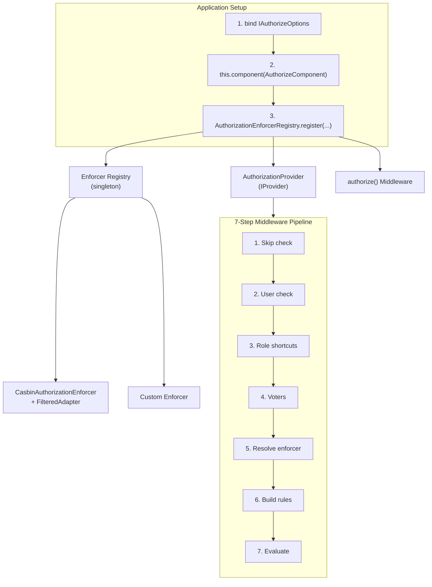
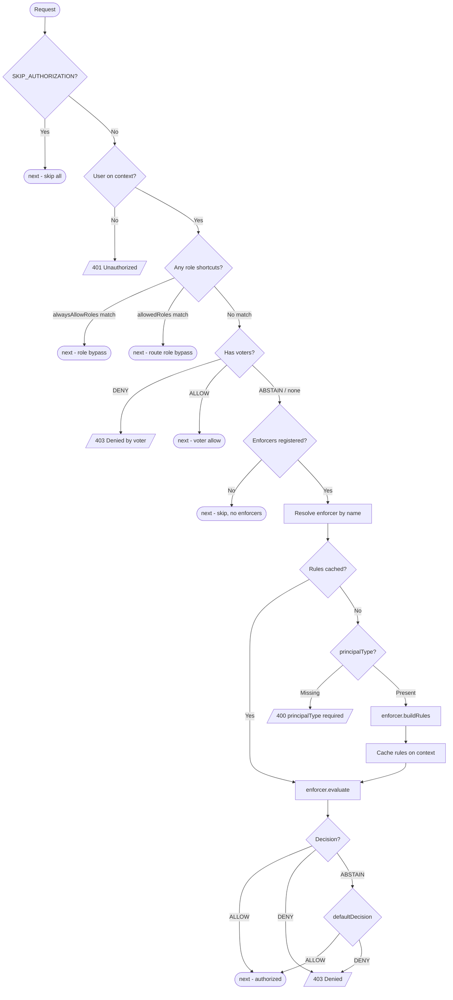
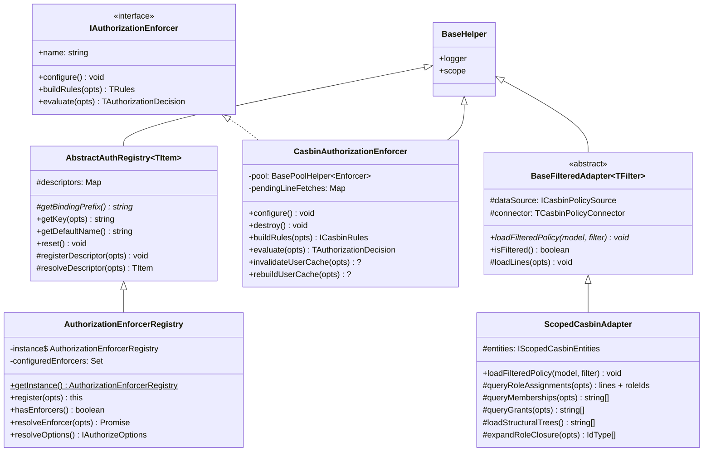
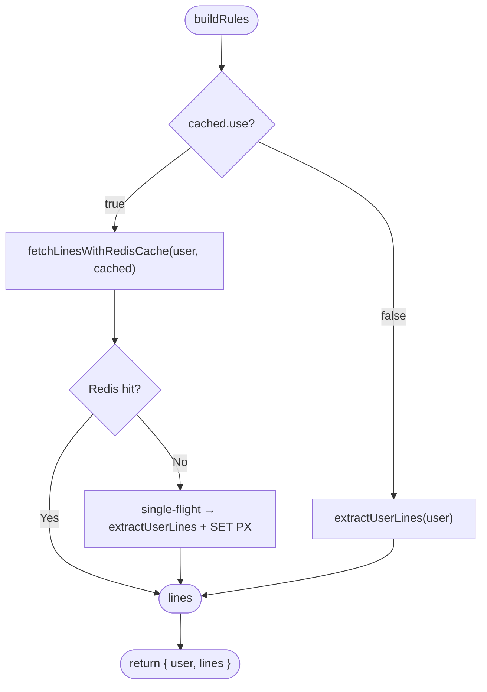
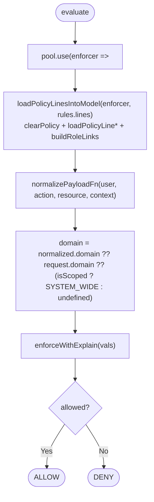
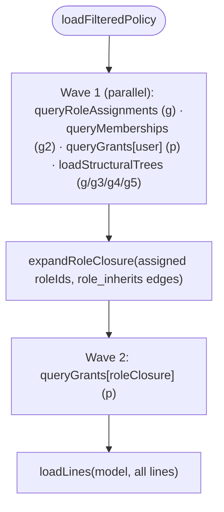

# Authorization -- API Reference

> Architecture, enforcer internals, provider, registry, adapters, models, and middleware pipeline. See [Setup & Configuration](./) for initial setup.

## Architecture

### System Overview



### Middleware Pipeline Flowchart



### Class Hierarchy



### Module File Layout

```
auth/authorize/
├── adapters/
│   ├── base-filtered.ts          # BaseFilteredAdapter (thin abstract) + ICasbinPolicyFilter
│   ├── scoped-casbin.adapter.ts  # ScopedCasbinAdapter (generic edge-table reader)
│   └── types.ts                  # IScopedCasbinEntities, IScopedCasbinTable
├── common/
│   ├── constants.ts              # Authorization, AuthorizationActions, AuthorizationDecisions,
│   │                             #   AuthorizationDomainScopes, AuthorizationPolicyVariants,
│   │                             #   AuthorizationRoles, AuthorizationEnforcerTypes,
│   │                             #   CasbinEnforcerCachedDrivers, CasbinEnforcerModelDrivers,
│   │                             #   CasbinRuleVariants
│   ├── object-match.ts           # objectMatch resource-hierarchy matcher
│   ├── keys.ts                   # AuthorizeBindingKeys
│   ├── types.ts                  # IAuthorizeOptions, IAuthorizationEnforcer,
│   │                             #   IAuthorizationSpec, ICasbinEnforcerOptions, etc.
│   └── index.ts                  # Barrel export
├── enforcers/
│   ├── casbin.enforcer.ts        # CasbinAuthorizationEnforcer
│   ├── enforcer-registry.ts      # AuthorizationEnforcerRegistry (singleton)
│   ├── models/
│   │   ├── rbac-domain.model.ts  # CASBIN_RBAC_DOMAIN_SCOPED_MODEL (scoped model string)
│   │   └── index.ts
│   └── index.ts                  # Barrel export
├── middlewares/
│   └── authorize.middleware.ts   # authorize() standalone function
├── models/
│   ├── authorization-role.model.ts   # AuthorizationRole
│   └── index.ts
├── providers/
│   └── authorization.provider.ts # AuthorizationProvider
├── component.ts                  # AuthorizeComponent
└── index.ts                      # Barrel export (all submodules)
```

### Tech Stack

| Technology | Purpose |
|------------|---------|
| **Hono middleware** | Route-level authorization via `createMiddleware` from `hono/factory` |
| **`casbin`** (optional) | External policy engine for Casbin enforcer. Peer dependency -- not bundled. |
| **`@venizia/ignis-helpers`** | `BaseHelper` base class, `getError` for error creation, `HTTP` result codes |
| **`@venizia/ignis-inversion`** | `IProvider` interface, `BindingScopes` for singleton registration |

### Design Decisions

| Decision | Rationale |
|----------|-----------|
| **Enforcer-based** | Pluggable architecture -- swap between Casbin and custom enforcers without changing route configs |
| **Registry + co-located options** | Enforcer class, name, type, and options are registered together -- no split configuration across two binding sites |
| **Type-discriminated enforcers** | `type: 'casbin' \| 'custom'` in registry for type-safe options (`ICasbinEnforcerOptions` vs `unknown`) |
| **Voter pattern** | Custom logic that short-circuits before the enforcer (Spring Security inspiration) |
| **Rules caching** | Built rules cached on Hono context per-request -- avoids rebuilding for multi-spec routes |
| **Registry singleton** | Mirrors `AuthenticationStrategyRegistry` pattern -- consistent with the codebase |
| **Abstract base** | `AbstractAuthRegistry<T>` shared between authentication and authorization registries |
| **Filtered adapter pattern** | `BaseFilteredAdapter` is a thin read-only base; subclasses implement `loadFilteredPolicy` for custom query backends |
| **No-enforcer fallback** | When no enforcers are registered, the middleware skips authorization and calls `next()` instead of throwing -- prevents hard failures during development or gradual rollout |

## Component Lifecycle

The `AuthorizeComponent` extends `BaseComponent` and executes during its `binding()` method:

| Step | Action | Failure |
|------|--------|---------|
| 1 | Resolve `IAuthorizeOptions` from container via `AuthorizeBindingKeys.OPTIONS` | Throws `[AuthorizeComponent] No authorize options found` |
| 2 | Call `bindAlwaysAllowRoles()` -- binds `alwaysAllowRoles` to `AuthorizeBindingKeys.ALWAYS_ALLOW_ROLES` if present | -- (skipped if no roles) |

```typescript
class AuthorizeComponent extends BaseComponent {
  constructor(
    @inject({ key: CoreBindings.APPLICATION_INSTANCE }) private application: BaseApplication,
  ) { ... }

  override binding(): ValueOrPromise<void>;
  private bindAlwaysAllowRoles(opts: { options: IAuthorizeOptions }): void;
}
```

> [!NOTE]
> The component's role is minimal -- it validates that global options exist and binds `alwaysAllowRoles` for consumer access. Enforcer registration happens separately via `AuthorizationEnforcerRegistry.register()`.

## AbstractAuthRegistry

Shared base class for both authentication and authorization registries. Provides descriptor storage, binding key generation, and DI resolution.

### TRegistryDescriptor

```typescript
type TRegistryDescriptor<TItem> = {
  container: Container;
  targetClass: TClass<TItem>;
};
```

### Class

```typescript
abstract class AbstractAuthRegistry<TItem> extends BaseHelper {
  protected descriptors: Map<string, TRegistryDescriptor<TItem>>;

  constructor(opts: { scope: string });

  // Abstract -- subclass provides the binding key prefix
  protected abstract getBindingPrefix(): string;

  // Public API
  getKey(opts: { name: string }): string;
  getDefaultName(): string;
  reset(): void;

  // Protected internals
  protected registerDescriptor(opts: { container: Container; target: TClass<TItem>; name: string }): void;
  protected resolveDescriptor(opts: { name: string }): TItem;
}
```

### Methods

| Method | Description | Throws |
|--------|-------------|--------|
| `getKey({ name })` | Builds binding key as `{prefix}.{name}` | `[getKey] Invalid name` if name is empty |
| `getDefaultName()` | Returns the first registered descriptor's name (Map insertion order) | `[ClassName] No items registered` if none |
| `registerDescriptor(opts)` | Stores `TRegistryDescriptor` in Map + binds class as `SINGLETON` in DI container | -- |
| `resolveDescriptor({ name })` | Resolves instance from DI container by key | `Descriptor not found: {name}` or `Failed to resolve: {name}` |
| `reset()` | Clears all descriptors from the Map | -- |

### Subclass Binding Prefixes

| Registry | `getBindingPrefix()` returns |
|----------|------------------------------|
| `AuthenticationStrategyRegistry` | `Authentication.STRATEGY` |
| `AuthorizationEnforcerRegistry` | `Authorization.ENFORCER` (`'authorization.enforcer'`) |

## Enforcer Registry

<code v-pre>AuthorizationEnforcerRegistry</code> is a **singleton** that manages registered enforcers. It extends `AbstractAuthRegistry<IAuthorizationEnforcer>`.

### Class Hierarchy

```
BaseHelper
  └── AbstractAuthRegistry<TItem>
        ├── AuthenticationStrategyRegistry  (authenticate)
        └── AuthorizationEnforcerRegistry   (authorize)
```

### Class

```typescript
class AuthorizationEnforcerRegistry extends AbstractAuthRegistry<IAuthorizationEnforcer> {
  private static instance: AuthorizationEnforcerRegistry;
  private configuredEnforcers: Set<string>;

  static getInstance(): AuthorizationEnforcerRegistry;
  override reset(): void;   // clears descriptors + configuredEnforcers

  protected getBindingPrefix(): string;  // returns Authorization.ENFORCER

  register(opts: { ... }): this;
  hasEnforcers(): boolean;
  getDefaultEnforcerName(): string;
  resolveEnforcer(opts: { name: string }): Promise<IAuthorizationEnforcer>;
  resolveOptions(): IAuthorizeOptions | undefined;
}
```

### API

| Method | Returns | Description |
|--------|---------|-------------|
| `getInstance()` | `AuthorizationEnforcerRegistry` | Returns the singleton instance (creates on first call) |
| `register(opts)` | `this` | Registers enforcers with type-safe options. See below. |
| `hasEnforcers()` | `boolean` | Returns `true` if any enforcers are registered (`descriptors.size > 0`). Used by the middleware to skip authorization when no enforcers exist. |
| `getDefaultEnforcerName()` | `string` | Delegates to `getDefaultName()` -- returns the first registered enforcer's name |
| `resolveEnforcer({ name })` | `Promise<IAuthorizationEnforcer>` | Resolves and auto-configures an enforcer (configure-once pattern via `configuredEnforcers` Set) |
| `resolveOptions()` | `IAuthorizeOptions \| undefined` | Iterates all registered containers looking for `AuthorizeBindingKeys.OPTIONS` |
| `reset()` | `void` | Clears all descriptors AND the `configuredEnforcers` set |

### register()

The `register` method accepts a discriminated union of enforcer descriptors:

```typescript
register(opts: {
  container: Container;
  enforcers: Array<
    | {
        enforcer: TClass<IAuthorizationEnforcer>;
        name: string;
        type: 'casbin';
        options?: ICasbinEnforcerOptions;
      }
    | {
        enforcer: TClass<IAuthorizationEnforcer>;
        name: string;
        type: 'custom';
        options?: unknown;
      }
  >;
}) => this
```

**Behavior:**
1. Validates no duplicate names in the batch (across all `enforcers` in this call)
2. Validates each name is not already registered (against previously registered enforcers)
3. Calls `registerDescriptor()` -- binds each enforcer class as singleton: `authorization.enforcer.{name}`
4. If `options` is provided, binds it to `AuthorizeBindingKeys.enforcerOptions(name)` (`@app/authorize/enforcers/{name}/options`)

> [!NOTE]
> `register()` returns `this`, enabling method chaining. The `type` field provides TypeScript-level type safety for the `options` field -- `type: 'casbin'` constrains `options` to `ICasbinEnforcerOptions`, while `type: 'custom'` allows `unknown`.

### Configure-Once Pattern

The `resolveEnforcer()` method tracks which enforcers have been configured via the `configuredEnforcers: Set<string>`:

```typescript
async resolveEnforcer(opts: { name: string }): Promise<IAuthorizationEnforcer> {
  const enforcer = this.resolveDescriptor(opts);  // from AbstractAuthRegistry

  if (!this.configuredEnforcers.has(opts.name)) {
    await enforcer.configure();
    this.configuredEnforcers.add(opts.name);
  }

  return enforcer;
}
```

First call: resolves + calls `configure()`. Subsequent calls: resolves only.

## IAuthorizationEnforcer Interface

The core enforcer contract. All enforcers (Casbin, custom) must implement this interface.

```typescript
interface IAuthorizationEnforcer<
  E extends Env = Env,
  TAction = string,
  TResource = string,
  TRules = unknown,
  TBuildRulesReturn = ValueOrPromise<TRules>,
  TEvaluateReturn = ValueOrPromise<TAuthorizationDecision>,
> {
  name: string;

  configure(): ValueOrPromise<void>;

  buildRules(opts: {
    user: { principalType: string } & IAuthUser;
    context: TContext<E, string>;
  }): TBuildRulesReturn;

  evaluate(opts: {
    rules: TRules;
    request: IAuthorizationRequest<TAction, TResource>;
    context: TContext<E, string>;
  }): TEvaluateReturn;
}
```

### Generic Parameters

| Parameter | Default | Description |
|-----------|---------|-------------|
| `E` | `Env` | Hono `Env` type for typed context access |
| `TAction` | `string` | Action type (string) |
| `TResource` | `string` | Resource type (string) |
| `TRules` | `unknown` | Rules type produced by `buildRules` and consumed by `evaluate` |
| `TBuildRulesReturn` | `ValueOrPromise<TRules>` | Return type of `buildRules` |
| `TEvaluateReturn` | `ValueOrPromise<TAuthorizationDecision>` | Return type of `evaluate` |

### TRules per Enforcer

| Enforcer | TRules | Description |
|----------|--------|-------------|
| `CasbinAuthorizationEnforcer` | `ICasbinRules` | `{ user, lines }` - the user plus their resolved Casbin policy lines (loaded into a pooled enforcer at evaluate time) |
| Custom | Any type | Your custom rules structure |

### Method Contracts

| Method | Input | Returns | Called by |
|--------|-------|---------|----------|
| `configure()` | None | `void` | Registry on first `resolveEnforcer()` |
| `buildRules` | `{ user, context }` | `TRules` | Provider at step 6 |
| `evaluate` | `{ rules, request, context }` | `TAuthorizationDecision` | Provider at step 7 |

## IAuthorizationRequest Interface

The request object passed to `evaluate()`:

```typescript
interface IAuthorizationRequest<TAction = string, TResource = string> {
  action: TAction;
  resource: TResource;
  conditions?: TAuthorizationConditions;
  /** Resolved domain scope: `"<DomainType>_<id>"` (e.g. `"Merchant_7"`) or the `"SYSTEM_WIDE"` sentinel. */
  domain?: string;
}
```

| Field | Type | Description |
|-------|------|-------------|
| `action` | `TAction` | Action being checked (e.g., `'read'`, `'create'`) |
| `resource` | `TResource` | Resource being accessed (e.g., `'Article'`) |
| `conditions` | `TAuthorizationConditions` | Optional key-value conditions for ABAC |

## Casbin Enforcer

`CasbinAuthorizationEnforcer` wraps the `casbin` library (optional peer dependency).

### Class

```typescript
class CasbinAuthorizationEnforcer<
  E extends Env = Env,
  TAction extends string = string,
  TResource extends string = string,
>
  extends BaseHelper
  implements IAuthorizationEnforcer<E, TAction, TResource, ICasbinRules>
{
  name = 'CasbinAuthorizationEnforcer';

  private readonly MIN_EXPIRES_IN = 10_000;
  private pool: TNullable<BasePoolHelper<CasbinEnforcerType>>;          // per-request enforcers
  private helper: TNullable<typeof CasbinHelper>;                        // casbin.Helper (loadPolicyLine)
  private readonly pendingLineFetches = new Map<string, Promise<string[]>>(); // single-flight
  private resolvedPayloadFn: TNullable<TNormalizePayloadFn>;             // memoized in configure()

  constructor(
    @inject({ key: AuthorizeBindingKeys.enforcerOptions('casbin') })
    private options: ICasbinEnforcerOptions<E, TAction, TResource>,
  );

  // Lifecycle
  async configure(): Promise<void>;
  destroy(): void;

  // IAuthorizationEnforcer
  async buildRules(opts: { user; context }): Promise<ICasbinRules>;       // { user, lines }
  async evaluate(opts: { rules; request; context }): Promise<TAuthorizationDecision>;

  // Optional cache management (Redis only)
  async invalidateUserCache(opts: { user }): Promise<{ invalidatedKeys: number }>;
  async rebuildUserCache(opts: { user }): Promise<{ cacheKey: string; lineCount: number }>;

  // Protected internals
  protected async registerMatchers(opts: { enforcer; casbin }): Promise<void>;
  protected assertMatcherCompilesSync(opts: { enforcer }): void;
  protected resolveModel(opts): Model;
  protected validateExpiresIn(opts: { expiresIn: number }): void;
  protected async fetchLinesWithRedisCache(opts: { user; cached }): Promise<string[]>;
  protected async extractUserLines(opts: { user }): Promise<string[]>;   // throwaway enforcer + adapter
  protected async extractLinesFrom(enforcer): Promise<string[]>;
  protected async loadPolicyLinesIntoModel(opts: { enforcer; lines }): Promise<void>;
  protected enforceWithExplain(opts: { enforcer; vals: string[] }): boolean;
}
```

> **Architecture in one line:** the adapter (DB load) runs only on a *throwaway* enforcer to build a
> user's lines (cached in Redis); every request then enforces on a *pooled* enforcer freshly loaded
> with those lines. This isolates concurrency and keeps the DB out of the hot path.

### Constructor

Injects `ICasbinEnforcerOptions` from the DI container using the binding key `AuthorizeBindingKeys.enforcerOptions('casbin')`.

### configure()

Called once by the registry on first use. Performs:

1. Dynamically imports `casbin` - throws `"casbin" is not installed` if missing.
2. Validates `options.model` - throws `options.model is required.` if missing.
3. Memoizes the payload normalizer (`options.normalizePayloadFn ?? defaultScopedPayloadFn()`).
4. If `cached.use`, validates `expiresIn >= MIN_EXPIRES_IN` (10,000 ms).
5. Builds a **`BasePoolHelper<Enforcer>`** (`size = poolSize ?? 16`, `acquireTimeoutMs = poolAcquireTimeoutMs ?? 5000`). Each pooled enforcer is created **without an adapter** (`newEnforcer(model)` - no DB load at warmup), then `registerMatchers()` and `assertMatcherCompilesSync()` run on it.
6. `await pool.warmup()` - pre-creates the enforcers.

`registerMatchers()` - when `isScoped`, registers `keyMatch` as the domain matching func on `g`, adds `objectMatch` as a function, and registers it as the matching func on the resource relation (`g4`). When `domainMatching` is set (non-scoped), registers the chosen `Util.*Func` on the named role definition. Always finishes with `buildRoleLinks()`.

`assertMatcherCompilesSync()` - a boot-time smoke test: forces casbin's lazy matcher compile by running one dummy `enforceSync` (4 args when scoped/`normalizePayloadFn`, else 3), so a malformed matcher, an unregistered function, or an arity mismatch fails at warmup instead of on the first real request.

### destroy()

`this.pool?.destroy()` - drains and disposes the pooled enforcers.

### buildRules()

Returns `ICasbinRules` = `{ user, lines }`. The `lines` are the user's complete Casbin policy lines.



- **`extractUserLines(user)`** builds a fresh, **isolated** enforcer *with the adapter*, calls
  `adapter.loadFilteredPolicy({ principal: { type, id } })`, then `extractLinesFrom()` serializes every
  p-type and g-type rule back into lines. This throwaway enforcer never serves a request - that is the
  anti-poisoning guarantee.
- **`fetchLinesWithRedisCache`** returns cached lines on hit (Redis owns expiry via `PX`). On miss it
  dedups concurrent misses through `pendingLineFetches` (single-flight), extracts once, and writes the
  lines back to Redis. A corrupt entry is logged and discarded (refetch), never a 500.

### evaluate()

Borrows an enforcer from the pool and evaluates **atomically** inside `pool.use`:



- `vals` is `[subject, domain, resource, action]` when a domain is present (scoped), else `[subject, resource, action]`.
- On any error inside `pool.use`, the pool **destroys** the borrowed enforcer (fail-closed); a fresh one is created on demand.
- `enforceWithExplain` uses `enforceExSync` to also log the deciding policy on a DENY.

### invalidateUserCache() / rebuildUserCache()

Redis-only (throw if caching is disabled). `invalidateUserCache` deletes the user's shared Redis key
(next request rebuilds lazily). `rebuildUserCache` deletes then immediately re-extracts (on a throwaway
enforcer) and re-caches. Because the key is shared in Redis, a single call is correct across instances.

### Protected Methods

| Method | Output | Description |
|--------|--------|-------------|
| `registerMatchers` | `void` | Registers domain/resource matching funcs (+ `buildRoleLinks`); scoped vs `domainMatching` |
| `assertMatcherCompilesSync` | `void` | Boot-time matcher smoke test (forces lazy compile) |
| `resolveModel` | `Model` | Resolves casbin model from `file` or `text` driver |
| `validateExpiresIn` | `void` | Throws if `expiresIn < MIN_EXPIRES_IN` |
| `fetchLinesWithRedisCache` | `string[]` | Redis read → single-flight extract+write on miss |
| `extractUserLines` | `string[]` | Throwaway enforcer + adapter `loadFilteredPolicy` → `extractLinesFrom` |
| `extractLinesFrom` | `string[]` | Serializes every p-type and g-type rule into lines |
| `loadPolicyLinesIntoModel` | `void` | `clearPolicy` + `loadPolicyLine` per line + `buildRoleLinks` |
| `enforceWithExplain` | `boolean` | `enforceExSync`; logs the deciding rule on DENY |

#### extractLinesFrom()

Serializes **all** policy + grouping rule types (not just `p`/`g`) so the cached payload is complete
for the scoped model (`g2`…`g5`):

```typescript
const model = enforcer.getModel();
const lines: string[] = [];

for (const ptype of model.model.get(CasbinRuleVariants.P)?.keys() ?? []) {
  for (const rule of await enforcer.getNamedPolicy(ptype)) lines.push([ptype, ...rule].join(', '));
}
for (const gtype of model.model.get(CasbinRuleVariants.G)?.keys() ?? []) {
  for (const rule of await enforcer.getNamedGroupingPolicy(gtype)) lines.push([gtype, ...rule].join(', '));
}
return lines;
```

#### loadPolicyLinesIntoModel()

Atomically resets a borrowed enforcer's model to exactly `lines`:

```typescript
const model = opts.enforcer.getModel();
model.clearPolicy();
for (const line of opts.lines) {
  this.helper.loadPolicyLine(line, model);
}
await opts.enforcer.buildRoleLinks();
```

## BaseFilteredAdapter

Thin read-only base for casbin `FilteredAdapter`s backed by a datasource. It owns the boilerplate
every filtered adapter repeats - datasource/connector plumbing, the `isFiltered() === true` flag, the
no-op write methods, and a `loadLines` helper. A subclass implements only `loadFilteredPolicy`: query
the store for ONE principal's policies and turn them into casbin lines.

### Class

```typescript
abstract class BaseFilteredAdapter<TFilter = ICasbinPolicyFilter>
  extends BaseHelper
  implements FilteredAdapter
{
  protected readonly dataSource: ICasbinPolicySource;
  protected get connector(): TCasbinPolicyConnector;

  constructor(opts: { scope: string; dataSource: ICasbinPolicySource });

  // Subclasses implement ONLY this:
  abstract loadFilteredPolicy(model: Model, filter: TFilter): Promise<void>;

  isFiltered(): boolean; // always true

  // No-op write methods (read-only adapter)
  async loadPolicy(): Promise<void>;
  async savePolicy(): Promise<boolean>;          // returns true
  async addPolicy(): Promise<void>;
  async removePolicy(): Promise<void>;
  async removeFilteredPolicy(): Promise<void>;

  // Helper: parse + load casbin lines into a model.
  protected async loadLines(opts: { model: Model; lines: string[] }): Promise<void>;
}
```

### Generic Parameters

| Parameter | Default | Description |
|-----------|---------|-------------|
| `TFilter` | `ICasbinPolicyFilter` | Filter shape passed to `loadFilteredPolicy`. Subclasses may narrow it (e.g. `IScopedCasbinPolicyFilter`) |

### ICasbinPolicyFilter

The default filter: which principal's policies to load. Subclasses may narrow it.

```typescript
interface ICasbinPolicyFilter {
  principal: { type: string; id: IdType };
}
```

### ICasbinPolicySource

The minimal contract `BaseFilteredAdapter` depends on for its `dataSource` -- **not** the framework's
general `IDataSource` interface. Any drizzle-backed datasource (e.g. `BasePostgresDataSource`) satisfies
it structurally; the adapter only ever needs the connector to run policy queries.

```typescript
interface ICasbinPolicySource {
  connector: TCasbinPolicyConnector;
}

type TCasbinPolicyConnector = ReturnType<
  typeof drizzle<Record<string, AnyType>, NodePgClient>
>;
```

> [!NOTE]
> Components that only need query execution depend on this minimal local contract rather than a
> connector class -- keeps the casbin adapters decoupled from the full datasource surface.

### loadLines()

The base's only orchestration helper - subclasses call it from `loadFilteredPolicy` after assembling
their casbin lines:

```typescript
protected async loadLines(opts: { model: Model; lines: string[] }): Promise<void> {
  const { Helper } = await import('casbin');
  for (const line of opts.lines) {
    Helper.loadPolicyLine(line, opts.model);
  }
}
```

There are no template-method query hooks or shared line formatters on the base - a subclass owns its
own queries and line construction (see `ScopedCasbinAdapter` below for the reference implementation).

## ScopedCasbinAdapter

The generic, read-only `FilteredAdapter` for the scoped RBAC model. It reads **one principal's edges**
plus the **shared structural hierarchy** from a single `PolicyDefinition` edge table (joined to
`Permission` for codes) and emits casbin lines. No subclassing - configure it with `IScopedCasbinEntities`.

### Class

```typescript
class ScopedCasbinAdapter extends BaseFilteredAdapter<IScopedCasbinPolicyFilter> {
  protected readonly entities: IScopedCasbinEntities;

  constructor(opts: { dataSource: ICasbinPolicySource; entities: IScopedCasbinEntities });

  async loadFilteredPolicy(model: Model, filter: IScopedCasbinPolicyFilter): Promise<void>;

  // Per-principal queries
  protected queryRoleAssignments(opts): Promise<{ lines: string[]; roleIds: IdType[] }>; // → g
  protected queryMemberships(opts): Promise<string[]>;                                   // → g2
  protected queryGrants(opts): Promise<string[]>;                                        // → p
  // Shared hierarchy
  protected loadStructuralTrees(): Promise<string[]>;        // role(g)/domain(g3)/resource(g4)/action(g5)
  protected queryRoleInherits(): Promise<string[]>;          // → g
  protected queryDomainInherits(): Promise<string[]>;        // → g3
  protected queryResourceInherits(): Promise<string[]>;      // → g4
  protected queryActionInherits(): Promise<string[]>;        // → g5
  // Role closure (BFS over role_inherits)
  protected expandRoleClosure(opts: { role: { ids: IdType[]; edges: string[] } }): IdType[];
}
```

### IScopedCasbinEntities

```typescript
interface IScopedCasbinTable { tableName: string; schemaName?: string; }

interface IScopedCasbinEntities {
  policyDefinition: IScopedCasbinTable;          // the single edge table
  permission: IScopedCasbinTable;                // permission catalog (id, code, ...)
  principals: { user: string; role: string };    // casbin name prefixes
  domainTypes: string[];                          // e.g. ['Merchant', 'Organizer']
  softDelete?: { use: false } | { use: true; columnName: string };
}
```

### IScopedCasbinPolicyFilter

```typescript
interface IScopedCasbinPolicyFilter {
  principal: { type: string; id: IdType };
}
```

### loadFilteredPolicy() - two waves



1. **Wave 1 (parallel):** the principal's own edges - role assignments (`g`), domain memberships
   (`g2`), direct grants (`p`) - plus the shared structural trees (`role_inherits` → `g`,
   `domain_inherits` → `g3`, `resource_inherits` → `g4`, `action_inherits` → `g5`).
2. **Role closure:** `expandRoleClosure` does a cycle-safe BFS over the `role_inherits` (`g`) edges to
   collect the assigned roles + all transitive parents.
3. **Wave 2:** fetch the grants (`p`) of every role in the closure, so a user inherits the permissions
   of parent roles.
4. All lines are loaded via `loadLines`.

### SQL notes

All queries use the `sql` template tag from `drizzle-orm`. Tables are schema-qualified via
`sql.identifier` (injection-safe); interpolated values (the `variant` discriminator from
`AuthorizationPolicyVariants.*.action`, ids, types) are bound parameters. The soft-delete clause
(`AND <alias>.<col> IS NULL`) is appended when `entities.softDelete.use` is true. `queryGrants`
short-circuits to `[]` when given no subject ids (no DB round-trip).

### Usage Example

```typescript
import { ScopedCasbinAdapter } from '@venizia/ignis';

const adapter = new ScopedCasbinAdapter({
  dataSource: myPostgresDataSource,
  entities: {
    policyDefinition: { tableName: 'PolicyDefinition', schemaName: 'identity' },
    permission: { tableName: 'Permission', schemaName: 'identity' },
    principals: { user: 'User', role: 'Role' },
    domainTypes: ['Merchant', 'Organizer'],
    softDelete: { use: true, columnName: 'deleted_at' },
  },
});
```

## Authorization Provider

`AuthorizationProvider` implements `IProvider<TAuthorizeFn>` and produces the middleware factory.

### Class

```typescript
class AuthorizationProvider extends BaseHelper implements IProvider<TAuthorizeFn> {
  constructor();

  value(): TAuthorizeFn;

  private createAuthorizeMiddleware(opts: {
    spec: IAuthorizationSpec;
    enforcerName?: string;
  }): MiddlewareHandler;

  private extractUserRoles(opts: { user: IAuthUser }): string[];
}
```

### Middleware Pipeline (7 Steps)

The `createAuthorizeMiddleware` method creates a Hono middleware with this evaluation order:

```typescript
// Step 1: Skip check
const isSkipAuthorize = context.get(Authorization.SKIP_AUTHORIZATION);
if (isSkipAuthorize) → next()

// Step 2: User check
const user = context.get(Authentication.CURRENT_USER);
if (!user) → throw 401 "No authenticated user found"

// Step 3: Role-based shortcuts (alwaysAllowRoles + allowedRoles merged)
const needsRoleCheck = options?.alwaysAllowRoles?.length || spec.allowedRoles?.length;
if (needsRoleCheck) {
  const userRoles = extractUserRoles({ user });  // called once
  if (alwaysAllowRoles match) → next()  // logs "User has always-allow role"
  if (allowedRoles match) → next()      // logs "User has allowed role for route"
}

// Step 4: Voters (from IAuthorizationSpec)
for (voter of spec.voters) {
  if (DENY) → throw 403 "Authorization denied by voter"
  if (ALLOW) → next()
  // ABSTAIN → continue to next voter
}

// Step 5: Resolve enforcer (with no-enforcer fallback)
if (!registry.hasEnforcers()) → next()  // skip if no enforcers registered
const resolvedName = enforcerName ?? registry.getDefaultEnforcerName();
const enforcer = await registry.resolveEnforcer({ name: resolvedName });

// Step 5b: Resolve request domain scope (only when domain scoping is in play)
if (spec.domain || options?.domainResolver) {
  const domainScope = await resolveRequestDomain({ spec, context, options }); // "<Type>_<id>" | SYSTEM_WIDE
  context.set(Authorization.DOMAIN, domainScope);  // the enforcer reads this for request.domain
}

// Step 6: Build/cache rules
let rules = context.get(Authorization.RULES);
if (!rules) {
  if (!user.principalType) → throw 400 "principalType is required"
  rules = await enforcer.buildRules({ user, context });
  context.set(Authorization.RULES, rules);  // cache on context
}

// Step 7: Evaluate
let decision = await enforcer.evaluate({ rules, request, context });
if (decision === ABSTAIN) → decision = options?.defaultDecision ?? DENY;
if (decision !== ALLOW) → throw 403 "Authorization denied"

// All checks passed
await next();
```

### Role Extraction

The `extractUserRoles` method handles multiple role formats from the user object:

```typescript
private extractUserRoles(opts: { user: IAuthUser }): string[] {
  const roles = user.roles;  // via index signature

  if (!Array.isArray(roles)) {
    return [];
  }

  return roles.map((r: string | { identifier?: string; name?: string; id?: unknown }) => {
    if (typeof r === 'string') return r;
    return r.identifier ?? r.name ?? String(r.id ?? '');
  });
}
```

**Extraction priority:** `identifier` > `name` > `String(id)`.

Supports these formats:
```typescript
// String array
roles: ['admin', 'user']

// Object array with identifier (preferred - matches AuthorizationRole.identifier)
roles: [{ id: 1, identifier: '900_admin', priority: 900 }]

// Object array with name fallback
roles: [{ id: 1, name: 'admin' }]

// Object array with id-only fallback
roles: [{ id: 1 }]
```

## Standalone `authorize()` Function

```typescript
// authorize.middleware.ts
const authorizationProvider = new AuthorizationProvider();
const authorizeFn = authorizationProvider.value();

export const authorize = (opts: { spec: IAuthorizationSpec; enforcerName?: string }) => {
  return authorizeFn(opts);
};
```

This is the primary export for creating authorization middleware. It creates a singleton `AuthorizationProvider` instance at module load time. The returned middleware handler is a standard Hono `MiddlewareHandler`.

## AuthorizationRole Model

Value object representing a role with priority-based comparison.

### Class

```typescript
class AuthorizationRole implements IAuthorizationRole {
  readonly name: string;
  readonly priority: number;
  readonly delimiter: string;  // default '_'

  static build(opts: { name: string; priority: number; delimiter?: string }): AuthorizationRole;
  constructor(opts: { name: string; priority: number; delimiter?: string });

  get identifier(): string;

  compare(opts: { target: IAuthorizationRole }): number;
  isHigherThan(opts: { target: IAuthorizationRole }): boolean;
  isLowerThan(opts: { target: IAuthorizationRole }): boolean;
  isEqualTo(opts: { target: IAuthorizationRole }): boolean;
}
```

### IAuthorizationRole Interface

```typescript
interface IAuthorizationRole {
  readonly name: string;
  readonly priority: number;
  readonly identifier: string;
}
```

### Identifier Format

The identifier is generated as `{paddedPriority}{delimiter}{name}`. Priority is zero-padded to 3 digits:

```typescript
// Priority 999, name 'super-admin', delimiter '_' → '999_super-admin'
// Priority 10, name 'user', delimiter '_' → '010_user'
// Priority 1, name 'guest', delimiter '_' → '001_guest'
// Priority 0, name 'unknown-user', delimiter '_' → '000_unknown-user'
```

Implementation: `[String(this.priority).padStart(3, '0'), this.name].join(this.delimiter)`

### Comparison

Roles are compared by priority (higher number = higher privilege). `compare()` returns `this.priority - target.priority`:

```typescript
AuthorizationRoles.SUPER_ADMIN.isHigherThan({ target: AuthorizationRoles.ADMIN }); // true (999 > 900)
AuthorizationRoles.GUEST.isLowerThan({ target: AuthorizationRoles.USER });          // true (1 < 10)
AuthorizationRoles.ADMIN.isEqualTo({ target: AuthorizationRoles.ADMIN });           // true (900 === 900)
```

## Controller Integration

### How Authorization Middleware is Injected

Authorization is supported in both **REST** and **gRPC** controllers.

#### REST Controllers

The `AbstractRestController.buildRouteMiddlewares()` method handles middleware injection order. `getRouteConfigs()` calls `buildRouteMiddlewares()` internally:

```typescript
buildRouteMiddlewares<RouteConfig extends IAuthRouteConfig>(opts: { configs: RouteConfig }) {
  const { authenticate = {}, authorize, ...restConfig } = configs;
  const mws = [];

  // 1. Authenticate middleware (first)
  if (strategies.length > 0) {
    mws.push(authenticateFn({ strategies, mode }));
  }

  // 2. Authorize middleware (second) - supports single or array
  if (authorize) {
    const specs = Array.isArray(authorize) ? authorize : [authorize];
    for (const spec of specs) {
      mws.push(authorizeFn({ spec }));
    }
  }

  // 3. Custom middleware (last)
  if (restConfig.middleware) { ... }

  return { restConfig, security, mws };
}
```

#### gRPC Controllers

The `AbstractGrpcController.buildRpcMiddlewares()` method provides symmetric middleware injection for gRPC:

```typescript
buildRpcMiddlewares(opts: { configs: IRpcMetadata }): TRpcMiddleware[] {
  const { configs } = opts;
  const mws = [];

  // 1. Authenticate middleware (first)
  if (configs.authenticate) { ... }

  // 2. Authorize middleware (second) - same pattern as REST
  if (configs.authorize) {
    const specs = Array.isArray(configs.authorize) ? configs.authorize : [configs.authorize];
    for (const spec of specs) {
      const authzMw = authorizeFn({ spec });
      mws.push((context, next) => authzMw(context, next));
    }
  }

  return mws;
}
```

### IAuthRouteConfig

Extended route config that supports both authentication and authorization (REST):

```typescript
interface IAuthRouteConfig extends HonoRouteConfig {
  authenticate?: { strategies?: TAuthStrategy[]; mode?: TAuthMode };
  authorize?: IAuthorizationSpec | IAuthorizationSpec[];
}
```

When `authorize` is an array, each spec creates a separate middleware. All must pass for the handler to execute.

### Per-Route Auth Types (CRUD Factory)

```typescript
/** Per-route authorization config: { skip: true }, single spec, or array of specs. */
type TRouteAuthorizeConfig = { skip: true } | IAuthorizationSpec | IAuthorizationSpec[];

/** Per-route auth config. Endpoint config takes precedence over controller-level config. */
type TRouteAuthConfig = {
  authenticate?: TRouteAuthenticateConfig;
  authorize?: TRouteAuthorizeConfig;
};
```

## IAuthUser Interface

The user object available during authorization. Defined in `authenticate/common/types.ts`:

```typescript
interface IAuthUser {
  userId: IdType;  // IdType = number | string | bigint
  [extra: string | symbol]: any;
}
```

Key properties accessed by the authorization module via the index signature:
- `user.roles` -- used by `extractUserRoles()` for role-based shortcuts
- `user.principalType` -- required by `buildRules()` for enforcer-based evaluation

## IJWTTokenPayload Interface

Full JWT token payload shape (extends `IAuthUser`):

```typescript
interface IJWTTokenPayload extends JWTPayload, IAuthUser {
  userId: IdType;
  roles: { id: IdType; identifier: string; priority: number }[];
  clientId?: string;
  provider?: string;
  email?: string;
  name?: string;
  [extra: string | symbol]: any;
}
```

## Hono Context Variables (ContextVariableMap)

The auth module augments Hono's `ContextVariableMap` in `auth/context-variables.ts`:

```typescript
declare module 'hono' {
  interface ContextVariableMap {
    // Authentication
    [Authentication.CURRENT_USER]: IAuthUser;          // 'authentication.currentUser'
    [Authentication.AUDIT_USER_ID]: IdType;            // 'authentication.auditUserId'
    [Authentication.SKIP_AUTHENTICATION]: boolean;     // 'authentication.skip'

    // Authorization
    [Authorization.RULES]: unknown;                    // 'authorization.rules'
    [Authorization.SKIP_AUTHORIZATION]: boolean;       // 'authorization.skip'
    [Authorization.DOMAIN]: string;                    // 'authorization.domain'
  }
}
```

This enables type-safe `context.get()` and `context.set()` across all auth middleware.

## See Also

- [Setup & Configuration](./) -- Binding keys, options interfaces, and initial setup
- [Usage & Examples](./usage) -- Securing routes, voters, patterns, and CRUD integration
- [Error Reference](./errors) -- Error messages and troubleshooting
