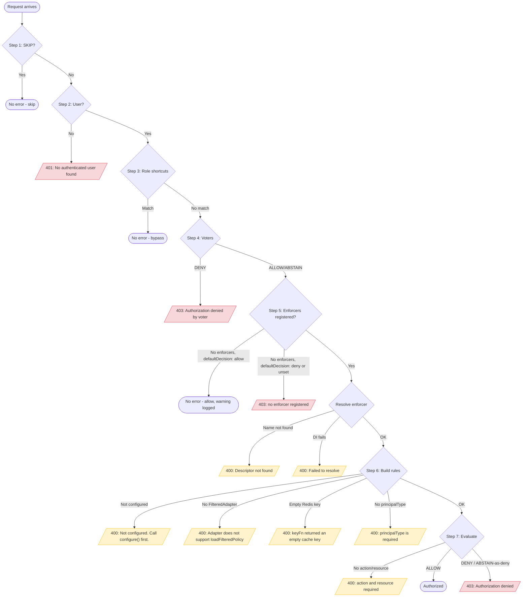

# Authorization - Error Reference

> Complete error messages and troubleshooting for the authorization module. See [Setup & Configuration](./) for initial setup.

## Find what you need

| You want to | Go to |
|---|---|
| See every error message, status code, and cause in one table | [Complete Error Reference](#complete-error-reference) |
| See which pipeline step throws which error | [Error Flow Diagram](#error-flow-diagram) |
| Fix a specific error message you're staring at | [Troubleshooting](#troubleshooting) |
| Debug "authorization does nothing" during rollout | [Authorization is not running](#authorization-is-not-running) |
| Debug rules rebuilding when you expected a cache hit | [Rules are rebuilt on every request](#rules-are-rebuilt-on-every-request) |
| Debug policies that don't seem to load | [Casbin policies not loading](#casbin-policies-not-loading) |
| Debug a Redis cache that never hits | [Redis cache not working](#redis-cache-not-working) |

## Error Flow Diagram



## Complete Error Reference

All error messages from the authorization module, organized by source. **Status** is what `error.statusCode` holds. Most calls use `getError({ message })` with no explicit `statusCode`, so the shared `ApplicationError` defaults it to **400**. Only the request-pipeline errors below (steps 2, 4, 7) set an explicit `401`/`403`.

### Component Errors (`AuthorizeComponent`)

Thrown during `binding()`, at application startup.

| Error Message | Status | Method | Cause |
|---------------|--------|--------|-------|
| `[AuthorizeComponent] No authorize options found. Bind options to AuthorizeBindingKeys.OPTIONS before registering the component.` | 400 | `binding` | `IAuthorizeOptions` was never bound before `this.component(AuthorizeComponent)` |

### Enforcer Registry Errors (`AuthorizationEnforcerRegistry` + inherited `AbstractAuthRegistry`)

| Error Message | Status | Method | Cause |
|---------------|--------|--------|-------|
| <code v-pre>[getKey] Invalid name &#124; name: {{name}}</code> | 400 | `getKey` | Enforcer name is empty or falsy |
| `[AuthorizationEnforcerRegistry] No items registered` | 400 | `getDefaultName` | `getDefaultEnforcerName()` called with zero enforcers registered |
| <code v-pre>[AuthorizationEnforcerRegistry] Duplicate enforcer name(s): {{names}}</code> | 400 | `register` | Two or more enforcers in the same `register()` call share a name |
| <code v-pre>[AuthorizationEnforcerRegistry] Enforcer already registered: {{name}}</code> | 400 | `register` | An enforcer with this name was already registered in a previous call |
| <code v-pre>[AuthorizationEnforcerRegistry] Descriptor not found: {{name}}</code> | 400 | `resolveDescriptor` | `enforcerName` doesn't match any registered enforcer |
| <code v-pre>[AuthorizationEnforcerRegistry] Failed to resolve: {{name}}</code> | 400 | `resolveDescriptor` | The registered class has unsatisfied `@inject` dependencies |
| <code v-pre>[AuthorizationEnforcerRegistry] Enforcer "{{name}}" does not support cache invalidation</code> | 400 | `invalidateUserCache` / `rebuildUserCache` | The resolved enforcer doesn't implement the optional cache-management methods |

> [!NOTE]
> `[AuthorizationEnforcerRegistry] No items registered` can only surface if `getDefaultEnforcerName()` is called directly. During normal middleware execution, the provider checks `registry.hasEnforcers()` first and denies (or, with `defaultDecision: 'allow'`, proceeds) before ever calling `getDefaultEnforcerName()`, so it never reaches this throw.

### Authorization Provider Errors (`AuthorizationProvider` - the request pipeline)

The only errors in the module with an **explicit** `statusCode`.

| Error Message | Status | Pipeline step | Cause |
|---------------|--------|------|-------|
| `Authorization failed: No authenticated user found` | 401 | 2 - User check | `Authentication.CURRENT_USER` is missing from the Hono context |
| <code v-pre>Authorization denied by voter &#124; action: {{action}} &#124; resource: {{resource}}</code> | 403 | 4 - Voters | A voter function returned `AuthorizationDecisions.DENY` |
| <code v-pre>Authorization failed: authorize() was declared for this route but no enforcer is registered &#124; path: {{path}}</code> | 403 | 5 - Resolve enforcer | `hasEnforcers()` is `false` and `defaultDecision` is `'deny'` (the default) or unset |
| `Authorization failed: user.principalType is required for enforcer-based authorization` | 400 | 6 - Build rules | The authenticated user object has no `principalType` field |
| <code v-pre>Authorization denied &#124; action: {{action}} &#124; resource: {{resource}}</code> | 403 | 7 - Evaluate | The enforcer returned `DENY`, or `ABSTAIN` and `defaultDecision` resolved to `'deny'` |

### Casbin Enforcer Errors - Startup (`CasbinAuthorizationEnforcer.configure()`)

| Error Message | Status | Method | Cause |
|---------------|--------|--------|-------|
| `[CasbinAuthorizationEnforcer] "casbin" is not installed` | 400 | `configure` | The optional `casbin` peer dependency isn't installed |
| `[CasbinAuthorizationEnforcer] options.model is required.` | 400 | `configure` | `model` is missing from the enforcer options |
| <code v-pre>[registerMatchers] Role definition "{{name}}" is not declared in the Casbin model. Declare it under [role_definition] (e.g. `g = _, _, _`) before enabling domainMatching.</code> | 400 | `configure` (via `registerMatchers`) | `domainMatching.roleDefinition` isn't declared in `[role_definition]` (only checked when `domainMatching` is set) |
| <code v-pre>[CasbinAuthorizationEnforcer] Matcher smoke test failed at warmup - the model matcher did not compile ... {{error}}</code> | 400 | `configure` (via `assertMatcherCompilesSync`) | The matcher expression doesn't compile: syntax error, an unregistered function, or an arity mismatch |
| <code v-pre>[CasbinAuthorizationEnforcer] cached.options.expiresIn must be >= 10000 (ms) &#124; Received: {{value}}</code> | 400 | `configure` (via `validateExpiresIn`) | `cached.options.expiresIn` is below `MIN_EXPIRES_IN` (10,000 ms) |
| <code v-pre>[resolveDomainMatchingFn] Unsupported func: {{name}} &#124; Valids: [...]</code> | 400 | `configure` (via `registerMatchers`) | `domainMatching.fn` isn't a `CasbinDomainMatchingFunctions` value |
| <code v-pre>[resolveModel] Invalid model.driver &#124; Valids: [file, text]</code> | 400 | `configure` (via `resolveModel`) | `model.driver` isn't `'file'` or `'text'` |

> [!NOTE]
> `cached` is a typed discriminated union (`{ use: false } | { use: true; driver: 'redis'; ... }`), so an unsupported cache driver fails at compile time - there is no `Invalid cached.driver` runtime error. Caching is **Redis-only**.

### Casbin Enforcer Errors - Runtime (`buildRules` / `evaluate` / cache management)

| Error Message | Status | Method | Cause |
|---------------|--------|--------|-------|
| `[CasbinAuthorizationEnforcer] Not configured. Call configure() first.` | 400 | `evaluate` | `evaluate()` ran before `configure()` built the enforcer pool - should not happen via `resolveEnforcer()` |
| `[CasbinAuthorizationEnforcer] request.action and request.resource are required.` | 400 | `evaluate` | Malformed `IAuthorizationRequest` passed to `evaluate()` |
| `[CasbinAuthorizationEnforcer] keyFn returned an empty cache key.` | 400 | `resolveCacheKey` (via `buildRules`, `invalidateUserCache`, `rebuildUserCache`) | `cached.options.keyFn` returned a falsy value for this user |
| `[CasbinAuthorizationEnforcer] Cache management requires the redis cache driver, but caching is disabled.` | 400 | `invalidateUserCache` / `rebuildUserCache` (via `requireRedisCache`) | Called with `cached: { use: false }` |
| `[extractUserLines] Adapter does not support loadFilteredPolicy.` | 400 | `buildRules` (via `extractUserLines`) | `options.adapter` doesn't implement casbin's `FilteredAdapter.loadFilteredPolicy` |
| `[loadPolicyLinesIntoModel] Not configured. Call configure() first.` | 400 | `evaluate` (via `loadPolicyLinesIntoModel`) | Same root cause as the `evaluate` "Not configured" row, different call site |

**Not an error** - `[CasbinAuthorizationEnforcer] Cached payload is not an array of policy lines.` `parseCachedPolicyLines` logs this at `warn` level; it never throws up to the caller. A corrupted or legacy Redis entry is discarded, and the lines are refetched from the adapter. The request never 500s (or 400s) on cache corruption.

## Troubleshooting

### "[AuthorizeComponent] No authorize options found"

**Cause:** `AuthorizeComponent` was registered but `IAuthorizeOptions` was not bound to the container.

**Fix:** Bind options **before** registering the component.

```typescript
this.bind<IAuthorizeOptions>({ key: AuthorizeBindingKeys.OPTIONS }).toValue({
  defaultDecision: 'deny',
  alwaysAllowRoles: ['999_super-admin'],
});

this.component(AuthorizeComponent);
```

### "Authorization failed: No authenticated user found"

**Cause:** The authorization middleware runs after authentication, but no user was found on the context (`Authentication.CURRENT_USER` is `undefined`). Common triggers:

- The route has `authorize` but no `authenticate`.
- Authentication was skipped, but authorization wasn't.
- The request genuinely has no valid credentials.

**Fix:** Every route with `authorize` needs a matching `authenticate` config.

```typescript
this.defineRoute({
  configs: {
    path: '/',
    method: 'get',
    authenticate: { strategies: [Authentication.STRATEGY_JWT] },  // must be present
    authorize: { action: AuthorizationActions.READ, resource: 'Article' },
    // ...
  },
  handler: async context => { /* ... */ },
});
```

### "Authorization failed: user.principalType is required"

**Cause:** The authenticated user object has no `principalType` field. Enforcer-based authorization uses it to build the casbin subject - for example, `User_123`.

**Fix:** Set `principalType` when you build the user in your authentication service or token payload.

```typescript
return {
  userId: '123',
  principalType: 'User', // required for authorization
  roles: [...],
};
```

> [!NOTE]
> `principalType` is read via the `IAuthUser` index signature, not a dedicated field - it must be a real property on the returned user object.

### "Authorization denied by voter | action: ... | resource: ..."

**Cause:** A voter function explicitly returned `AuthorizationDecisions.DENY`.

**Fix:** Inspect the voter named in your logs. Common causes:

- An ownership check failed.
- A time-window check rejected the request.
- A resource-state check (locked/archived) blocked it.

### "Authorization denied | action: ... | resource: ..."

**Cause:** `enforcer.evaluate()` returned `DENY`, or `ABSTAIN` and it fell back to `defaultDecision`. Usually one of:

- No matching policy for the user.
- A matching `deny` policy.
- The model doesn't cover the requested domain/resource/action combination.

**Fix:** Work through this checklist:

1. **Policies are loaded correctly** - verify the adapter returns the right rows for this user (`ScopedCasbinAdapter` reads `PolicyDefinition` filtered by `subject_type`/`subject_id`).
2. **Subject format matches.** `normalizePayloadFn` (or the default scoped payload) must produce a subject that matches what's stored - for example, `User_123`.
3. **The model covers the request.** For a custom (non-scoped) `.conf`, confirm the matcher handles the action/resource/domain shape you're sending.
4. **Set `defaultDecision` explicitly** - don't rely on an implicit fallback:

```typescript
this.bind<IAuthorizeOptions>({ key: AuthorizeBindingKeys.OPTIONS }).toValue({
  defaultDecision: 'deny', // explicit is better than implicit
});
```

### "[AuthorizationEnforcerRegistry] Duplicate enforcer name(s): ..."

**Cause:** Two or more enforcers in the same `register()` call have the same name.

**Fix:** Give every enforcer in the call a unique name.

```typescript
AuthorizationEnforcerRegistry.getInstance().register({
  container: this,
  enforcers: [
    { enforcer: CasbinAuthorizationEnforcer, name: 'casbin', type: 'casbin', options: { /* ... */ } },
    { enforcer: MyCustomEnforcer, name: 'custom', type: 'custom' }, // different name
  ],
});
```

### "[AuthorizationEnforcerRegistry] Enforcer already registered: ..."

**Cause:** An enforcer with this name was already registered in a previous `register()` call - the registry doesn't allow overwriting.

**Fix:** Register each name once. Call `AuthorizationEnforcerRegistry.getInstance().reset()` first if you genuinely need to re-register (typically only in tests).

### "[AuthorizationEnforcerRegistry] Descriptor not found: ..."

**Cause:** `enforcerName` in an `authorize()` call doesn't match any registered enforcer name.

**Fix:** Match the name used in `register()`. The default (when `enforcerName` is omitted) is the first one registered.

### "[AuthorizationEnforcerRegistry] Failed to resolve: ..."

**Cause:** The enforcer class is registered, but DI resolution returned `null` - typically an unsatisfied `@inject` dependency in its constructor.

**Fix:** Confirm every `@inject` in the enforcer's constructor is bound in the same container before `resolveEnforcer()` runs.

### "[CasbinAuthorizationEnforcer] "casbin" is not installed"

**Cause:** The Casbin enforcer dynamically imports `casbin` in `configure()`, but the package isn't installed.

**Fix:**

```bash
bun add casbin
```

### "[CasbinAuthorizationEnforcer] options.model is required."

**Cause:** The enforcer options have no `model`.

**Fix:** Provide a model - inline text (recommended: `CASBIN_RBAC_DOMAIN_SCOPED_MODEL`) or a file path.

```typescript
options: {
  model: { driver: CasbinEnforcerModelDrivers.TEXT, definition: CASBIN_RBAC_DOMAIN_SCOPED_MODEL },
  isScoped: true,
  adapter,
  cached: { use: false },
}
```

### "[registerMatchers] Role definition "g2" is not declared in the Casbin model..."

**Cause:** `domainMatching.roleDefinition` references a relation the model doesn't declare under `[role_definition]`. Without this check, Casbin would register the function as a silent no-op, leaving wildcard domains permanently unmatched - global roles would be silently denied. The enforcer throws at boot instead.

**Fix:** Point `roleDefinition` at a relation the model actually declares.

```typescript
domainMatching: { roleDefinition: 'g', fn: CasbinDomainMatchingFunctions.KEY_MATCH } // model must declare `g = _, _, _`
```

### "[CasbinAuthorizationEnforcer] Matcher smoke test failed at warmup..."

**Cause:** `assertMatcherCompilesSync()` runs a dummy `enforceSync()` at warmup to force casbin's lazy matcher compile. It failed for one of these reasons:

- A matcher syntax error.
- A function referenced in the matcher that was never registered.
- A request-arity mismatch (3 vs. 4 tokens).

**Fix:** Check the `[matchers]` section of your `.conf`.

- Scoped model: confirm `isScoped: true` is set. It registers `objectMatch` and `keyMatch` automatically.
- Custom flat model: confirm every function the matcher calls is registered via `domainMatching`.

### "[CasbinAuthorizationEnforcer] cached.options.expiresIn must be >= 10000"

**Cause:** `expiresIn` is below the 10,000 ms minimum (`MIN_EXPIRES_IN`).

**Fix:**

```typescript
cached: {
  use: true,
  driver: 'redis',
  options: {
    connection: redisHelper,
    expiresIn: 5 * 60 * 1000, // 5 minutes (minimum: 10,000 ms)
    keyFn: ({ user }) => `authz:policies:${user.principalType}:${user.userId}`,
  },
},
```

### "[CasbinAuthorizationEnforcer] Not configured. Call configure() first."

**Cause:** `evaluate()` (or its internal `loadPolicyLinesIntoModel()`) ran before `configure()` built the enforcer pool. This shouldn't happen through `resolveEnforcer()`, which auto-configures. It can occur if the enforcer is resolved manually from the DI container.

**Fix:** Always go through the registry, which handles configure-once automatically.

```typescript
const enforcer = await AuthorizationEnforcerRegistry.getInstance().resolveEnforcer({ name: 'casbin' });
```

### "[CasbinAuthorizationEnforcer] keyFn returned an empty cache key."

**Cause:** `cached.options.keyFn` returned a falsy value for a user.

**Fix:** Always return a stable, non-empty key.

```typescript
keyFn: ({ user }) => `authz:policies:${user.principalType}:${user.userId}`,
```

### "[extractUserLines] Adapter does not support loadFilteredPolicy"

**Cause:** `options.adapter` doesn't implement casbin's `FilteredAdapter.loadFilteredPolicy`. Authorization always loads policies filtered by principal.

**Fix:** Use `ScopedCasbinAdapter`, or extend `BaseFilteredAdapter` and implement `loadFilteredPolicy`.

```typescript
import { ScopedCasbinAdapter } from '@venizia/ignis';

const adapter = new ScopedCasbinAdapter({ dataSource, entities: { /* IScopedCasbinEntities */ } });
```

### "[resolveModel] Invalid model.driver | Valids: [file, text]"

**Cause:** An unsupported `model.driver` string was passed.

**Fix:** Use `CasbinEnforcerModelDrivers.FILE` (`'file'`) or `CasbinEnforcerModelDrivers.TEXT` (`'text'`).

### "[CasbinAuthorizationEnforcer] Cache management requires the redis cache driver, but caching is disabled."

**Cause:** `invalidateUserCache()` or `rebuildUserCache()` was called on an enforcer configured with `cached: { use: false }`.

**Fix:** Either configure Redis caching, or don't call the cache-management methods for a non-cached enforcer.

## Common Patterns

### Authorization is not running

Check, in order:

1. `authorize` is actually set on the route config (not just `authenticate`).
2. `authenticate` isn't `{ skip: true }` - that skips authorization too, in both raw route configs and the CRUD factory.
3. The component is registered AND at least one enforcer is registered via `AuthorizationEnforcerRegistry`.
4. If no enforcers are registered, the middleware denies with a 403 naming the missing enforcer - unless `defaultDecision: 'allow'` is set, in which case it proceeds and logs a warning. A warning in your logs on every request is often the real sign of "no enforcer registered" during rollout.

### Rules are rebuilt on every request

Rules cache on `Authorization.RULES`, but only **within one request**:

- A new HTTP request always starts with an empty cache.
- Multiple `authorize` specs on the same route share the cache - only the first builds.
- `undefined`/`null` on `Authorization.RULES` triggers a rebuild - `c.set(Authorization.RULES, null)` forces one mid-request.

### Casbin policies not loading

1. **Adapter entities** - `IScopedCasbinEntities` (`policyDefinition`/`permission` table + schema names, `principals`, `domainTypes`) must match your actual database schema.
2. **Variant column** - `PolicyDefinition.variant` must use `AuthorizationPolicyVariants.*.action` values: `grant`, `assign_role`, `join_domain`, `role_inherits`, `resource_inherits`, `action_inherits`, `domain_inherits`.
3. **Subject/target types** - the adapter's SQL filters by `subject_type`/`target_type` against `principals` and `domainTypes`; a mismatch silently returns zero rows.
4. **Model** - scoped RBAC needs `CASBIN_RBAC_DOMAIN_SCOPED_MODEL` with `isScoped: true` together; one without the other misfires.

### Redis cache not working

1. **Connection** - verify the `IRedisHelper` (`RedisSingleHelper`/`RedisClusterHelper`/`RedisSentinelHelper`) is actually connected.
2. **`keyFn`** - must return a unique, non-empty key per user.
3. **`expiresIn`** - must be `>= 10_000` (`MIN_EXPIRES_IN`).
4. **Corruption is silent.** A malformed cached payload is discarded and refetched (see the Casbin runtime error table above). If caching never seems to hit, suspect a `keyFn` mismatch before corruption.

## See Also

- [Setup & Configuration](./) -- Binding keys, options interfaces, and initial setup
- [Usage & Examples](./usage) -- Securing routes, voters, patterns, and CRUD integration
- [API Reference](./api) -- Architecture, enforcer internals, provider, registry, and adapters
