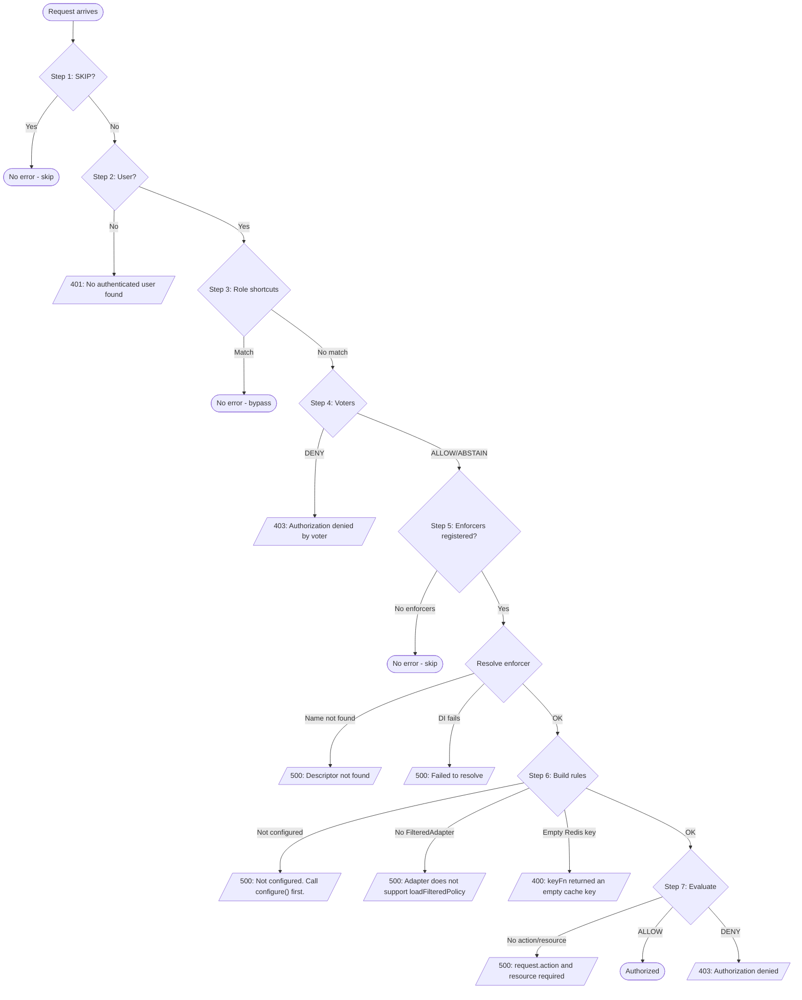

# Authorization -- Error Reference

> Complete error messages and troubleshooting for the authorization module. See [Setup & Configuration](./) for initial setup.

## Error Flow Diagram



## Complete Error Reference

All error messages from the authorization module, organized by source:

### Component Errors (AuthorizeComponent)

| Error Message | Status | Method |
|---------------|--------|--------|
| `[AuthorizeComponent] No authorize options found. Bind options to AuthorizeBindingKeys.OPTIONS before registering the component.` | 500 | `binding` |

### Authorization Provider Errors

| Error Message | Status | Step |
|---------------|--------|------|
| `Authorization failed: No authenticated user found` | 401 | Step 2 -- User check |
| `Authorization failed: user.principalType is required for enforcer-based authorization` | 400 | Step 6 -- Build rules |
| <code v-pre>Authorization denied by voter &#124; action: {{action}} &#124; resource: {{resource}}</code> | 403 | Step 4 -- Voter DENY |
| <code v-pre>Authorization denied &#124; action: {{action}} &#124; resource: {{resource}}</code> | 403 | Step 7 -- Enforcer denied |

### Enforcer Registry Errors (AuthorizationEnforcerRegistry)

| Error Message | Status | Method |
|---------------|--------|--------|
| <code v-pre>[getKey] Invalid name &#124; name: {{name}}</code> | 500 | `getKey` |
| `[AuthorizationEnforcerRegistry] No items registered` | 500 | `getDefaultName` |
| <code v-pre>[AuthorizationEnforcerRegistry] Duplicate enforcer name(s): {{names}}</code> | 500 | `register` |
| <code v-pre>[AuthorizationEnforcerRegistry] Enforcer already registered: {{name}}</code> | 500 | `register` |
| <code v-pre>[AuthorizationEnforcerRegistry] Descriptor not found: {{name}}</code> | 500 | `resolveDescriptor` |
| <code v-pre>[AuthorizationEnforcerRegistry] Failed to resolve: {{name}}</code> | 500 | `resolveDescriptor` |

> [!NOTE]
> The `[AuthorizationEnforcerRegistry] No items registered` error can only occur if `getDefaultEnforcerName()` is called directly. During normal middleware execution, the provider checks `registry.hasEnforcers()` first and skips authorization if no enforcers are registered, so this error is not thrown in the standard pipeline.

### Casbin Enforcer Errors (CasbinAuthorizationEnforcer)

| Error Message | Status | Method |
|---------------|--------|--------|
| `[CasbinAuthorizationEnforcer] "casbin" is not installed` | 500 | `configure` |
| `[CasbinAuthorizationEnforcer] options.model is required.` | 500 | `configure` |
| `[CasbinAuthorizationEnforcer] Not configured. Call configure() first.` | 500 | `evaluate`, `loadPolicyLinesIntoModel` |
| `[extractUserLines] Adapter does not support loadFilteredPolicy.` | 500 | `buildRules` (via `extractUserLines`) |
| `[CasbinAuthorizationEnforcer] request.action and request.resource are required.` | 500 | `evaluate` |
| `[CasbinAuthorizationEnforcer] keyFn returned an empty cache key.` | 400 | `buildRules`/cache management (via `resolveCacheKey`) |
| <code v-pre>[CasbinAuthorizationEnforcer] cached.options.expiresIn must be >= 10000 (ms) &#124; Received: {{value}}</code> | 500 | `configure` (via `validateExpiresIn`) |
| <code v-pre>[CasbinAuthorizationEnforcer] Matcher smoke test failed at warmup — ...</code> | 500 | `configure` (via `assertMatcherCompilesSync`) |
| <code v-pre>[resolveDomainMatchingFn] Unsupported func: {{name}} &#124; Valids: [...]</code> | 500 | `configure` (via `registerMatchers`) |
| <code v-pre>[registerMatchers] Role definition "{{name}}" is not declared in the Casbin model. ...</code> | 500 | `configure` (via `registerMatchers`, only when `domainMatching` is set) |
| <code v-pre>[resolveModel] Invalid model.driver &#124; Valids: [file, text]</code> | 500 | `configure` (via `resolveModel`) |
| `[CasbinAuthorizationEnforcer] Cache management requires the redis cache driver, but caching is disabled.` | 500 | `invalidateUserCache`/`rebuildUserCache` (via `requireRedisCache`) |

> The `Invalid cached.driver` errors were removed — `cached` is now a typed union
> (`{ use: false } | { use: true, driver: 'redis', ... }`), so an invalid driver is a compile-time
> error, not a runtime one.

### Policy Loading Errors (CasbinAuthorizationEnforcer internals)

| Error Message | Status | Method |
|---------------|--------|--------|
| `[CasbinAuthorizationEnforcer] keyFn returned an empty cache key.` | 400 | `resolveCacheKey` (read + cache-management paths) |
| `[extractUserLines] Adapter does not support loadFilteredPolicy.` | 500 | `extractUserLines` |
| `[loadPolicyLinesIntoModel] Not configured. Call configure() first.` | 500 | `loadPolicyLinesIntoModel` |
| `[CasbinAuthorizationEnforcer] Cached payload is not an array of policy lines.` | — (logged, not thrown) | `parseCachedPolicyLines` — corrupt entry is discarded + refetched |

> A corrupted Redis cache entry does **not** raise an error — it is logged and discarded, and the
> lines are refetched from the adapter (the request never 500s on cache corruption).

### Registry Errors (AuthorizationEnforcerRegistry)

| Error Message | Status | Method |
|---------------|--------|--------|
| `[AuthorizationEnforcerRegistry] Enforcer "{{name}}" does not support cache invalidation` | 500 | `invalidateUserCache` / `rebuildUserCache` (the resolved enforcer lacks the optional method) |

## Troubleshooting

### "[AuthorizeComponent] No authorize options found"

**Cause:** `AuthorizeComponent` was registered but `IAuthorizeOptions` was not bound to the container.

**Fix:** Bind options **before** registering the component:

```typescript
// 1. Bind options first
this.bind<IAuthorizeOptions>({ key: AuthorizeBindingKeys.OPTIONS }).toValue({
  defaultDecision: 'deny',
  alwaysAllowRoles: ['999_super-admin'],
});

// 2. Then register the component
this.component(AuthorizeComponent);
```

### "Authorization failed: No authenticated user found"

**Cause:** The authorization middleware runs after authentication, but no user was found on the context (`Authentication.CURRENT_USER` is undefined). This happens when:
- The route has `authorize` but no `authenticate` config
- Authentication middleware failed silently
- Authentication was skipped but authorization was not

**Fix:** Ensure routes with `authorize` also have `authenticate`:

```typescript
this.defineRoute({
  configs: {
    path: '/',
    method: 'get',
    authenticate: { strategies: [Authentication.STRATEGY_JWT] },  // Must be present
    authorize: { action: AuthorizationActions.READ, resource: 'Article' },
    // ...
  },
  handler: async (context) => { ... },
});
```

### "Authorization failed: user.principalType is required"

**Cause:** The authenticated user object does not have a `principalType` field. This is required for enforcer-based authorization because the enforcer uses `principalType` to construct the casbin subject (e.g., `user_123`, `service_456`).

**Fix:** Ensure your authentication service sets `principalType` on the user object:

```typescript
// In your JWT token service or authentication service:
return {
  userId: '123',
  principalType: 'user',  // Required for authorization
  roles: [...],
};
```

> [!NOTE]
> `principalType` is accessed via the `IAuthUser` index signature (`[extra: string | symbol]: any`), not a dedicated field. It must be set as a property on the returned user object.

### "Authorization denied by voter | action: ... | resource: ..."

**Cause:** A voter function explicitly returned `AuthorizationDecisions.DENY` for the request.

**Fix:** Check the voter logic. Review which voter denied the request by examining the action and resource in the error message. Common causes:
- Voter checking ownership and user is not the owner
- Voter checking time window and request is outside allowed hours
- Voter checking resource state (e.g., locked, archived)

### "Authorization denied | action: ... | resource: ..."

**Cause:** The enforcer's `evaluate()` returned `DENY` or `ABSTAIN` (which fell back to `defaultDecision`) for the requested action/resource. This means:
- No matching policies were found for the user
- Matching policies exist but deny the action
- The casbin model does not cover the requested action/resource combination

**Fix:** Debug by checking:

1. **Policies are loaded correctly** -- verify your adapter is returning the right policy definitions for the user
2. **Subject format matches** -- the `normalizePayloadFn` must produce subjects matching your policy definitions (e.g., `user_123` must match what's in the database)
3. **Casbin model covers the request** -- your `.conf` file must define matchers for the action/resource/domain pattern you're using
4. **Set defaultDecision explicitly:**
```typescript
this.bind<IAuthorizeOptions>({ key: AuthorizeBindingKeys.OPTIONS }).toValue({
  defaultDecision: 'deny',  // Explicit is better
  // ...
});
```

### "[AuthorizationEnforcerRegistry] Duplicate enforcer name(s): ..."

**Cause:** Two or more enforcers in the same `register()` call have the same name.

**Fix:** Ensure each enforcer has a unique name:

```typescript
AuthorizationEnforcerRegistry.getInstance().register({
  container: this,
  enforcers: [
    { enforcer: CasbinEnforcer, name: 'casbin', type: 'casbin', ... },
    { enforcer: CustomEnforcer, name: 'custom', type: 'custom', ... },  // Different name
  ],
});
```

### "[AuthorizationEnforcerRegistry] Enforcer already registered: ..."

**Cause:** An enforcer with this name was already registered in a previous `register()` call. The registry does not allow overwriting.

**Fix:** Ensure you only register each enforcer name once. If you need to re-register, call `registry.reset()` first (typically only in tests).

### "[AuthorizationEnforcerRegistry] No items registered"

**Cause:** Tried to get the default enforcer name but no enforcers are registered. This error can only occur if `getDefaultEnforcerName()` is called directly. During normal middleware execution, the provider checks `registry.hasEnforcers()` first and skips authorization if no enforcers are registered, so this error is not triggered in the standard pipeline.

**Fix:** Register enforcers after registering the component:

```typescript
// 1. Bind options and register component
this.bind<IAuthorizeOptions>({ key: AuthorizeBindingKeys.OPTIONS }).toValue({ ... });
this.component(AuthorizeComponent);

// 2. Register enforcers
AuthorizationEnforcerRegistry.getInstance().register({
  container: this,
  enforcers: [{ enforcer: CasbinAuthorizationEnforcer, name: 'casbin', type: 'casbin', options: { ... } }],
});
```

### "[AuthorizationEnforcerRegistry] Descriptor not found: ..."

**Cause:** Tried to resolve an enforcer by a name that was never registered. This happens when `enforcerName` is specified in the `authorize()` call but doesn't match any registered enforcer.

**Fix:** Ensure the enforcer name matches what was registered. The default enforcer name is the first one registered.

### "[AuthorizationEnforcerRegistry] Failed to resolve: ..."

**Cause:** The enforcer class was registered in the descriptor Map but DI container resolution returned `null`. This typically means the enforcer class has unsatisfied dependencies.

**Fix:** Check that all `@inject` dependencies in your enforcer's constructor are bound in the same container.

### "[CasbinAuthorizationEnforcer] casbin is not installed"

**Cause:** The Casbin enforcer dynamically imports `casbin` at configure time, but the package is not installed.

**Fix:** Install casbin as a dependency:

```bash
bun add casbin
```

### "[CasbinAuthorizationEnforcer] options.model is required"

**Cause:** The Casbin enforcer's options do not include a `model` field. The model defines the casbin RBAC/ABAC rules structure.

**Fix:** Provide `model` in the enforcer options:

```typescript
AuthorizationEnforcerRegistry.getInstance().register({
  container: this,
  enforcers: [{
    enforcer: CasbinAuthorizationEnforcer,
    name: 'casbin',
    type: 'casbin',
    options: {
      model: {
        driver: 'file',
        definition: path.resolve(__dirname, './security/model.conf'),
      },
      cached: { use: false },
    },
  }],
});
```

### "[extractUserLines] Adapter does not support loadFilteredPolicy"

**Cause:** The adapter provided to the Casbin enforcer does not implement the `loadFilteredPolicy` method from casbin's `FilteredAdapter` interface. The authorization system always uses filtered policy loading.

**Fix:** Use an adapter that implements `FilteredAdapter`, such as `ScopedCasbinAdapter` or a custom adapter extending `BaseFilteredAdapter`:

```typescript
import { ScopedCasbinAdapter } from '@venizia/ignis';

const adapter = new ScopedCasbinAdapter({
  dataSource,
  entities: { /* IScopedCasbinEntities */ },
});
```

### "[CasbinAuthorizationEnforcer] cached.options.expiresIn must be >= 10000"

**Cause:** The `expiresIn` value for the cache TTL is too small. Minimum is 10,000 ms (10 seconds), enforced by the `MIN_EXPIRES_IN` constant.

**Fix:** Increase the expiration time:

```typescript
cached: {
  use: true,
  driver: 'redis',
  options: {
    connection: redisHelper,
    expiresIn: 5 * 60 * 1000,  // 5 minutes (minimum: 10,000 ms)
    keyFn: ({ user }) => `authz:policies:${user.userId}`,
  },
},
```

### "[CasbinAuthorizationEnforcer] Not configured. Call configure() first."

**Cause:** The Casbin enforcer's `evaluate()` (or `loadPolicyLinesIntoModel()`) was called before `configure()` built the enforcer pool. This should not happen when using `resolveEnforcer()` (which auto-configures), but can occur if the enforcer is resolved manually via the DI container.

**Fix:** Always resolve enforcers through the registry's `resolveEnforcer()` method, which handles configure-once automatically:

```typescript
const enforcer = await AuthorizationEnforcerRegistry.getInstance().resolveEnforcer({ name: 'casbin' });
// configure() is called automatically on first resolve
```

### "[loadPoliciesWithRedisCache] Invalid cachedKey"

**Cause:** The `keyFn` in Redis cache options returned a falsy value (empty string, null, undefined). The cache key is required to store/retrieve policies from Redis.

**Fix:** Ensure your `keyFn` always returns a non-empty string:

```typescript
keyFn: ({ user }) => {
  if (!user.userId) {
    throw new Error('User ID is required for cache key');
  }
  return `authz:policies:${user.userId}`;
},
```

### "[CasbinAuthorizationEnforcer] Not configured. Call configure() first."

**Cause:** `evaluate()` or `loadPolicyLinesIntoModel()` ran before the enforcer pool was built.

**Fix:** Ensure `configure()` completed successfully (the registry calls it on first use) before any
evaluation. The enforcer pool is created in `configure()`.

### "[CasbinAuthorizationEnforcer] keyFn returned an empty cache key."

**Cause:** The Redis `cached.options.keyFn` returned an empty string for a user.

**Fix:** Return a stable, non-empty key (commonly derived from `user.principalType` + `user.userId`):

```typescript
keyFn: ({ user }) => `authz:policies:${user.principalType}:${user.userId}`,
```

### "[resolveModel] Invalid model.driver | Valids: [file, text]"

**Cause:** An unsupported `model.driver` string was passed.

**Fix:** Use `CasbinEnforcerModelDrivers.FILE` (`'file'`) or `CasbinEnforcerModelDrivers.TEXT` (`'text'`).

> There is no longer an `Invalid cached.driver` runtime error — `cached` is a typed union, so an
> unsupported cache driver is caught at compile time. Caching is **Redis-only**.

## Common Patterns

### Authorization Is Not Running

Check middleware injection order:
1. Verify `authorize` is set on the route config (not just `authenticate`)
2. Verify `authenticate` is not set to `{ skip: true }` (which also skips authorization in CRUD factory)
3. Verify the component is registered and enforcers are registered via the registry
4. Note: if no enforcers are registered, the middleware skips authorization silently (calls `next()`) rather than throwing an error

### Rules Are Built On Every Request

Check that rules are being cached correctly. The middleware caches on `Authorization.RULES`:
- Cached per-request (each new request starts fresh)
- Multiple authorization specs on the same route share the cache
- If rules are `undefined` or `null`, they will be rebuilt

### Casbin Policies Not Loading

1. **Check adapter entities** -- ensure `IScopedCasbinEntities` (`policyDefinition`/`permission` table names + `schemaName`, `principals`, `domainTypes`) match your database schema
2. **Check the variant column** -- `PolicyDefinition.variant` must use the `AuthorizationPolicyVariants.*.action` values: `grant`, `assign_role`, `join_domain`, `role_inherits`, `resource_inherits`, `action_inherits`, `domain_inherits`
3. **Check subject/target types** -- the SQL queries filter by `subject_type`/`target_type` against `principals` and `domainTypes`
4. **Check the model** -- for scoped RBAC, use `CASBIN_RBAC_DOMAIN_SCOPED_MODEL` with `isScoped: true`

### Redis Cache Not Working

1. **Check Redis connection** -- verify `DefaultRedisHelper` is properly connected
2. **Check keyFn** -- ensure it returns a unique, non-empty key per user
3. **Check expiresIn** -- must be >= 10,000 ms (`MIN_EXPIRES_IN`)
4. **Verify cache hit** -- check logs for `"Loaded CACHED Policies"` vs `"Loaded ADAPTER + CACHED Policies"`

## See Also

- [Setup & Configuration](./) -- Binding keys, options interfaces, and initial setup
- [Usage & Examples](./usage) -- Securing routes, voters, patterns, and CRUD integration
- [API Reference](./api) -- Architecture, enforcer internals, provider, registry, and adapters
