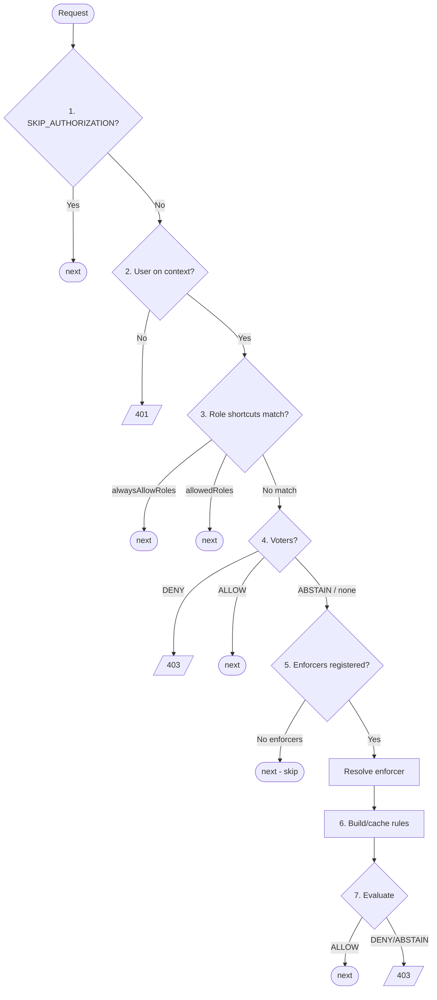
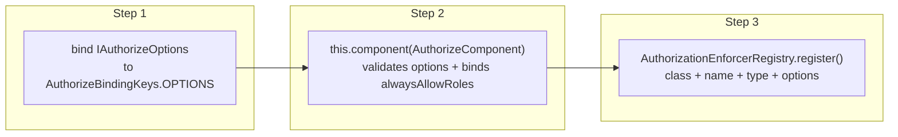
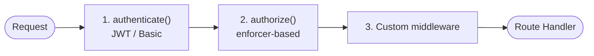

# Authorization -- Setup & Configuration

> Enforcer-based authorization with RBAC, voters, and Casbin integration

## Quick Reference

| Item | Value |
|------|-------|
| **Package** | `@venizia/ignis` |
| **Class** | `AuthorizeComponent` |
| **Runtimes** | Both |

### Key Components

| Component | Purpose |
|-----------|---------|
| **AuthorizeComponent** | Main component validating authorization options and binding global config |
| **AuthorizationEnforcerRegistry** | Singleton managing registered enforcers (mirrors `AuthenticationStrategyRegistry`) |
| **CasbinAuthorizationEnforcer** | Casbin-backed enforcer (optional `casbin` peer dep) |
| **AuthorizationProvider** | IProvider producing the `authorize()` middleware factory |
| **authorize** | Standalone function wrapping `AuthorizationProvider.value()` |
| **AuthorizationRole** | Value object for role identity with priority-based comparison |
| **BaseFilteredAdapter** | Thin abstract casbin `FilteredAdapter` (datasource plumbing + `loadLines`); subclasses implement only `loadFilteredPolicy` |
| **ScopedCasbinAdapter** | Generic read-only `FilteredAdapter` for the scoped RBAC model - reads one principal's edges + the shared hierarchy from a single `PolicyDefinition` table |
| **AbstractAuthRegistry** | Shared base class for authentication strategy registry and authorization enforcer registry |

### Authorization Flow (7 Steps)



| Step | Action | Short-circuits? |
|------|--------|-----------------|
| 1 | Check `Authorization.SKIP_AUTHORIZATION` flag | Yes -- skip all |
| 2 | Get authenticated user from context | Yes -- 401 if missing |
| 3 | Check role-based shortcuts (`alwaysAllowRoles` + `allowedRoles`) | Yes -- allow if matched |
| 4 | Execute `voters` (per-route) | Yes -- DENY/ALLOW short-circuits |
| 5 | Check if enforcers are registered; resolve enforcer (by name or default) | Yes -- skip all if no enforcers registered |
| 6 | Build or retrieve cached rules | No |
| 7 | Evaluate permission via enforcer | Yes -- 403 if denied |

> [!NOTE]
> Step 3 merges the global `alwaysAllowRoles` check and the per-route `allowedRoles` check into a single step. User roles are extracted once and checked against both lists.

> [!NOTE]
> Step 5 has a safety fallback: if no enforcers are registered in the `AuthorizationEnforcerRegistry`, the middleware skips authorization entirely and calls `next()`. This prevents hard failures when authorization is configured on routes but no enforcer has been registered yet.

### Authorization Constants

| Constant | Value | Description |
|----------|-------|-------------|
| `Authorization.RULES` | `'authorization.rules'` | Context key for cached rules |
| `Authorization.SKIP_AUTHORIZATION` | `'authorization.skip'` | Context key to dynamically skip authorization |
| `Authorization.ENFORCER` | `'authorization.enforcer'` | Binding key prefix for enforcers |
| `Authorization.DOMAIN` | `'authorization.domain'` | Context key for the resolved request domain scope (set by the provider when domain scoping is in play) |

### Authorization Actions

| Constant | Value |
|----------|-------|
| `AuthorizationActions.CREATE` | `'create'` |
| `AuthorizationActions.READ` | `'read'` |
| `AuthorizationActions.UPDATE` | `'update'` |
| `AuthorizationActions.DELETE` | `'delete'` |
| `AuthorizationActions.EXECUTE` | `'execute'` |

`AuthorizationActions.SCHEME_SET` contains all valid actions. `AuthorizationActions.isValid(input)` checks membership.

### Authorization Decisions

| Constant | Value | Description |
|----------|-------|-------------|
| `AuthorizationDecisions.ALLOW` | `'allow'` | Grant access |
| `AuthorizationDecisions.DENY` | `'deny'` | Deny access |
| `AuthorizationDecisions.ABSTAIN` | `'abstain'` | No opinion -- fall through to next check |

`AuthorizationDecisions` also provides comparison helpers that accept both strings and numbers:

| Method | String check | Number check |
|--------|-------------|--------------|
| `isAllow(input)` | `input.toLowerCase() === 'allow'` | `input > 0` |
| `isDeny(input)` | `input.toLowerCase() === 'deny'` | `input < 0` |
| `isAbstain(input)` | `input.toLowerCase() === 'abstain'` | `input === 0` |

`AuthorizationDecisions.SCHEME_SET` contains all valid decisions. `AuthorizationDecisions.isValid(input)` checks membership.

### Authorization Enforcer Types

| Constant | Value | Description |
|----------|-------|-------------|
| `AuthorizationEnforcerTypes.CASBIN` | `'casbin'` | Casbin-backed enforcer |
| `AuthorizationEnforcerTypes.CUSTOM` | `'custom'` | Custom enforcer implementation |

`AuthorizationEnforcerTypes.SCHEME_SET` contains all valid types. `AuthorizationEnforcerTypes.isValid(input)` checks membership.

### Casbin Enforcer Model Drivers

| Constant | Value | Description |
|----------|-------|-------------|
| `CasbinEnforcerModelDrivers.FILE` | `'file'` | Load model from `.conf` file path |
| `CasbinEnforcerModelDrivers.TEXT` | `'text'` | Load model from inline string |

`CasbinEnforcerModelDrivers.SCHEME_SET` contains all valid drivers. `CasbinEnforcerModelDrivers.isValid(input)` checks membership.

### Casbin Enforcer Cached Drivers

| Constant | Value | Description |
|----------|-------|-------------|
| `CasbinEnforcerCachedDrivers.REDIS` | `'redis'` | Redis-backed per-user line cache with TTL (the only cache driver) |

`CasbinEnforcerCachedDrivers.SCHEME_SET` contains all valid drivers. `CasbinEnforcerCachedDrivers.isValid(input)` checks membership.

> The in-memory cache driver was removed. Caching is **Redis-only**: set `cached` to
> `{ use: true, driver: 'redis', options: { connection, expiresIn, keyFn } }`, or `{ use: false }`
> to disable caching (every request rebuilds the user's policy from the datasource).

### Casbin Domain Matching Functions

Built-in Casbin matching functions selectable for `ICasbinEnforcerOptions.domainMatching.fn`. Each value maps 1:1 to a Casbin `Util.*Func` export and is applied to the **domain slot** of a role definition (e.g. `g`).

| Constant | Value | Description |
|----------|-------|-------------|
| `CasbinDomainMatchingFunctions.KEY_MATCH` | `'keyMatch'` | `*` is the only wildcard; exact compare otherwise. Recommended for `Merchant_<uuid>`-style domains |
| `CasbinDomainMatchingFunctions.KEY_MATCH_2` | `'keyMatch2'` | Adds URL-path `:param` segment matching |
| `CasbinDomainMatchingFunctions.KEY_MATCH_3` | `'keyMatch3'` | Adds `{param}` segment matching |
| `CasbinDomainMatchingFunctions.KEY_MATCH_4` | `'keyMatch4'` | `{param}` with repeated-name equality checks |
| `CasbinDomainMatchingFunctions.REGEX_MATCH` | `'regexMatch'` | Treats the stored/policy value as a full regular expression |

`CasbinDomainMatchingFunctions.SCHEME_SET` contains all valid values. `CasbinDomainMatchingFunctions.isValid(input)` checks membership. Companion type: `TCasbinDomainMatchingFunction`.

> [!IMPORTANT]
> The function is applied as `fn(requestDomain, policyDomain)` - the wildcard must live on the **stored/policy** side. With `keyMatch`: `keyMatch("Merchant_X", "*") === true`, `keyMatch("Merchant_X", "Merchant_X") === true`, `keyMatch("Merchant_X", "Merchant_Y") === false`. Store only `*` or exact domain values (never partial patterns like `Merchant_*`) to keep tenant isolation guaranteed.

### Casbin Rule Variants

`CasbinRuleVariants` holds **only the Casbin line prefixes** declared by the model, numbered in
request-tuple order (`sub → dom → obj → act`):

| Constant | Value | Relation |
|----------|-------|----------|
| `CasbinRuleVariants.P` | `'p'` | Permission policy line |
| `CasbinRuleVariants.G` | `'g'` | Role membership + role inheritance (the `sub` axis) |
| `CasbinRuleVariants.G2` | `'g2'` | User→domain membership (the `dom` axis) |
| `CasbinRuleVariants.G3` | `'g3'` | Domain hierarchy (the `dom` axis) |
| `CasbinRuleVariants.G4` | `'g4'` | Resource hierarchy (the `obj` axis, via `objectMatch`) |
| `CasbinRuleVariants.G5` | `'g5'` | Action hierarchy (the `act` axis) |

### Authorization Policy Variants

The DB `variant` discriminator (the kind of "edge" stored in `PolicyDefinition`) lives on
`AuthorizationPolicyVariants`. Each entry carries `action` (the DB value) and `rule` (the Casbin prefix
the adapter emits for that edge):

| Variant | `action` (DB) | `rule` | Meaning |
|---------|---------------|--------|---------|
| `GRANT` | `'grant'` | `p` | Give a permission to a User or Role |
| `ASSIGN_ROLE` | `'assign_role'` | `g` | Give a User a Role (optionally domain-scoped) |
| `ROLE_INHERITS` | `'role_inherits'` | `g` | Role inherits another Role |
| `JOIN_DOMAIN` | `'join_domain'` | `g2` | User is a member of a Domain |
| `DOMAIN_INHERITS` | `'domain_inherits'` | `g3` | Domain nested under a parent Domain |
| `RESOURCE_INHERITS` | `'resource_inherits'` | `g4` | Resource nested under a broader Resource |
| `ACTION_INHERITS` | `'action_inherits'` | `g5` | Action implied by a broader Action |

`AuthorizationPolicyVariants.isValidAction(input)` / `isValidRule(input)` check membership;
`ACTION_SCHEME_SET` / `RULE_SCHEME_SET` hold the sets.

### Authorization Domain Scopes

Sentinel domain values used on `grant` rows:

| Constant | Value | Meaning |
|----------|-------|---------|
| `AuthorizationDomainScopes.ANY_MEMBER` | `'ANY_MEMBER'` | Applies in every domain the subject joined (checked via `g2`) |
| `AuthorizationDomainScopes.SYSTEM_WIDE` | `'SYSTEM_WIDE'` | Applies system-wide, bypassing membership (super-admin) |

> [!NOTE]
> All constant classes follow the same pattern: static readonly values + `SCHEME_SET: Set<string>` + `isValid(input): boolean`. Each class also has a companion type alias generated via `TConstValue<typeof ClassName>` (e.g., `TAuthorizationAction`, `TAuthorizationDecision`, `TCasbinRuleVariant`).

### Built-in Roles

| Constant | Identifier | Priority | Description |
|----------|------------|----------|-------------|
| `AuthorizationRoles.SUPER_ADMIN` | `'999_super-admin'` | 999 | Highest privilege |
| `AuthorizationRoles.ADMIN` | `'900_admin'` | 900 | Administrator |
| `AuthorizationRoles.USER` | `'010_user'` | 10 | Regular user |
| `AuthorizationRoles.GUEST` | `'001_guest'` | 1 | Guest user |
| `AuthorizationRoles.UNKNOWN_USER` | `'000_unknown-user'` | 0 | Unauthenticated fallback |

Each built-in role is an `AuthorizationRole` instance. `AuthorizationRoles.SCHEME_SET` contains identifier strings. `AuthorizationRoles.isValid(input)` checks membership.

### Import Paths

```typescript
// Classes & functions
import {
  // Component & middleware
  AuthorizeComponent,
  AuthorizationProvider,
  authorize,

  // Registry
  AuthorizationEnforcerRegistry,

  // Enforcers
  CasbinAuthorizationEnforcer,

  // Adapters
  BaseFilteredAdapter,
  ScopedCasbinAdapter,

  // Scoped RBAC model
  CASBIN_RBAC_DOMAIN_SCOPED_MODEL,

  // Models
  AuthorizationRole,

  // Constants
  Authorization,
  AuthorizationActions,
  AuthorizationDecisions,
  AuthorizationDomainScopes,
  AuthorizationPolicyVariants,
  AuthorizationRoles,
  AuthorizationEnforcerTypes,
  CasbinEnforcerModelDrivers,
  CasbinEnforcerCachedDrivers,
  CasbinRuleVariants,
  CasbinDomainMatchingFunctions,

  // Binding keys
  AuthorizeBindingKeys,
} from '@venizia/ignis';

// Types & interfaces
import type {
  // Core interfaces
  IAuthorizeOptions,
  IAuthorizationEnforcer,
  IAuthorizationSpec,
  IAuthorizationRequest,
  IAuthorizationRole,

  // Casbin options
  ICasbinEnforcerOptions,
  ICasbinEnforcerCachedRedis,

  // Adapter types
  ICasbinPolicyFilter,
  ICasbinPolicySource,
  IScopedCasbinEntities,
  IScopedCasbinPolicyFilter,

  // Function & utility types
  TAuthorizeFn,
  TAuthorizationVoter,
  TAuthorizationConditions,
  TRegistryDescriptor,

  // Value types (from TConstValue)
  TAuthorizationAction,
  TAuthorizationDecision,
  TAuthorizationEnforcerType,
  TCasbinEnforcerCachedDriver,
  TCasbinEnforcerModelDriver,
  TCasbinRuleVariant,
  TCasbinDomainMatchingFunction,
} from '@venizia/ignis';
```

## Setup

Authorization setup is a **three-step process**: bind global options, register the component, then register enforcers via the registry.



### Step 1: Bind Global Options

Bind `IAuthorizeOptions` to configure global authorization behavior. This interface is minimal -- it only contains global settings, not enforcer-specific configuration.

```typescript
import {
  AuthorizeBindingKeys,
  AuthorizationDecisions,
  IAuthorizeOptions,
} from '@venizia/ignis';

this.bind<IAuthorizeOptions>({ key: AuthorizeBindingKeys.OPTIONS }).toValue({
  defaultDecision: AuthorizationDecisions.DENY,
  alwaysAllowRoles: ['999_super-admin'],
});
```

### Step 2: Register the Component

```typescript
import { AuthorizeComponent } from '@venizia/ignis';

this.component(AuthorizeComponent);
```

The component validates that `IAuthorizeOptions` is bound and extracts `alwaysAllowRoles` into a separate binding (`AuthorizeBindingKeys.ALWAYS_ALLOW_ROLES`) for downstream consumers.

### Step 3: Register Enforcers via Registry

Enforcer registration is separate from global options. Each enforcer is registered with its **class**, **name**, **type**, and **options** -- all co-located in one call.

#### Casbin Enforcer (Recommended)

```typescript
import {
  AuthorizationEnforcerRegistry,
  AuthorizationEnforcerTypes,
  CasbinAuthorizationEnforcer,
  CasbinEnforcerModelDrivers,
  ScopedCasbinAdapter,
  CASBIN_RBAC_DOMAIN_SCOPED_MODEL,
} from '@venizia/ignis';

// The generic scoped adapter - reads one principal's edges + the shared hierarchy from a single
// PolicyDefinition edge table. No subclassing; configure it with IScopedCasbinEntities.
const adapter = new ScopedCasbinAdapter({
  dataSource,
  entities: {
    policyDefinition: { tableName: 'PolicyDefinition', schemaName: 'identity' },
    permission: { tableName: 'Permission', schemaName: 'identity' },
    principals: { user: 'User', role: 'Role' },   // casbin name prefixes
    domainTypes: ['Merchant', 'Organizer'],         // domain types you scope on
    softDelete: { use: true, columnName: 'deleted_at' },
  },
});

AuthorizationEnforcerRegistry.getInstance().register({
  container: this,
  enforcers: [{
    enforcer: CasbinAuthorizationEnforcer,
    name: 'casbin',
    type: AuthorizationEnforcerTypes.CASBIN,
    options: {
      model: {
        driver: CasbinEnforcerModelDrivers.TEXT,
        definition: CASBIN_RBAC_DOMAIN_SCOPED_MODEL,
      },
      isScoped: true,           // 4-token (sub, dom, obj, act); auto-registers keyMatch + objectMatch
      adapter,
      cached: {
        use: true,
        driver: 'redis',
        options: {
          connection: redisHelper,
          expiresIn: 5 * 60 * 1000, // 5 minutes
          keyFn: ({ user }) => `authz:policies:${user.principalType}:${user.userId}`,
        },
      },
      // poolSize / poolAcquireTimeoutMs are optional (defaults 16 / 5000ms).
      // In scoped mode you do NOT pass domainMatching or normalizePayloadFn - the request domain
      // is supplied by the provider's domain resolver (see "Domain scoping" in usage.md).
    },
  }],
});
```

#### Custom Enforcer

```typescript
AuthorizationEnforcerRegistry.getInstance().register({
  container: this,
  enforcers: [{
    enforcer: MyCustomEnforcer,
    name: 'my-custom',
    type: AuthorizationEnforcerTypes.CUSTOM,
    options: { /* your enforcer-specific options */ },
  }],
});
```

### Full Setup Example

```typescript
import {
  AuthorizeComponent,
  AuthorizeBindingKeys,
  AuthorizationEnforcerRegistry,
  AuthorizationEnforcerTypes,
  CasbinAuthorizationEnforcer,
  CasbinEnforcerModelDrivers,
  ScopedCasbinAdapter,
  CASBIN_RBAC_DOMAIN_SCOPED_MODEL,
  BaseApplication,
  IAuthorizeOptions,
} from '@venizia/ignis';

export class Application extends BaseApplication {
  async registerAuthorization() {
    // Step 1: Global options
    this.bind<IAuthorizeOptions>({ key: AuthorizeBindingKeys.OPTIONS }).toValue({
      defaultDecision: 'deny',
      alwaysAllowRoles: ['999_super-admin'],
    });

    // Step 2: Register component
    this.component(AuthorizeComponent);

    // Step 3: Register enforcer(s) with co-located options
    const adapter = new ScopedCasbinAdapter({ dataSource, entities: { /* IScopedCasbinEntities */ } });

    AuthorizationEnforcerRegistry.getInstance().register({
      container: this,
      enforcers: [{
        enforcer: CasbinAuthorizationEnforcer,
        name: 'casbin',
        type: AuthorizationEnforcerTypes.CASBIN,
        options: {
          model: {
            driver: CasbinEnforcerModelDrivers.TEXT,
            definition: CASBIN_RBAC_DOMAIN_SCOPED_MODEL,
          },
          isScoped: true,
          adapter,
          cached: { use: false },
        },
      }],
    });
  }
}
```

> [!IMPORTANT]
> Authorization depends on authentication. Register `AuthenticateComponent` **before** `AuthorizeComponent` so that `Authentication.CURRENT_USER` is populated before authorization checks run.

> [!NOTE]
> Enforcer-specific options (model, adapter, cached, normalizePayloadFn) are co-located with the enforcer registration in `AuthorizationEnforcerRegistry.register()`, not inside `IAuthorizeOptions`. This keeps enforcer configuration next to the enforcer class.

## Configuration

### IAuthorizeOptions

Global authorization settings. Bound to the container before registering `AuthorizeComponent`.

| Option | Type | Default | Description |
|--------|------|---------|-------------|
| `defaultDecision` | `TAuthorizationDecision` | -- | **Required.** Decision when enforcer returns `ABSTAIN` (`'allow'`, `'deny'`, or `'abstain'`) |
| `alwaysAllowRoles` | `string[]` | `[]` | Roles that bypass all authorization checks (global) |
| `domainResolver` | `TAuthorizationDomainResolver` | -- | Fallback domain resolver used when a route's `spec.domain` is not set. Returns `{ type, id }` or `null` (→ `SYSTEM_WIDE`) |

```typescript
interface IAuthorizeOptions {
  defaultDecision: TAuthorizationDecision;
  alwaysAllowRoles?: string[];
  /** Fallback domain resolver used when a route's spec has no `domain`. */
  domainResolver?: TAuthorizationDomainResolver;
}
```

### ICasbinEnforcerOptions

Casbin-specific options, provided per-enforcer via `AuthorizationEnforcerRegistry.register()`.

| Option | Type | Default | Description |
|--------|------|---------|-------------|
| `model` | `{ driver, definition }` | -- | **Required.** Casbin model definition (file path or inline text). For scoped RBAC, use `CASBIN_RBAC_DOMAIN_SCOPED_MODEL` |
| `cached` | `{ use: false } \| { use: true, driver: 'redis', options }` | -- | **Required.** Caching configuration (Redis-only) |
| `adapter` | `Adapter` | -- | Casbin adapter instance (e.g., `ScopedCasbinAdapter`) |
| `isScoped` | `boolean` | `false` | Enable the scoped model: 4-token `(sub, dom, obj, act)` requests; auto-registers `keyMatch` on `g` + `objectMatch` on the resource relation |
| `poolSize` | `number` | `16` | Number of pooled enforcers (each request enforces on its own) |
| `poolAcquireTimeoutMs` | `number` | `5000` | Max ms to wait for a free pooled enforcer before failing closed |
| `normalizePayloadFn` | `(opts) => { subject, resource, action, domain? }` | -- | (Non-scoped/custom) normalize subject/resource/action before evaluation |
| `domainMatching` | `{ roleDefinition: string; fn: TCasbinDomainMatchingFunction }` | -- | (Non-scoped) opt-in domain matching function on a role definition. **Not needed when `isScoped: true`** - the scoped model registers its matchers automatically |

```typescript
interface ICasbinEnforcerOptions<
  E extends Env = Env,
  TAction = string,
  TResource = string,
  TAdapter = Adapter,
> {
  model:
    | { driver: 'file'; definition: string }
    | { driver: 'text'; definition: string };

  cached:
    | { use: false }
    | (ICasbinEnforcerCachedRedis & { use: true });

  adapter?: TAdapter;

  // Enable the scoped RBAC model (4-token requests + auto-registered matchers).
  isScoped?: boolean;

  // Per-request enforcer pool (concurrency-safe; fail-closed on error).
  poolSize?: number;             // default 16
  poolAcquireTimeoutMs?: number; // default 5000

  normalizePayloadFn?(opts: {
    user: IAuthUser;
    action: TAction;
    resource: TResource;
    context: TContext<E, string>;
  }): {
    subject: string;
    resource: string;
    action: string;
    domain?: string;
  };

  // Non-scoped only. Registers a Casbin domain matching function on the named role definition.
  // When isScoped is true, the scoped model registers its own matchers - do not set this.
  domainMatching?: {
    roleDefinition: string; // e.g. 'g'
    fn: TCasbinDomainMatchingFunction;
  };
}
```

> [!NOTE]
> `cached.options.expiresIn` must be >= 10,000 ms (10 seconds). Values below this threshold cause a validation error (`MIN_EXPIRES_IN = 10_000`).

#### Cache Configuration Types

The `cached` field is a discriminated union. **Caching is Redis-only** (the in-memory driver was removed):

```typescript
// No caching - every request rebuilds the user's policy from the datasource.
interface { use: false }

// Redis cache (store/retrieve the user's policy lines from Redis, TTL via PX).
interface ICasbinEnforcerCachedRedis {
  driver: 'redis';
  options: {
    connection: IRedisHelper;
    expiresIn: number;
    keyFn: (opts: { user: IAuthorizationUser }) => ValueOrPromise<string>;
  };
}
```

### IAuthorizationSpec (Route-level)

| Option | Type | Default | Description |
|--------|------|---------|-------------|
| `action` | `TAction` | -- | **Required.** Action being performed (e.g., `'read'`, `'create'`) |
| `resource` | `TResource` | -- | **Required.** Resource being accessed (e.g., `'Article'`, `'User'`) |
| `conditions` | `TAuthorizationConditions` | -- | Key-value conditions for ABAC (strict equality) |
| `allowedRoles` | `string[]` | -- | Roles that bypass enforcer for this specific route |
| `voters` | `TAuthorizationVoter[]` | -- | Custom voter functions for this specific route |

```typescript
interface IAuthorizationSpec<E extends Env = Env, TAction = string, TResource = string> {
  action: TAction;
  resource: TResource;
  conditions?: TAuthorizationConditions;
  allowedRoles?: string[];
  voters?: TAuthorizationVoter<E, TAction, TResource>[];
}
```

### TAuthorizationConditions

Key-value conditions for attribute-based access control. Values are compared with strict equality (`===`).

```typescript
type TAuthorizationConditions<
  KeyType extends string | symbol = string | symbol,
  ValueType = string | number | boolean | null,
> = Record<KeyType, ValueType>;
```

### TAuthorizationVoter

Function type for voter callbacks:

```typescript
type TAuthorizationVoter<
  E extends Env = Env,
  TAction = string,
  TResource = string,
> = (opts: {
  user: IAuthUser;
  action: TAction;
  resource: TResource;
  context: TContext<E, string>;
}) => ValueOrPromise<TAuthorizationDecision>;
```

### TAuthorizeFn

Function type for the `authorize()` middleware factory:

```typescript
type TAuthorizeFn<E extends Env = Env, TAction = string, TResource = string> = (opts: {
  spec: IAuthorizationSpec<E, TAction, TResource>;
  enforcerName?: string;
}) => MiddlewareHandler;
```

## Binding Keys

| Key | Constant | Type | Description |
|-----|----------|------|-------------|
| `@app/authorize/options` | `AuthorizeBindingKeys.OPTIONS` | `IAuthorizeOptions` | Global authorization options |
| `@app/authorize/always-allow-roles` | `AuthorizeBindingKeys.ALWAYS_ALLOW_ROLES` | `string[]` | Auto-bound by component if present in options |
| `@app/authorize/enforcers/{name}/options` | `AuthorizeBindingKeys.enforcerOptions(name)` | `ICasbinEnforcerOptions \| unknown` | Per-enforcer options, auto-bound by registry |

```typescript
class AuthorizeBindingKeys {
  static readonly OPTIONS = '@app/authorize/options';
  static readonly ALWAYS_ALLOW_ROLES = '@app/authorize/always-allow-roles';

  static enforcerOptions(name: string): string {
    return `@app/authorize/enforcers/${name}/options`;
  }
}
```

> [!NOTE]
> `AuthorizeBindingKeys.enforcerOptions(name)` is called automatically by `AuthorizationEnforcerRegistry.register()` when `options` is provided. The `CasbinAuthorizationEnforcer` injects its options from `AuthorizeBindingKeys.enforcerOptions('casbin')`.

## Context Variables

The authorization module extends Hono's `ContextVariableMap` for type-safe context access. The full augmentation is defined in `auth/context-variables.ts` and covers both authentication and authorization:

```typescript
declare module 'hono' {
  interface ContextVariableMap {
    // Authentication
    [Authentication.CURRENT_USER]: IAuthUser;
    [Authentication.AUDIT_USER_ID]: IdType;
    [Authentication.SKIP_AUTHENTICATION]: boolean;

    // Authorization
    [Authorization.RULES]: unknown;
    [Authorization.SKIP_AUTHORIZATION]: boolean;
    [Authorization.DOMAIN]: string;
  }
}
```

### Authorization-Specific Variables

| Key | Constant | Type | Description |
|-----|----------|------|-------------|
| `'authorization.rules'` | `Authorization.RULES` | `unknown` | Cached rules built by the enforcer. Type depends on enforcer implementation. |
| `'authorization.skip'` | `Authorization.SKIP_AUTHORIZATION` | `boolean` | Set to `true` to dynamically skip authorization for this request. |
| `'authorization.domain'` | `Authorization.DOMAIN` | `string` | Resolved request domain scope (`"<Type>_<id>"` or `SYSTEM_WIDE`); set by the provider when `spec.domain` or a global `domainResolver` is in play, and read by the enforcer. |

### Authentication Variables Used by Authorization

| Key | Constant | Type | Used for |
|-----|----------|------|----------|
| `'authentication.currentUser'` | `Authentication.CURRENT_USER` | `IAuthUser` | Read in step 2 to get authenticated user |
| `'authentication.auditUserId'` | `Authentication.AUDIT_USER_ID` | `IdType` | Available for audit logging |

### IAuthUser Interface

The `IAuthUser` interface (from the authenticate module) is the user object available during authorization:

```typescript
interface IAuthUser {
  userId: IdType;  // IdType = number | string | bigint
  [extra: string | symbol]: any;
}
```

The authorization middleware accesses `user.roles` (for role extraction) and `user.principalType` (for enforcer-based evaluation) via the index signature.

### IJWTTokenPayload Interface

When using JWT authentication, the full token payload extends `IAuthUser`:

```typescript
interface IJWTTokenPayload extends JWTPayload, IAuthUser {
  userId: IdType;
  roles: { id: IdType; identifier: string; priority: number }[];
  clientId?: string;
  provider?: string;
  email?: string;
  name?: string;
  [extra: string | symbol]: any;
}
```

> [!NOTE]
> `IdType = number | string | bigint` is defined in `@/base/models/common/types`.

## Relationship with Authentication

Authorization runs **after** authentication in the middleware chain. Both REST and gRPC controllers ensure the correct ordering:



1. Authentication middleware is injected first (from `authenticate` config)
2. Authorization middleware is injected second (from `authorize` config)
3. Custom middleware is injected last (from `middleware` config -- REST only)

This means `Authentication.CURRENT_USER` is always available when the authorization middleware executes.

### REST Controllers

The `AbstractRestController.buildRouteMiddlewares()` method builds the middleware array from route config. The `getRouteConfigs()` method calls `buildRouteMiddlewares()` internally and wraps it into a Hono route definition:

```typescript
// In AbstractRestController
buildRouteMiddlewares<RouteConfig extends IAuthRouteConfig>(opts: { configs: RouteConfig }) {
  const { authenticate = {}, authorize, ...restConfig } = opts.configs;
  const mws = [];

  // 1. Authenticate middleware (first)
  if (strategies.length > 0) {
    mws.push(authenticateFn({ strategies, mode }));
  }

  // 2. Authorize middleware (second) - supports single or array
  if (authorize) {
    const specs = Array.isArray(authorize) ? authorize : [authorize];
    for (const spec of specs) {
      mws.push(authorizeFn({ spec }));
    }
  }

  // 3. Custom middleware (last)
  if (restConfig.middleware) { ... }

  return { restConfig, security, mws };
}
```

### gRPC Controllers

The `AbstractGrpcController.buildRpcMiddlewares()` method provides symmetric authorization support for gRPC routes. Authorization specs are applied the same way as REST:

```typescript
// In AbstractGrpcController
buildRpcMiddlewares(opts: { configs: IRpcMetadata }): TRpcMiddleware[] {
  const { configs } = opts;
  const mws = [];

  // 1. Authenticate middleware
  if (configs.authenticate) { ... }

  // 2. Authorize middleware - same pattern as REST
  if (configs.authorize) {
    const specs = Array.isArray(configs.authorize) ? configs.authorize : [configs.authorize];
    for (const spec of specs) {
      const authzMw = authorizeFn({ spec });
      mws.push((context, next) => authzMw(context, next));
    }
  }

  return mws;
}
```

### IAuthRouteConfig

Extended route config that supports both authentication and authorization:

```typescript
interface IAuthRouteConfig extends HonoRouteConfig {
  authenticate?: { strategies?: TAuthStrategy[]; mode?: TAuthMode };
  authorize?: IAuthorizationSpec | IAuthorizationSpec[];
}
```

When `authorize` is an array, each spec creates a separate middleware. All must pass for the handler to execute.

### Per-Route Configuration in CRUD Factory

CRUD factory routes support both authentication and authorization configuration:

```typescript
ControllerFactory.defineCrudController({
  entity: Article,
  repository: { name: 'ArticleRepository' },
  controller: {
    name: 'ArticleController',
    basePath: '/articles',
  },
  authenticate: { strategies: [Authentication.STRATEGY_JWT], mode: AuthenticationModes.ANY },
  authorize: { action: AuthorizationActions.READ, resource: 'Article' },
  routes: {
    // Skip both auth for public read
    find: { authenticate: { skip: true } },
    // Override authorization for delete
    deleteById: {
      authorize: { action: AuthorizationActions.DELETE, resource: 'Article' },
    },
    // Skip only authorization
    count: { authorize: { skip: true } },
  },
});
```

**Priority rules:**
1. `authenticate: { skip: true }` -- skips both authentication AND authorization
2. `authorize: { skip: true }` -- skips only authorization (authentication still runs)
3. Per-route `authorize` overrides controller-level `authorize`
4. No per-route config -- inherits controller-level config

### Per-Route Auth Types

```typescript
/** Per-route authorization config: { skip: true }, single spec, or array of specs. */
type TRouteAuthorizeConfig = { skip: true } | IAuthorizationSpec | IAuthorizationSpec[];

/** Per-route auth config. Endpoint config takes precedence over controller-level config. */
type TRouteAuthConfig = {
  authenticate?: TRouteAuthenticateConfig;
  authorize?: TRouteAuthorizeConfig;
};
```

## See Also

- [Usage & Examples](./usage) -- Securing routes, voters, patterns, and CRUD integration
- [API Reference](./api) -- Architecture, enforcer internals, provider, registry, and adapters
- [Error Reference](./errors) -- Error messages and troubleshooting

- **Related Components:**
  - [Authentication](../authentication/) -- Authentication system (runs before authorization)
  - [All Components](../index) -- Built-in components list

- **References:**
  - [Controllers](/references/base/controllers) -- Route configuration with auth
  - [Middlewares](/references/base/middlewares) -- Custom middleware integration

- **Best Practices:**
  - [Security Guidelines](/best-practices/security-guidelines) -- Authorization best practices
