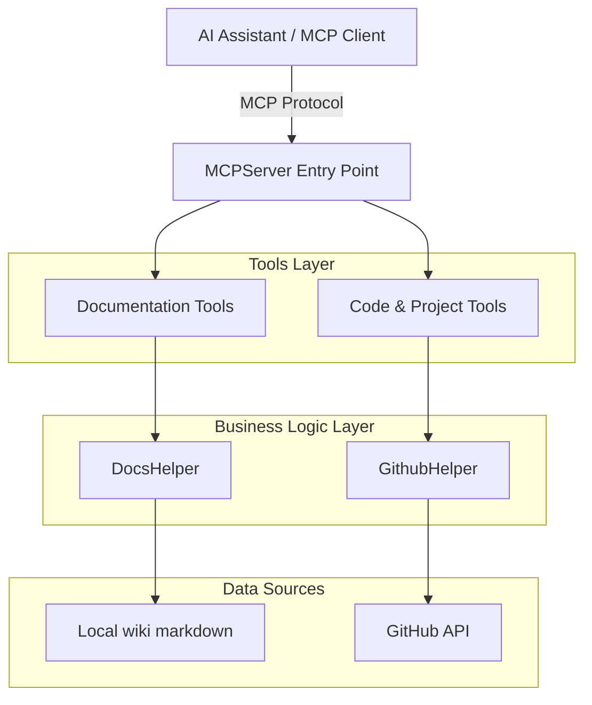

# MCP Docs Server: Deep Dive

The IGNIS Documentation MCP server exposes the wiki, and the GitHub repository, as ten MCP tools. An AI assistant calls them to answer questions about IGNIS with real content, instead of guessing. For setup, see the [MCP Docs Server Quickstart](/guides/reference/mcp-docs-server).

## Architecture

Two tool groups sit behind one server. Documentation tools read local markdown files. Code tools call the GitHub API.



Documentation tools read files that ship with the server - your local checkout. Code tools fetch from GitHub at a chosen branch (`main` by default), not from your local working tree. A local edit you haven't pushed won't show up in `searchCode` or `viewSourceFile`.

At startup, `main()` loads every wiki document into memory once, before the server starts accepting requests. `DocsHelper.load()` is idempotent - later calls return the cached list instead of re-reading disk.

## Tools reference

### Documentation tools

Read the wiki. Backed by `DocsHelper`, which loads every `.md` file under `content/` and builds a [Fuse.js](https://www.fusejs.io/) search index over it.

| Tool | Input | Purpose |
|------|-------|---------|
| `searchDocs` | `{ query, limit? }` | Fuzzy search titles and content |
| `getDocContent` | `{ id }` | Full markdown content of one document |
| `listDocs` | `{ category? }` | List documents, optionally filtered by category |
| `listCategories` | `{}` | List every category, alphabetically |
| `getDocMetadata` | `{ id }` | Word count, character count, last-modified date |
| `getPackageOverview` | `{ packageName? }` | Package summaries, sourced from `extensions/src-details/` |

`id` is the document's path relative to the wiki root, for example `extensions/helpers/redis/index.md`. Get one from a `searchDocs` or `listDocs` result.

> [!NOTE]
> `getPackageOverview` matches `extensions/src-details/{packageName}.md` exactly. Today that directory holds only this page (`mcp-server.md`). Until sibling pages exist, every other name - `core`, `helpers`, `inversion`, `dev-configs`, `docs` - returns a "not found" error.

### Code & project tools

Explore the IGNIS repository on GitHub. Backed by `GithubHelper`, which reads via the GitHub REST API and `raw.githubusercontent.com`.

| Tool | Input | Purpose |
|------|-------|---------|
| `searchCode` | `{ query, limit? }` | GitHub code search across the repo |
| `listProjectFiles` | `{ directoryPath? }` | List files and subdirectories at a path (default: repo root) |
| `viewSourceFile` | `{ filePath }` | Full content of one source file |
| `verifyDependencies` | `{ packagePath }` | Compare a package's `package.json` deps against the npm registry |

`searchCode` uses GitHub's native query syntax. Qualifiers like `extension:ts` or `path:packages/core` go inside the `query` string itself - there is no separate `extension` parameter.

Every tool returns an `error` string field on failure, instead of throwing. Check for it before trusting the rest of the response.

## Resources

The server also exposes each document as an MCP resource, for clients that read resources directly instead of calling `searchDocs`.

| Property | Value |
|----------|-------|
| URI format | `ignis://docs/{document-id}` |
| MIME type | `text/markdown` |
| Description | `{category} - {wordCount} words` |

## Search configuration

`searchDocs` and `searchCode` are tuned independently.

| Setting | Docs (`searchDocs`) | Code (`searchCode`) |
|---|---|---|
| Default result limit | 10 | 10 |
| Max result limit | 50 | 30 |
| Minimum query length | 2 chars | 2 chars |

`searchDocs` also ranks by a weighted Fuse.js index:

| Field | Weight |
|---|---|
| Title | 70% |
| Content | 30% |

`threshold: 0.4` tolerates typos and partial matches, without matching everything.

## Project structure

```
mcp-server/
├── common/
│   ├── config.ts           # MCPConfigs - server, GitHub, search settings
│   ├── guards.ts           # isNonEmptyString - truthiness check for external data
│   ├── paths.ts            # Paths - wiki directory resolution
│   └── index.ts
├── helpers/
│   ├── docs.helper.ts      # DocsHelper - load, search, cache
│   ├── github.helper.ts    # GithubHelper - GitHub API + raw content
│   ├── logger.helper.ts    # Logger - console logging
│   └── index.ts
├── tools/
│   ├── base.tool.ts        # BaseTool - abstract base every tool extends
│   ├── docs/                # 6 documentation tools
│   └── github/               # 4 code/project tools
├── index.ts                # Server entry point, tool registration, main()
└── README.md
```

`common/guards.ts` exists because everything this server reads is external and untyped - frontmatter, GitHub error bodies, npm registry responses. A key can be present but empty, which needs the same fallback as a missing key. `isNonEmptyString` makes that a deliberate truthiness check, not `??`.

## Configuration

`MCPConfigs`, in `common/config.ts`, is a static class - not a config file. Change the constants, and rebuild.

| Field | Default | Notes |
|---|---|---|
| `server.name` | `'ignis-docs'` | Reported to MCP clients |
| `github.branch` | `'main'` | Set at runtime via the CLI arg: `ignis-docs-mcp <branch>` |
| `github.repoOwner` / `repoName` | `VENIZIA-AI` / `ignis` | The repository code tools read from |
| `search.snippetLength` | `320` | Max characters in a `searchDocs` snippet |
| `fuse.threshold` | `0.4` | `0.0` = exact match only, `1.0` = match anything |

## Error handling

A tool never throws to the MCP client. Each `execute()` catches its own failures and returns `{ error: string, ...partial fields }`, matching that tool's output schema. `searchCode` also returns `rateLimitWarning` when GitHub's rate limit is running low - unauthenticated requests are capped at 10 per minute.

## Debugging

Set `DEBUG=1` to see `Logger.debug()` output - cache loads, search queries, and GitHub request URLs.

```bash
DEBUG=1 ignis-docs-mcp
```

## Extending the server

Every tool extends `BaseTool<TInputSchema, TOutputSchema>` and implements `id`, `description`, `inputSchema`, `outputSchema`, `execute()`, and `getTool()`.

```typescript
import { createTool } from '@mastra/core/tools';
import { z } from 'zod';
import { BaseTool } from '../base.tool';

const InputSchema = z.object({ param: z.string().describe('Parameter description') });
const OutputSchema = z.object({ result: z.string().describe('Result description') });

export class MyNewTool extends BaseTool<typeof InputSchema, typeof OutputSchema> {
  readonly id = 'myNewTool';
  readonly description = 'What this tool does';
  readonly inputSchema = InputSchema;
  readonly outputSchema = OutputSchema;

  async execute(opts: z.infer<typeof InputSchema>) {
    return { result: 'output' };
  }

  getTool() {
    return createTool({
      id: this.id,
      description: this.description,
      inputSchema: this.inputSchema,
      outputSchema: this.outputSchema,
      execute: async input => this.execute(InputSchema.parse(input)),
    });
  }
}
```

Export the class from `tools/index.ts`, then register it in `index.ts`:

```typescript
const mcpTools = {
  // ...existing tools
  myNewTool: new MyNewTool().getTool(),
};
```

> [!NOTE]
> The key you register the tool under - `myNewTool` here - is the name MCP clients see, not `this.id`. `MCPServer` overwrites the tool's `id` with its object key at registration time, so keep them identical to avoid confusing yourself later.

## See also

- [MCP Docs Server Quickstart](/guides/reference/mcp-docs-server) - install and connect a client
- [Helpers Overview](/extensions/helpers/) - a directory `searchDocs` and `listDocs` can browse

**Files:** [`docs/wiki/mcp-server`](https://github.com/VENIZIA-AI/ignis/blob/main/docs/wiki/mcp-server)
