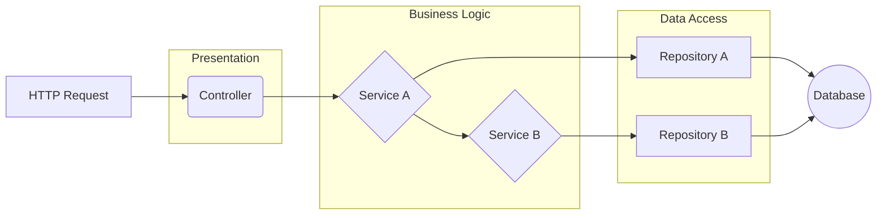

# Services

Services contain your application's business logic, orchestrating data flow and executing use cases.

> **Deep Dive:** See [Services Reference](../../references/base/services.md) for the full API reference.

## The Business Logic Layer

Services sit between controllers and repositories. A controller receives an HTTP request and immediately delegates to a service; the service applies business rules, calls one or more repositories, and returns the result.

Primary responsibilities:

- **Encapsulate business rules** - validation, state-machine transitions, authorization guards, calculations
- **Coordinate repositories** - fetch related data, combine writes, enforce consistency
- **Manage transactions** - begin, commit, or roll back across multiple repository calls
- **Compose services** - inject and call other services to avoid duplicating logic

Controllers stay thin. Repositories stay dumb. Everything in between is a service.

---

## Creating a Service

Extend `BaseService` and call `super({ scope: ClassName.name })` in the constructor:

```typescript
import { BaseService, inject } from '@venizia/ignis';
import { getError, HTTP } from '@venizia/ignis-helpers';
import { UserRepository } from '../repositories';

export class UserService extends BaseService {
  constructor(
    @inject({ key: 'repositories.UserRepository' })
    private userRepository: UserRepository,
  ) {
    super({ scope: UserService.name });
  }

  async getUser(opts: { id: string }) {
    const user = await this.userRepository.findById({ id: opts.id });

    if (!user) {
      throw getError({
        statusCode: HTTP.ResultCodes.RS_4.NotFound,
        message: 'User not found',
      });
    }

    return user;
  }
}
```

**`scope`** is the tag written into every log line produced by this service. Use `ClassName.name` - it's the project convention and avoids string drift when renaming the class.

---

## Registering a Service

Registration is always imperative - call `this.service(ClassName)` inside an application lifecycle method, which handles the binding. There is no class-level decorator for this.

```typescript
import { BaseApplication } from '@venizia/ignis';
import { PostgresDataSource } from './datasources';
import { UserRepository } from './repositories';
import { UserService } from './services';

export class Application extends BaseApplication {
  preConfigure(): void {
    // Register dependencies first, then the service
    this.dataSource(PostgresDataSource);
    this.repository(UserRepository);
    this.service(UserService);   // binds as 'services.UserService'
  }
}
```

`this.service(UserService)` binds the class at the key `services.UserService`. Any other binding that injects `@inject({ key: 'services.UserService' })` resolves an instance from this binding. Service bindings are **transient** by default - each resolution creates a new instance. If your service must be shared (e.g., it holds state), set the scope explicitly: `this.service(UserService).setScope(BindingScopes.SINGLETON)`.

---

## Injecting Dependencies

Use `@inject({ key })` on each constructor parameter. Two equivalent forms:

### Plain string keys (concise)

```typescript
constructor(
  @inject({ key: 'repositories.UserRepository' })
  private userRepository: UserRepository,

  @inject({ key: 'services.NotificationService' })
  private notificationService: NotificationService,
) {
  super({ scope: UserService.name });
}
```

### `BindingKeys.build` (refactor-safe)

```typescript
import { BindingKeys, BindingNamespaces } from '@venizia/ignis';

constructor(
  @inject({
    key: BindingKeys.build({
      namespace: BindingNamespaces.REPOSITORY,  // 'repositories'
      key: UserRepository.name,                 // 'UserRepository'
    }),
  })
  private userRepository: UserRepository,
) {
  super({ scope: UserService.name });
}
```

Both produce the same runtime key (`repositories.UserRepository`). `BindingKeys.build` is preferred in larger codebases because a class rename caught by the TypeScript compiler automatically updates the key.

---

## Logging

`BaseService` inherits `this.logger` from `BaseHelper`. Scope log lines to the current method:

```typescript
async signIn(opts: { username: string }): Promise<string> {
  this.logger.for('signIn').info('SignIn called | username: %s', opts.username);

  const user = await this.userRepository.findByUsername(opts.username);

  if (!user) {
    this.logger.for('signIn').warn('User not found | username: %s', opts.username);
    throw getError({ statusCode: HTTP.ResultCodes.RS_4.Unauthorized, message: 'Invalid credentials' });
  }

  this.logger.for('signIn').info('SignIn successful | userId: %s', user.id);
  return await this.generateToken({ userId: user.id });
}
```

`this.logger.for('signIn')` adds a `[signIn]` tag to each line without creating a new logger object.

---

## Service-to-Service Composition

Services can inject other services the same way they inject repositories. This is the primary mechanism for logic reuse.

```typescript
export class RepositoryTestService extends BaseService {
  constructor(
    @inject({
      key: BindingKeys.build({
        namespace: BindingNamespaces.SERVICE,
        key: CrudTestService.name,
      }),
    })
    private readonly crudTestService: CrudTestService,

    @inject({
      key: BindingKeys.build({
        namespace: BindingNamespaces.SERVICE,
        key: TransactionTestService.name,
      }),
    })
    private readonly transactionTestService: TransactionTestService,
  ) {
    super({ scope: RepositoryTestService.name });
  }

  async runAll(): Promise<void> {
    await this.crudTestService.run();
    await this.transactionTestService.run();
  }
}
```

Register all participating services in `preConfigure()`:

```typescript
this.service(CrudTestService);
this.service(TransactionTestService);
this.service(RepositoryTestService);
```

The DI container resolves the dependency graph automatically - registration order within the same lifecycle phase does not matter.

---

## Worked Example: Authentication Service

The following is representative of `examples/vert/src/services/authentication.service.ts`. It shows the complete pattern: multiple injected dependencies, method-scoped logging, error handling, and calling other services.

```typescript
import { BaseService, IAuthService, inject, JWKSIssuerTokenService, TContext } from '@venizia/ignis';
import { getError, HTTP } from '@venizia/ignis-helpers';
import { compare, genSalt, hash } from 'bcrypt';
import { Env } from 'hono';

export class AuthenticationService
  extends BaseService
  implements IAuthService<Env, TSignInRequest, TSignInResponse, ...>
{
  constructor(
    // Inject a repository by string key
    @inject({ key: 'repositories.UserRepository' })
    private userRepository: UserRepository,

    // Inject a built-in framework service by string key
    @inject({ key: 'services.JWKSIssuerTokenService' })
    private jwksTokenService: JWKSIssuerTokenService,
  ) {
    super({ scope: AuthenticationService.name });
  }

  async signIn(_context: TContext<Env>, opts: TSignInRequest): Promise<TSignInResponse> {
    this.logger.for('signIn').info('SignIn called | identifier: %j', opts.identifier);

    const user = await this.userRepository.findByUsername(opts.identifier.value);

    if (!user) {
      throw getError({
        statusCode: HTTP.ResultCodes.RS_4.Unauthorized,
        message: 'Invalid credentials',
      });
    }

    const isValid = await compare(opts.credential.value, user.password);
    if (!isValid) {
      throw getError({
        statusCode: HTTP.ResultCodes.RS_4.Unauthorized,
        message: 'Invalid credentials',
      });
    }

    const token = await this.jwksTokenService.generate({
      payload: { userId: user.id, email: user.email },
    });

    this.logger.for('signIn').info('SignIn successful | userId: %s', user.id);
    return { token: { value: token, type: 'Bearer' } };
  }

  async signUp(_context: TContext<Env>, opts: TSignUpRequest): Promise<TSignUpResponse> {
    this.logger.for('signUp').info('SignUp called | username: %s', opts.username);

    const existing = await this.userRepository.findByUsername(opts.username);
    if (existing) {
      throw getError({
        statusCode: HTTP.ResultCodes.RS_4.Conflict,
        message: 'Username already exists',
      });
    }

    const salt = await genSalt();
    const hashedPassword = await hash(opts.credential, salt);

    await this.userRepository.create({ data: { username: opts.username, password: hashedPassword } });

    return { message: 'User registered successfully' };
  }
}
```

Registration:

```typescript
// application.ts
preConfigure(): void {
  this.dataSource(PostgresDataSource);
  this.repository(UserRepository);
  this.service(AuthenticationService);  // 'services.AuthenticationService'
}
```

---

## Transaction Orchestration

Use a datasource reference to begin a transaction, then pass the transaction handle through repository `options`:

```typescript
export class CheckoutService extends BaseService {
  constructor(
    @inject({ key: 'datasources.PostgresDataSource' })
    private dataSource: PostgresDataSource,

    @inject({ key: 'repositories.OrderRepository' })
    private orderRepository: OrderRepository,

    @inject({ key: 'repositories.InventoryRepository' })
    private inventoryRepository: InventoryRepository,
  ) {
    super({ scope: CheckoutService.name });
  }

  async placeOrder(opts: { userId: string; items: OrderItem[] }): Promise<Order> {
    const log = this.logger.for('placeOrder');
    const transaction = await this.dataSource.beginTransaction();

    try {
      const { data: order } = await this.orderRepository.create({
        data: { userId: opts.userId },
        options: { transaction },
      });

      for (const item of opts.items) {
        await this.inventoryRepository.updateById({
          id: item.productId,
          data: { stock: item.quantity },
          options: { transaction },
        });
      }

      await transaction.commit();
      log.info('Order placed | orderId: %s', order.id);
      return order;
    } catch (error) {
      await transaction.rollback();
      log.error('Order failed, rolled back | error: %s', error);
      throw error;
    }
  }
}
```

Always call `rollback()` in `catch` - an uncommitted transaction holds a database connection until it is released.

---

## Architecture Diagram



Controllers call services. Services call other services and repositories. Repositories call the database. No layer reaches past its immediate neighbor.

---

## Provider vs Service

**Services** contain business logic and are resolved from the DI container (transient scope by default).

**Providers** implement the Factory pattern - their `value(container)` method produces a configured value or instance on demand (mail transport, cache driver, middleware). Use a Provider when you need to select between multiple implementations at runtime.

See [Providers Reference](/references/base/providers) for the full comparison and examples.

---

## See Also

- **Related Concepts:**
  - [Controllers](/guides/core-concepts/rest-controllers) - Call services to handle requests
  - [Repositories](/guides/core-concepts/persistent/repositories) - Data access layer used by services
  - [Dependency Injection](/guides/core-concepts/dependency-injection) - Injecting dependencies into services

- **References:**
  - [BaseService API](/references/base/services) - Complete API reference
  - [Providers](/references/base/providers) - Factory pattern
  - [Logger Helper](/extensions/helpers/logger/) - Logging in services

- **Best Practices:**
  - [Architectural Patterns](/best-practices/architectural-patterns)
  - [Testing](/guides/tutorials/testing)

- **Tutorials:**
  - [Building a CRUD API](/guides/tutorials/building-a-crud-api)
  - [E-commerce API](/guides/tutorials/ecommerce-api)
