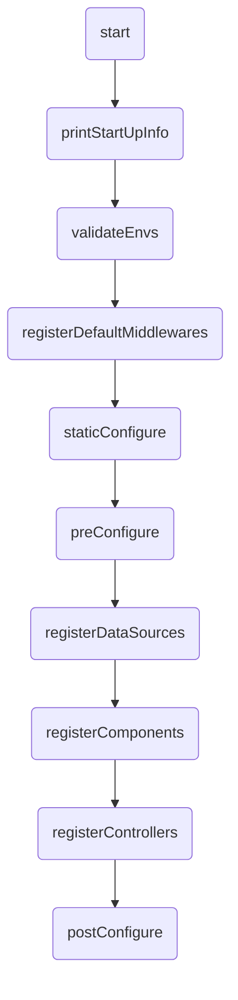

# Deep Dive: Application

Extend `BaseApplication`. The three classes above it exist so a host that cannot open a socket - a browser Worker, a test harness - can still serve the same controllers.

**Files:**
- `packages/kernel/src/base/applications/abstract.ts`
- `packages/kernel/src/base/applications/rest.ts`
- `packages/core-server/src/base/applications/server.ts`
- `packages/core-server/src/base/applications/base.ts`
- `packages/kernel/src/base/applications/types.ts`

## Quick Reference

Each layer adds one capability. The first two ship from `@venizia/ignis-kernel` and touch no node builtin; the last two ship from `@venizia/ignis`.

| Class | Adds | Key Methods |
|-------|------|-------------|
| **AbstractApplication** | config, lifecycle hooks, the DI container | `init()`, `registerPostStartHook()`, `registerPostStopHook()` |
| **RestApplication** | the two `OpenAPIHono` routers | `getServer()`, `getRootRouter()`, `inspectRoutes()` |
| **ServerApplication** | the socket | `start()`, `stop()`, `getServerHost()`, `getServerPort()`, `getServerAddress()` |
| **BaseApplication** | resource registration, secrets, boot | `component()`, `controller()`, `service()`, `repository()`, `dataSource()`, `boot()`, `validateEnvs()` |

> [!NOTE]
> Every symbol still resolves from `@venizia/ignis` - `packages/core-server` re-exports the kernel wholesale. The split changed no import path.

## `AbstractApplication`

Config, lifecycle and the container. No router, no server. Extends `Container`.

```typescript
abstract class AbstractApplication extends Container
```

### Constructor

```typescript
constructor(opts: { scope: string; config: IApplicationConfigs })
```

The constructor:
1. Merges the provided config with defaults, taking host and port from `getEnvServerHost()` / `getEnvServerPort()` and falling back to `localhost:3000`
2. Resolves `asyncContext.enable` from `getDefaultAsyncContextEnabled()`
3. Sets `projectRoot` from `getProjectRoot()`

Port `0` survives that merge on purpose - it asks the operating system for an ephemeral port.

The constructor binds nothing. `registerCoreBindings()` runs from `init()`, and `init()` is not called for you - see [Lifecycle](#lifecycle) below.

### The four constructor hooks

`getEnvServerHost()`, `getEnvServerPort()`, `getDefaultAsyncContextEnabled()` and `getProjectRoot()` return `undefined`, `undefined`, `false` and `''` here. `ServerApplication` overrides all four to restore server behaviour - `process.env.HOST`, `process.env.PORT`, `true`, and `process.cwd()`. The kernel layers read no `process`, because a browser Worker has none.

> [!WARNING]
> All four run inside this constructor, before any subclass field is assigned. An override must return a literal or read module-level state only. Reading `this.something` from one yields `undefined`, silently. `getProjectRoot()` is the one applications most often override - keep it free of instance state.

## `RestApplication`

Adds the routers, and nothing that opens a socket.

```typescript
abstract class RestApplication<
  AppEnv extends Env = Env,
  AppSchema extends Schema = {},
  BasePath extends string = '/',
> extends AbstractApplication
```

It builds the two `OpenAPIHono` instances - the main server and the `rootRouter` - and binds them as `APPLICATION_SERVER` and `APPLICATION_ROOT_ROUTER`.

## `ServerApplication`

Adds `start()`, `stop()` and the runtime detection that picks `Bun.serve` or `@hono/node-server`.

```typescript
abstract class ServerApplication<
  AppEnv extends Env = Env,
  AppSchema extends Schema = {},
  BasePath extends string = '/',
> extends RestApplication<AppEnv, AppSchema, BasePath>
  implements IApplication<AppEnv, AppSchema, BasePath>
```
5. Auto-detects the runtime (Bun or Node.js)

### Key Features

| Feature | Description |
| :--- | :--- |
| **Hono Instance** | Creates and holds two `OpenAPIHono` instances - a main server and a root router |
| **Runtime Detection** | Auto-detects Bun or Node.js via `RuntimeModules.detect()` and uses the appropriate server implementation |
| **Core Bindings** | Registers `CoreBindings.APPLICATION_INSTANCE`, `CoreBindings.APPLICATION_SERVER`, and `CoreBindings.APPLICATION_ROOT_ROUTER` |
| **Lifecycle Management** | Defines abstract methods (`preConfigure`, `postConfigure`, `setupMiddlewares`, `staticConfigure`, `initialize`, `getAppInfo`) |
| **Environment Validation** | Validates all registered `applicationEnvironment` keys are non-empty (unless `ALLOW_EMPTY_ENV_VALUE` is set) |
| **Post-Start Hooks** | Supports registering hooks that execute after the server starts |

### Abstract Methods

These must be implemented by subclasses:

| Method | Signature | Purpose |
| :--- | :--- | :--- |
| `getAppInfo()` | `() => ValueOrPromise<IApplicationInfo>` | Return application metadata (name, version, description) |
| `preConfigure()` | `() => ValueOrPromise<void>` | Register resources before framework auto-configuration |
| `postConfigure()` | `() => ValueOrPromise<void>` | Logic after all resources are configured |
| `staticConfigure()` | `() => void` | Pre-DI static setup (synchronous) |
| `setupMiddlewares(opts?)` | `(opts?: { middlewares?: Record<string \| symbol, any> }) => ValueOrPromise<void>` | Register Hono middlewares |
| `initialize()` | `() => Promise<void>` | Full initialization sequence |

### Public Methods

| Method | Return Type | Description |
| :--- | :--- | :--- |
| `getProjectConfigs()` | `IApplicationConfigs` | Returns the merged application config |
| `getProjectRoot()` | `string` | Returns `process.cwd()` and binds it to `CoreBindings.APPLICATION_PROJECT_ROOT` |
| `getRootRouter()` | `OpenAPIHono` | Returns the root router instance |
| `getServerHost()` | `string` | Returns the configured host |
| `getServerPort()` | `number` | Returns the configured port |
| `getServerAddress()` | `string` | Returns `host:port` string |
| `getServer()` | `OpenAPIHono` | Returns the main Hono server instance |
| `getServerInstance()` | `TBunServerInstance \| TNodeServerInstance \| undefined` | Returns the underlying runtime server instance |
| `registerPostStartHook(opts)` | `void` | Register a hook to run after server start |
| `init()` | `void` | Calls `registerCoreBindings()` |
| `start()` | `Promise<void>` | Runs `initialize()`, `setupMiddlewares()`, mounts root router, starts the server, then runs post-start hooks |
| `stop()` | `void` | Stops the server (calls `.stop()` for Bun, `.close()` for Node.js) |

### `start()` Method Flow

```mermaid
graph TD
    A(start) --> B(initialize);
    B --> C(setupMiddlewares);
    C --> D(Mount rootRouter on base path);
    D --> E{Runtime?};
    E -->|Bun| F(Bun.serve);
    E -->|Node.js| G(@hono/node-server serve);
    F --> H(executePostStartHooks);
    G --> H;
```

### Server Types

```typescript
// Bun server instance
type TBunServerInstance = ReturnType<typeof Bun.serve>;

// Node.js server instance (from @hono/node-server)
type TNodeServerInstance = any;
```

The server is stored as a discriminated union based on runtime:

```typescript
protected server:
  | { hono: OpenAPIHono; runtime: 'bun'; instance?: TBunServerInstance }
  | { hono: OpenAPIHono; runtime: 'node'; instance?: TNodeServerInstance };
```

## `BaseApplication`

Extends `ServerApplication` with concrete lifecycle implementations, resource registration, secrets hydration and boot support. Implements `IRestApplication` and `IBootableApplication`. This is the class your application extends.

```typescript
abstract class BaseApplication
  extends ServerApplication
  implements IRestApplication, IBootableApplication
```

### Resource Registration Methods

`BaseApplication` provides a set of convenient methods for registering your application's building blocks. These methods bind the provided classes to the DI container with conventional keys.

| Method | DI Binding Key Convention | Scope |
| :--- | :--- | :--- |
| `component(ctor, opts?)` | `components.{Name}` | Singleton |
| `controller(ctor, opts?)` | `controllers.{Name}` | Transient |
| `service(ctor, opts?)` | `services.{Name}` | Transient |
| `repository(ctor, opts?)` | `repositories.{Name}` | Transient |
| `dataSource(ctor, opts?)` | `datasources.{Name}` | Singleton |
| `booter(ctor, opts?)` | `booters.{Name}` | Tagged with `'booter'` |

> [!TIP]
> All registration methods accept an optional `opts.binding` parameter to override the default namespace-based key:
> ```typescript
> this.controller(UserController, {
>   binding: { namespace: 'controllers', key: 'CustomUserController' },
> });
> ```

### Method Signatures

```typescript
component<Base extends BaseComponent, Args extends AnyObject = any>(
  ctor: TClass<Base>,
  opts?: TMixinOpts<Args>,
): Binding<Base>

controller<Base, Args extends AnyObject = any>(
  ctor: TClass<Base>,
  opts?: TMixinOpts<Args>,
): Binding<Base>

service<Base extends IService, Args extends AnyObject = any>(
  ctor: TClass<Base>,
  opts?: TMixinOpts<Args>,
): Binding<Base>

repository<Base extends IRepository, Args extends AnyObject = any>(
  ctor: TClass<Base>,
  opts?: TMixinOpts<Args>,
): Binding<Base>

dataSource<Base extends IDataSource, Args extends AnyObject = any>(
  ctor: TClass<Base>,
  opts?: TMixinOpts<Args>,
): Binding<Base>

booter<Base extends IBooter, Args extends AnyObject = any>(
  ctor: TClass<Base>,
  opts?: TMixinOpts<Args>,
): Binding<Base>
```

Where `TMixinOpts` is:

```typescript
type TMixinOpts<Args extends AnyObject = any> = {
  binding?: { namespace: string; key: string };
  args?: Args;
  allowOverride?: boolean;
};
```

`binding` is optional - omit it and the method derives `{ namespace, key }` from the class name.
`allowOverride` defaults to `true`, matching `bind()`'s own silent-overwrite behavior: register the
same key twice and the second registration wins, no warning. Set it to `false` to make a same-key
re-registration throw instead of silently shadowing the first one.

```typescript
this.controller(UserController, { allowOverride: false });
```

### Static File Serving

```typescript
static(opts: { restPath?: string; folderPath: string }): this
```

Serves static files using the appropriate runtime handler (`hono/bun` for Bun, `@hono/node-server/serve-static` for Node.js). The `restPath` defaults to `'*'`.

```typescript
this.static({ restPath: '/public/*', folderPath: './public' });
```

### Boot Support

```typescript
boot(): Promise<IBootReport>
```

Registers default booters (`DatasourceBooter`, `RepositoryBooter`, `ServiceBooter`, `ControllerBooter`) and runs the bootstrapper. The boot options come from `this.configs.bootOptions`.

```typescript
async registerBooters(): Promise<void>
```

Registers the `Bootstrapper` singleton and all four default booters with the `'booter'` tag.

### registerDynamicBindings

Protected method for handling late-registration and circular dependency patterns. Iterates bindings in a namespace, configuring each instance and re-fetching to pick up dynamically added bindings.

```typescript
protected async registerDynamicBindings<T extends IConfigurable>(opts: {
  namespace: TBindingNamespace;
  onBeforeConfigure?: (opts: { binding: Binding<T> }) => Promise<void>;
  onAfterConfigure?: (opts: { binding: Binding<T>; instance: T }) => Promise<void>;
}): Promise<void>
```

| Parameter | Type | Description |
|-----------|------|-------------|
| `namespace` | `TBindingNamespace` | Binding namespace to scan (e.g., `'components'`, `'datasources'`) |
| `onBeforeConfigure` | callback | Called before each binding's `configure()` |
| `onAfterConfigure` | callback | Called after `configure()` |

The method tracks already-configured bindings to prevent duplicates and re-fetches after each configuration to handle bindings registered during the configure phase.

### `initialize()` Method Flow

Startup sequence executed by the `initialize()` method:



| Hook | When to Use | Notes |
|------|-------------|-------|
| **`staticConfigure()`** | Pre-DI static setup (static files, etc.) | Synchronous, called before `preConfigure` |
| **`preConfigure()`** | Register all resources (datasources, services, controllers) | Nothing instantiated yet - order doesn't matter |
| **`register...()`** | Framework iterates bindings and instantiates classes | DataSources initialized first (other layers depend on them) |
| **`postConfigure()`** | Logic after all resources configured | Do not register new datasources/components/controllers here - they won't auto-configure |

### registerDefaultMiddlewares

Automatically registers these default middlewares during `initialize()`:

1. **Error handler** (`AppErrorMiddleware`) - with optional `rootKey` from `configs.error.rootKey`
2. **Async context storage** (`contextStorage`) - enabled by default via `configs.asyncContext.enable`
3. **Not-found handler** (`notFoundHandler`)
4. **RequestTrackerComponent** - assigns `x-request-id` to every request, includes request body parsing
5. **Emoji favicon** - defaults to the flame emoji, configurable via `configs.favicon`

### registerControllers and Transport Support

The `registerControllers()` method supports multiple transport protocols via the `transports` config:

```typescript
// In your application config
{
  transports: ['rest'],        // Default: REST only
  transports: ['rest', 'grpc'], // Enable both REST and gRPC
  transports: ['grpc'],        // gRPC only
}
```

For each transport in the array, the corresponding component (`RestComponent` or `GrpcComponent`) is instantiated and configured. If gRPC controllers are discovered but the `'grpc'` transport is not enabled, a warning is logged.

### registerComponents

When registering components, after each component's `configure()` completes, the framework also re-registers any datasources that the component may have added. This handles the pattern where components bring their own datasources.

## `IApplicationConfigs`

```typescript
interface IApplicationConfigs {
  host?: string;                          // Server host (default: process.env.HOST || 'localhost')
  port?: number;                          // Server port (default: process.env.PORT || 3000)
  path: { base: string; isStrict: boolean }; // Base path config (required)
  requestId?: { isStrict: boolean };      // Request ID validation
  favicon?: string;                       // Favicon emoji (default: '🔥')
  error?: { rootKey: string };            // Error response root key
  asyncContext?: { enable: boolean };     // Hono async context storage (default: true)
  bootOptions?: IBootOptions;             // Boot system configuration
  debug?: { shouldShowRoutes?: boolean }; // Show registered routes on startup
  transports?: TControllerTransport[];    // Controller transports: 'rest' | 'grpc' (default: ['rest'])
  [key: string]: any;                     // Extensible (e.g. strictPath?: boolean - Hono strict path matching, default: true)
}
```

### `IBootOptions`

```typescript
interface IBootOptions {
  controllers?: IArtifactOptions;
  services?: IArtifactOptions;
  repositories?: IArtifactOptions;
  datasources?: IArtifactOptions;
  [artifactType: string]: IArtifactOptions | undefined;
}

interface IArtifactOptions {
  dirs?: string[];
  extensions?: string[];
  isNested?: boolean;
  glob?: string;
}
```

### `TControllerTransport`

```typescript
class ControllerTransports {
  static readonly REST = 'rest';
  static readonly GRPC = 'grpc';
}

type TControllerTransport = 'rest' | 'grpc';
```

## `IApplicationInfo`

```typescript
interface IApplicationInfo {
  name: string;
  version: string;
  description: string;
  author?: { name: string; email: string; url?: string };
  [extra: string | symbol]: any;
}
```

## `CoreBindings`

Core binding keys used for fundamental application components:

| Key | Value | Description |
| :--- | :--- | :--- |
| `APPLICATION_INSTANCE` | `'@app/instance'` | The application instance itself |
| `APPLICATION_SERVER` | `'@app/server'` | The server object (hono + runtime + instance) |
| `APPLICATION_CONFIG` | `'@app/config'` | Application configuration |
| `APPLICATION_PROJECT_ROOT` | `'@app/project_root'` | Project root directory (`process.cwd()`) |
| `APPLICATION_ROOT_ROUTER` | `'@app/router/root'` | The root OpenAPIHono router |
| `APPLICATION_ENVIRONMENTS` | `'@app/environments'` | Application environment variables |
| `APPLICATION_MIDDLEWARE_OPTIONS` | `'@app/middleware_options'` | Middleware configuration options |

## `BindingNamespaces`

Standard namespaces for organizing DI bindings:

| Namespace | Value | Used By |
| :--- | :--- | :--- |
| `COMPONENT` | `'components'` | `component()` |
| `DATASOURCE` | `'datasources'` | `dataSource()` |
| `REPOSITORY` | `'repositories'` | `repository()` |
| `MODEL` | `'models'` | Model bindings |
| `SERVICE` | `'services'` | `service()` |
| `MIDDLEWARE` | `'middlewares'` | Middleware bindings |
| `PROVIDER` | `'providers'` | Provider bindings |
| `CONTROLLER` | `'controllers'` | `controller()` |
| `BOOTERS` | `'booters'` | `booter()` |

## Mixin Interfaces

`BaseApplication` implements several mixin interfaces that define its capabilities:

| Interface | Methods | Description |
| :--- | :--- | :--- |
| `IComponentMixin` | `component()`, `registerComponents()` | Component registration and lifecycle |
| `IControllerMixin` | `controller()`, `registerControllers()` | Controller registration and route mounting |
| `IRepositoryMixin` | `dataSource()`, `repository()` | DataSource and repository registration |
| `IServiceMixin` | `service()` | Service registration |
| `IStaticServeMixin` | `static()` | Static file serving |

> [!NOTE]
> There is also an `IServerConfigMixin` interface defined in the mixins types that declares `staticConfigure()`, `preConfigure()`, `postConfigure()`, and `getApplicationVersion()`, though `BaseApplication` inherits the first three from `AbstractApplication`.

## Middleware Configuration Types

These types are used when configuring middlewares via `setupMiddlewares()`:

```typescript
interface IMiddlewareConfigs {
  requestId?: IRequestIdOptions;
  compress?: ICompressOptions;
  cors?: ICORSOptions;
  csrf?: ICSRFOptions;
  bodyLimit?: IBodyLimitOptions;
  ipRestriction?: IBaseMiddlewareOptions & IIPRestrictionRules;
  [extra: string | symbol]: any;
}

interface IBaseMiddlewareOptions {
  enable: boolean;
  path?: string;
  [extra: string | symbol]: any;
}
```

## See Also

- **Related Concepts:**
  - [Application Guide](/guides/core-concepts/application/) - Creating your first application
  - [Bootstrapping](/guides/core-concepts/application/bootstrapping) - Auto-discovery of artifacts
  - [Dependency Injection](/guides/core-concepts/dependency-injection) - How DI works in IGNIS
  - [REST Controllers](/guides/core-concepts/rest-controllers) | [gRPC Controllers](/guides/core-concepts/grpc-controllers) - Registering HTTP/gRPC endpoints

- **References:**
  - [Bootstrapping API](/references/base/bootstrapping) - Boot system reference
  - [Components API](/references/base/components) - Component system
  - [gRPC Controllers](/references/base/grpc-controllers) - gRPC transport reference
  - [Environment Variables](/references/configuration/environment-variables) - Configuration management
  - [Middlewares](/references/base/middlewares) - Request interceptors

- **Tutorials:**
  - [5-Minute Quickstart](/guides/get-started/5-minute-quickstart) - Create your first app
  - [Building a CRUD API](/guides/tutorials/building-a-crud-api) - Complete application example

- **Best Practices:**
  - [Architectural Patterns](/best-practices/architectural-patterns) - Application structure patterns
