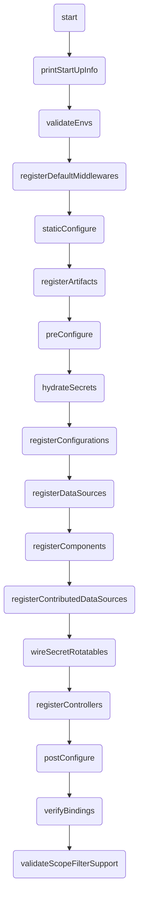

# Deep Dive: Application

Extend `BaseApplication`. The three classes above it exist so a host that cannot open a socket - a browser Worker, a test harness - can still serve the same controllers.

**Files:**
- `packages/kernel/src/base/applications/abstract.ts`
- `packages/kernel/src/base/applications/rest.ts`
- `packages/core-server/src/base/applications/server.ts`
- `packages/core-server/src/base/applications/base.ts`
- `packages/kernel/src/base/applications/common/types/`

## Quick Reference

Each layer adds one capability. The first two ship from `@venizia/ignis-kernel` and touch no node builtin; the last two ship from `@venizia/ignis`.

| Class | Adds | Key Methods |
|-------|------|-------------|
| **AbstractApplication** | config, lifecycle hooks, the DI container | `init()`, `registerPostStartHook()`, `registerPostStopHook()` |
| **RestApplication** | the two `OpenAPIHono` routers and the whole registration surface | `getServer()`, `getRootRouter()`, `configuration()`, `component()`, `controller()`, `service()`, `repository()`, `dataSource()`, `registerArtifacts()` |
| **ServerApplication** | the socket | `start()`, `stop()`, `getServerHost()`, `getServerPort()`, `getServerAddress()` |
| **BaseApplication** | secrets, static serving, the gRPC transport, the server-only boot steps | `static()`, `validateEnvs()`, `registerSecrets()`, `hydrateSecrets()`, `wireSecretRotatables()` |

Registration is a kernel capability, not a server one. `component()`, `controller()`, `service()`, `repository()`, `dataSource()`, `configuration()` and `registerArtifacts()` are all declared on `RestApplication`, so a host with no socket registers artifacts the same way a server does.

> [!NOTE]
> Every symbol still resolves from `@venizia/ignis` - `packages/core-server` re-exports the kernel wholesale. The split changed no import path.

## `AbstractApplication`

Config, lifecycle and the container. No router, no server. Extends `Container`.

```typescript
abstract class AbstractApplication extends Container
```

### Constructor

```typescript
constructor(opts: { scope: string; config: IApplicationConfigs })
```

The constructor:
1. Merges the provided config with defaults
2. Resolves `asyncContext.enable` from `getDefaultAsyncContextEnabled()`
3. Sets `projectRoot` from `getProjectRoot()`

It resolves no host and no port. Both mean nothing to a host that binds no socket, so `ServerApplication` resolves them in its own constructor instead.

The constructor binds nothing. `registerCoreBindings()` runs from `init()`, and `init()` is not called for you - see [Lifecycle](#initialize-method-flow) below.

### The two constructor hooks

`getDefaultAsyncContextEnabled()` and `getProjectRoot()` return `false` and `''` here. `ServerApplication` overrides both to restore server behaviour - `true`, and `configs.projectRoot ?? process.cwd()`. The kernel layers read no `process`, because a browser Worker has none.

`getEnvServerHost()` and `getEnvServerPort()` are gone. Address resolution now lives in `ServerApplication`'s constructor.

> [!WARNING]
> Both hooks run inside this constructor, before any subclass field is assigned. An override must return a literal or read module-level state only. Reading `this.something` from one yields `undefined`, silently. `getProjectRoot()` is the one applications most often override - keep it free of instance state.

## `RestApplication`

Adds the routers, and nothing that opens a socket.

```typescript
abstract class RestApplication<
  AppEnv extends Env = Env,
  AppSchema extends Schema = {},
  BasePath extends string = '/',
> extends AbstractApplication
```

It builds the two `OpenAPIHono` instances - the main server and the `rootRouter` - and binds them as `APPLICATION_SERVER` and `APPLICATION_ROOT_ROUTER`.

## `ServerApplication`

Adds `start()`, `stop()` and the runtime detection that picks `Bun.serve` or `@hono/node-server`.

```typescript
abstract class ServerApplication<
  AppEnv extends Env = Env,
  AppSchema extends Schema = {},
  BasePath extends string = '/',
> extends RestApplication<AppEnv, AppSchema, BasePath>
  implements IServerApplication<AppEnv, AppSchema, BasePath>
```

Its constructor resolves the address, because it is the only layer that binds one. `host` takes the first non-empty of `opts.config.host`, `process.env.HOST`, `process.env.APP_ENV_SERVER_HOST`, then falls back to `localhost`. `port` takes the first *usable* value of `opts.config.port`, `process.env.PORT`, `process.env.APP_ENV_SERVER_PORT`, then falls back to `3000`.

Port `0` survives that scan on purpose - it asks the operating system for an ephemeral port. A candidate is skipped only when it is not an integer in the range `0` to `65535`, so an unusable `PORT` no longer shadows a usable `APP_ENV_SERVER_PORT`.

### Key Features

| Feature | Description |
| :--- | :--- |
| **Hono Instance** | Creates and holds two `OpenAPIHono` instances - a main server and a root router |
| **Runtime Detection** | Auto-detects Bun or Node.js via `RuntimeModules.detect()` and uses the appropriate server implementation |
| **Core Bindings** | Registers `CoreBindings.APPLICATION_INSTANCE`, `CoreBindings.APPLICATION_SERVER`, and `CoreBindings.APPLICATION_ROOT_ROUTER` |
| **Lifecycle Management** | Defines abstract methods (`preConfigure`, `postConfigure`, `setupMiddlewares`, `staticConfigure`, `initialize`, `getAppInfo`) |
| **Environment Validation** | Off by default. Set `ALLOW_EMPTY_ENV_VALUE=false` (or `0`) to require every registered `applicationEnvironment` key to be non-empty |
| **Post-Start Hooks** | Supports registering hooks that execute after the server starts |

### Abstract Methods

These must be implemented by subclasses:

| Method | Signature | Purpose |
| :--- | :--- | :--- |
| `getAppInfo()` | `() => ValueOrPromise<IApplicationInfo>` | Return application metadata (name, version, description) |
| `preConfigure()` | `() => ValueOrPromise<void>` | Register resources before framework auto-configuration |
| `postConfigure()` | `() => ValueOrPromise<void>` | Logic after all resources are configured |
| `staticConfigure()` | `() => void` | Pre-DI static setup (synchronous) |
| `setupMiddlewares(opts?)` | `(opts?: { middlewares?: Record<string \| symbol, any> }) => ValueOrPromise<void>` | Register Hono middlewares |
| `initialize()` | `() => Promise<void>` | Full initialization sequence |

### Public Methods

| Method | Return Type | Description |
| :--- | :--- | :--- |
| `getProjectConfigs()` | `IApplicationConfigs` | Returns the merged application config |
| `getProjectRoot()` | `string` | Returns `configs.projectRoot ?? process.cwd()`, binds it to `CoreBindings.APPLICATION_PROJECT_ROOT` and hands it to `ModuleUtility` so optional peers resolve under it |
| `getRootRouter()` | `OpenAPIHono` | Returns the root router instance |
| `getServerHost()` | `string` | Returns the configured host |
| `getServerPort()` | `number` | Returns the configured port |
| `getServerAddress()` | `string` | Returns `host:port` string |
| `getServer()` | `OpenAPIHono` | Returns the main Hono server instance |
| `getServerInstance()` | `TBunServerInstance \| TNodeServerInstance \| undefined` | Returns the underlying runtime server instance |
| `registerPostStartHook(opts)` | `void` | Register a hook to run after server start |
| `init()` | `void` | Calls `registerCoreBindings()` |
| `start()` | `Promise<void>` | Runs `initialize()`, `setupMiddlewares()`, mounts root router, starts the server, then runs post-start hooks |
| `stop()` | `Promise<void>` | Runs the post-stop hooks, stops the server (`.stop()` on Bun, `.close()` on Node.js), then calls `close()` on every datasource the boot configured - even when the server fails to close. Each `close()` gets at most `dataSourceCloseTimeoutMs` (default `10_000`, `0` waits without limit); past it, the datasource is logged as timed out and skipped - a client that was never released used to hold it forever. A failed `close()` is logged and does not stop the others. Safe to call twice |

### `start()` Method Flow

```mermaid
graph TD
    A(start) --> B(initialize);
    B --> C(setupMiddlewares);
    C --> D(Mount rootRouter on base path);
    D --> E{Runtime?};
    E -->|Bun| F(Bun.serve);
    E -->|Node.js| G(@hono/node-server serve);
    F --> H(executePostStartHooks);
    G --> H;
```

### Server Types

```typescript
// Bun server instance
type TBunServerInstance = ReturnType<typeof Bun.serve>;

// Node.js server instance (from @hono/node-server)
type TNodeServerInstance = any;
```

The router and the socket are held apart. `RestApplication` carries the router alone:

```typescript
protected server: { hono: OpenAPIHono<AppEnv, AppSchema, BasePath> };
```

`ServerApplication` adds the runtime and the socket as two separate fields of its own:

```typescript
protected runtime = RuntimeModules.detect();
protected serverInstance?: TBunServerInstance | TNodeServerInstance;
```

There is no discriminated union any more, so `this.server.runtime` does not typecheck. Read `this.runtime` and `this.serverInstance` instead. A browser Worker extends `RestApplication` and inherits neither field, which is the point: `RuntimeModules.detect()` answers `'node'` inside a Worker.

## `BaseApplication`

Extends `ServerApplication` with concrete lifecycle implementations, resource registration and secrets hydration. Implements `IRestApplication`. This is the class your application extends.

```typescript
abstract class BaseApplication
  extends ServerApplication
  implements IRestApplication
```

### Resource Registration Methods

The seven methods below bind classes to the DI container with conventional keys. They are declared on `RestApplication`, so every host has them. Each of the six single-class methods reads the class's decorator defaults (`binding`, `scope`, `allowOverride`, set through `@controller`, `@service`, ...); an explicit `opts` at the call site wins over them. `registerArtifacts` is what the `registerArtifacts` boot step calls with `configs.artifacts` - see [Artifact Registration](/references/base/bootstrapping).

| Method | DI Binding Key Convention | Scope |
| :--- | :--- | :--- |
| `configuration(ctor, opts?)` | `configurations.{Name}` | Singleton |
| `component(ctor, opts?)` | `components.{Name}` | Singleton |
| `controller(ctor, opts?)` | `controllers.{Name}` | Singleton |
| `service(ctor, opts?)` | `services.{Name}` | Transient |
| `repository(ctor, opts?)` | `repositories.{Name}` | Transient |
| `dataSource(ctor, opts?)` | `datasources.{Name}` | Singleton |
| `registerArtifacts(index)` | one call per listed class, in dependency order | per class |

> [!TIP]
> All registration methods accept an optional `opts.binding` parameter to override the default namespace-based key:
> ```typescript
> this.controller(UserController, {
>   binding: { namespace: 'controllers', key: 'CustomUserController' },
> });
> ```

### Method Signatures

```typescript
configuration<Base extends BaseConfiguration<Options>, Options extends object = {}>(
  target: TClass<Base>,
  opts?: TMixinOpts<Options>,
): Binding<Base>
component<Base extends BaseComponent<Options>, Options extends object = {}>(
  target: TClass<Base>,
  opts?: TMixinOpts<Options>,
): Binding<Base>
controller<Base>(target: TClass<Base>, opts?: TMixinOpts): Binding<Base>
service<Base extends IService>(target: TClass<Base>, opts?: TMixinOpts): Binding<Base>
repository<Base extends IRepository>(target: TClass<Base>, opts?: TMixinOpts): Binding<Base>
dataSource<Base extends IDataSource<Options>, Options extends object = {}>(
  target: TClass<Base>,
  opts?: TMixinOpts<Options>,
): Binding<Base>
registerArtifacts(index: TArtifactIndexInput): Promise<void>
protected registerConfiguredArtifacts(): Promise<void>
```

Where `TMixinOpts` is:

```typescript
type TMixinOpts<Options extends object = {}> = {
  binding?: { namespace: string; key: string };
  allowOverride?: boolean;
  options?: Options;
};
```

The options describe the registration, never the artifact: what a class needs goes on the class.

| Method | Binding scope | Why |
|---|---|---|
| `configuration`, `component`, `dataSource`, `controller` | `SINGLETON` | One instance per application - a controller is mounted once, a datasource holds one pool |
| `service`, `repository` | `TRANSIENT` | A new instance per resolution, so each injection point owns its own |

`binding` is optional - omit it and the method derives `{ namespace, key }` from the class name.
`allowOverride` defaults to `true`, matching `bind()`'s own silent-overwrite behavior: register the
same key twice and the second registration wins, no warning. Set it to `false` to make a same-key
re-registration throw instead of silently shadowing the first one.
[`bootChecks.binding.allowOverride: false`](/references/base/bootstrapping#bootchecks) flips that
default for every registration in the application; `allowOverride: true` on a registration opts it out
again.

```typescript
this.controller(UserController, { allowOverride: false });
```

### Passing options to `configure()`

`opts.options` is the one channel from a registration call into the artifact's own `configure()`. The application stores the value against the binding key, and the boot sweep for that namespace replays it:

```typescript
this.component(MailerComponent, { options: { transport: 'smtp' } });
```

`registerDynamicBindings()` resolves the binding, then calls `instance.configure({ transport: 'smtp' })`. Register the same class without `options` and `configure()` is called with `undefined`.

What the artifact does with them is its own business:

| Base class | What it does with `options` |
| :--- | :--- |
| `BaseConfiguration` | Forwards them to its `setup(opts?)` hook |
| `BaseComponent` | Logs them, then calls `binding()` with no arguments - override `configure()` to use them |
| `AbstractDataSource` | Declares `configure()` abstract, so the implementation decides |

> [!WARNING]
> A class that never reads the parameter never sees these options, and nothing warns you. Type the class as `BaseComponent<MyOptions>` or `BaseConfiguration<MyOptions>` so at least the shape is checked at the call site.

### Static File Serving

```typescript
static(opts: { restPath?: string; folderPath: string }): this
```

Serves static files using the appropriate runtime handler (`hono/bun` for Bun, `@hono/node-server/serve-static` for Node.js). The `restPath` defaults to `'*'`.

```typescript
this.static({ restPath: '/public/*', folderPath: './public' });
```

### Artifact registration

```typescript
async registerArtifacts(index: TArtifactIndexInput): Promise<void>
protected async registerConfiguredArtifacts(): Promise<void>
```

`registerArtifacts` registers one index or a composition of indexes: configurations (plus their `@provide` keys), then datasources, components (plus their `@provide` keys), repositories, services, controllers; a class's `when` may skip it and `order` sorts within a kind. `registerConfiguredArtifacts` is the boot step that passes `configs.artifacts` to it. Full behavior: [Artifact Registration](/references/base/bootstrapping#registerartifacts).

### registerDynamicBindings

Protected. Scans one binding namespace, resolves each binding and calls its `configure()`, then re-scans once the whole batch is drained and repeats until a pass finds nothing new. An artifact that a `configure()` registers is therefore picked up in the same call.

```typescript
protected async registerDynamicBindings<T extends IConfigurable>(opts: {
  namespace: TBindingNamespace;
  onBeforeConfigure?: (opts: { binding: Binding<T> }) => Promise<void>;
  onAfterConfigure?: (opts: { binding: Binding<T>; instance: T }) => Promise<void>;
}): Promise<void>
```

| Parameter | Type | Description |
|-----------|------|-------------|
| `namespace` | `TBindingNamespace` | Binding namespace to scan (e.g., `'components'`, `'datasources'`) |
| `onBeforeConfigure` | callback | Runs before each binding's `configure()` |
| `onAfterConfigure` | callback | Runs after `configure()`, once the binding is already marked configured |

Configured keys are remembered per namespace, so a second call over the same namespace touches only what the first one missed.

### `initialize()` Method Flow

Startup sequence executed by the `initialize()` method:



Sixteen steps. `getBootSequence()` returns them as data (`ServerBootSteps` names each one), `runBootSequence()` logs `Boot step n/16 <name>` per step, and a subclass inserts its own step with `BootSequence.insertAfter({ steps, target, step })`.

| Hook | When to Use | Notes |
|------|-------------|-------|
| **`staticConfigure()`** | Pre-DI static setup (static files, etc.) | Synchronous, called before `registerArtifacts` |
| **`registerArtifacts`** | Framework registers every class in `configs.artifacts` | Decorator `when` conditions run here, before `preConfigure` |
| **`preConfigure()`** | Register what the index cannot express - registry calls, hand-made bindings | Nothing instantiated yet - order doesn't matter |
| **`register...()`** | Framework iterates bindings and instantiates classes | Configurations first, then datasources, then the layers that depend on them |
| **`postConfigure()`** | Logic after all resources configured | Do not register new datasources/components/controllers here - they won't auto-configure |

### registerDefaultMiddlewares

Automatically registers these default middlewares during `initialize()`:

`RestApplication` installs the three every host needs, in this order:

1. **Request id** (`requestId`) - the generator is `RequestIdGenerator`, not hono's default, which calls `crypto.randomUUID` unguarded
2. **Error handler** (`AppErrorMiddleware`) - with optional `rootKey` from `configs.error.rootKey`
3. **Not-found handler** (`notFoundHandler`)

`BaseApplication` then adds what only a listening server has:

4. **Request context resolver** - always set, so `tryGetContext()` answers "no context" rather than throwing
5. **Async context storage** (`contextStorage`) - only when `configs.asyncContext.enable` is true
6. **RequestTrackerComponent** - request-body parsing and the access log; it reads the request id installed at step 1 and registers none of its own
7. **Emoji favicon** - defaults to the flame emoji, configurable via `configs.favicon`

### registerControllers and Transport Support

The `registerControllers()` method supports multiple transport protocols via the `transports` config:

```typescript
// In your application config
{
  transports: ['rest'],        // Default: REST only
  transports: ['rest', 'grpc'], // Enable both REST and gRPC
  transports: ['grpc'],        // gRPC only
}
```

The method is split across two layers rather than switching on the transport in one place. `RestApplication.registerControllers()` handles REST only: it returns early unless `transports` includes `'rest'`, otherwise it builds a `RestComponent` and configures it. `BaseApplication` overrides the method, calls `super()`, then loops the remaining transports and builds a `GrpcComponent` for `'grpc'`. Any other value throws.

If gRPC controllers are discovered but the `'grpc'` transport is not enabled, each one is logged as an error and left unmounted.

### registerComponents

A component may register more components while it is configured, at any nesting depth, and may add a datasource of its own. Contributed datasources are configured by `registerContributedDataSources()`, one flat sweep that runs after every component has finished - not after each component in turn. A component that uses a datasource an earlier component contributed sees it unconfigured until that sweep runs.

## `IApplicationConfigs`

```typescript
interface IApplicationConfigs {
  path: { base: string; isStrict: boolean }; // Base path; isStrict: trailing-slash strictness (default true)
  requestId?: { isStrict: boolean };      // Request ID validation
  favicon?: string;                       // Favicon emoji (default: '🔥')
  error?: { rootKey?: string; environment?: string }; // Error envelope root key, ambient environment name
  asyncContext?: { enable: boolean };     // Hono async context storage
  artifacts?: TArtifactIndexInput;        // Generated indexes registered before preConfigure
  bootChecks?: {                          // Boot-time checks; absent means nothing is verified
    binding?: { doVerify: boolean; allowManual: boolean; allowOverride: boolean };
  };
  debug?: { shouldShowRoutes?: boolean }; // Show registered routes on startup
  transports?: TControllerTransport[];    // Controller transports: 'rest' | 'grpc' (default: ['rest'])
  dataSourceCloseTimeoutMs?: number;      // How long stop() waits per datasource close() (default 10_000; 0 waits without limit)
  [key: string]: any;                     // Extensible
}
```

`error.environment` names the host's ambient environment. Set it where there is none to read - a browser Worker - so the error middleware can tell "no ambient environment" from "misconfigured". Leave it unset on a server, which reads `process.env.NODE_ENV`.

There is no `host` and no `port` here: a browser Worker has neither. `@venizia/ignis` widens the shape for hosts that bind a socket:

```typescript
interface IServerApplicationConfigs extends IApplicationConfigs {
  host?: string;                          // Default: process.env.HOST, then APP_ENV_SERVER_HOST, then 'localhost'
  port?: number;                          // Default: process.env.PORT, then APP_ENV_SERVER_PORT, then 3000
  projectRoot?: string;                   // Bound as APPLICATION_PROJECT_ROOT (default: process.cwd())
  server?: { idleTimeout?: number; maxRequestBodySize?: number }; // Bun.serve options, Bun runtime only
}
```

### `TArtifactIndexInput`

```typescript
interface IArtifactIndex {
  configurations?: ReadonlyArray<TClass<BaseConfiguration>>;
  dataSources?: ReadonlyArray<TClass<IDataSource>>;
  components?: ReadonlyArray<TClass<BaseComponent>>;
  repositories?: ReadonlyArray<TClass<IRepository>>;
  services?: ReadonlyArray<TClass<IService>>;
  controllers?: ReadonlyArray<TClass<unknown>>;
}

interface IConditionalArtifactIndex {
  when: TArtifactCondition;
  index: TArtifactIndexInput;
}

type TArtifactIndexInput =
  IArtifactIndex | IConditionalArtifactIndex | TArtifactIndexInput[];
```

Field order is registration order. A `IConditionalArtifactIndex` entry contributes its subtree only when `when` answers true, which is how a worker keeps controllers out of the container instead of mounting routes no security step guards.

`bootOptions` is removed - see the [changelog](/changelogs/2026-09-03-deprecated-boot-api-removed) for migration.

### `TControllerTransport`

```typescript
class ControllerTransports {
  static readonly REST = 'rest';
  static readonly GRPC = 'grpc';
}

type TControllerTransport = 'rest' | 'grpc';
```

## `IApplicationInfo`

```typescript
interface IApplicationInfo {
  name: string;
  version: string;
  description: string;
  author?: { name: string; email: string; url?: string };
  [extra: string | symbol]: any;
}
```

## `CoreBindings`

Core binding keys used for fundamental application components:

| Key | Value | Description |
| :--- | :--- | :--- |
| `APPLICATION_INSTANCE` | `'@app/instance'` | The application instance itself |
| `APPLICATION_SERVER` | `'@app/server'` | The server object, `{ hono }` and nothing else |
| `APPLICATION_CONFIG` | `'@app/config'` | Application configuration |
| `APPLICATION_PROJECT_ROOT` | `'@app/project_root'` | Project root directory (`configs.projectRoot ?? process.cwd()`) |
| `APPLICATION_ROOT_ROUTER` | `'@app/router/root'` | The root OpenAPIHono router |
| `APPLICATION_ENVIRONMENTS` | `'@app/environments'` | Application environment variables |
| `APPLICATION_MIDDLEWARE_OPTIONS` | `'@app/middleware_options'` | Middleware configuration options |

## `BindingNamespaces`

Standard namespaces for organizing DI bindings:

| Namespace | Value | Used By |
| :--- | :--- | :--- |
| `CONFIGURATION` | `'configurations'` | `configuration()` |
| `COMPONENT` | `'components'` | `component()` |
| `DATASOURCE` | `'datasources'` | `dataSource()` |
| `REPOSITORY` | `'repositories'` | `repository()` |
| `MODEL` | `'models'` | Model bindings |
| `SERVICE` | `'services'` | `service()` |
| `MIDDLEWARE` | `'middlewares'` | Middleware bindings |
| `PROVIDER` | `'providers'` | Provider bindings |
| `CONTROLLER` | `'controllers'` | `controller()` |

## Mixin Interfaces

`BaseApplication` implements `IRestApplication`, which is `IApplication` plus these mixin interfaces:

| Interface | Methods | Description |
| :--- | :--- | :--- |
| `IComponentMixin` | `component()`, `registerComponents()` | Component registration and lifecycle |
| `IControllerMixin` | `controller()`, `registerControllers()` | Controller registration and route mounting |
| `IRepositoryMixin` | `dataSource()`, `repository()` | DataSource and repository registration |
| `IServiceMixin` | `service()` | Service registration |
| `IStaticServeMixin` | `static()` | Static file serving |

The same file declares three more mixin interfaces that `IRestApplication` does not extend:

| Interface | Methods | Note |
| :--- | :--- | :--- |
| `IConfigurationMixin` | `configuration()`, `registerConfigurations()` | `RestApplication` implements both, but `IRestApplication` does not extend this interface |
| `IArtifactRegistrationMixin` | `registerArtifacts()` | Implemented by `RestApplication` |
| `IServerConfigMixin` | `staticConfigure()`, `preConfigure()`, `postConfigure()`, `getApplicationVersion()` | `BaseApplication` inherits the first three from `AbstractApplication` |

## Middleware Configuration Types

These types are used when configuring middlewares via `setupMiddlewares()`:

```typescript
interface IMiddlewareConfigs {
  requestId?: IRequestIdOptions;
  compress?: ICompressOptions;
  cors?: ICORSOptions;
  csrf?: ICSRFOptions;
  bodyLimit?: IBodyLimitOptions;
  ipRestriction?: IBaseMiddlewareOptions & IIPRestrictionRules;
  [extra: string | symbol]: any;
}

interface IBaseMiddlewareOptions {
  enable: boolean;
  path?: string;
  [extra: string | symbol]: any;
}
```

## See Also

- **Related Concepts:**
  - [Application Guide](/guides/core-concepts/application/) - Creating your first application
  - [Registering artifacts](/guides/core-concepts/application/bootstrapping) - Decorators, the generated index, `configs.artifacts`
  - [Dependency Injection](/guides/core-concepts/dependency-injection) - How DI works in IGNIS
  - [REST Controllers](/guides/core-concepts/rest-controllers) | [gRPC Controllers](/guides/core-concepts/grpc-controllers) - Registering HTTP/gRPC endpoints

- **References:**
  - [Artifact Registration API](/references/base/bootstrapping) - Stereotypes, `@provide`, `registerArtifacts`, the generator
  - [Components API](/references/base/components) - Component system
  - [gRPC Controllers](/references/base/grpc-controllers) - gRPC transport reference
  - [Environment Variables](/references/configuration/environment-variables) - Configuration management
  - [Middlewares](/references/base/middlewares) - Request interceptors
  - [Changelog 2026-09-03](/changelogs/2026-09-03-deprecated-boot-api-removed) - the deprecated boot API removed

- **Tutorials:**
  - [5-Minute Quickstart](/guides/get-started/5-minute-quickstart) - Create your first app
  - [Building a CRUD API](/guides/tutorials/building-a-crud-api) - Complete application example

- **Best Practices:**
  - [Architectural Patterns](/best-practices/architectural-patterns) - Application structure patterns
