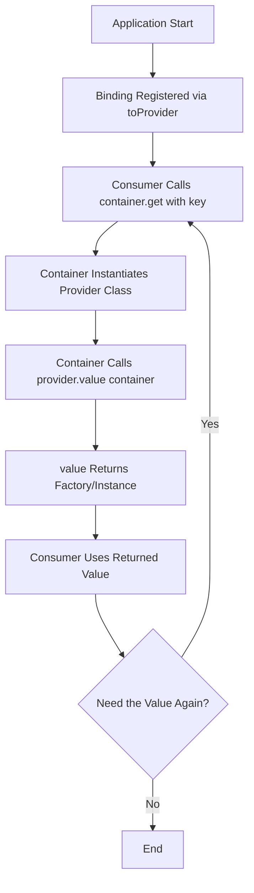

# Providers Reference

Providers implement the Factory pattern in IGNIS, allowing you to create and configure instances dynamically at runtime based on configuration or context. Unlike services that contain business logic, providers are factories that produce values, instances, or functions.

**Files:**
- `packages/kernel/src/base/providers/base.ts`

## Prerequisites

Before reading this document, you should understand:
- [TypeScript basics](https://www.typescriptlang.org/docs/)
- [Dependency Injection in IGNIS](./dependency-injection.md)
- [Services](./services.md) - To understand the difference

## Quick Reference

| Feature | Description |
|---------|-------------|
| **Purpose** | Factory pattern for runtime instance creation |
| **Base Class** | `BaseProvider<T>` |
| **Key Method** | `value(container: Container): T` |
| **Use Case** | Dynamic configuration, multi-strategy patterns, plugin systems |
| **Extends** | `BaseHelper` (provides logging) |
| **Implements** | `IProvider<T>` from `@venizia/ignis-inversion` |

## What is a Provider?

A **Provider** is a class that implements the Factory pattern, responsible for creating and configuring instances based on runtime conditions, configuration, or context.

### Core Characteristics

1. **Factory Pattern**: Produces values, instances, or functions
2. **Configuration-Driven**: Creates different implementations based on config
3. **Deferred Creation**: Instances are created when needed, not at startup
4. **Type-Safe**: Generic type `T` ensures type safety of produced values

### Common Use Cases

- **Strategy Selection**: Choose between multiple implementations (e.g., email providers: Nodemailer, Mailgun, SendGrid)
- **Configuration-Based Instantiation**: Create instances with different configurations
- **Plugin Systems**: Load and configure plugins dynamically
- **Multi-Tenant**: Provide tenant-specific instances
- **Feature Flags**: Enable/disable features at runtime


## BaseProvider Class

Abstract base class for all providers in IGNIS.

### Class Definition

```typescript
import { Container } from '@/helpers/inversion';
import { BaseHelper } from '@venizia/ignis-helpers';
import { IProvider } from '@venizia/ignis-inversion';

export abstract class BaseProvider<T> extends BaseHelper implements IProvider<T> {
  abstract value(container: Container): T;
}
```

### Generic Type Parameter

| Parameter | Description |
|-----------|-------------|
| `T` | The type of value this provider produces |

**Examples:**
- `BaseProvider<IMailTransport>` - Produces mail transport instances
- `BaseProvider<MiddlewareHandler>` - Produces Hono middleware
- `BaseProvider<(config: Config) => Service>` - Produces factory functions

### Inheritance

- **Extends `BaseHelper`**: Provides scoped logging via `this.logger`
- **Implements `IProvider<T>`**: Enforces the `value(container: Container): T` contract

### Abstract Method: `value(container: Container): T`

The `value` method is where you implement your factory logic.

**Parameters:**
| Parameter | Type | Description |
|-----------|------|-------------|
| `container` | `Container` | DI container instance for resolving dependencies |

**Returns:** `T` - The produced value, instance, or factory function

**Purpose:**
- Access to DI container allows resolving other dependencies
- Create and configure instances based on logic
- Return factories for deferred instantiation


## Provider vs Service

Understanding when to use Providers vs Services is crucial for proper architecture.

### Comparison Table

| Aspect | Provider | Service |
|--------|----------|---------|
| **Purpose** | Create/configure instances | Contain business logic |
| **Pattern** | Factory pattern | Business logic layer |
| **Method** | `value(container)` returns factory | Business methods (CRUD, etc.) |
| **Lifecycle** | Creates instances on-demand | Single instance per DI scope |
| **Dependencies** | Produces configured instances | Uses repositories/other services |
| **Example** | `MailTransportProvider` | `UserService` |
| **Returns** | Values, instances, or functions | Business data/results |

### When to Use Providers

Use providers when you need:

```typescript
// ✅ Multiple implementations to choose from
class MailTransportProvider extends BaseProvider<TGetMailTransportFn> {
  value(container: Container): TGetMailTransportFn {
    return (options) => {
      switch (options.provider) {
        case 'nodemailer': return new NodemailerTransport(options);
        case 'mailgun': return new MailgunTransport(options);
        case 'sendgrid': return new SendGridTransport(options);
      }
    };
  }
}

// ✅ Configuration-based instance creation
class DatabaseProvider extends BaseProvider<Database> {
  value(container: Container): Database {
    const config = container.get<IDatabaseConfig>({ key: 'configs.database' });
    return new Database({
      host: config.host,
      port: config.port,
    });
  }
}

// ✅ Runtime factory functions
class CacheProvider extends BaseProvider<(key: string) => Cache> {
  value(container: Container): (key: string) => Cache {
    return (key: string) => new Cache({ namespace: key });
  }
}
```

### When to Use Services

Use services when you need:

```typescript
// ✅ Business logic
class UserService extends BaseService {
  async createUser(data: CreateUserDto) {
    // Validation, transformation, business rules
    const user = await this.userRepository.create(data);
    await this.emailService.sendWelcome(user.email);
    return user;
  }
}

// ✅ Orchestration between repositories
class OrderService extends BaseService {
  async createOrder(items: CartItem[]) {
    const order = await this.orderRepository.create(items);
    await this.inventoryRepository.decrementStock(items);
    await this.paymentService.charge(order.total);
    return order;
  }
}
```

:::tip Quick Decision
- **Need to produce different implementations?** → Use a Provider
- **Need to implement business logic?** → Use a Service
:::


## Creating Custom Providers

### Basic Provider

```typescript
import { BaseProvider } from '@venizia/ignis';
import { Container } from '@venizia/ignis-inversion';

interface ILogger {
  log(message: string): void;
}

class ConsoleLogger implements ILogger {
  log(message: string) {
    console.log(message);
  }
}

class FileLogger implements ILogger {
  constructor(private filePath: string) {}

  log(message: string) {
    // Write to file
  }
}

export class LoggerProvider extends BaseProvider<ILogger> {
  constructor() {
    super({ scope: LoggerProvider.name });
  }

  value(container: Container): ILogger {
    const env = process.env.NODE_ENV;

    if (env === 'production') {
      this.logger.info('[value] Creating FileLogger for production');
      return new FileLogger('/var/log/app.log');
    }

    this.logger.info('[value] Creating ConsoleLogger for development');
    return new ConsoleLogger();
  }
}
```

Register the provider with `.toProvider()`. Consumers then `get()` the **produced value**, not the provider instance - the container instantiates the provider and calls `value(container)` for you:

```typescript
// In your application (e.g. preConfigure)
this.bind<ILogger>({ key: 'providers.Logger' }).toProvider(LoggerProvider);

// Consumers receive the produced ILogger directly
const logger = this.get<ILogger>({ key: 'providers.Logger' });
```

### Factory Function Provider

Providers can return factory functions for deferred instantiation:

```typescript
import { getError } from '@venizia/ignis-helpers';

type TGetMailTransportFn = (options: MailOptions) => IMailTransport;

export class MailTransportProvider extends BaseProvider<TGetMailTransportFn> {
  constructor() {
    super({ scope: MailTransportProvider.name });
  }

  value(container: Container): TGetMailTransportFn {
    // Return a factory function
    return (options: MailOptions) => {
      this.logger.info('[value] Creating mail transport: %s', options.provider);

      switch (options.provider) {
        case 'nodemailer':
          return new NodemailerTransport(options.config);
        case 'mailgun':
          return new MailgunTransport(options.config);
        default:
          throw getError({ message: `Unknown provider: ${options.provider}` });
      }
    };
  }
}

// Registration
app.bind({ key: 'providers.MailTransport' }).toProvider(MailTransportProvider);

// Usage - get() returns the factory function produced by value()
const getTransport = app.get<TGetMailTransportFn>({ key: 'providers.MailTransport' });
const transport = getTransport({ provider: 'nodemailer', config: {...} });
```

### Provider with Dependency Injection

Access other dependencies through the container:

```typescript
export class DatabaseProvider extends BaseProvider<Database> {
  constructor() {
    super({ scope: DatabaseProvider.name });
  }

  value(container: Container): Database {
    // Resolve dependencies from container
    const config = container.get<IDatabaseConfig>({ key: 'configs.database' });

    const database = new Database({
      host: config.host,
      port: config.port,
    });

    this.logger.info('[value] Database instance created');
    return database;
  }
}
```


## Provider Lifecycle

Understanding the provider lifecycle helps you use them effectively.

### Lifecycle Stages



### Key Points

1. **Registered via `.toProvider()`**: Providers are bound explicitly (`bind({ key }).toProvider(MyProvider)`), not auto-scanned
2. **`value()` Called by the Container**: `container.get({ key })` instantiates the provider and calls `value(container)` - consumers receive the produced value, never the provider instance
3. **Singleton Scope Caches the Produced Value**: With `.setScope(BindingScopes.SINGLETON)`, the container caches the result of `value()` and returns it on subsequent `get()` calls. With the default transient scope, `value()` runs on every `get()`
4. **Factory vs Instance**: Providers can return:
   - Direct instances (created each time `value()` is called)
   - Factory functions (deferred creation)

### Example: Singleton vs Factory

```typescript
// Singleton: value() runs once, produced instance is cached by the container
app
  .bind({ key: 'providers.Database' })
  .toProvider(DatabaseProvider)
  .setScope(BindingScopes.SINGLETON);

// Transient (default): value() runs on every get()
app.bind({ key: 'providers.Database' }).toProvider(DatabaseProvider);
```


## Real-World Examples

### Example 1: Mail Transport Provider

From `packages/core-server/src/components/mail/providers/mail-transporter.provider.ts`:

```typescript
export type TGetMailTransportFn = (options: TMailOptions) => IMailTransport;

export class MailTransportProvider extends BaseProvider<TGetMailTransportFn> {
  constructor() {
    super({ scope: MailTransportProvider.name });
  }

  value(_container: Container): TGetMailTransportFn {
    return (options: TMailOptions) => {
      this.logger
        .for(this.value.name)
        .info('Creating mail transport for provider: %s', options.provider);

      switch (options.provider) {
        case MailProviders.NODEMAILER: {
          return this.createNodemailerTransport(options);
        }

        case MailProviders.MAILGUN: {
          return this.createMailgunTransport(options);
        }

        case MailProviders.CUSTOM: {
          return this.createCustomTransport(options);
        }

        default: {
          throw getError({
            statusCode: 500,
            messageCode: MailErrorCodes.INVALID_CONFIGURATION,
            message: `Unsupported mail provider: ${options.provider}`,
          });
        }
      }
    };
  }

  // Each create* method validates the options shape (type guard) before constructing
  // the transport helper, throwing MailErrorCodes.INVALID_CONFIGURATION on mismatch.
  private createNodemailerTransport(options: TMailOptions): NodemailerTransportHelper { /* ... */ }
  private createMailgunTransport(options: TMailOptions): MailgunTransportHelper { /* ... */ }
  private createCustomTransport(options: TMailOptions): IMailTransport { /* ... */ }
}
```

**Usage** (how `MailComponent` registers and consumes it):

```typescript
// Registration - MailComponent.initProviders()
this.application
  .bind({ key: MailKeys.MAIL_TRANSPORT_PROVIDER })
  .toProvider(MailTransportProvider)
  .setScope('singleton');

// Consumption - MailComponent.createAndBindInstances()
const transportGetter = this.application.get<TGetMailTransportFn>({
  key: MailKeys.MAIL_TRANSPORT_PROVIDER,
});
const mailOptions = this.application.get<TMailOptions>({ key: MailKeys.MAIL_OPTIONS });

const mailTransportInstance = transportGetter(mailOptions);
this.application.bind({ key: MailKeys.MAIL_TRANSPORT_INSTANCE }).toValue(mailTransportInstance);
```

### Example 2: Queue Executor Provider

From `packages/core-server/src/components/mail/providers/mail-queue-executor.provider.ts`:

```typescript
export type TGetMailQueueExecutorFn = (config: IMailQueueExecutorConfig) => IMailQueueExecutor;

export class MailQueueExecutorProvider extends BaseProvider<TGetMailQueueExecutorFn> {
  constructor() {
    super({ scope: MailQueueExecutorProvider.name });
  }

  value(_container: Container): TGetMailQueueExecutorFn {
    return (config: IMailQueueExecutorConfig) => {
      this.logger
        .for(this.value.name)
        .info('Creating mail queue executor of type: %s', config.type);

      switch (config.type) {
        case MailQueueExecutorTypes.DIRECT: {
          return new DirectMailExecutorHelper();
        }

        case MailQueueExecutorTypes.INTERNAL_QUEUE: {
          if (!config.internalQueue) {
            throw getError({ message: 'Internal queue configuration is missing' });
          }

          return new InternalQueueMailExecutorHelper({
            identifier: config.internalQueue.identifier,
          });
        }

        case MailQueueExecutorTypes.BULLMQ: {
          if (!config.bullmq) {
            throw getError({ message: 'BullMQ configuration is missing' });
          }

          return new BullMQMailExecutorHelper(config.bullmq);
        }

        default: {
          throw getError({ message: `Unknown mail queue executor type: ${config.type}` });
        }
      }
    };
  }
}
```

### Example 3: Middleware Provider

Providers can also produce middleware. `RequestSpyMiddleware` is a real-world example that implements `IProvider<MiddlewareHandler>` directly (extending `BaseHelper`, not `BaseProvider`):

```typescript
// From packages/core-server/src/base/middlewares/request-spy/request-spy.middleware.ts
export class RequestSpyMiddleware extends BaseHelper implements IProvider<MiddlewareHandler> {
  static readonly REQUEST_ID_KEY = 'requestId';

  private isDebugMode: boolean;

  constructor() {
    super({ scope: 'SpyMW' });
    this.isDebugMode = process.env.NODE_ENV?.toLowerCase() !== Environment.PRODUCTION;
  }

  /** Parses request body based on Content-Type header. */
  async parseBody(opts: { req: TContext['req'] }): Promise<unknown> { /* ... */ }

  /** Returns a Hono middleware that logs request details and duration. */
  value() {
    return createMiddleware(async (context, next) => {
      const t = performance.now();
      const requestId = context.get(RequestSpyMiddleware.REQUEST_ID_KEY);
      const clientIp = /* resolved from connection info or x-real-ip/x-forwarded-for */ '';
      const method = context.req.method;
      const path = context.req.path ?? '/';
      const body = await this.parseBody(context);

      this.logger.info('[%s][%s][=>] %s %s | query: %j | body: %j', requestId, clientIp, method, path, context.req.query(), body);

      await next();

      const duration = (performance.now() - t).toFixed(2);
      this.logger.info('[%s][%s][<=] %s %s | Took: %s (ms)', requestId, clientIp, method, path, duration);
    });
  }
}
```

See [Middlewares](./middlewares.md) for the full implementation (IP resolution, body-parsing rules, and production log redaction).

Note that `RequestSpyMiddleware.value()` does not accept a `container` parameter. The `IProvider<T>` interface defines `value(container: Container): T`, but implementations may ignore the parameter when they don't need container access. In practice, `RequestSpyMiddleware` is registered via `RequestTrackerComponent`, which binds it as a provider in the DI container and resolves it automatically.


## Common Patterns

### Pattern 1: Configuration Validator

Validate configuration before creating instances:

```typescript
export class S3StorageProvider extends BaseProvider<S3Storage> {
  constructor() {
    super({ scope: S3StorageProvider.name });
  }

  value(container: Container): S3Storage {
    const config = container.get<IS3Config>({ key: 'configs.s3' });

    // Validate configuration
    if (!config?.accessKey || !config?.secretKey || !config?.bucket) {
      throw getError({ message: 'S3 configuration incomplete' });
    }

    this.logger.info('[value] Creating S3 storage for bucket: %s', config.bucket);

    return new S3Storage({
      accessKeyId: config.accessKey,
      secretAccessKey: config.secretKey,
      bucket: config.bucket,
    });
  }
}
```

### Pattern 2: Lazy Singleton

Create instance only once, lazily (or bind with `.setScope(BindingScopes.SINGLETON)` and let the container cache the produced value):

```typescript
export class DatabaseConnectionProvider extends BaseProvider<DatabaseConnection> {
  private connection?: DatabaseConnection;

  value(container: Container): DatabaseConnection {
    if (!this.connection) {
      this.logger.info('[value] Creating database connection');
      const config = container.get<IDatabaseConfig>({ key: 'configs.database' });
      this.connection = new DatabaseConnection(config.url);
    } else {
      this.logger.debug('[value] Reusing existing connection');
    }

    return this.connection;
  }
}
```

### Pattern 3: Environment-Based Strategy

Select implementation based on environment:

```typescript
export class CacheProvider extends BaseProvider<ICache> {
  value(container: Container): ICache {
    const env = process.env.NODE_ENV;

    if (env === 'test') {
      this.logger.info('[value] Using InMemoryCache for testing');
      return new InMemoryCache();
    }

    if (env === 'production') {
      this.logger.info('[value] Using RedisCache for production');
      const config = container.get<IRedisConfig>({ key: 'configs.redis' });
      return new RedisCache({
        host: config.host,
        port: config.port,
      });
    }

    this.logger.info('[value] Using InMemoryCache for development');
    return new InMemoryCache();
  }
}
```


## Common Pitfalls

### Pitfall 1: Expecting `get()` to Return the Provider Instance

```typescript
// ❌ Wrong: Expecting the provider instance and calling value() yourself
const provider = app.get<MailTransportProvider>({ key: 'providers.MailTransport' });
const getTransport = provider.value(container); // provider is NOT the instance - this fails

// ✅ Correct: get() already returns the produced value (the container calls value() for you)
const getTransport = app.get<TGetMailTransportFn>({ key: 'providers.MailTransport' });
const transport = getTransport({ provider: 'nodemailer' });
```

### Pitfall 2: Creating Instances in Constructor

```typescript
// ❌ Wrong: Creating instances in constructor
export class BadProvider extends BaseProvider<Database> {
  private db: Database;

  constructor() {
    super({ scope: BadProvider.name });
    this.db = new Database(); // Too early! Config might not be ready
  }

  value(container: Container): Database {
    return this.db;
  }
}

// ✅ Correct: Create in value() method
export class GoodProvider extends BaseProvider<Database> {
  constructor() {
    super({ scope: GoodProvider.name });
  }

  value(container: Container): Database {
    const config = container.get<IDatabaseConfig>({ key: 'configs.database' });
    return new Database(config.url);
  }
}
```

### Pitfall 3: Not Handling Errors

```typescript
// ❌ Wrong: No error handling
value(container: Container): IMailTransport {
  return new MailTransport(container.get({ key: 'configs.mail' })); // Might throw
}

// ✅ Correct: Validate and handle errors
value(container: Container): IMailTransport {
  const mailConfig = container.get<IMailConfig>({ key: 'configs.mail', isOptional: true });

  if (!mailConfig) {
    throw getError({ message: 'Mail configuration is missing' });
  }

  try {
    return new MailTransport(mailConfig);
  } catch (error) {
    this.logger.error('[value] Failed to create mail transport', error);
    throw error;
  }
}
```


## Performance Considerations

### Factory Functions vs Direct Instances

**Factory Functions** (Recommended for multiple instances):
```typescript
// Returns a factory - no instance created until called
value(container: Container): () => Service {
  return () => new Service();
}
```

**Direct Instances** (Use for singletons):
```typescript
// Creates instance immediately
value(container: Container): Service {
  return new Service();
}
```

### Caching Strategies

```typescript
// Cache expensive operations
export class ConfigProvider extends BaseProvider<Config> {
  private cachedConfig?: Config;

  value(container: Container): Config {
    if (this.cachedConfig) {
      return this.cachedConfig;
    }

    // Expensive operation: read files, parse, validate
    this.cachedConfig = this.loadAndValidateConfig();
    return this.cachedConfig;
  }

  private loadAndValidateConfig(): Config {
    // ... expensive operations
  }
}
```


## See Also

- **Related References:**
  - [Services](./services.md) - Business logic layer
  - [Dependency Injection](./dependency-injection.md) - DI container and injection
  - [Middlewares](./middlewares.md) - Built-in middlewares (includes `RequestSpyMiddleware` provider)

- **Guides:**
  - [Dependency Injection Guide](/guides/core-concepts/dependency-injection.md)
  - [Building Services](/guides/core-concepts/services.md)

- **Best Practices:**
  - [Architectural Patterns](/best-practices/architectural-patterns)

- **External Resources:**
  - [Factory Pattern](https://refactoring.guru/design-patterns/factory-method)
  - [Dependency Injection Pattern](https://en.wikipedia.org/wiki/Dependency_injection)
