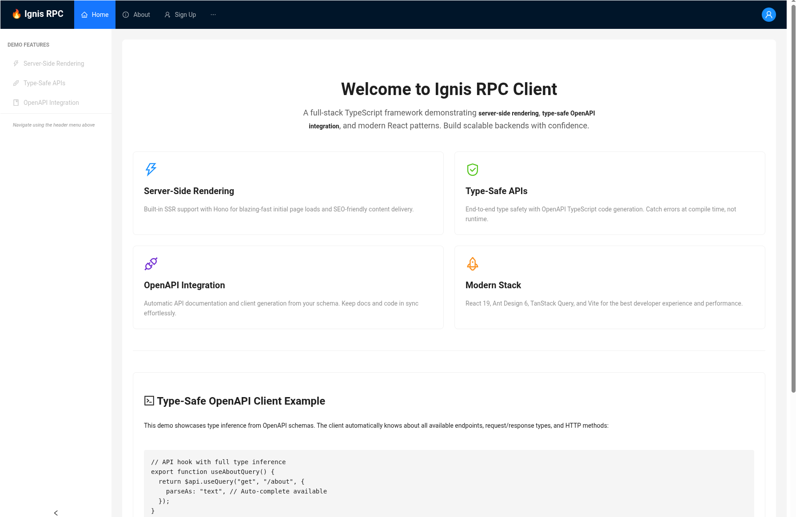

# RPC Client App

> A demonstration React application showcasing server-side rendering (SSR) and type-safe API integration using OpenAPI-generated clients with the Ignis backend framework.

## Table of Contents

- [General Info](#general-information)
- [Technologies Used](#technologies-used)
- [Features](#features)
- [Screenshots](#screenshots)
- [Setup](#setup)
- [Usage](#usage)
- [Project Status](#project-status)
- [Room for Improvement](#room-for-improvement)
- [Acknowledgements](#acknowledgements)
- [Contact](#contact)

## General Information

- This project serves as a reference implementation for building modern React applications with type-safe API integration.
- **Problem it solves**: Demonstrates how to eliminate runtime API errors and maintain type safety between frontend and backend using OpenAPI specifications.
- **Purpose**: Educational example showing best practices for:
  - Server-side rendering integration with React applications
  - Type-safe API calls using auto-generated clients from OpenAPI schemas
  - Feature-Sliced Design (FSD) architecture for scalable frontend applications
  - Modern React patterns with React Router v7 and React Query
- **Why this project**: Part of the Ignis framework examples to showcase full-stack TypeScript development with end-to-end type safety.

## Technologies Used

- React - version 19.1.0
- TypeScript - version 5.8.3
- Vite - version 7.0.0
- React Router DOM - version 7.9.6
- Ant Design - version 6.0.0
- TanStack React Query - version 5.90.11
- openapi-react-query - version 0.5.1
- openapi-fetch - version 0.15.0
- DOMPurify - version 3.3.0

## Features

Ready features:

- **Type-Safe API Integration**: Auto-generated TypeScript types and React hooks from OpenAPI schema
- **Server-Side Rendering**: Demonstrates fetching and rendering HTML content from backend
- **Holy Grail Layout**: Responsive layout with collapsible sidebar, sticky header, and footer
- **Feature-Sliced Design**: Well-organized codebase following FSD architectural principles
- **Form Handling**: Modern form state management using React 19's `useActionState` hook
- **Authentication UI**: Sign-up and login forms with validation and error handling
- **React Query Integration**: Efficient server state management with caching and mutations
- **Hot Module Replacement**: Fast development experience with Vite's HMR

## Screenshots



<!-- Screenshot showing the Holy Grail layout with navigation, sidebar, and content area -->

## Setup

### Prerequisites

- Node.js 18+ or Bun 1.3+
- Running Ignis backend server (see `examples/vert/` for backend setup)

### Installation

1. Navigate to the project directory:

```bash
cd examples/rpc-client-app
```

2. Install dependencies:

```bash
bun install
# or
npm install
```

3. Generate TypeScript types from OpenAPI schema:

```bash
bun run generate:rpc-types
```

This will fetch the OpenAPI schema from your backend and generate type-safe API hooks.

4. Start the development server:

```bash
bun run dev
# or
npm run dev
```

The application will be available at `http://localhost:5173` (or next available port).

### Environment Configuration

The application expects the backend API to be running at the URL specified in `src/shared/config/api-config.ts`. Update this file if your backend runs on a different URL.

## Usage

### Development Commands

```bash
# Start development server with hot reload
bun run dev

# Build for production
bun run build

# Preview production build
bun run preview

# Run linter
bun run lint

# Format code with Prettier
bun run format

# Check code formatting
bun run format:check

# Regenerate API types from OpenAPI schema
npx openapi-typescript http://0.0.0.0:1190/v1/api/doc/openapi.json -o ./schema.d.ts
```

### Code Examples

**Type-safe API query:**

```typescript
import { $api } from "@/shared/api";

// Auto-generated hook with full TypeScript support
export function useAboutQuery() {
  return $api.useQuery("get", "/about", {
    parseAs: "text", // Auto-complete available for all options
  });
}
```

**Type-safe mutation:**

```typescript
import { $api } from "@/shared/api";

// TypeScript knows the exact shape of request body
export function useSignUp() {
  return $api.useMutation("post", "/auth/sign-up");
  // Body type: { username: string, credential: string }
}
```

**Using in components:**

```typescript
function SignUpForm() {
  const signUp = useSignUp();

  const handleSubmit = async (data: {
    username: string;
    credential: string;
  }) => {
    const result = await signUp.mutateAsync({
      body: data, // Fully type-checked
    });
  };

  // Component implementation...
}
```

### Project Structure

```
src/
├── app/              # Application initialization layer
│   ├── providers/    # Context providers (Router, React Query)
│   └── index.tsx     # Root App component with routing
├── features/         # Feature-based modules
│   ├── auth/         # Authentication (sign-up, login)
│   ├── about/        # About page with SSR demo
│   └── home/         # Home page
├── widgets/          # Composite UI components
│   ├── layout/       # Main layout wrapper
│   ├── header/       # Top navigation header
│   ├── sidebar/      # Left sidebar menu
│   └── footer/       # Footer component
└── shared/           # Shared resources
    ├── api/          # API client configuration
    ├── config/       # App configuration (routes, API)
    └── types/        # Shared TypeScript types
```

## Project Status

Project is: _in progress_

This is a demonstration project that continues to evolve alongside the Ignis framework. It serves as a living example of best practices and will be updated as new patterns and features are introduced.

## Room for Improvement

Areas for improvement:

- Add comprehensive error boundary implementation for better error handling
- Improve accessibility with ARIA labels and skip links
- Add loading skeletons for better perceived performance
- Implement proper authentication state management
- Add E2E tests using Playwright or Cypress

To do:

- Implement full authentication flow with JWT token management
- Add protected routes and authorization guards
- Create user profile management features
- Add dark mode theme support
- Implement real-time features using Socket.IO integration
- Add comprehensive unit and integration tests
- Create Storybook documentation for components

## Acknowledgements

- This project is part of the [Ignis Framework](https://github.com/your-org/ignis) examples
- Built with [Vite](https://vite.dev/) for blazing fast development experience
- UI components powered by [Ant Design](https://ant.design/)
- Type-safe API clients generated using [openapi-typescript](https://openapi-ts.dev/)
- Inspired by modern React best practices and Feature-Sliced Design architecture

## Contact

Created as part of the Ignis Framework project - feel free to contribute or raise issues on GitHub!

---

**Note**: This is a demonstration application. For production use, ensure proper security measures, authentication, authorization, and error handling are implemented according to your requirements.
