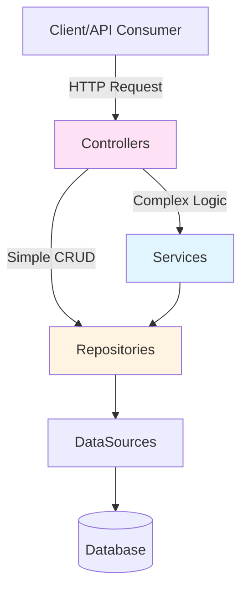

# Architectural Patterns

Ignis promotes separation of concerns, dependency injection, and modularity for scalable, maintainable applications.

> **Deep Dive:** See [Core Framework Reference](../references/src-details/core.md) for implementation details.

## 1. Layered Architecture

Each layer has a single responsibility. Ignis supports **two architectural approaches**:



| Layer | Responsibility | Example |
|-------|---------------|---------|
| **Controllers** | Handle HTTP - parse requests, validate, format responses | `ConfigurationController` (uses `ControllerFactory`) |
| **Services** | Business logic - orchestrate operations | `AuthenticationService` (auth logic) |
| **Repositories** | Data access - CRUD operations | `ConfigurationRepository` (extends `DefaultCRUDRepository`) |
| **DataSources** | Database connections | `PostgresDataSource` (connects to PostgreSQL) |
| **Models** | Data structure - Drizzle schemas + Entity classes | `Configuration`, `User` models |

**Key Principle - Two Approaches:**

```
Simple CRUD (no business logic):
┌────────────┐
│ Controller │──────────────┐
└────────────┘              │
                            ▼
                    ┌──────────────┐
                    │  Repository  │
                    └──────────────┘
                            │
                            ▼
                        Database

Complex Logic (validation, orchestration):
┌────────────┐
│ Controller │────┐
└────────────┘    │
                  ▼
            ┌─────────┐
            │ Service │
            └─────────┘
                  │
                  ▼
          ┌──────────────┐
          │  Repository  │
          └──────────────┘
                  │
                  ▼
              Database
```

**When to use each:**
- **Controller → Repository** - Simple CRUD (list, get by ID, create, update, delete)
- **Controller → Service → Repository** - Business logic, validation, orchestrating multiple repositories

## 2. Dependency Injection (DI)

Classes declare dependencies in their constructor - the framework automatically provides them at runtime.

**Benefits:**
- Loosely coupled code
- Easy to test (mock dependencies)
- Easy to swap implementations

**Example:**
```typescript
@controller({ path: BASE_PATH })
export class ConfigurationController extends _Controller {
  constructor(
    // The @inject decorator tells the container to provide
    // an instance of ConfigurationRepository here.
    @inject({
      key: BindingKeys.build({
        namespace: BindingNamespaces.REPOSITORY,
        key: ConfigurationRepository.name,
      }),
    })
    repository: ConfigurationRepository,
  ) {
    super(repository);
  }
}
```

## 3. Component-Based Modularity

Components bundle a group of related, reusable, and pluggable features into self-contained modules. A single component can encapsulate multiple providers, services, controllers, and repositories, essentially functioning as a mini-application that can be easily "plugged in" to any Ignis project.

**Built-in Components:**
- `AuthenticateComponent` - JWT authentication
- `SwaggerComponent` - OpenAPI documentation
- `HealthCheckComponent` - Health check endpoint
- `RequestTrackerComponent` - Request logging

**Example:**
```typescript
// src/application.ts

export class Application extends BaseApplication {
  // ...
  preConfigure(): ValueOrPromise<void> {
    // ...
    // Registering components plugs their functionality into the application.
    this.component(HealthCheckComponent);
    this.component(SwaggerComponent);
    // ...
  }
}
```
This architecture keeps the main `Application` class clean and focused on high-level assembly, while the details of each feature are neatly encapsulated within their respective components.

## 4. Custom Components

You can encapsulate your own logic or third-party integrations (like Socket.IO, Redis, specific Cron jobs) into reusable Components.

**Structure of a Component:**
1.  Extend `BaseComponent`.
2.  Define default `bindings` (optional configuration/options).
3.  Implement `binding()` to register services, providers, or attach logic to the application.

**Example (`SocketIOComponent`):**

```typescript
import { BaseComponent, inject, CoreBindings, Binding } from '@venizia/ignis';

export class MySocketComponent extends BaseComponent {
  constructor(
    @inject({ key: CoreBindings.APPLICATION_INSTANCE }) private application: BaseApplication,
  ) {
    super({
      scope: MySocketComponent.name,
      // Automatically register bindings when component is loaded
      initDefault: { enable: true, container: application },
      bindings: {
        // Define default configuration binding
        'my.socket.options': Binding.bind({ key: 'my.socket.options' }).toValue({ port: 8080 }),
      },
    });
  }

  // The binding method is called during application startup (preConfigure)
  override binding(): void {
    const options = this.application.get({ key: 'my.socket.options' });
    
    this.logger.info('Initializing Socket.IO with options: %j', options);
    
    // Perform setup logic, register other services, etc.
    // this.application.bind(...).toValue(...);
  }
}
```

## 5. Application Lifecycle Hooks

Ignis applications follow a predictable startup sequence with hooks for customization:

```
┌─────────────────────────────────────────────────────────────┐
│                     initialize()                            │
├─────────────────────────────────────────────────────────────┤
│  1. printStartUpInfo()     - Log startup configuration      │
│  2. validateEnvs()         - Validate APP_ENV_* variables   │
│  3. registerDefaultMiddlewares() - Error handlers, favicon  │
│  4. staticConfigure()      - Configure static file serving  │
│                                                             │
│  ┌─────────────────────────────────────────────────────┐    │
│  │ 5. preConfigure()  ← YOUR CODE HERE                 │    │
│  │    - Register DataSources                           │    │
│  │    - Register Repositories                          │    │
│  │    - Register Services                              │    │
│  │    - Register Controllers                           │    │
│  │    - Register Components                            │    │
│  └─────────────────────────────────────────────────────┘    │
│                                                             │
│  6. registerDataSources()  - Initialize DB connections      │
│  7. registerComponents()   - Configure all components       │
│  8. registerControllers()  - Mount routes to router         │
│                                                             │
│  ┌─────────────────────────────────────────────────────┐    │
│  │ 9. postConfigure()  ← YOUR CODE HERE                │    │
│  │    - Seed data                                      │    │
│  │    - Start background jobs                          │    │
│  │    - Custom initialization                          │    │
│  └─────────────────────────────────────────────────────┘    │
└─────────────────────────────────────────────────────────────┘
```

**Lifecycle Methods:**

| Method | When | Purpose |
|--------|------|---------|
| `staticConfigure()` | Before DI registration | Configure static file serving |
| `preConfigure()` | Before auto-registration | Register all bindings (datasources, repos, services, controllers, components) |
| `postConfigure()` | After everything is registered | Seed data, start jobs, custom logic |

**Example:**
```typescript
export class Application extends BaseApplication {
  // Called before automatic registration
  async preConfigure(): Promise<void> {
    // DataSources (order matters - first)
    this.dataSource(PostgresDataSource);

    // Repositories
    this.repository(UserRepository);
    this.repository(OrderRepository);

    // Services
    this.service(AuthService);
    this.service(EmailService);

    // Controllers
    this.controller(UserController);
    this.controller(OrderController);

    // Components
    this.component(AuthenticateComponent);
    this.component(SwaggerComponent);
  }

  // Called after all registrations complete
  async postConfigure(): Promise<void> {
    // Access registered services
    const userRepo = this.get<UserRepository>({
      key: BindingKeys.build({
        namespace: BindingNamespaces.REPOSITORY,
        key: UserRepository.name,
      }),
    });

    // Seed initial data
    const adminExists = await userRepo.findOne({
      filter: { where: { role: 'admin' } },
    });
    if (!adminExists.data) {
      await userRepo.create({ data: { name: 'Admin', role: 'admin' } });
    }
  }

  // Configure static file serving
  staticConfigure(): void {
    this.static({ restPath: '/public/*', folderPath: './public' });
  }
}
```

> [!WARNING]
> Do not register new datasources, components, or controllers in `postConfigure()`. They will not be automatically initialized. Use `preConfigure()` for all registrations.

## 6. Mixin Pattern

Mixins enable class composition without deep inheritance hierarchies. Ignis uses mixins to add capabilities to the `BaseApplication` class.

**How Mixins Work:**
```typescript
// A mixin is a function that takes a class and returns an extended class
const ServiceMixin = <T extends TMixinTarget<AbstractApplication>>(baseClass: T) => {
  return class extends baseClass {
    service<Base extends IService>(ctor: TClass<Base>): Binding<Base> {
      return this.bind<Base>({
        key: BindingKeys.build({
          namespace: BindingNamespaces.SERVICE,
          key: ctor.name,
        }),
      }).toClass(ctor);
    }
  };
};
```

**Available Mixins:**

| Mixin | Methods Added | Purpose |
|-------|---------------|---------|
| `ServiceMixin` | `service()` | Register service classes |
| `RepositoryMixin` | `repository()`, `dataSource()`, `registerDataSources()` | Register data layer |
| `ControllerMixin` | `controller()` | Register HTTP controllers |
| `ComponentMixin` | `component()` | Register modular components |

**Composing Mixins:**
```typescript
// The framework composes mixins like this:
class AbstractApplication extends ComponentMixin(
  ControllerMixin(
    ServiceMixin(
      RepositoryMixin(BaseClass)
    )
  )
) {
  // Now has: service(), repository(), dataSource(), controller(), component()
}
```

**Why Mixins?**
- Avoid "diamond inheritance" problems
- Add capabilities selectively
- Keep base classes focused
- Enable code reuse across unrelated classes

## 7. Controller Factory Pattern

`ControllerFactory.defineCrudController()` generates a complete CRUD controller from an entity definition. This reduces boilerplate while maintaining full customization.

**Basic Usage:**
```typescript
const _Controller = ControllerFactory.defineCrudController({
  entity: () => User,
  repository: { name: UserRepository.name },
  controller: {
    name: 'UserController',
    basePath: '/users',
    isStrict: true,      // Enable strict validation
    defaultLimit: 50,    // Default pagination limit
  },
});

@controller({ path: '/users' })
export class UserController extends _Controller {
  constructor(
    @inject({ key: BindingKeys.build({ namespace: BindingNamespaces.REPOSITORY, key: UserRepository.name }) })
    repository: UserRepository,
  ) {
    super(repository);
  }
}
```

**Per-Route Authentication:**
```typescript
const _Controller = ControllerFactory.defineCrudController({
  entity: () => User,
  repository: { name: UserRepository.name },
  controller: { name: 'UserController', basePath: '/users' },

  // Apply JWT to all routes by default
  authStrategies: [Authentication.STRATEGY_JWT],

  // Override per-route
  routes: {
    // Public read endpoints
    find: { skipAuth: true },
    findById: { skipAuth: true },
    count: { skipAuth: true },

    // Protected write endpoints (use controller-level auth)
    create: {},
    updateById: {},
    deleteById: {},
  },
});
```

**Custom Schemas Per Route:**
```typescript
const _Controller = ControllerFactory.defineCrudController({
  entity: () => User,
  repository: { name: UserRepository.name },
  controller: { name: 'UserController', basePath: '/users' },

  routes: {
    // Custom request body schema for create
    create: {
      authStrategies: [Authentication.STRATEGY_JWT],
      requestBody: z.object({
        email: z.string().email(),
        name: z.string().min(2),
        // Exclude sensitive fields from client input
      }),
    },

    // Custom response schema
    find: {
      skipAuth: true,
      schema: z.array(z.object({
        id: z.string(),
        name: z.string(),
        // Exclude internal fields from response
      })),
    },
  },
});
```

**Generated Routes:**

| Route | Method | Path | Description |
|-------|--------|------|-------------|
| `count` | GET | `/count` | Count records matching filter |
| `find` | GET | `/` | List records with filter |
| `findById` | GET | `/:id` | Get single record |
| `findOne` | GET | `/find-one` | Get first matching record |
| `create` | POST | `/` | Create new record |
| `updateById` | PATCH | `/:id` | Update record by ID |
| `updateBy` | PATCH | `/` | Bulk update by filter |
| `deleteById` | DELETE | `/:id` | Delete by ID |
| `deleteBy` | DELETE | `/` | Bulk delete by filter |