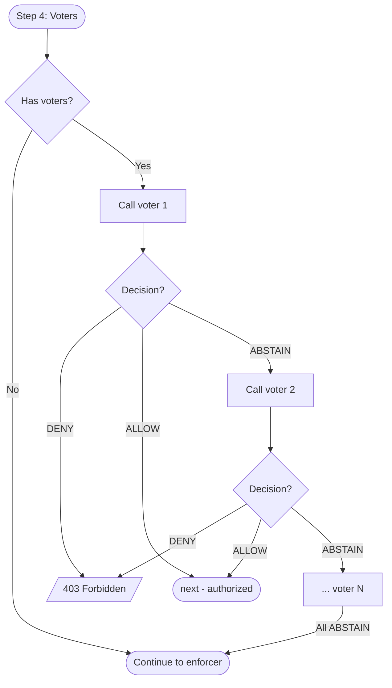
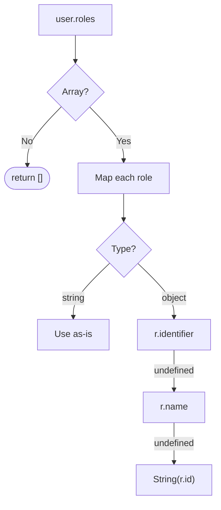
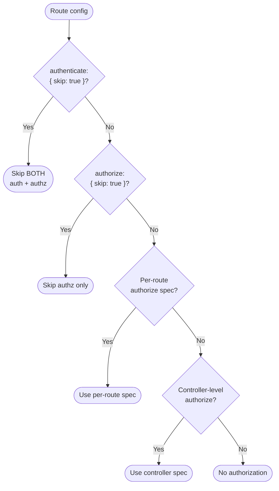

# Authorization -- Usage & Examples

> Securing routes, voters, CRUD factory integration, custom enforcers, and comparable actions/resources. See [Setup & Configuration](./) for initial setup.

## Securing Routes

### Imperative Route (defineRoute)

Use the `authorize` field in route configs to declare authorization requirements:

```typescript
import {
  BaseRestController,
  Authentication,
  AuthorizationActions,
} from '@venizia/ignis';

class ArticleController extends BaseRestController {
  binding() {
    // Read requires 'read' action on 'Article' resource
    this.defineRoute({
      configs: {
        path: '/',
        method: 'get',
        authenticate: { strategies: [Authentication.STRATEGY_JWT] },
        authorize: {
          action: AuthorizationActions.READ,
          resource: 'Article',
        },
        responses: jsonResponse({
          description: 'List of articles',
          schema: z.array(ArticleSchema),
        }),
      },
      handler: async (context) => {
        const articles = await this.articleService.findAll();
        return context.json(articles);
      },
    });

    // Delete requires 'delete' action with conditions
    this.defineRoute({
      configs: {
        path: '/{id}',
        method: 'delete',
        authenticate: { strategies: [Authentication.STRATEGY_JWT] },
        authorize: {
          action: AuthorizationActions.DELETE,
          resource: 'Article',
          conditions: { ownerId: 'currentUser' },
        },
        responses: jsonResponse({
          description: 'Deleted article',
          schema: ArticleSchema,
        }),
      },
      handler: async (context) => {
        const { id } = context.req.valid('param');
        const result = await this.articleService.deleteById({ id });
        return context.json(result);
      },
    });
  }
}
```

### Multiple Authorization Specs

Pass an array of `IAuthorizationSpec` to require **all** specs to pass. Each spec creates a separate middleware -- all must succeed for the handler to execute:

```typescript
import { Authentication, AuthorizationActions } from '@venizia/ignis';

this.defineRoute({
  configs: {
    path: '/admin/users/{id}',
    method: 'patch',
    authenticate: { strategies: [Authentication.STRATEGY_JWT] },
    authorize: [
      { action: AuthorizationActions.UPDATE, resource: 'User' },
      { action: AuthorizationActions.UPDATE, resource: 'Admin' },
    ],
    responses: jsonResponse({
      description: 'Updated user',
      schema: UserSchema,
    }),
  },
  handler: async (context) => {
    // Both 'update:User' AND 'update:Admin' must pass
  },
});
```

> [!NOTE]
> When multiple specs are evaluated on the same route, rules are built once and cached on the context (`Authorization.RULES`). The second spec reuses the cached rules without rebuilding.

### Decorator-Based Route

Use the `authorize` field alongside `authenticate` in decorator configs:

```typescript
import { controller, get, post, AuthorizationActions, AuthorizationRoles } from '@venizia/ignis';

@controller({ path: '/articles' })
class ArticleController extends BaseRestController {
  @get({
    configs: {
      path: '/',
      authenticate: { strategies: [Authentication.STRATEGY_JWT] },
      authorize: { action: AuthorizationActions.READ, resource: 'Article' },
      responses: jsonResponse({ description: 'Articles', schema: z.array(ArticleSchema) }),
    },
  })
  async findAll(opts: { context: TRouteContext }) {
    // Handler runs only if authorized
  }

  @post({
    configs: {
      path: '/',
      authenticate: { strategies: [Authentication.STRATEGY_JWT] },
      authorize: {
        action: AuthorizationActions.CREATE,
        resource: 'Article',
        allowedRoles: ['editor', AuthorizationRoles.ADMIN.identifier],
      },
      request: { body: jsonContent({ schema: CreateArticleSchema }) },
      responses: jsonResponse({ description: 'Created article', schema: ArticleSchema }),
    },
  })
  async create(opts: { context: TRouteContext }) {
    // Handler runs if user has 'create:Article' permission OR 'editor'/'900_admin' role
  }
}
```

### gRPC Route Authorization

Authorization works the same way in gRPC controllers. Use the `authorize` field in RPC metadata:

```typescript
import { AuthorizationActions, Authentication } from '@venizia/ignis';

class GreeterController extends BaseGrpcController {
  binding() {
    this.defineRoute({
      configs: {
        method: sayHello,
        authenticate: { strategies: [Authentication.STRATEGY_JWT] },
        authorize: {
          action: AuthorizationActions.EXECUTE,
          resource: 'Greeter',
        },
      },
      handler: async (context) => {
        // Handler runs only if authorized
      },
    });
  }
}
```

The `AbstractGrpcController.buildRpcMiddlewares()` method injects authorization middleware in the same order as REST controllers: authenticate first, then authorize.

## Using the `authorize()` Standalone Function

The `authorize()` function is a convenience wrapper around `AuthorizationProvider`. It returns a Hono `MiddlewareHandler`:

```typescript
import { authorize, authenticate, Authentication, AuthorizationActions } from '@venizia/ignis';

// Use as Hono middleware directly
app.delete(
  '/articles/:id',
  authenticate({ strategies: [Authentication.STRATEGY_JWT] }),
  authorize({ spec: { action: AuthorizationActions.DELETE, resource: 'Article' } }),
  (c) => {
    const user = c.get(Authentication.CURRENT_USER);
    return c.json({ deleted: true });
  },
);
```

### With Specific Enforcer

If multiple enforcers are registered, specify which one to use:

```typescript
authorize({
  spec: { action: AuthorizationActions.READ, resource: 'Report' },
  enforcerName: 'my-custom',  // defaults to first registered if omitted
});
```

## Voters

Voters provide custom authorization logic that runs **before** the enforcer (step 4 in the pipeline).



Each voter returns one of three decisions:

| Decision | Effect |
|----------|--------|
| `AuthorizationDecisions.ALLOW` | Immediately grants access (skips remaining voters and enforcer) |
| `AuthorizationDecisions.DENY` | Immediately denies access (throws 403) |
| `AuthorizationDecisions.ABSTAIN` | No opinion -- continues to next voter or enforcer |

### Basic Voter Example

```typescript
import {
  AuthorizationActions,
  AuthorizationDecisions,
  TAuthorizationVoter,
} from '@venizia/ignis';

const ownerVoter: TAuthorizationVoter = async ({ user, action, resource, context }) => {
  if (action !== AuthorizationActions.UPDATE && action !== AuthorizationActions.DELETE) {
    return AuthorizationDecisions.ABSTAIN;
  }

  const articleId = context.req.param('id');
  const article = await articleService.findById({ id: articleId });

  if (!article) {
    return AuthorizationDecisions.ABSTAIN;
  }

  if (article.authorId === user.userId) {
    return AuthorizationDecisions.ALLOW;
  }

  return AuthorizationDecisions.ABSTAIN; // Let enforcer decide
};
```

### Using Voters in Routes

```typescript
this.defineRoute({
  configs: {
    path: '/{id}',
    method: 'patch',
    authenticate: { strategies: [Authentication.STRATEGY_JWT] },
    authorize: {
      action: AuthorizationActions.UPDATE,
      resource: 'Article',
      voters: [ownerVoter],
    },
    // ...
  },
  handler: async (context) => {
    // Runs if: owner (voter ALLOW) OR enforcer permits
  },
});
```

### Multiple Voters

Voters are evaluated sequentially. The first non-ABSTAIN decision wins:

```typescript
authorize: {
  action: AuthorizationActions.UPDATE,
  resource: 'Article',
  voters: [ownerVoter, adminOverrideVoter, timeWindowVoter],
}
```

**Evaluation flow:**
1. `ownerVoter` returns `ABSTAIN` -- continue
2. `adminOverrideVoter` returns `ALLOW` -- **access granted** (skips remaining voters and enforcer)

> [!TIP]
> Use `ABSTAIN` as the default return when a voter doesn't have a strong opinion. Only return `DENY` when you're certain the request should be blocked regardless of other checks.

## Role-Based Shortcuts

### Global `alwaysAllowRoles`

Roles listed in `alwaysAllowRoles` bypass **all** authorization checks globally (step 3 in the pipeline):

```typescript
import { AuthorizationRoles } from '@venizia/ignis';

this.bind<IAuthorizeOptions>({ key: AuthorizeBindingKeys.OPTIONS }).toValue({
  defaultDecision: 'deny',
  alwaysAllowRoles: [AuthorizationRoles.SUPER_ADMIN.identifier, 'system'],
});
```

### Per-Route `allowedRoles`

Roles listed in `allowedRoles` on a specific `IAuthorizationSpec` bypass the enforcer for that route only (still evaluated at step 3):

```typescript
authorize: {
  action: AuthorizationActions.DELETE,
  resource: 'Article',
  allowedRoles: [AuthorizationRoles.ADMIN.identifier, 'moderator'],
}
```

### Role Extraction

The authorization middleware extracts roles from the authenticated user's `roles` field via the `extractUserRoles()` method:



It supports multiple formats:

```typescript
// String array
roles: ['admin', 'user']

// Object array with identifier (preferred — matches AuthorizationRole.identifier)
roles: [{ id: 1, identifier: '900_admin', priority: 900 }]

// Object array with name fallback
roles: [{ id: 1, name: 'admin' }]

// Object array with id-only fallback
roles: [{ id: 1 }]
```

Extraction priority: `identifier` > `name` > `String(id)`

## CRUD Factory Integration

### Controller-Level Authorization

Apply authorization to all CRUD routes:

```typescript
import { AuthorizationActions } from '@venizia/ignis';

ControllerFactory.defineCrudController({
  entity: Article,
  repository: { name: 'ArticleRepository' },
  controller: { name: 'ArticleController', basePath: '/articles' },
  authenticate: { strategies: [Authentication.STRATEGY_JWT] },
  authorize: { action: AuthorizationActions.READ, resource: 'Article' },
});
```

### Per-Route Overrides

Override authorization per CRUD endpoint:

```typescript
import { AuthorizationActions, AuthorizationRoles } from '@venizia/ignis';

ControllerFactory.defineCrudController({
  entity: Article,
  repository: { name: 'ArticleRepository' },
  controller: { name: 'ArticleController', basePath: '/articles' },
  authenticate: { strategies: [Authentication.STRATEGY_JWT] },
  authorize: { action: AuthorizationActions.READ, resource: 'Article' },
  routes: {
    // Public read -- skip both auth
    find: { authenticate: { skip: true } },
    count: { authenticate: { skip: true } },

    // Custom authorization for write operations
    create: {
      authorize: { action: AuthorizationActions.CREATE, resource: 'Article' },
    },
    updateById: {
      authorize: { action: AuthorizationActions.UPDATE, resource: 'Article' },
    },

    // Skip only authorization (still requires auth)
    findOne: { authorize: { skip: true } },

    // Strict delete with custom roles
    deleteById: {
      authorize: {
        action: AuthorizationActions.DELETE,
        resource: 'Article',
        allowedRoles: [AuthorizationRoles.ADMIN.identifier],
      },
    },
  },
});
```

### Priority Resolution (Factory Routes)

The `resolveRouteAuthorize` function in `defineControllerRouteConfigs` resolves authorization with this priority:



1. **`authenticate: { skip: true }`** -- skips both authentication and authorization
2. **`authorize: { skip: true }`** -- skips authorization only
3. **Per-route `authorize` spec** -- overrides controller-level
4. **Controller-level `authorize`** -- default for all routes

### Per-Route Auth Type

The per-route authorize config is typed as a discriminated union:

```typescript
type TRouteAuthorizeConfig = { skip: true } | IAuthorizationSpec | IAuthorizationSpec[];
```

This means each route can either skip authorization entirely, provide a single spec, or provide an array of specs that all must pass.

## Dynamic Skip Authorization

Use `Authorization.SKIP_AUTHORIZATION` to dynamically bypass authorization in middleware (step 1 in the pipeline):

```typescript
import { Authorization } from '@venizia/ignis';
import { createMiddleware } from 'hono/factory';

const conditionalAuthzMiddleware = createMiddleware(async (c, next) => {
  // Skip authorization for internal service-to-service calls
  if (c.req.header('X-Internal-Service') === 'trusted-key') {
    c.set(Authorization.SKIP_AUTHORIZATION, true);
  }
  return next();
});
```

## Rules Caching

The authorization middleware caches rules on the Hono context to avoid rebuilding them on every authorization spec evaluation. This is especially useful when multiple authorization specs are applied to the same route:

```typescript
// First spec triggers buildRules() → result cached on context
authorize: [
  { action: AuthorizationActions.READ, resource: 'Article' },
  { action: AuthorizationActions.READ, resource: 'Comment' },
]
// Second spec reuses cached rules → no rebuild
```

> [!TIP]
> Rules caching happens per-request. Each new HTTP request starts with an empty cache. If you need to invalidate cached rules mid-request (e.g., after role change), set `context.set(Authorization.RULES, null)`.

## Accessing Context Variables

The authorization module provides type-safe access to auth data on the Hono context:

```typescript
import { Authorization, Authentication } from '@venizia/ignis';

// In a route handler or middleware
const user = c.get(Authentication.CURRENT_USER);  // IAuthUser
const rules = c.get(Authorization.RULES);           // unknown (type depends on enforcer)
const isSkipped = c.get(Authorization.SKIP_AUTHORIZATION); // boolean

// Set skip dynamically
c.set(Authorization.SKIP_AUTHORIZATION, true);

// Invalidate cached rules
c.set(Authorization.RULES, null);
```

## Using IAuthorizationComparable

For custom action/resource comparison logic beyond plain string equality, implement `IAuthorizationComparable`.

### StringAuthorizationAction with Wildcard

The built-in `StringAuthorizationAction` supports a wildcard (`*`) that matches any action:

```typescript
import { StringAuthorizationAction } from '@venizia/ignis';

const wildcard = StringAuthorizationAction.build({ value: '*' });
wildcard.isEqual('read');    // true — wildcard matches all
wildcard.isEqual('delete');  // true — wildcard matches all
wildcard.isEqual('create');  // true — wildcard matches all

const readOnly = StringAuthorizationAction.build({ value: 'read' });
readOnly.isEqual('read');    // true
readOnly.isEqual('update');  // false
```

### StringAuthorizationResource

Standard string comparison for resources (no wildcard):

```typescript
import { StringAuthorizationResource } from '@venizia/ignis';

const article = StringAuthorizationResource.build({ value: 'Article' });
article.isEqual('Article');  // true
article.isEqual('User');     // false
```

### Custom Comparable Implementation

Create your own comparable type for advanced matching:

```typescript
import type { IAuthorizationComparable } from '@venizia/ignis';

class HierarchicalResource implements IAuthorizationComparable<string> {
  readonly value: string;

  constructor(opts: { value: string }) {
    this.value = opts.value;
  }

  compare(other: string): number {
    // Match if the other resource starts with this resource's value
    // e.g., 'articles' matches 'articles.comments'
    if (other.startsWith(this.value)) return 0;
    return this.value.localeCompare(other);
  }

  isEqual(other: string): boolean {
    return this.compare(other) === 0;
  }
}
```

## Custom Enforcer

Create a custom enforcer by implementing `IAuthorizationEnforcer`:

```typescript
import {
  IAuthorizationEnforcer,
  IAuthorizationRequest,
  IAuthUser,
  TAuthorizationDecision,
  AuthorizationDecisions,
  TContext,
} from '@venizia/ignis';
import { BaseHelper, ValueOrPromise } from '@venizia/ignis-helpers';
import { Env } from 'hono';

type MyRules = Map<string, Set<string>>;

class MyCustomEnforcer
  extends BaseHelper
  implements IAuthorizationEnforcer<Env, string, string, MyRules>
{
  name = 'my-custom';

  constructor() {
    super({ scope: MyCustomEnforcer.name });
  }

  async configure(): Promise<void> {
    // One-time initialization (called by registry on first use)
  }

  async buildRules(opts: {
    user: { principalType: string } & IAuthUser;
    context: TContext;
  }): Promise<MyRules> {
    const rules = new Map<string, Set<string>>();
    // Build your rules map from DB, config, etc.
    return rules;
  }

  async evaluate(opts: {
    rules: MyRules;
    request: IAuthorizationRequest;
    context: TContext;
  }): Promise<TAuthorizationDecision> {
    const { rules, request } = opts;
    const resourceActions = rules.get(request.resource);
    if (resourceActions?.has(request.action)) {
      return AuthorizationDecisions.ALLOW;
    }
    return AuthorizationDecisions.DENY;
  }
}
```

Then register it via the registry:

```typescript
import {
  AuthorizationEnforcerRegistry,
  AuthorizationEnforcerTypes,
  AuthorizeBindingKeys,
  AuthorizeComponent,
  IAuthorizeOptions,
} from '@venizia/ignis';

// Step 1: Global options
this.bind<IAuthorizeOptions>({ key: AuthorizeBindingKeys.OPTIONS }).toValue({
  defaultDecision: 'deny',
});

// Step 2: Component
this.component(AuthorizeComponent);

// Step 3: Register custom enforcer
AuthorizationEnforcerRegistry.getInstance().register({
  container: this,
  enforcers: [{
    enforcer: MyCustomEnforcer,
    name: 'my-custom',
    type: AuthorizationEnforcerTypes.CUSTOM,
    options: { /* your enforcer-specific options if needed */ },
  }],
});
```

> [!NOTE]
> Custom enforcers can inject their options via `@inject({ key: AuthorizeBindingKeys.enforcerOptions('my-custom') })` in the constructor, just like `CasbinAuthorizationEnforcer` does.

## Custom Filtered Adapter

Create a custom adapter by extending `BaseFilteredAdapter`:

```typescript
import {
  BaseFilteredAdapter,
  IBaseFilteredAdapterEntities,
  ICasbinPolicyFilter,
  TBasePolicyRow,
} from '@venizia/ignis';

interface MyEntities extends IBaseFilteredAdapterEntities {
  permission: { tableName: string; principalType: string };
  role: { tableName: string; principalType: string };
  policyDefinition: { tableName: string; principalType: string };
}

class MyCustomAdapter extends BaseFilteredAdapter<MyEntities> {
  constructor(opts: { entities: MyEntities; /* your dependencies */ }) {
    super({ scope: MyCustomAdapter.name, entities: opts.entities });
  }

  protected async buildDirectPolicies(opts: {
    filter: ICasbinPolicyFilter;
    rolePrincipal: string;
  }): Promise<string[]> {
    // Query direct permission policies for the user
    // Return casbin `p` lines using this.toPolicyLine()
    const rows = await this.queryDirectPolicies(opts.filter);
    return rows.map(row => this.toPolicyLine({ row })).filter(Boolean) as string[];
  }

  protected async buildGroupPolicies(opts: {
    filter: ICasbinPolicyFilter;
  }): Promise<{ lines: string[]; roleIds: (string | number)[] }> {
    // Query role assignments for the user
    // Return casbin `g` lines using this.toGroupLine() + role IDs
    return { lines: [...], roleIds: [...] };
  }

  protected async buildRolePolicies(opts: {
    roleIds: (string | number)[];
    rolePrincipal: string;
  }): Promise<string[]> {
    // Query permission policies inherited through roles
    // Return casbin `p` lines using this.toPolicyLine()
    return [...];
  }
}
```

The base class provides shared formatters:
- `this.formatDomain(domain)` -- adds entity prefix to domain values
- `this.toGroupLine({ subject, role, domain })` -- formats `g` lines
- `this.toPolicyLine({ row })` -- formats `p` lines

## AuthorizationRole Comparison

Use `AuthorizationRole` for priority-based role comparison:

```typescript
import { AuthorizationRole, AuthorizationRoles } from '@venizia/ignis';

// Built-in roles
AuthorizationRoles.SUPER_ADMIN.identifier;  // '999_super-admin'
AuthorizationRoles.ADMIN.identifier;         // '900_admin'
AuthorizationRoles.USER.identifier;          // '010_user'

// Comparison
AuthorizationRoles.SUPER_ADMIN.isHigherThan({ target: AuthorizationRoles.ADMIN }); // true
AuthorizationRoles.GUEST.isLowerThan({ target: AuthorizationRoles.USER });          // true

// Custom roles
const moderator = AuthorizationRole.build({ name: 'moderator', priority: 500 });
moderator.identifier;  // '500_moderator'
moderator.isHigherThan({ target: AuthorizationRoles.USER });  // true (500 > 10)
moderator.isLowerThan({ target: AuthorizationRoles.ADMIN });  // true (500 < 900)

// Custom delimiter
const customRole = AuthorizationRole.build({ name: 'editor', priority: 100, delimiter: '-' });
customRole.identifier;  // '100-editor'
```

## Model-Based Resource References

Instead of hardcoding resource strings, use `AUTHORIZATION_SUBJECT` from your model classes. When a model declares `authorize.principal` in `@model` settings, the decorator auto-populates `AUTHORIZATION_SUBJECT`:

```typescript
import { BaseEntity, model, generateIdColumnDefs } from '@venizia/ignis';
import { pgTable, text } from 'drizzle-orm/pg-core';

@model({
  type: 'entity',
  settings: {
    authorize: { principal: 'article' },
  },
})
export class Article extends BaseEntity<typeof Article.schema> {
  static override schema = pgTable('Article', {
    ...generateIdColumnDefs({ id: { dataType: 'string' } }),
    title: text('title').notNull(),
  });
}

// Article.AUTHORIZATION_SUBJECT === 'article'
```

Use it in route configs for type-safe, refactor-friendly resource references:

```typescript
import { AuthorizationActions } from '@venizia/ignis';
import { Article } from '../models/entities/article.model';

// Instead of: resource: 'article'
authorize: {
  action: AuthorizationActions.READ,
  resource: Article.AUTHORIZATION_SUBJECT,
}
```

### Querying All Principals

Use `MetadataRegistry` to retrieve all registered authorization principals at runtime:

```typescript
import { MetadataRegistry } from '@venizia/ignis';

const registry = MetadataRegistry.getInstance();

// Flat array of principal names — ideal for Casbin policy setup
const principals = registry.getAuthorizeModelPrincipals({ format: 'array' });
// ['article', 'user', 'configuration']

// Record of model name → principal
const principalMap = registry.getAuthorizeModelPrincipals({ format: 'record' });
// { Article: 'article', User: 'user', Configuration: 'configuration' }

// Full settings with model registry entries (framework-level)
const settings = registry.getAuthorizeModelSettings({ format: 'array' });
// [{ name: 'Article', authorize: { principal: 'article' }, entry: IModelRegistryEntry }]
```

> [!TIP]
> Defining `authorize.principal` on the model makes the model the single source of truth for its authorization subject. This eliminates string duplication across route configs and policy setup.

## RBAC with Domains (Multi-Tenant)

For multi-tenant apps where a user holds roles **scoped to specific tenants** (and sometimes globally), use Casbin's [RBAC with domains](https://casbin.apache.org/docs/rbac-with-domains/) model and register a **domain matching function** via `domainMatching`. This lets the domain slot of a grouping (`g`) policy use a wildcard, so a global role is a single line (`g, user, role, *`) and role permissions stay domain-agnostic (`p, role, *, …`).

> [!TIP]
> Why this matters: putting the tenant on the membership (`g`) and keeping permissions wildcard (`p.dom = "*"`) keeps a user's materialized policy count **linear** (`memberships + permissions`) instead of the `permissions × tenants` cross-product. For a user with 30 tenants and 700 permissions that is ~730 lines instead of ~21,000.

### The model

```ini
[request_definition]
r = sub, dom, obj, act

[policy_definition]
p = sub, dom, obj, act, eft

[role_definition]
g = _, _, _

[policy_effect]
e = some(where (p.eft == allow)) && !some(where (p.eft == deny))

[matchers]
m = g(r.sub, p.sub, r.dom) && keyMatch(r.dom, p.dom) && r.obj == p.obj && r.act == p.act
```

- `g = _, _, _` — the membership relation is **domain-aware** (subject, role, domain).
- `g(r.sub, p.sub, r.dom)` — the registered domain matching function decides whether the request domain matches the stored membership domain (this is what makes `*` a wildcard).
- `keyMatch(r.dom, p.dom)` — `keyMatch` is a **built-in matcher function** (no registration needed); it lets a permission with `p.dom = "*"` match any request domain.

### Registering the domain matching function

Pass `domainMatching` in the enforcer options. It is registered once during `configure()`:

```typescript
import {
  AuthorizationEnforcerRegistry,
  AuthorizationEnforcerTypes,
  CasbinAuthorizationEnforcer,
  CasbinDomainMatchingFunctions,
  CasbinEnforcerModelDrivers,
  type ICasbinEnforcerOptions,
} from '@venizia/ignis';

AuthorizationEnforcerRegistry.getInstance().register({
  container: this,
  enforcers: [
    {
      enforcer: CasbinAuthorizationEnforcer,
      name: 'casbin',
      type: AuthorizationEnforcerTypes.CASBIN,
      options: {
        model: { driver: CasbinEnforcerModelDrivers.TEXT, definition: CASBIN_RBAC_MODEL },
        adapter,
        cached,
        // For a domain model, normalizePayloadFn MUST always return a `domain`.
        normalizePayloadFn: ({ user, action, resource, context }) => ({
          subject: `User_${user.userId}`,
          domain: `Merchant_${resolveActiveMerchant({ context })}`,
          resource,
          action,
        }),
        // Register keyMatch on the `g` role definition so wildcard domains work:
        domainMatching: { roleDefinition: 'g', fn: CasbinDomainMatchingFunctions.KEY_MATCH },
      } satisfies ICasbinEnforcerOptions,
    },
  ],
});
```

> [!NOTE]
> `domainMatching` is opt-in. When omitted, domains are compared as exact strings and behavior is unchanged. The enforcer calls Casbin's `addNamedDomainMatchingFunc(roleDefinition, Util.keyMatchFunc)` internally — you never call it directly.

### Choosing the matching function

`keyMatch` is the safe default for opaque domain identifiers like `Merchant_<uuid>`: it treats only `*` as special and never splits on `/` or `:`, so it cannot accidentally match one tenant against another. Use the others only if your domains are structured paths.

```typescript
domainMatching: { roleDefinition: 'g', fn: CasbinDomainMatchingFunctions.KEY_MATCH };   // * wildcard (recommended)
domainMatching: { roleDefinition: 'g', fn: CasbinDomainMatchingFunctions.KEY_MATCH_2 };  // /tenants/:id
domainMatching: { roleDefinition: 'g', fn: CasbinDomainMatchingFunctions.KEY_MATCH_3 };  // /tenants/{id}
domainMatching: { roleDefinition: 'g', fn: CasbinDomainMatchingFunctions.REGEX_MATCH };  // ^Merchant_.*$
```

### All cases — policy lines and outcomes

Given the model above with `keyMatch` registered on `g`, the request is `enforceSync(subject, domain, resource, action)`:

| Case | Policy lines | Request | Outcome |
|------|--------------|---------|---------|
| **Scoped role** (owner/employee in a tenant) | `g, User_u, Role_owner, Merchant_A`<br/>`p, Role_owner, *, Material.find, read, allow` | `(User_u, Merchant_A, Material.find, read)` | ✅ allow |
| **Scoped role — isolation** | (same as above) | `(User_u, Merchant_B, Material.find, read)` | ❌ deny (`g` domain doesn't match) |
| **Multi-tenant role** | `g, User_u, Role_owner, Merchant_A`<br/>`g, User_u, Role_owner, Merchant_B`<br/>`p, Role_owner, *, Material.find, read, allow` | `(User_u, Merchant_B, Material.find, read)` | ✅ allow (one `g` line per owned tenant; **single** `p` line) |
| **Global role** (e.g. guest/onboarding) | `g, User_u, Role_guest, *`<br/>`p, Role_guest, *, Organizer.onBoarding, create, allow` | `(User_u, Merchant_anything, Organizer.onBoarding, create)` | ✅ allow (wildcard `g` domain) |
| **Direct user permission (scoped)** | `p, User_u, Merchant_A, Report.read, read, allow` | `(User_u, Merchant_A, Report.read, read)` | ✅ allow (reflexive `g(u,u,dom)` + `keyMatch`) |
| **Direct user permission — isolation** | (same as above) | `(User_u, Merchant_B, Report.read, read)` | ❌ deny |
| **Deny override** | `p, Role_x, *, Secret.read, read, deny`<br/>`p, Role_y, *, Secret.read, read, allow` | any domain where the user has both roles | ❌ deny (`!some(p.eft == deny)`) |

> [!IMPORTANT]
> The function is applied as `fn(requestDomain, policyDomain)` — the wildcard belongs on the **stored** side. Store only `*` or exact domain values (never `Merchant_*`) to keep isolation guaranteed.

### Misconfiguration is caught early

If `roleDefinition` is not declared under `[role_definition]` in the model, `configure()` throws — Casbin would otherwise register the function as a silent no-op, leaving wildcard domains permanently unmatched (global roles silently denied):

```typescript
// model declares `g` only
domainMatching: { roleDefinition: 'g2', fn: CasbinDomainMatchingFunctions.KEY_MATCH };
// => throws: Role definition "g2" is not declared in the Casbin model. Declare it under
//    [role_definition] (e.g. `g = _, _, _`) before enabling domainMatching.
```

## See Also

- [Setup & Configuration](./) -- Binding keys, options interfaces, and initial setup
- [API Reference](./api) -- Architecture, enforcer internals, provider, registry, and adapters
- [Error Reference](./errors) -- Error messages and troubleshooting
