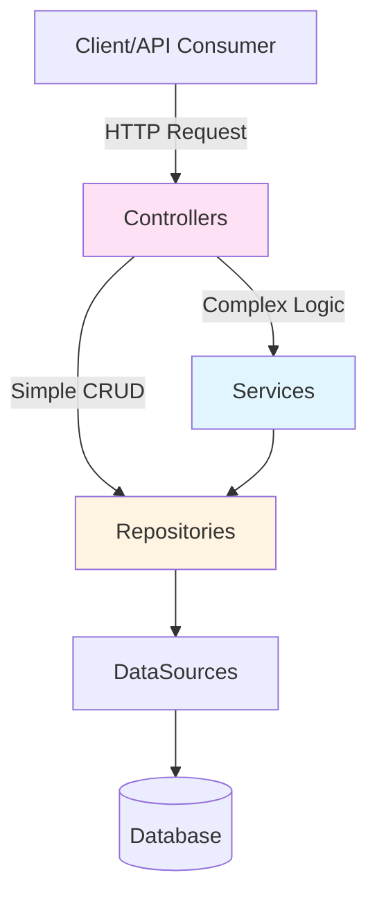

# Architectural Patterns

Ignis promotes separation of concerns, dependency injection, and modularity for scalable, maintainable applications.

> **Deep Dive:** See [Core Framework Reference](../../references/src-details/core.md) for implementation details.

## 1. Layered Architecture

Each layer has a single responsibility. Ignis supports **two architectural approaches**:



| Layer | Responsibility | Example |
|-------|---------------|---------|
| **Controllers** | Handle HTTP - parse requests, validate, format responses | `ConfigurationController` (uses `ControllerFactory`) |
| **Services** | Business logic - orchestrate operations | `AuthenticationService` (auth logic) |
| **Repositories** | Data access - CRUD operations | `ConfigurationRepository` (extends `DefaultCRUDRepository`) |
| **DataSources** | Database connections | `PostgresDataSource` (connects to PostgreSQL) |
| **Models** | Data structure - Drizzle schemas + Entity classes | `Configuration`, `User` models |

**Key Principle - Two Approaches:**

```
Simple CRUD (no business logic):
┌────────────┐
│ Controller │──────────────┐
└────────────┘              │
                            ▼
                    ┌──────────────┐
                    │  Repository  │
                    └──────────────┘
                            │
                            ▼
                        Database

Complex Logic (validation, orchestration):
┌────────────┐
│ Controller │────┐
└────────────┘    │
                  ▼
            ┌─────────┐
            │ Service │
            └─────────┘
                  │
                  ▼
          ┌──────────────┐
          │  Repository  │
          └──────────────┘
                  │
                  ▼
              Database
```

**When to use each:**
- **Controller → Repository** - Simple CRUD (list, get by ID, create, update, delete)
- **Controller → Service → Repository** - Business logic, validation, orchestrating multiple repositories

## 2. Dependency Injection (DI)

Classes declare dependencies in their constructor - the framework automatically provides them at runtime.

**Benefits:**
- Loosely coupled code
- Easy to test (mock dependencies)
- Easy to swap implementations

**Example:**
```typescript
@controller({ path: BASE_PATH })
export class ConfigurationController extends _Controller {
  constructor(
    // The @inject decorator tells the container to provide
    // an instance of ConfigurationRepository here.
    @inject({
      key: BindingKeys.build({
        namespace: BindingNames...REPOSITORY,
        key: ConfigurationRepository.name,
      }),
    })
    repository: ConfigurationRepository,
  ) {
    super(repository);
  }
}
```

## 3. Component-Based Modularity

Components bundle related features into self-contained, pluggable modules.

**Built-in Components:**
- `AuthenticateComponent` - JWT authentication
- `SwaggerComponent` - OpenAPI documentation
- `HealthCheckComponent` - Health check endpoint
- `RequestTrackerComponent` - Request logging

**Example:**
```typescript
// src/application.ts

export class Application extends BaseApplication {
  // ...
  preConfigure(): ValueOrPromise<void> {
    // ...
    // Registering components plugs their functionality into the application.
    this.component(HealthCheckComponent);
    this.component(SwaggerComponent);
    // ...
  }
}
```
This architecture keeps the main `Application` class clean and focused on high-level assembly, while the details of each feature are neatly encapsulated within their respective components.