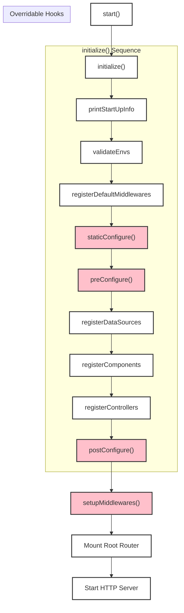

# The Application Class

The Application class orchestrates your application's configuration, lifecycle, and resource registration (components, controllers, services).

> **Deep Dive:** See [Application Reference](../../references/base/application.md) for technical details.

## Creating an Application

Extend `BaseApplication` and implement the hook methods:

```typescript
// src/application.ts
import {
  BaseApplication,
  IApplicationConfigs,
  IApplicationInfo,
  ValueOrPromise,
} from "@vez/ignis";
import packageJson from "./../package.json";

// Application configurations
export const appConfigs: IApplicationConfigs = {
  host: process.env.APP_ENV_SERVER_HOST,
  port: +(process.env.APP_ENV_SERVER_PORT ?? 3000),
  path: {
    base: process.env.APP_ENV_SERVER_BASE_PATH,
    isStrict: true,
  },
  debug: {
    showRoutes: process.env.NODE_ENV !== "production",
  },
};

// Main Application class
export class Application extends BaseApplication {
  override getAppInfo(): ValueOrPromise<IApplicationInfo> {
    return packageJson;
  }

  staticConfigure(): void {
    // e.g., this.static({ folderPath: './public' })
  }
  
  preConfigure(): ValueOrPromise<void> {
    // Register all your resources here
    this.dataSource(MyDataSource);
    this.service(MyService);
    this.controller(MyController);
  }
  
  postConfigure(): ValueOrPromise<void> {
    // Logic to run after everything is configured
  }
  
  setupMiddlewares(): ValueOrPromise<void> {
    // Add any custom application-wide middlewares
  }
}
```

## Application Lifecycle

The `Ignis` application has a well-defined lifecycle, managed primarily by the `start()` and `initialize()` methods.

| Method | Description |
| :--- | :--- |
| **`constructor(opts)`** | Initializes the application, sets up the Hono server, and detects the runtime (Bun/Node). |
| **`start()`** | The main entry point. It calls `initialize()`, sets up middlewares, and starts the HTTP server. |
| **`stop()`** | Stops the application server. |
| **`initialize()`** | Orchestrates the entire setup process, calling the various configuration and registration methods in the correct order. |

The `BaseApplication` class provides several **overridable hook methods** that allow you to customize the startup process. These are the primary places you'll write your application-specific setup code.

| Hook Method | Purpose |
| :--- | :--- |
| `getAppInfo()` | **Required.** Return application metadata, usually from `package.json`. Used for OpenAPI docs. |
| `staticConfigure()` | Configure static file serving. |
| `preConfigure()` | **Most Important Hook.** Set up application resources like components, controllers, services, and datasources. |
| `postConfigure()` | Perform actions *after* all resources have been configured and instantiated. |
| `setupMiddlewares()`| Add custom application-level middlewares to the Hono instance. |

## Lifecycle Diagram

This diagram shows the sequence of operations during application startup. The methods you can override are highlighted.



## Configuration

Application configuration is passed to the `BaseApplication` constructor via an `IApplicationConfigs` object.

### Configuration Options

| Option | Type | Default | Description |
| :--- | :--- | :--- | :--- |
| `host` | `string` | `'localhost'` | The host address to bind the server to. |
| `port` | `number` | `3000` | The port to listen on. |
| `path.base`| `string` | `'/'` | The base path for all application routes (e.g., `/api`). |
| `path.isStrict`| `boolean`| `true` | If `true`, the router is strict about trailing slashes. |
| `debug.showRoutes`| `boolean`| `false`| If `true`, prints all registered routes to the console on startup. |
| `favicon` | `string` | `'🔥'` | An emoji to be used as the application's favicon. |

### Example Configuration

```typescript
export const appConfigs: IApplicationConfigs = {
  host: "0.0.0.0",
  port: 3000,
  path: {
    base: "/api",
    isStrict: true,
  },
  debug: {
    showRoutes: true,
  },
};
```

## Registering Resources

Register resources in `preConfigure()` to tell the DI container about your classes:

| Method | Example | When to Use |
|--------|---------|-------------|
| `this.controller(...)` | `this.controller(UserController)` | Register API endpoints |
| `this.service(...)` | `this.service(UserService)` | Register business logic |
| `this.repository(...)` | `this.repository(UserRepository)` | Register data access |
| `this.dataSource(...)` | `this.dataSource(PostgresDataSource)` | Register database connection |
| `this.component(...)` | `this.component(AuthComponent)` | Register reusable modules |

**Registration order:**
1. DataSources first (database connections)
2. Repositories (depend on DataSources)
3. Services (depend on Repositories)
4. Controllers (depend on Services)
5. Components last

> **Deep Dive:** See [Dependency Injection](./dependency-injection.md) for how registration and injection work together.
