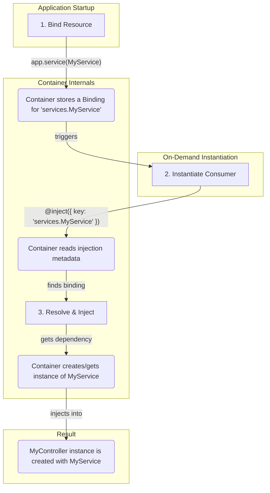

# Dependency Injection

Dependency Injection (DI) enables loosely coupled, testable code by automatically providing dependencies to classes.

> **Deep Dive:** See [DI Reference](../../references/base/dependency-injection.md) for technical details on Container, Binding, and `@inject`.

## Core Concepts

| Concept | Description |
| :--- | :--- |
| **Container** | The central registry for all your application's services and dependencies. The `Application` class itself acts as the container. |
| **Binding** | The process of registering a class or value with the container under a specific key (e.g., `'services.UserService'`). |
| **Injection**| The process of requesting a dependency from the container using the `@inject` decorator. |

### How It Works: The DI Flow



## Binding Dependencies

Before a dependency can be injected, it must be **bound** to the container. This is typically done in the `preConfigure` method of your `Application` class.

### Standard Resource Binding

The `Application` class provides helper methods for common resource types. These automatically create a binding with a conventional key.

| Method | Example Key |
| :--- | :--- |
| `app.service(UserService)` | `services.UserService` |
| `app.repository(UserRepository)` | `repositories.UserRepository` |
| `app.dataSource(PostgresDataSource)` | `datasources.PostgresDataSource` |
| `app.controller(UserController)` | `controllers.UserController` |
| `app.component(MyComponent)` | `components.MyComponent` |

### Custom Bindings

For other values or more complex setups, use the `bind` method directly.

```typescript
// In your application class's preConfigure()
this.bind<MyCustomClass>({ key: 'MyCustomClass' }).toClass(MyCustomClass);

this.bind<string>({ key: 'API_KEY' }).toValue('my-secret-api-key');
```

### Binding Scopes

You can control the lifecycle of your dependencies with scopes.

-   **`TRANSIENT`** (default): A new instance is created every time the dependency is injected.
-   **`SINGLETON`**: A single instance is created once and reused for all subsequent injections.

```typescript
this.bind({ key: 'services.MySingletonService' })
  .toClass(MySingletonService)
  .setScope(BindingScopes.SINGLETON); // Use SINGLETON for this service
```

## Injecting Dependencies

`Ignis` provides the `@inject` decorator to request dependencies from the container.

### Constructor Injection (Recommended)

This makes dependencies explicit and ensures they are available right away.

```typescript
import { BaseController, controller, inject } from '@vez/ignis';
import { UserService } from '../services/user.service';

@controller({ path: '/users' })
export class UserController extends BaseController {
  constructor(
    @inject({ key: 'services.UserService' })
    private userService: UserService
  ) {
    super({ scope: UserController.name, path: '/users' });
  }

  // ... you can now use this.userService
}
```

### Property Injection

You can also inject dependencies directly as class properties.

```typescript
import { inject } from '@vez/ignis';
import { UserService } from '../services/user.service';

export class UserComponent {
  @inject({ key: 'services.UserService' })
  private userService: UserService;
  
  // ...
}
```

## Providers

Providers are used for dependencies that require complex setup logic. A provider is a class that implements a `value()` method, which is responsible for creating and returning the dependency instance.

### Creating a Custom Provider

```typescript
import { BaseProvider, inject, Container, IConfig } from '@vez/ignis';
import { ThirdPartyApiClient } from '../services/api-client.service';

// Assume IConfig is a configuration object we've bound elsewhere
@injectable() // Make the provider itself injectable
export class ApiClientProvider extends BaseProvider<ThirdPartyApiClient> {
  @inject({ key: 'configs.api' })
  private apiConfig: IConfig;
  
  // The container calls this method to get the instance
  value(container: Container): ThirdPartyApiClient {
    const client = new ThirdPartyApiClient({
      apiKey: this.apiConfig.apiKey,
      baseUrl: this.apiConfig.baseUrl,
    });
    client.connect(); // Perform initial setup
    return client;
  }
}
```

You would then bind this provider in your application:

```typescript
// In your application class
this.bind<ThirdPartyApiClient>({ key: 'services.ApiClient' })
  .toProvider(ApiClientProvider);
```
