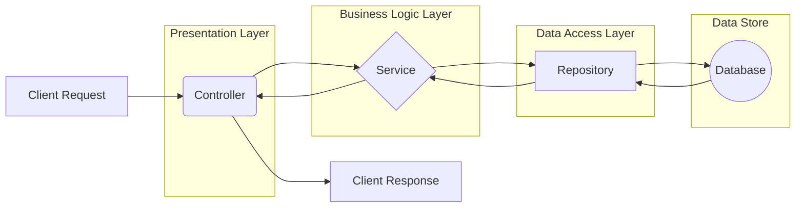

# Services

In the Ignis framework, the application's logic is organized into **Services**. This layer is a key principle of the framework's architecture, promoting clean, maintainable, and testable code.

> **Deep Dive:** For a technical breakdown of the underlying `BaseService` class, see the [**Deep Dive: Services**](../../references/base/services.md) page.

## The Business Logic Layer

Services contain the core business logic of your application. They orchestrate the flow of data and execute the application's use cases. A service's primary responsibilities are:

-   **Encapsulating Business Rules**: Centralizing logic such as calculations, data validation, and process workflows.
-   **Coordinating Data Operations**: Using one or more repositories to fetch and persist data.
-   **Isolating Controllers**: Keeping controllers thin by handling all the complex logic, so controllers are only responsible for handling the HTTP request and response.

### Creating a Service

To create a service, you extend the `BaseService` class and inject the repositories or other services it depends on.

```typescript
import { BaseService, inject } from '@vez/ignis';
import { ConfigurationRepository } from '../repositories';
import { UserRepository } from '../repositories';
import { TConfiguration } from '../models/entities';

export class ConfigurationService extends BaseService {
  constructor(
    @inject({ key: 'repositories.ConfigurationRepository' }) 
    private configurationRepository: ConfigurationRepository,
    @inject({ key: 'repositories.UserRepository' }) 
    private userRepository: UserRepository,
  ) {
    super({ scope: ConfigurationService.name });
  }

  async createConfigurationForUser(userId: string, data: Partial<TConfiguration>): Promise<TConfiguration> {
    // Business logic: Check if the user exists
    const user = await this.userRepository.findById({ id: userId });
    if (!user) {
      throw new Error(`User with ID ${userId} not found.`);
    }
    
    // Business logic: Check for duplicate configuration code
    const existingConfig = await this.configurationRepository.findOne({ where: { code: data.code } });
    if (existingConfig) {
      throw new Error('Configuration with this code already exists.');
    }

    // Use the repository to create the configuration, assigning the creator
    const newConfigData = { ...data, createdBy: userId, modifiedBy: userId };
    return this.configurationRepository.create(newConfigData);
  }
}
```

## How Services Fit into the Architecture

Services act as the intermediary between controllers and repositories, ensuring a clean separation of concerns.



This layered architecture makes your application:

-   **More Organized:** Each layer has a clear and distinct responsibility.
-   **Easier to Test:** You can test your business logic in isolation by providing mock repositories to your services, without needing a live database.
-   **More Flexible:** You can change your database or data access implementation (e.g., switch from PostgreSQL to MySQL) by only changing the repository and datasource layer, with no changes to your business logic.
