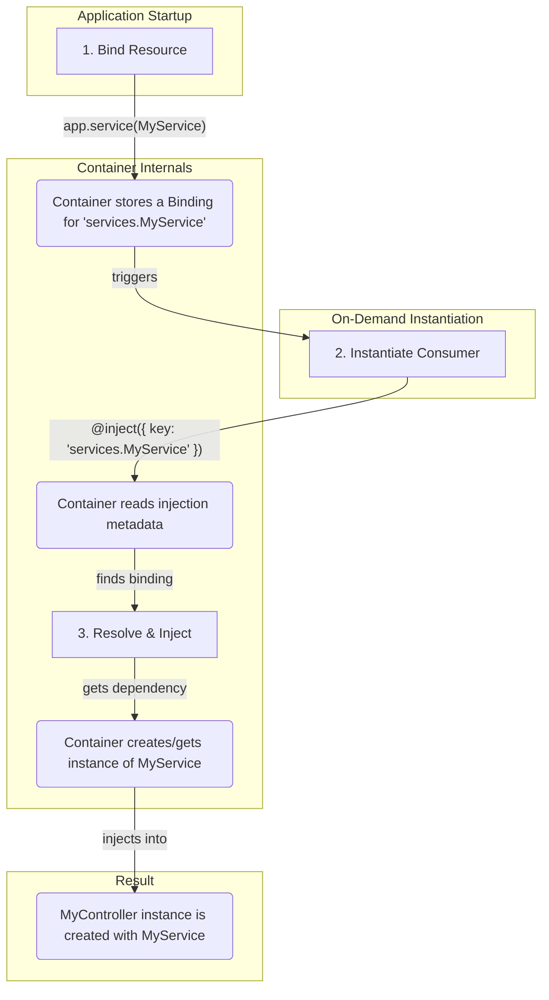

# Dependency Injection

Dependency Injection (DI) enables loosely coupled, testable code by automatically providing dependencies to classes.

> **Deep Dive:** See [DI Reference](../../references/base/dependency-injection.md) for technical details on Container, Binding, and `@inject`.

> **Standalone Package:** The core DI container is available as the standalone `@venizia/ignis-inversion` package for use outside the Ignis framework. See [Inversion Package Reference](../../references/src-details/inversion.md) for details.

## Core Concepts

| Concept | Description |
| :--- | :--- |
| **Container** | The central registry for all your application's services and dependencies. The `Application` class itself acts as the container. |
| **Binding** | The process of registering a class or value with the container under a specific key (e.g., `'services.UserService'`). |
| **Injection**| The process of requesting a dependency from the container using the `@inject` decorator. |

### How It Works: The DI Flow



## Binding Dependencies

Before a dependency can be injected, it must be **bound** to the container. This is typically done in the `preConfigure` method of your `Application` class.

### Standard Resource Binding

The `Application` class provides helper methods for common resource types. These automatically create a binding with a conventional key.

| Method | Default Key |
| :--- | :--- |
| `app.service(UserService)` | `services.UserService` |
| `app.repository(UserRepository)` | `repositories.UserRepository` |
| `app.dataSource(PostgresDataSource)` | `datasources.PostgresDataSource` |
| `app.controller(UserController)` | `controllers.UserController` |
| `app.component(MyComponent)` | `components.MyComponent` |

All these methods accept an optional second parameter to customize the binding key:

```typescript
// Default binding (key: 'controllers.UserController')
app.controller(UserController);

// Custom binding key
app.controller(UserController, {
  binding: { namespace: 'controllers', key: 'CustomUserController' }
});
```

### Custom Bindings

For other values or more complex setups, use the `bind` method directly.

```typescript
// In your application class's preConfigure()
this.bind<MyCustomClass>({ key: 'MyCustomClass' }).toClass(MyCustomClass);

this.bind<string>({ key: 'API_KEY' }).toValue('my-secret-api-key');
```

### Binding Scopes

You can control the lifecycle of your dependencies with scopes.

-   **`TRANSIENT`** (default): A new instance is created every time the dependency is injected.
-   **`SINGLETON`**: A single instance is created once and reused for all subsequent injections.

```typescript
this.bind({ key: 'services.MySingletonService' })
  .toClass(MySingletonService)
  .setScope(BindingScopes.SINGLETON); // Use SINGLETON for this service
```

## Injecting Dependencies

`Ignis` provides the `@inject` decorator to request dependencies from the container.

### Constructor Injection (Recommended)

This makes dependencies explicit and ensures they are available right away.

```typescript
import { BaseController, controller, inject } from '@venizia/ignis';
import { UserService } from '../services/user.service';

@controller({ path: '/users' })
export class UserController extends BaseController {
  constructor(
    @inject({ key: 'services.UserService' })
    private userService: UserService
  ) {
    super({ scope: UserController.name, path: '/users' });
  }

  // ... you can now use this.userService
}
```

### Property Injection

You can also inject dependencies directly as class properties.

```typescript
import { inject } from '@venizia/ignis';
import { UserService } from '../services/user.service';

export class UserComponent {
  @inject({ key: 'services.UserService' })
  private userService: UserService;
  
  // ...
}
```

## Providers

Providers are used for dependencies that require complex setup logic. A provider is a class that implements a `value()` method, which is responsible for creating and returning the dependency instance.

### Creating a Custom Provider

```typescript
import { BaseProvider, inject, Container, IConfig } from '@venizia/ignis';
import { ThirdPartyApiClient } from '../services/api-client.service';

// Assume IConfig is a configuration object we've bound elsewhere
@injectable() // Make the provider itself injectable
export class ApiClientProvider extends BaseProvider<ThirdPartyApiClient> {
  @inject({ key: 'configs.api' })
  private apiConfig: IConfig;
  
  // The container calls this method to get the instance
  value(container: Container): ThirdPartyApiClient {
    const client = new ThirdPartyApiClient({
      apiKey: this.apiConfig.apiKey,
      baseUrl: this.apiConfig.baseUrl,
    });
    client.connect(); // Perform initial setup
    return client;
  }
}
```

You would then bind this provider in your application:

```typescript
// In your application class
this.bind<ThirdPartyApiClient>({ key: 'services.ApiClient' })
  .toProvider(ApiClientProvider);
```

## Standalone Containers

You can create independent DI containers using the `Container` class directly. These containers are **completely separate** from the application's context and do not share any bindings.

### Creating an Independent Container

```typescript
import { Container, BindingScopes } from '@venizia/ignis-inversion';

// Create a standalone container
const container = new Container({ scope: 'MyCustomContainer' });

// Bind dependencies
container.bind({ key: 'config.apiKey' }).toValue('my-secret-key');
container.bind({ key: 'services.Logger' }).toClass(LoggerService);
container.bind({ key: 'services.Cache' })
  .toClass(CacheService)
  .setScope(BindingScopes.SINGLETON);

// Resolve dependencies
const logger = container.get<LoggerService>({ key: 'services.Logger' });
const apiKey = container.getSync<string>({ key: 'config.apiKey' });
```

### Use Cases

| Use Case | Description |
|----------|-------------|
| **Unit Testing** | Create isolated containers with mock dependencies for each test |
| **Isolated Modules** | Build self-contained modules with their own dependency graph |
| **Multi-Tenancy** | Separate containers per tenant with tenant-specific configurations |
| **Worker Threads** | Independent containers for background workers |
| **Plugin Systems** | Each plugin gets its own container to prevent conflicts |

### Example: Testing with Isolated Container

```typescript
import { Container } from '@venizia/ignis-inversion';
import { describe, it, expect, beforeEach } from 'bun:test';

describe('UserService', () => {
  let container: Container;

  beforeEach(() => {
    // Fresh container for each test
    container = new Container({ scope: 'TestContainer' });

    // Bind mock dependencies
    container.bind({ key: 'repositories.UserRepository' }).toValue({
      findById: async () => ({ id: '1', name: 'Test User' }),
    });

    container.bind({ key: 'services.UserService' }).toClass(UserService);
  });

  it('should find user by id', async () => {
    const userService = container.get<UserService>({ key: 'services.UserService' });
    const user = await userService.findById({ id: '1' });

    expect(user.name).toBe('Test User');
  });
});
```

### Container vs Application

| Aspect | `Application` (extends Container) | Standalone `Container` |
|--------|-----------------------------------|------------------------|
| **Purpose** | Full HTTP server with routing, middleware | Pure dependency injection |
| **Bindings** | Shared across entire application | Isolated, no sharing |
| **Lifecycle** | Managed by framework | You control it |
| **Use Case** | Main application | Testing, isolated modules, workers |

::: tip
The `Application` class extends `Container`, so all container methods (`bind`, `get`, `getSync`) are available on your application instance. Standalone containers are useful when you need isolation from the main application context.
:::

## See Also

- **Related Concepts:**
  - [Application](/guides/core-concepts/application/) - Application extends Container
  - [Controllers](/guides/core-concepts/controllers) - Use DI for injecting services
  - [Services](/guides/core-concepts/services) - Use DI for injecting repositories
  - [Providers](/references/base/providers) - Factory pattern for dynamic injection

- **References:**
  - [Dependency Injection API](/references/base/dependency-injection) - Complete API reference
  - [Inversion Helper](/references/helpers/inversion) - DI container utilities
  - [Glossary](/guides/reference/glossary#dependency-injection-di) - DI concepts explained

- **Tutorials:**
  - [Testing](/guides/tutorials/testing) - Unit testing with mocked dependencies
  - [Building a CRUD API](/guides/tutorials/building-a-crud-api) - DI in practice

- **Best Practices:**
  - [Architectural Patterns](/best-practices/architectural-patterns) - DI patterns and anti-patterns
