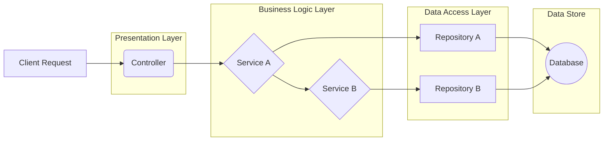

# Services

Services contain your application's business logic, orchestrating data flow and executing use cases.

> **Deep Dive:** See [Services Reference](../../references/base/services.md) for advanced patterns.

## The Business Logic Layer

Services contain the core business logic of your application. They orchestrate the flow of data and execute the application's use cases. A service's primary responsibilities are:

-   **Encapsulating Business Rules**: Centralizing logic such as calculations, data validation, and process workflows.
-   **Coordinating Operations**: Using repositories to fetch and persist data, or orchestrating other services to execute complex business workflows.
-   **Reusing Business Logic**: Services can inject other services to reuse established logic, ensuring "Don't Repeat Yourself" (DRY) principles are maintained across the application.
-   **Isolating Controllers**: Keeping controllers thin by handling all the complex logic, so controllers are only responsible for handling the HTTP request and response.

### Creating a Service

To create a service, you extend the `BaseService` class and inject the repositories or other services it depends on.

```typescript
import { BaseService, inject, getError } from '@venizia/ignis';
import { ConfigurationRepository } from '../repositories';
import { UserRepository } from '../repositories';
import { LoggingService } from './logging.service'; // Example of another service
import { TConfiguration } from '../models/entities';

export class ConfigurationService extends BaseService {
  constructor(
    @inject({ key: 'repositories.ConfigurationRepository' }) 
    private configurationRepository: ConfigurationRepository,
    @inject({ key: 'repositories.UserRepository' }) 
    private userRepository: UserRepository,
    @inject({ key: 'services.LoggingService' })
    private loggingService: LoggingService, // Injecting another service for reuse
  ) {
    super({ scope: ConfigurationService.name });
  }

  async createConfigurationForUser(opts: {
    userId: string;
    data: Partial<TConfiguration>;
  }): Promise<TConfiguration> {
    // Call another service logic
    await this.loggingService.audit({ message: `Creating config for user: ${opts.userId}` });

    // Business logic: Check if the user exists
    const user = await this.userRepository.findById({ id: opts.userId });
// ...
```

## How Services Fit into the Architecture

Services act as the primary layer for business logic, sitting between controllers and repositories. While controllers are the typical entry point, **services can also inject and call other services**. This enables powerful logic reuse and allows you to build complex use cases by composing smaller, specialized services.



This layered architecture makes your application:

-   **More Organized:** Each layer has a clear and distinct responsibility.
-   **Easier to Test:** You can test your business logic in isolation by providing mock repositories to your services, without needing a live database.
-   **More Flexible:** You can change your database or data access implementation (e.g., switch from PostgreSQL to MySQL) by only changing the repository and datasource layer, with no changes to your business logic.
