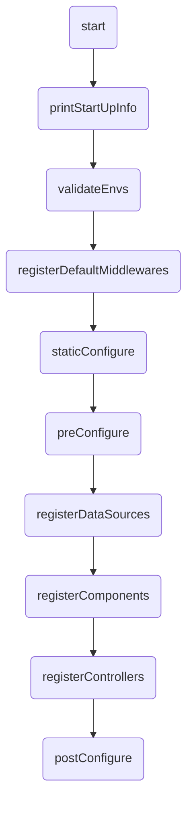

# Deep Dive: Application

Technical reference for `AbstractApplication` and `BaseApplication` - the foundation classes for every Ignis application.

**Files:**
- `packages/core/src/base/applications/abstract.ts`
- `packages/core/src/base/applications/base.ts`

## Quick Reference

| Class | Purpose | Key Methods |
|-------|---------|-------------|
| **AbstractApplication** | Base class with lifecycle management | `preConfigure()`, `postConfigure()`, `validateEnvs()` |
| **BaseApplication** | Concrete implementation with resource registration | `component()`, `controller()`, `service()`, `repository()`, `dataSource()` |

## `AbstractApplication`

Base class responsible for core lifecycle and server management.

### Key Features

| Feature | Description |
| :--- | :--- |
| **Hono Instance** | Creates and holds the `OpenAPIHono` instance (underlying web server) |
| **Runtime Detection** | Auto-detects Bun or Node.js and uses appropriate server implementation |
| **Core Bindings** | Registers essential services (`CoreBindings.APPLICATION_INSTANCE`, `CoreBindings.APPLICATION_SERVER`) |
| **Lifecycle Management** | Defines abstract methods (`preConfigure`, `postConfigure`, `setupMiddlewares`) |
| **Environment Validation** | Validates all required `APP_ENV_*` environment variables |

## `BaseApplication`

Extends `AbstractApplication` with concrete lifecycle implementations and resource registration.

### Resource Registration Methods

`BaseApplication` provides a set of convenient methods for registering your application's building blocks. These methods bind the provided classes to the DI container with conventional keys.

| Method | DI Binding Key Convention |
| :--- | :--- |
| `component(MyComponent, opts?)` | `components.MyComponent` (default) or custom key via `opts.binding` |
| `controller(MyController, opts?)` | `controllers.MyController` (default) or custom key via `opts.binding` |
| `service(MyService, opts?)` | `services.MyService` (default) or custom key via `opts.binding` |
| `repository(MyRepository, opts?)`| `repositories.MyRepository` (default) or custom key via `opts.binding` |
| `dataSource(MyDataSource, opts?)`| `datasources.MyDataSource` (default) or custom key via `opts.binding` |

### `initialize()` Method Flow

Startup sequence executed by the `initialize()` method:

| Hook | When to Use | Notes |
|------|-------------|-------|
| **`preConfigure()`** | Register all resources (datasources, services, controllers) | Nothing instantiated yet - order doesn't matter |
| **`register...()`** | Framework iterates bindings and instantiates classes | DataSources initialized first (other layers depend on them) |
| **`postConfigure()`** | Logic after all resources configured | Example: fetch initial data from repository |

## See Also

- **Related Concepts:**
  - [Application Guide](/guides/core-concepts/application/) - Creating your first application
  - [Bootstrapping](/guides/core-concepts/application/bootstrapping) - Auto-discovery of artifacts
  - [Dependency Injection](/guides/core-concepts/dependency-injection) - How DI works in IGNIS
  - [Controllers](/guides/core-concepts/controllers) - Registering HTTP endpoints

- **References:**
  - [Bootstrapping API](/references/base/bootstrapping) - Boot system reference
  - [Components API](/references/base/components) - Component system
  - [Environment Variables](/references/configuration/environment-variables) - Configuration management
  - [Middlewares](/references/base/middlewares) - Request interceptors

- **Tutorials:**
  - [5-Minute Quickstart](/guides/get-started/5-minute-quickstart) - Create your first app
  - [Building a CRUD API](/guides/tutorials/building-a-crud-api) - Complete application example

- **Best Practices:**
  - [Architectural Patterns](/best-practices/architectural-patterns) - Application structure patterns
