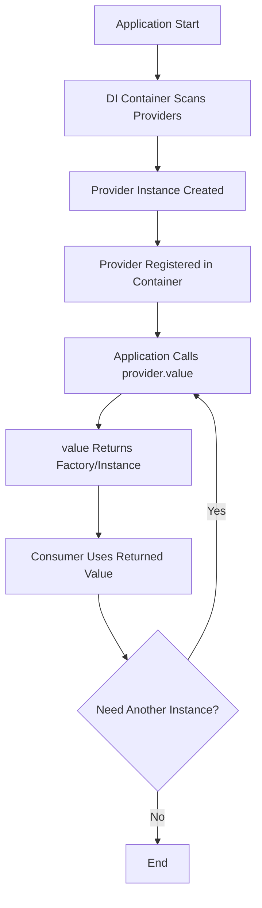

# Providers Reference

Providers implement the Factory pattern in IGNIS, allowing you to create and configure instances dynamically at runtime based on configuration or context. Unlike services that contain business logic, providers are factories that produce values, instances, or functions.

**Files:**
- `packages/core/src/base/providers/base.ts`

## Prerequisites

Before reading this document, you should understand:
- [TypeScript basics](https://www.typescriptlang.org/docs/)
- [Dependency Injection in IGNIS](./dependency-injection.md)
- [Services](./services.md) - To understand the difference

## Quick Reference

| Feature | Description |
|---------|-------------|
| **Purpose** | Factory pattern for runtime instance creation |
| **Base Class** | `BaseProvider<T>` |
| **Key Method** | `value(container: Container): T` |
| **Use Case** | Dynamic configuration, multi-strategy patterns, plugin systems |
| **Extends** | `BaseHelper` (provides logging) |
| **Implements** | `IProvider<T>` from `@venizia/ignis-inversion` |

## What is a Provider?

A **Provider** is a class that implements the Factory pattern, responsible for creating and configuring instances based on runtime conditions, configuration, or context.

### Core Characteristics

1. **Factory Pattern**: Produces values, instances, or functions
2. **Configuration-Driven**: Creates different implementations based on config
3. **Deferred Creation**: Instances are created when needed, not at startup
4. **Type-Safe**: Generic type `T` ensures type safety of produced values

### Common Use Cases

- **Strategy Selection**: Choose between multiple implementations (e.g., email providers: Nodemailer, Mailgun, SendGrid)
- **Configuration-Based Instantiation**: Create instances with different configurations
- **Plugin Systems**: Load and configure plugins dynamically
- **Multi-Tenant**: Provide tenant-specific instances
- **Feature Flags**: Enable/disable features at runtime

---

## BaseProvider Class

Abstract base class for all providers in IGNIS.

### Class Definition

```typescript
import { Container } from '@/helpers/inversion';
import { BaseHelper } from '@venizia/ignis-helpers';
import { IProvider } from '@venizia/ignis-inversion';

export abstract class BaseProvider<T> extends BaseHelper implements IProvider<T> {
  abstract value(container: Container): T;
}
```

### Generic Type Parameter

| Parameter | Description |
|-----------|-------------|
| `T` | The type of value this provider produces |

**Examples:**
- `BaseProvider<IMailTransport>` - Produces mail transport instances
- `BaseProvider<MiddlewareHandler>` - Produces Hono middleware
- `BaseProvider<(config: Config) => Service>` - Produces factory functions

### Inheritance

- **Extends `BaseHelper`**: Provides scoped logging via `this.logger`
- **Implements `IProvider<T>`**: Enforces the `value(container: Container): T` contract

### Abstract Method: `value(container: Container): T`

The `value` method is where you implement your factory logic.

**Parameters:**
| Parameter | Type | Description |
|-----------|------|-------------|
| `container` | `Container` | DI container instance for resolving dependencies |

**Returns:** `T` - The produced value, instance, or factory function

**Purpose:**
- Access to DI container allows resolving other dependencies
- Create and configure instances based on logic
- Return factories for deferred instantiation

---

## Provider vs Service

Understanding when to use Providers vs Services is crucial for proper architecture.

### Comparison Table

| Aspect | Provider | Service |
|--------|----------|---------|
| **Purpose** | Create/configure instances | Contain business logic |
| **Pattern** | Factory pattern | Business logic layer |
| **Method** | `value(container)` returns factory | Business methods (CRUD, etc.) |
| **Lifecycle** | Creates instances on-demand | Single instance per DI scope |
| **Dependencies** | Produces configured instances | Uses repositories/other services |
| **Example** | `MailTransportProvider` | `UserService` |
| **Returns** | Values, instances, or functions | Business data/results |

### When to Use Providers

Use providers when you need:

```typescript
// ✅ Multiple implementations to choose from
class MailTransportProvider extends BaseProvider<TGetMailTransportFn> {
  value(container: Container): TGetMailTransportFn {
    return (options) => {
      switch (options.provider) {
        case 'nodemailer': return new NodemailerTransport(options);
        case 'mailgun': return new MailgunTransport(options);
        case 'sendgrid': return new SendGridTransport(options);
      }
    };
  }
}

// ✅ Configuration-based instance creation
class DatabaseProvider extends BaseProvider<Database> {
  value(container: Container): Database {
    const config = container.get(ConfigService);
    return new Database({
      host: config.get('DB_HOST'),
      port: config.get('DB_PORT'),
    });
  }
}

// ✅ Runtime factory functions
class CacheProvider extends BaseProvider<(key: string) => Cache> {
  value(container: Container): (key: string) => Cache {
    return (key: string) => new Cache({ namespace: key });
  }
}
```

### When to Use Services

Use services when you need:

```typescript
// ✅ Business logic
class UserService extends BaseService {
  async createUser(data: CreateUserDto) {
    // Validation, transformation, business rules
    const user = await this.userRepository.create(data);
    await this.emailService.sendWelcome(user.email);
    return user;
  }
}

// ✅ Orchestration between repositories
class OrderService extends BaseService {
  async createOrder(items: CartItem[]) {
    const order = await this.orderRepository.create(items);
    await this.inventoryRepository.decrementStock(items);
    await this.paymentService.charge(order.total);
    return order;
  }
}
```

:::tip Quick Decision
- **Need to produce different implementations?** → Use a Provider
- **Need to implement business logic?** → Use a Service
:::

---

## Creating Custom Providers

### Basic Provider

```typescript
import { BaseProvider } from '@venizia/ignis';
import { Container } from '@venizia/ignis-inversion';
import { injectable } from '@venizia/ignis-inversion';

interface ILogger {
  log(message: string): void;
}

class ConsoleLogger implements ILogger {
  log(message: string) {
    console.log(message);
  }
}

class FileLogger implements ILogger {
  constructor(private filePath: string) {}

  log(message: string) {
    // Write to file
  }
}

@injectable()
export class LoggerProvider extends BaseProvider<ILogger> {
  constructor() {
    super({ scope: LoggerProvider.name });
  }

  value(container: Container): ILogger {
    const env = process.env.NODE_ENV;

    if (env === 'production') {
      this.logger.info('[value] Creating FileLogger for production');
      return new FileLogger('/var/log/app.log');
    }

    this.logger.info('[value] Creating ConsoleLogger for development');
    return new ConsoleLogger();
  }
}
```

### Factory Function Provider

Providers can return factory functions for deferred instantiation:

```typescript
type TGetMailTransportFn = (options: MailOptions) => IMailTransport;

@injectable()
export class MailTransportProvider extends BaseProvider<TGetMailTransportFn> {
  constructor() {
    super({ scope: MailTransportProvider.name });
  }

  value(container: Container): TGetMailTransportFn {
    // Return a factory function
    return (options: MailOptions) => {
      this.logger.info('[value] Creating mail transport: %s', options.provider);

      switch (options.provider) {
        case 'nodemailer':
          return new NodemailerTransport(options.config);
        case 'mailgun':
          return new MailgunTransport(options.config);
        default:
          throw new Error(`Unknown provider: ${options.provider}`);
      }
    };
  }
}

// Usage
const getTransport = app.get(MailTransportProvider).value(container);
const transport = getTransport({ provider: 'nodemailer', config: {...} });
```

### Provider with Dependency Injection

Access other dependencies through the container:

```typescript
@injectable()
export class DatabaseProvider extends BaseProvider<Database> {
  constructor() {
    super({ scope: DatabaseProvider.name });
  }

  value(container: Container): Database {
    // Resolve dependencies from container
    const config = container.get(ConfigService);
    const logger = container.get(LoggerService);

    const database = new Database({
      host: config.get('DB_HOST'),
      port: config.get('DB_PORT'),
      logger: logger,
    });

    this.logger.info('[value] Database instance created');
    return database;
  }
}
```

---

## Provider Lifecycle

Understanding the provider lifecycle helps you use them effectively.

### Lifecycle Stages



### Key Points

1. **Provider Instance Created Once**: The provider class itself is instantiated once by the DI container
2. **`value()` Called When Needed**: The `value(container)` method is called when the application needs the produced value
3. **Factory vs Instance**: Providers can return:
   - Direct instances (created each time `value()` is called)
   - Factory functions (deferred creation)
   - Singleton instances (same instance each time)

### Example: Singleton vs Factory

```typescript
// Singleton: Same instance every time
@injectable()
export class SingletonDatabaseProvider extends BaseProvider<Database> {
  private instance?: Database;

  value(container: Container): Database {
    if (!this.instance) {
      this.instance = new Database({...});
      this.logger.info('[value] Database singleton created');
    }
    return this.instance;
  }
}

// Factory: New instance every time
@injectable()
export class FactoryDatabaseProvider extends BaseProvider<Database> {
  value(container: Container): Database {
    this.logger.info('[value] Creating new Database instance');
    return new Database({...});
  }
}
```

---

## Real-World Examples

### Example 1: Mail Transport Provider

From `packages/core/src/components/mail/providers/mail-transporter.provider.ts`:

```typescript
type TGetMailTransportFn = (options: TMailOptions) => IMailTransport;

@injectable()
export class MailTransportProvider extends BaseProvider<TGetMailTransportFn> {
  constructor() {
    super({ scope: MailTransportProvider.name });
  }

  value(_container: Container): TGetMailTransportFn {
    return (options: TMailOptions) => {
      this.logger.info('[value] Creating mail transport: %s', options.provider);

      switch (options.provider) {
        case MailProviders.NODEMAILER:
          return this.createNodemailerTransport(options);

        case MailProviders.MAILGUN:
          return this.createMailgunTransport(options);

        case MailProviders.CUSTOM:
          return this.createCustomTransport(options);

        default:
          throw new Error(`Unsupported provider: ${options.provider}`);
      }
    };
  }

  private createNodemailerTransport(options: INodemailerMailOptions) {
    this.logger.info('[createNodemailerTransport] Initializing');
    return new NodemailerTransportHelper(options.config);
  }

  private createMailgunTransport(options: IMailgunMailOptions) {
    this.logger.info('[createMailgunTransport] Initializing');
    return new MailgunTransportHelper(options.config);
  }

  private createCustomTransport(options: ICustomMailOptions) {
    this.logger.info('[createCustomTransport] Using custom transport');
    return options.config; // Already implements IMailTransport
  }
}
```

**Usage:**

```typescript
// In your service or application setup
const getMailTransport = app.get(MailTransportProvider).value(container);

// Create Nodemailer transport
const nodemailerTransport = getMailTransport({
  provider: MailProviders.NODEMAILER,
  config: { /* nodemailer config */ }
});

// Create Mailgun transport
const mailgunTransport = getMailTransport({
  provider: MailProviders.MAILGUN,
  config: { /* mailgun config */ }
});
```

### Example 2: Queue Executor Provider

From `packages/core/src/components/mail/providers/mail-queue-executor.provider.ts`:

```typescript
type TGetMailQueueExecutorFn = (config: IMailQueueExecutorConfig) => IMailQueueExecutor;

@injectable()
export class MailQueueExecutorProvider extends BaseProvider<TGetMailQueueExecutorFn> {
  constructor() {
    super({ scope: MailQueueExecutorProvider.name });
  }

  value(_container: Container): TGetMailQueueExecutorFn {
    return (config: IMailQueueExecutorConfig) => {
      this.logger.info('[value] Creating executor: %s', config.type);

      switch (config.type) {
        case MailQueueExecutorTypes.DIRECT:
          return new DirectMailExecutorHelper();

        case MailQueueExecutorTypes.INTERNAL_QUEUE:
          return new InternalQueueMailExecutorHelper({
            identifier: config.internalQueue.identifier,
          });

        case MailQueueExecutorTypes.BULLMQ:
          return new BullMQMailExecutorHelper(config.bullmq);

        default:
          throw new Error(`Unknown type: ${config.type}`);
      }
    };
  }
}
```

### Example 3: Middleware Provider

Providers can also produce middleware:

```typescript
import { RequestSpyMiddleware } from '@venizia/ignis';

// RequestSpyMiddleware is a provider that produces Hono middleware
@injectable()
export class RequestSpyMiddleware extends BaseHelper implements IProvider<MiddlewareHandler> {
  static readonly REQUEST_ID_KEY = 'requestId';

  constructor() {
    super({ scope: RequestSpyMiddleware.name });
  }

  value() {
    return createMiddleware(async (context, next) => {
      const requestId = context.get(RequestSpyMiddleware.REQUEST_ID_KEY);

      this.logger.info('[spy][%s] START | path: %s', requestId, context.req.path);

      await next();

      this.logger.info('[spy][%s] DONE | path: %s', requestId, context.req.path);
    });
  }
}

// Usage
const requestSpy = new RequestSpyMiddleware();
app.use(requestSpy.value());
```

---

## Common Patterns

### Pattern 1: Configuration Validator

Validate configuration before creating instances:

```typescript
@injectable()
export class S3StorageProvider extends BaseProvider<S3Storage> {
  constructor() {
    super({ scope: S3StorageProvider.name });
  }

  value(container: Container): S3Storage {
    const config = container.get(ConfigService);

    const accessKey = config.get('AWS_ACCESS_KEY');
    const secretKey = config.get('AWS_SECRET_KEY');
    const bucket = config.get('AWS_S3_BUCKET');

    // Validate configuration
    if (!accessKey || !secretKey || !bucket) {
      throw new Error('S3 configuration incomplete');
    }

    this.logger.info('[value] Creating S3 storage for bucket: %s', bucket);

    return new S3Storage({
      accessKeyId: accessKey,
      secretAccessKey: secretKey,
      bucket: bucket,
    });
  }
}
```

### Pattern 2: Lazy Singleton

Create instance only once, lazily:

```typescript
@injectable()
export class DatabaseConnectionProvider extends BaseProvider<DatabaseConnection> {
  private connection?: DatabaseConnection;

  value(container: Container): DatabaseConnection {
    if (!this.connection) {
      this.logger.info('[value] Creating database connection');
      const config = container.get(ConfigService);
      this.connection = new DatabaseConnection(config.get('DATABASE_URL'));
    } else {
      this.logger.debug('[value] Reusing existing connection');
    }

    return this.connection;
  }
}
```

### Pattern 3: Environment-Based Strategy

Select implementation based on environment:

```typescript
@injectable()
export class CacheProvider extends BaseProvider<ICache> {
  value(container: Container): ICache {
    const env = process.env.NODE_ENV;

    if (env === 'test') {
      this.logger.info('[value] Using InMemoryCache for testing');
      return new InMemoryCache();
    }

    if (env === 'production') {
      this.logger.info('[value] Using RedisCache for production');
      const config = container.get(ConfigService);
      return new RedisCache({
        host: config.get('REDIS_HOST'),
        port: config.get('REDIS_PORT'),
      });
    }

    this.logger.info('[value] Using InMemoryCache for development');
    return new InMemoryCache();
  }
}
```

---

## Common Pitfalls

### Pitfall 1: Forgetting to Call `value()`

```typescript
// ❌ Wrong: Getting the provider instance
const provider = app.get(MailTransportProvider);
const transport = provider({ provider: 'nodemailer' }); // Error!

// ✅ Correct: Call value() first
const provider = app.get(MailTransportProvider);
const getTransport = provider.value(container);
const transport = getTransport({ provider: 'nodemailer' });
```

### Pitfall 2: Creating Instances in Constructor

```typescript
// ❌ Wrong: Creating instances in constructor
@injectable()
export class BadProvider extends BaseProvider<Database> {
  private db: Database;

  constructor() {
    super({ scope: BadProvider.name });
    this.db = new Database(); // Too early! Config might not be ready
  }

  value(container: Container): Database {
    return this.db;
  }
}

// ✅ Correct: Create in value() method
@injectable()
export class GoodProvider extends BaseProvider<Database> {
  constructor() {
    super({ scope: GoodProvider.name });
  }

  value(container: Container): Database {
    const config = container.get(ConfigService);
    return new Database(config.get('DATABASE_URL'));
  }
}
```

### Pitfall 3: Not Handling Errors

```typescript
// ❌ Wrong: No error handling
value(container: Container): IMailTransport {
  return new MailTransport(config.get('MAIL_CONFIG')); // Might throw
}

// ✅ Correct: Validate and handle errors
value(container: Container): IMailTransport {
  const config = container.get(ConfigService);
  const mailConfig = config.get('MAIL_CONFIG');

  if (!mailConfig) {
    throw new Error('Mail configuration is missing');
  }

  try {
    return new MailTransport(mailConfig);
  } catch (error) {
    this.logger.error('[value] Failed to create mail transport', error);
    throw error;
  }
}
```

---

## Performance Considerations

### Factory Functions vs Direct Instances

**Factory Functions** (Recommended for multiple instances):
```typescript
// Returns a factory - no instance created until called
value(container: Container): () => Service {
  return () => new Service();
}
```

**Direct Instances** (Use for singletons):
```typescript
// Creates instance immediately
value(container: Container): Service {
  return new Service();
}
```

### Caching Strategies

```typescript
// Cache expensive operations
@injectable()
export class ConfigProvider extends BaseProvider<Config> {
  private cachedConfig?: Config;

  value(container: Container): Config {
    if (this.cachedConfig) {
      return this.cachedConfig;
    }

    // Expensive operation: read files, parse, validate
    this.cachedConfig = this.loadAndValidateConfig();
    return this.cachedConfig;
  }

  private loadAndValidateConfig(): Config {
    // ... expensive operations
  }
}
```

---

## See Also

- **Related References:**
  - [Services](./services.md) - Business logic layer
  - [Dependency Injection](./dependency-injection.md) - DI container and injection
  - [Middlewares](./middlewares.md) - Middleware providers

- **Guides:**
  - [Dependency Injection Guide](/guides/core-concepts/dependency-injection.md)
  - [Building Services](/guides/core-concepts/services.md)

- **Best Practices:**
  - [Dependency Injection Patterns](/best-practices/architecture/dependency-injection.md)
  - [Service Layer Patterns](/best-practices/architecture/service-patterns.md)

- **External Resources:**
  - [Factory Pattern](https://refactoring.guru/design-patterns/factory-method)
  - [Dependency Injection Pattern](https://en.wikipedia.org/wiki/Dependency_injection)
