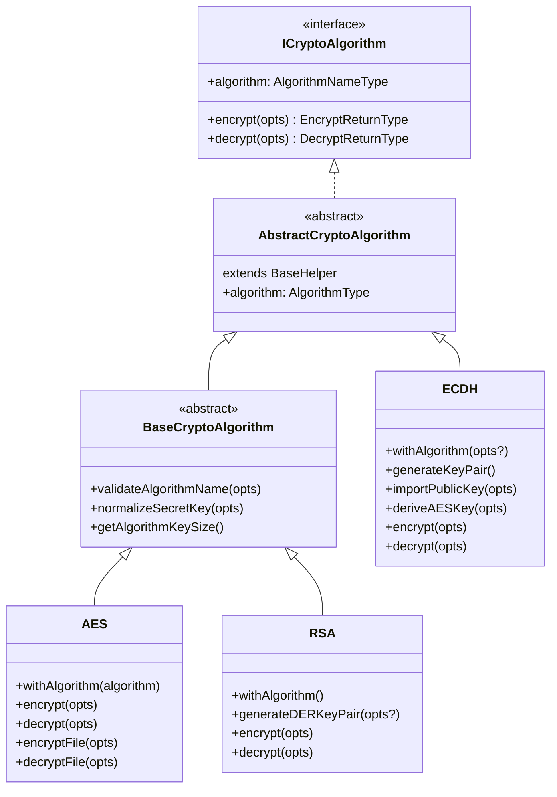

# Crypto Helper

Cryptographic utilities for AES symmetric encryption, RSA asymmetric encryption, ECDH key exchange, and hashing.

## Quick Reference

| Class/Function | Algorithm | Use Case |
|----------------|-----------|----------|
| **AES** | Symmetric | Fast encryption for data at rest (AES-256-CBC, AES-256-GCM) |
| **RSA** | Asymmetric | Key exchange, digital signatures (public/private DER keys) |
| **ECDH** | Asymmetric | Ephemeral key exchange with AES-256-GCM session encryption (Web Crypto API) |
| **hash()** | MD5, SHA256 | Passwords, data integrity (HMAC support) |

### Algorithm Comparison

| Feature | AES | RSA | ECDH |
|---------|-----|-----|------|
| Type | Symmetric | Asymmetric | Asymmetric + Symmetric |
| Key exchange | Shared secret | Public/private | Diffie-Hellman |
| Speed | Fast | Slow (large keys) | Fast (small keys) |
| Max message | Unlimited | ~190 bytes (2048-bit) | Unlimited |
| Async | No | No | Yes (Web Crypto) |
| Runtime | Node.js `crypto` | Node.js `crypto` | `crypto.subtle` (Bun/Browser) |

### Common Methods

| Operation | AES | RSA | ECDH |
|-----------|-----|-----|------|
| Encrypt | `aes.encrypt({ message, secret })` | `rsa.encrypt({ message, secret })` | `ecdh.encrypt({ message, secret })` |
| Decrypt | `aes.decrypt({ message, secret })` | `rsa.decrypt({ message, secret })` | `ecdh.decrypt({ message, secret })` |
| Key Generation | N/A (use secret string) | `rsa.generateDERKeyPair()` | `ecdh.generateKeyPair()` |

## Type Hierarchy

All crypto algorithms share a common type hierarchy with 7 generic type parameters:



**Why two base classes?**
- `BaseCryptoAlgorithm` adds `normalizeSecretKey()` and `getAlgorithmKeySize()` — useful for AES/RSA which use string secrets with size normalization
- `ECDH` extends `AbstractCryptoAlgorithm` directly because it uses `CryptoKey` objects (Web Crypto), not string secrets

## AES (Symmetric Encryption)

The `AES` class provides encryption and decryption using the Advanced Encryption Standard with 256-bit keys.

### AES Algorithms

| Algorithm | Mode | Features |
|-----------|------|----------|
| `aes-256-cbc` | CBC | Standard block cipher, widely compatible |
| `aes-256-gcm` | GCM | Authenticated encryption — detects tampering |

### Creating an AES Instance

```typescript
import { AES } from '@venizia/ignis-helpers';

const aesCbc = AES.withAlgorithm('aes-256-cbc');
const aesGcm = AES.withAlgorithm('aes-256-gcm');
```

### Encrypting Data

The `encrypt` method takes an options object with `message`, `secret`, and optional extra options.

```typescript
const secret = 'my-application-secret-key';
const message = 'This is a secret message.';

// Default: base64 output, random IV
const encrypted = aes.encrypt({ message, secret });
// => base64 encoded string containing IV + ciphertext
```

### Decrypting Data

```typescript
const decrypted = aes.decrypt({ message: encrypted, secret });
// => 'This is a secret message.'
```

### Extra Options

```typescript
import C from 'node:crypto';

// Custom IV and encoding
const encrypted = aes.encrypt({
  message: 'hello',
  secret: 'my-secret',
  opts: {
    iv: C.randomBytes(16),          // Custom IV (default: random)
    inputEncoding: 'utf-8',          // Message input encoding (default: 'utf-8')
    outputEncoding: 'hex',           // Ciphertext output encoding (default: 'base64')
    doThrow: false,                  // Return original message on error (default: true)
  },
});
```

### File Encryption

```typescript
// Encrypt file contents → returns encrypted string
const encrypted = aes.encryptFile({
  absolutePath: '/path/to/config.json',
  secret: 'my-secret',
});

// Decrypt file contents → returns decrypted string
const decrypted = aes.decryptFile({
  absolutePath: '/path/to/config.json.enc',
  secret: 'my-secret',
});
```

### GCM vs CBC

> [!TIP]
> Prefer `aes-256-gcm` for new applications. It provides **authenticated encryption** — if the ciphertext is tampered with, decryption will throw an error rather than silently returning corrupted data.

```typescript
const gcm = AES.withAlgorithm('aes-256-gcm');
const encrypted = gcm.encrypt({ message: 'sensitive data', secret });

// Tampering detection: modifying the ciphertext causes decryption to fail
// This does NOT happen with CBC mode
```

## RSA (Asymmetric Encryption)

The `RSA` class provides public-key encryption using RSA with DER-formatted keys.

### Creating an RSA Instance

```typescript
import { RSA } from '@venizia/ignis-helpers';

const rsa = RSA.withAlgorithm();
```

### Generating a Key Pair

Keys are generated in DER format (binary, compact).

```typescript
// Default: 2048-bit modulus
const { publicKey, privateKey } = rsa.generateDERKeyPair();

// Custom modulus length
const keys = rsa.generateDERKeyPair({ modulus: 4096 });
```

### Encrypting Data

Encrypt using the public key (base64-encoded DER).

```typescript
const pubKeyB64 = publicKey.toString('base64');
const encrypted = rsa.encrypt({ message: 'secret data', secret: pubKeyB64 });
```

### Decrypting Data

Decrypt using the private key (base64-encoded DER).

```typescript
const privKeyB64 = privateKey.toString('base64');
const decrypted = rsa.decrypt({ message: encrypted, secret: privKeyB64 });
// => 'secret data'
```

### Extra Options

```typescript
const encrypted = rsa.encrypt({
  message: 'hello',
  secret: pubKeyB64,
  opts: {
    inputEncoding: {
      key: 'base64',       // Key encoding (default: 'base64')
      message: 'utf-8',    // Message encoding (default: 'utf-8')
    },
    outputEncoding: 'hex',  // Ciphertext output (default: 'base64')
    doThrow: false,         // Return original on error (default: true)
  },
});
```

### Error Handling

```typescript
// Default: throws on invalid key
try {
  rsa.encrypt({ message: 'test', secret: 'invalid-key' });
} catch (error) {
  // Handle encryption error
}

// Graceful: return original message on error
const result = rsa.encrypt({
  message: 'test',
  secret: 'invalid-key',
  opts: { doThrow: false },
});
// result === 'test' (original message returned)
```

## ECDH (Elliptic Curve Diffie-Hellman)

The `ECDH` class provides **ephemeral key exchange** using ECDH P-256 with HKDF-derived AES-256-GCM session encryption. It uses the Web Crypto API (`crypto.subtle`) and is fully async.

### When to Use ECDH

| Scenario | Use ECDH | Use AES/RSA |
|----------|----------|-------------|
| Two parties need a shared secret without pre-sharing | Yes | No |
| WebSocket session encryption | Yes | No |
| Encrypting data at rest | No | AES |
| Signing/verifying tokens | No | RSA |
| Forward secrecy needed | Yes | No |

### Creating an ECDH Instance

```typescript
import { ECDH } from '@venizia/ignis-helpers';

// Default HKDF info: 'ignis-ecdh-aes-gcm'
const ecdh = ECDH.withAlgorithm();

// Custom HKDF info (isolates key derivation between applications)
const ecdh = ECDH.withAlgorithm({
  algorithm: 'ecdh-p256',
  hkdfInfo: 'my-app-session-keys',
});
```

### Complete Key Exchange Flow

```typescript
const ecdh = ECDH.withAlgorithm();

// 1. Both parties generate key pairs
const alice = await ecdh.generateKeyPair();
const bob = await ecdh.generateKeyPair();

// 2. Exchange public keys (over any channel — they're safe to share)
const alicePubForBob = await ecdh.importPublicKey({ rawKeyB64: alice.publicKeyB64 });
const bobPubForAlice = await ecdh.importPublicKey({ rawKeyB64: bob.publicKeyB64 });

// 3. Each party derives the SAME shared AES key independently
const aliceKey = await ecdh.deriveAESKey({
  privateKey: alice.keyPair.privateKey,
  peerPublicKey: bobPubForAlice,
});
const bobKey = await ecdh.deriveAESKey({
  privateKey: bob.keyPair.privateKey,
  peerPublicKey: alicePubForBob,
});

// 4. Alice encrypts → Bob decrypts (or vice versa)
const encrypted = await ecdh.encrypt({ message: 'Hello Bob!', secret: aliceKey });
const decrypted = await ecdh.decrypt({ message: encrypted, secret: bobKey });
// => 'Hello Bob!'
```

### Key Generation

```typescript
const { keyPair, publicKeyB64 } = await ecdh.generateKeyPair();
// keyPair.publicKey  — CryptoKey (non-extractable)
// keyPair.privateKey — CryptoKey (non-extractable)
// publicKeyB64       — base64 encoded raw public key (65 bytes for P-256)
```

### Public Key Import

```typescript
// Import a peer's base64-encoded public key
const peerKey = await ecdh.importPublicKey({ rawKeyB64: peerPublicKeyB64 });
```

### AES Key Derivation

The derived key uses **HKDF** (HMAC-based Key Derivation Function) with SHA-256 to produce an AES-256-GCM key from the ECDH shared secret.

```typescript
const aesKey = await ecdh.deriveAESKey({
  privateKey: myKeyPair.privateKey,
  peerPublicKey: importedPeerPublicKey,
});
// aesKey — CryptoKey for AES-256-GCM (non-extractable, encrypt + decrypt)
```

### Encrypted Payload Format

```typescript
interface IECDHEncryptedPayload {
  iv: string;  // base64 encoded 12-byte IV
  ct: string;  // base64 encoded ciphertext + GCM auth tag
}
```

### HKDF Info Isolation

Different `hkdfInfo` values produce **incompatible keys** from the same ECDH shared secret. Use this to isolate key derivation between different application contexts.

```typescript
const app1 = ECDH.withAlgorithm({ algorithm: 'ecdh-p256', hkdfInfo: 'chat-service' });
const app2 = ECDH.withAlgorithm({ algorithm: 'ecdh-p256', hkdfInfo: 'file-service' });

// Same key pairs, different hkdfInfo → keys are NOT interchangeable
```

### Security Properties

| Property | Guarantee |
|----------|-----------|
| **Confidentiality** | AES-256-GCM encryption |
| **Integrity** | GCM authentication tag — tampered ciphertext is detected |
| **Forward secrecy** | Ephemeral key pairs — compromising one session doesn't compromise others |
| **Key isolation** | HKDF info parameter separates key derivation contexts |

## Hash Utility

Standalone `hash` utility function for creating hashes (e.g., for passwords or data integrity checks).

```typescript
import { hash } from '@venizia/ignis-helpers';

// MD5 Hash
const md5Hash = hash('some text', { algorithm: 'MD5', outputType: 'hex' });

// SHA256 HMAC
const sha256Hash = hash('some text', {
  algorithm: 'SHA256',
  secret: 'a-secret-key',
  outputType: 'hex',
});
```

## See Also

- **Related Concepts:**
  - [Services](/guides/core-concepts/services) - Password hashing in user service

- **Other Helpers:**
  - [Helpers Index](./index) - All available helpers

- **References:**
  - [Crypto Utility](/references/utilities/crypto) - Pure crypto utilities
  - [Authentication Component](/references/components/authentication) - JWT and password verification

- **Best Practices:**
  - [Security Guidelines](/best-practices/security-guidelines) - Cryptographic best practices
