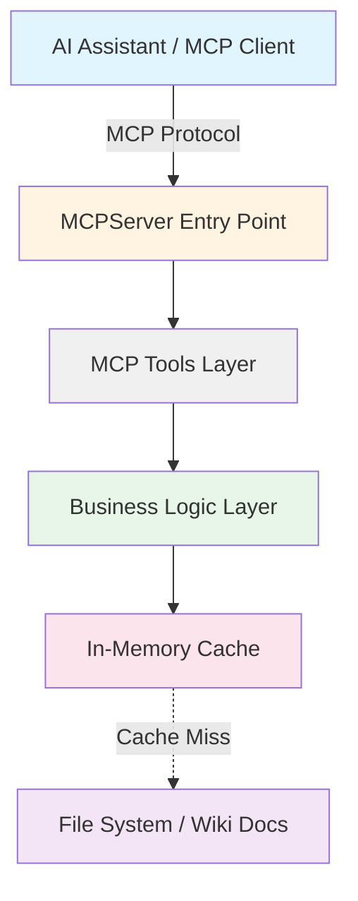
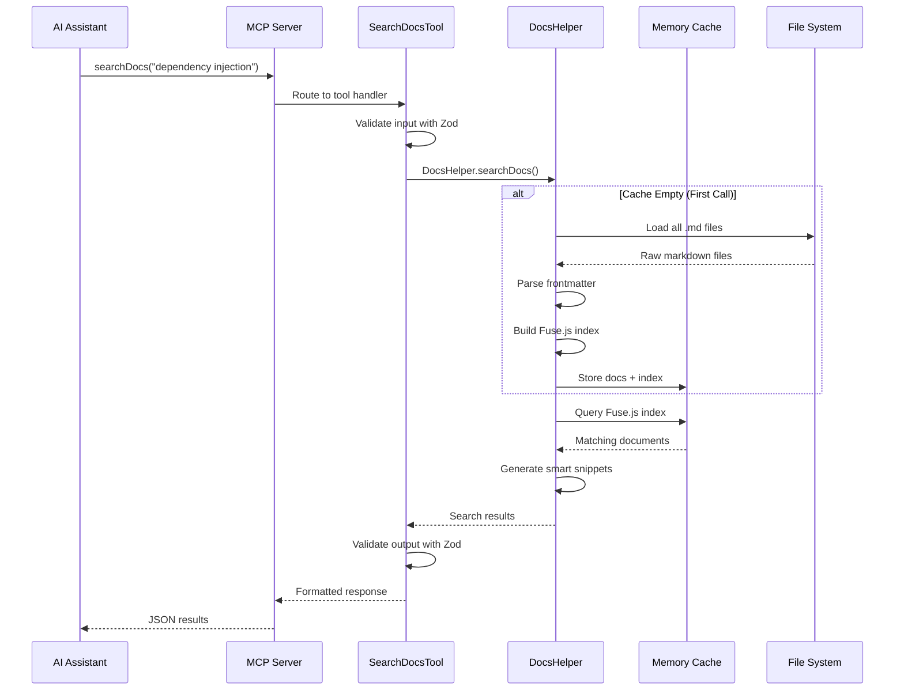
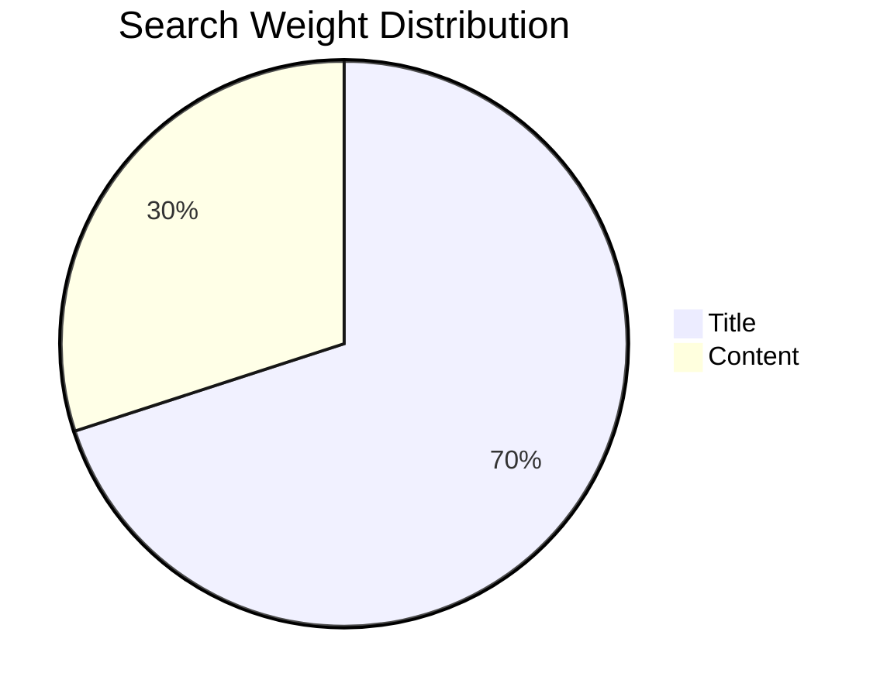
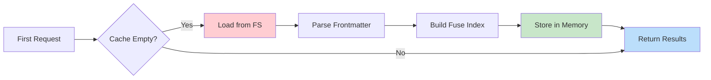

# MCP Docs Server: Deep Dive

This document provides a detailed look into the architecture, features, and internal workings of the Ignis Documentation MCP Server. For a guide on how to use the server, see the [MCP Docs Server Quickstart](/get-started/mcp-docs-server).

---

## Architecture Overview

### System Architecture



### Component Responsibilities

| Component | Responsibility | Key Features |
|-----------|---------------|--------------|
| **MCP Server** | Protocol handling, request routing | Stdio transport, tool registration |
| **Tools Layer** | Input validation, output formatting | Zod schemas, type safety |
| **DocsHelper** | Business logic, search, caching | Fuse.js search, memory cache |
| **File System** | Documentation storage | Markdown files with frontmatter |

---

## Data Flow

### Search Request Flow



---

## Tools Reference

### Tool Comparison Table

| Tool | Purpose | Input Complexity | Use Case |
|------|---------|------------------|----------|
| `searchDocs` | Find docs by keyword | Simple (query + limit) | "How do I use Redis?" |
| `getDocContent` | Get full document | Simple (id only) | Retrieve specific guide |
| `listDocs` | Browse all docs | Simple (optional filter) | Explore documentation |
| `listCategories` | List all categories | None | Understand structure |
| `getDocMetadata` | Get doc stats | Simple (id only) | Check length before reading |

### 1. searchDocs

**What it does:** Fuzzy searches across all documentation titles and content.

**Parameters:**

| Parameter | Type | Required | Default | Description |
|-----------|------|----------|---------|-------------|
| `query` | string | Yes | - | Search keywords (min 2 chars) |
| `limit` | number | No | 10 | Max results (1-50) |

**Returns:**

```typescript
Array<{
  id: string;        // "get-started/intro.md"
  title: string;     // "Introduction to Ignis"
  category: string;  // "Getting Started"
  snippet: string;   // First 300 chars preview
  score: number;     // 0-1 relevance (lower = better)
}>
```

**Example Request:**

```json
{
  "query": "dependency injection",
  "limit": 5
}
```

**Example Response:**

```json
[
  {
    "id": "core-concepts/dependency-injection.md",
    "title": "Dependency Injection",
    "category": "Core Concepts",
    "snippet": "Ignis uses a powerful dependency injection system that allows you to...",
    "score": 0.12
  }
]
```

---

### 2. getDocContent

**What it does:** Retrieves the full markdown content of a specific document.

**Parameters:**

| Parameter | Type | Required | Description |
|-----------|------|----------|-------------|
| `id` | string | Yes | Document ID from search/list |

**Returns:**

```typescript
{
  content: string;  // Full markdown content
  id: string;       // Document ID
  error?: string;   // Error message if not found
}
```

**Example Request:**

```json
{
  "id": "get-started/intro.md"
}
```

---

### 3. listDocs

**What it does:** Lists all documentation files with their metadata.

**Parameters:**

| Parameter | Type | Required | Description |
|-----------|------|----------|-------------|
| `category` | string | No | Filter by category name |

**Returns:**

```typescript
{
  count: number;
  docs: Array<{
    id: string;
    title: string;
    category: string;
  }>;
}
```

**Example Response:**

```json
{
  "count": 15,
  "docs": [
    {
      "id": "get-started/intro.md",
      "title": "Introduction",
      "category": "Getting Started"
    }
  ]
}
```

---

### 4. listCategories

**What it does:** Lists all unique categories, sorted alphabetically.

**Parameters:** None

**Returns:**

```typescript
{
  count: number;
  categories: string[];  // ["Core Concepts", "Getting Started", ...]
}
```

**Example Response:**

```json
{
  "count": 6,
  "categories": [
    "Core Concepts",
    "Getting Started",
    "Helpers",
    "References"
  ]
}
```

---

### 5. getDocMetadata

**What it does:** Retrieves statistics about a document without loading full content.

**Parameters:**

| Parameter | Type | Required | Description |
|-----------|------|----------|-------------|
| `id` | string | Yes | Document ID |

**Returns:**

```typescript
{
  id: string;
  title: string;
  category: string;
  wordCount: number;
  charCount: number;
  lastModified?: string;
  size?: number;        // Bytes
}
```

**Example Response:**

```json
{
  "id": "core-concepts/dependency-injection.md",
  "title": "Dependency Injection",
  "category": "Core Concepts",
  "wordCount": 2500,
  "charCount": 15234,
  "size": 15234
}
```

---

## Resources

The server exposes documentation as MCP resources for direct access:

| Property | Value |
|----------|-------|
| **URI Format** | `ignis://docs/{document-id}` |
| **MIME Type** | `text/markdown` |
| **Metadata** | Category and word count in description |

**Example Resource:**

```json
{
  "uri": "ignis://docs/get-started/intro.md",
  "name": "Introduction",
  "description": "Getting Started - 450 words",
  "mimeType": "text/markdown"
}
```

---

## Search Configuration

### Fuse.js Settings

The search engine uses optimized Fuse.js configuration:

| Setting | Value | Explanation |
|---------|-------|-------------|
| **threshold** | 0.4 | Balance between strict and fuzzy matching |
| **ignoreLocation** | true | Match anywhere in document, not just at start |
| **findAllMatches** | true | Return all relevant matches, not just first |
| **minMatchCharLength** | 2 | Minimum characters to trigger a match |

### Search Weights



| Field | Weight | Rationale |
|-------|--------|-----------|
| Title | 70% | Document titles are highly relevant |
| Content | 30% | Body content provides context |

**Why this matters:** When you search for "dependency injection", documents with that phrase in the title will rank higher than those with it only in the content.

---

## Project Structure

```
mcp-server/
├── common/
│   ├── config.ts           # Configuration constants
│   ├── logger.ts           # Logging infrastructure
│   ├── paths.ts            # Path resolution
│   └── index.ts            # Common exports
├── helpers/
│   ├── docs.helper.ts      # Documentation loading and searching
│   └── index.ts            # Helper exports
├── tools/
│   ├── base.tool.ts        # Abstract base class for tools
│   ├── search-docs.tool.ts
│   ├── get-doc-content.tool.ts
│   ├── list-docs.tool.ts
│   ├── list-categories.tool.ts
│   ├── get-doc-metadata.tool.ts
│   └── index.ts
├── index.ts                # Server entry point
└── README.md
```

### File Responsibilities

| File | Purpose | Key Exports |
|------|---------|-------------|
| `index.ts` | Server initialization, tool registration | `main()`, `mcpServer` |
| `tools/base.tool.ts` | Abstract tool class, singleton pattern | `BaseTool`, `createTool` |
| `helpers/docs.helper.ts` | Documentation loading, search, cache | `DocsHelper` class |
| `common/config.ts` | Centralized configuration | `MCP_CONFIG` object |
| `common/logger.ts` | Structured logging | `Logger` class |
| `common/paths.ts` | Path resolution | `PATHS` object |

---

## Performance Characteristics

### Caching Strategy



### Performance Metrics

| Operation | First Call | Subsequent Calls | Notes |
|-----------|-----------|------------------|-------|
| **Load Docs** | ~50-200ms | 0ms | Cached in memory |
| **Search** | ~100-300ms | ~5-20ms | Includes initial load |
| **Get Content** | ~50-200ms | ~1-5ms | Fast lookup by ID |
| **List Docs** | ~50-200ms | ~1-3ms | Pre-cached metadata |
| **Memory Usage** | ~5-10MB | ~5-10MB | Scales with doc count |

**Optimization Tips:**

- First search is slower (loads all docs)
- Subsequent searches are cached (very fast)
- Memory usage is constant after first load
- No disk I/O after initialization

---

## Error Handling

### Error Response Format

All tools return consistent error responses:

```json
{
  "error": "Document not found",
  "id": "requested-id"
}
```

### Common Errors

| Error | Cause | Solution |
|-------|-------|----------|
| "Document not found" | Invalid document ID | Use `listDocs` to find valid IDs |
| "Query too short" | Query < 2 characters | Use longer search query |
| "Limit out of range" | Limit > 50 or < 1 | Use default (10) or valid range |
| "Failed to load documentation" | File system error | Check wiki directory exists |

### Logging Levels

| Level | Usage | Example |
|-------|-------|---------|
| **info** | General information | "Server started", "Docs loaded" |
| **warn** | Non-critical issues | "Document not found" |
| **error** | Critical errors | "Failed to load docs" |
| **debug** | Development details | Search queries, cache hits |

**Enable debug logging:**

```bash
DEBUG=1 ignis-docs-mcp
```

---

## Development Guide

### Tool Architecture Pattern

All tools extend the `BaseTool` abstract class:

```typescript
export abstract class BaseTool<
  TInputSchema extends z.ZodType,
  TOutputSchema extends z.ZodType
> {
  // Singleton pattern
  static getInstance<T extends BaseTool>(this: new () => T): T {
    // Returns cached instance or creates new one
  }

  // Required implementations
  abstract readonly id: string;
  abstract readonly description: string;
  abstract readonly inputSchema: TInputSchema;
  abstract readonly outputSchema: TOutputSchema;

  abstract execute(input: z.infer<TInputSchema>): Promise<z.infer<TOutputSchema>>;
  abstract getTool(): MastraTool;
}
```

### Adding a New Tool

**Step 1: Create Tool File**

Create `tools/my-new-tool.tool.ts`:

```typescript
import { z } from 'zod';
import { BaseTool, createTool, type MastraTool } from './base.tool';
import { DocsHelper } from '../helpers';

// Define schemas
const InputSchema = z.object({
  param: z.string().describe('Parameter description'),
});

const OutputSchema = z.object({
  result: z.string().describe('Result description'),
});

// Implement tool class
export class MyNewTool extends BaseTool<typeof InputSchema, typeof OutputSchema> {
  readonly id = 'myNewTool';
  readonly description = 'What this tool does';
  readonly inputSchema = InputSchema;
  readonly outputSchema = OutputSchema;

  async execute(input: z.infer<typeof InputSchema>) {
    // Your logic here
    return { result: 'output' };
  }

  getTool(): MastraTool {
    return createTool({
      id: this.id,
      description: this.description,
      inputSchema: InputSchema,
      outputSchema: OutputSchema,
      execute: async ({ context }) => this.execute(context),
    });
  }
}
```

**Step 2: Export from Index**

Add to `tools/index.ts`:

```typescript
export { MyNewTool } from './my-new-tool.tool';
```

**Step 3: Register in Server**

Add to `index.ts`:

```typescript
import { MyNewTool } from './tools';

const mcpServer = new MCPServer({
  tools: {
    myNewTool: new MyNewTool().getTool(),
    // ... other tools
  },
});
```

### Configuration Updates

Modify `common/config.ts` to adjust global settings:

```typescript
export const MCP_CONFIG = {
  server: {
    name: 'ignis-docs',
    version: '0.0.1',
  },
  search: {
    defaultLimit: 10,     // Change default result count
    maxLimit: 50,         // Change maximum result count
    minQueryLength: 2,    // Change minimum query length
    snippetLength: 300,   // Change snippet preview length
  },
  fuse: {
    threshold: 0.4,       // Adjust fuzzy matching strictness
    keys: [
      { name: 'title', weight: 0.7 },    // Adjust title weight
      { name: 'content', weight: 0.3 },  // Adjust content weight
    ],
  },
};
```

**Configuration Impact:**

| Setting | Low Value | High Value |
|---------|-----------|------------|
| `threshold` | Stricter matches | More fuzzy matches |
| `title weight` | Less title importance | More title importance |
| `snippetLength` | Shorter previews | Longer previews |

---

## Best Practices

### For AI Assistants

1. **Search First**: Use `searchDocs` to find relevant documentation before fetching full content
2. **Filter Smart**: Use `listCategories` → `listDocs(category)` for category-specific browsing
3. **Check Size**: Use `getDocMetadata` before `getDocContent` for large documents
4. **Batch Queries**: If you need multiple docs, fetch IDs first then retrieve content
5. **Handle Errors**: Always check for error field in responses

### For Developers

1. **Document IDs**: Always use relative paths from wiki root (e.g., "get-started/intro.md")
2. **Frontmatter**: Ensure all markdown files have `title` and `category` in frontmatter
3. **Search Queries**: Use descriptive queries for better results (minimum 2 characters)
4. **Result Limits**: Adjust limit parameter based on needs (default: 10, max: 50)
5. **Logging**: Enable DEBUG mode during development for detailed logs

### Workflow Examples

**Example 1: Answer "How do I use Redis?"**

```
1. searchDocs("Redis") → Find relevant docs
2. Review snippets → Identify best match (e.g., "helpers/redis.md")
3. getDocContent("helpers/redis.md") → Retrieve full guide
4. Extract and format answer for user
```

**Example 2: Browse helpers documentation**

```
1. listCategories() → Get all categories
2. listDocs({ category: "Helpers" }) → Get all helper docs
3. Present list to user → Let them choose
4. getDocContent(selectedId) → Show full documentation
```

**Example 3: Check document before reading**

```
1. getDocMetadata("references/api.md") → Check length
2. If wordCount > 5000 → Warn user it's long
3. getDocContent("references/api.md") → Fetch full content
```

---

## Debugging

### Enable Debug Mode

```bash
# Show all debug logs
DEBUG=1 ignis-docs-mcp

# Show specific component logs
DEBUG=docs:search ignis-docs-mcp
DEBUG=docs:cache ignis-docs-mcp
```

### Debug Output Examples

```
[debug] Loading documentation from: /path/to/wiki
[debug] Found 45 markdown files
[debug] Building Fuse.js search index
[debug] Cache populated with 45 documents
[debug] Search query: "dependency injection"
[debug] Found 3 matches in 12ms
```

### Common Debug Tasks

| Task | Command | Expected Output |
|------|---------|----------------|
| Verify docs load | `DEBUG=1 ignis-docs-mcp` | "Cache populated with N documents" |
| Check search | Use searchDocs tool | "Found N matches in Xms" |
| Inspect cache | Check memory usage | ~5-10MB after first load |

---

## Roadmap

### Planned Features

- [ ] **Prompts Support** - When @mastra/mcp library adds support
- [ ] **Incremental Search** - Real-time search as user types
- [ ] **Semantic Search** - AI-powered semantic matching
- [ ] **Document Versioning** - Track documentation changes
- [ ] **Multi-language Support** - i18n documentation support

### Contributing

Want to add features or fix bugs? See the main Ignis repository:

- **Repository**: https://github.com/venizia-ai/ignis
- **Issues**: Report bugs or request features
- **Pull Requests**: Submit improvements

---

## FAQ

### How does caching work?

Documentation is loaded into memory on the first request and stays cached for the lifetime of the server process. This means:
- First search: ~100-300ms (loads all docs)
- Subsequent searches: ~5-20ms (cached)
- Memory usage: ~5-10MB (constant)

### Can I use this with other frameworks?

Yes! The MCP server architecture is framework-agnostic. You can fork this repo and adapt it to serve documentation for any project by:
1. Replacing the wiki directory
2. Updating the server name/version
3. Adjusting configuration as needed

### How do I update the documentation?

If you installed via npm:
```bash
npm update -g @vez/ignis-docs
```

The package includes bundled documentation that updates with each release.

### What if a document isn't found?

The tool returns an error object:
```json
{
  "error": "Document not found",
  "id": "invalid-id"
}
```

Use `listDocs()` to get valid document IDs.

### How accurate is the fuzzy search?

The search uses a threshold of 0.4, which balances between strict and fuzzy matching:
- Exact matches: Always ranked first
- Close matches: Tolerate 1-2 character typos
- Partial matches: Find substrings anywhere in title/content

Adjust `MCP_CONFIG.fuse.threshold` to make it stricter (lower) or fuzzier (higher).
